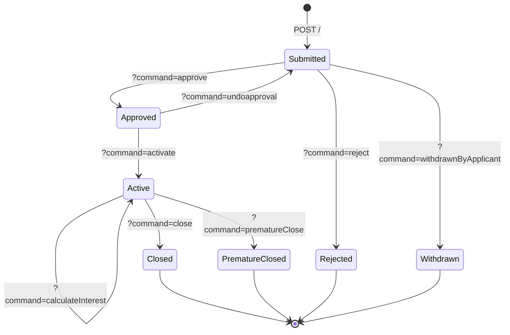

The Recurring Deposit Accounts API drives the full lifecycle of an Apache Fineract recurring-deposit application — where the client commits to making periodic deposits over a fixed term. It mirrors the [Fixed Deposit Accounts](/api/fixed-deposit-accounts) API but adds the `updateDepositAmount` command for varying the recurring deposit amount.

## Source

| Aspect | Value |
| --- | --- |
| Resource class | `org.apache.fineract.portfolio.savings.api.RecurringDepositAccountsApiResource` |
| File | `fineract-provider/src/main/java/org/apache/fineract/portfolio/savings/api/RecurringDepositAccountsApiResource.java` |
| JAX-RS `@Path` | `/v1/recurringdepositaccounts` |
| Swagger tag | `Recurring Deposit Account` |
| Permission resource | `RECURRINGDEPOSITACCOUNT` |
| Read service | `DepositAccountReadPlatformService` |
| Command source | `PortfolioCommandSourceWritePlatformService` |

## Endpoints

### Application lifecycle

| Method | Path | Operation id | Command handler |
| --- | --- | --- | --- |
| `GET` | `/v1/recurringdepositaccounts/template` | `retrieveTemplateRecurringDepositAccount` | `DepositAccountReadPlatformService.retrieveTemplate(RECURRING_DEPOSIT, ...)` |
| `GET` | `/v1/recurringdepositaccounts` | `retrieveAllRecurringDepositAccounts` | paginated `retrieveAll(...)` |
| `POST` | `/v1/recurringdepositaccounts` | `submitApplicationRecurringDepositAccount` | `CommandWrapperBuilder.createRecurringDepositAccount()` |
| `GET` | `/v1/recurringdepositaccounts/{accountId}` | `retrieveOneRecurringDepositAccount` | `retrieveOne(accountId)` |
| `PUT` | `/v1/recurringdepositaccounts/{accountId}` | `updateRecurringDepositAccount` | `CommandWrapperBuilder.updateRecurringDepositAccount(accountId)` |
| `POST` | `/v1/recurringdepositaccounts/{accountId}` | `handleCommandsRecurringDepositAccount` | varies by `?command=` |
| `DELETE` | `/v1/recurringdepositaccounts/{accountId}` | `deleteRecurringDepositAccount` | `CommandWrapperBuilder.deleteRecurringDepositAccount(accountId)` |
| `GET` | `/v1/recurringdepositaccounts/{accountId}/template` | `accountClosureTemplateRecurringDepositAccount` | account-closure template |

### Excel templates

| Method | Path | Description |
| --- | --- | --- |
| `GET` | `/v1/recurringdepositaccounts/downloadtemplate` | Download the RD-accounts import workbook. |
| `POST` | `/v1/recurringdepositaccounts/uploadtemplate` | Upload a completed RD-accounts workbook. |
| `GET` | `/v1/recurringdepositaccounts/transactions/downloadtemplate` | Download the RD-transactions workbook. |
| `POST` | `/v1/recurringdepositaccounts/transactions/uploadtemplate` | Upload a completed RD-transactions workbook. |

## State transition commands

`POST /v1/recurringdepositaccounts/{accountId}?command={cmd}` dispatched in `handleCommands(...)`:

| `command` | Builder |
| --- | --- |
| `reject` | `rejectRecurringDepositAccountApplication(accountId)` |
| `withdrawnByApplicant` | `withdrawRecurringDepositAccountApplication(accountId)` |
| `approve` | `approveRecurringDepositAccountApplication(accountId)` |
| `undoapproval` | `undoRecurringDepositAccountApplication(accountId)` |
| `activate` | `activateRecurringDepositAccount(accountId)` |
| `calculateInterest` | `withNoJsonBody().recurringDepositAccountInterestCalculation(accountId)` |
| `updateDepositAmount` (`DepositsApiConstants.UPDATE_DEPOSIT_AMOUNT`) | `updateDepositAmountForRecurringDepositAccount(accountId)` |
| `postInterest` | `postInterestOnRecurringDepositAccount(accountId)` |
| `close` | `closeRecurringDepositAccount(accountId)` |
| `prematureClose` | `prematureCloseRecurringDepositAccount(accountId)` |
| `calculatePrematureAmount` | `calculatePrematureAmountOnRecurringDepositAccount(accountId)` |

Unknown commands raise `UnrecognizedQueryParamException`.

## Request shapes

### Submit RD

`POST /v1/recurringdepositaccounts`:

```json
{
  "clientId": 42,
  "productId": 1,
  "submittedOnDate": "01 March 2026",
  "depositAmount": 200,
  "depositPeriod": 12,
  "depositPeriodFrequencyId": 2,
  "recurringFrequency": 1,
  "recurringFrequencyType": 2,
  "expectedFirstDepositOnDate": "01 March 2026",
  "interestCompoundingPeriodType": 1,
  "interestPostingPeriodType": 4,
  "interestCalculationType": 1,
  "interestCalculationDaysInYearType": 365,
  "locale": "en",
  "dateFormat": "dd MMMM yyyy"
}
```

### Update deposit amount

`POST /v1/recurringdepositaccounts/{accountId}?command=updateDepositAmount`:

```json
{
  "depositAmount": 250,
  "effectiveDate": "01 September 2026",
  "locale": "en",
  "dateFormat": "dd MMMM yyyy"
}
```

### Premature close

`POST /v1/recurringdepositaccounts/{accountId}?command=prematureClose`:

```json
{
  "closedOnDate": "15 September 2026",
  "onAccountClosureId": 2,
  "toSavingsAccountId": 88,
  "locale": "en",
  "dateFormat": "dd MMMM yyyy"
}
```

## Response shapes

### Standard write response

```json
{ "officeId": 1, "clientId": 42, "savingsId": 88, "resourceId": 88, "changes": { } }
```

### Retrieve (excerpt)

```json
{
  "id": 88,
  "accountNo": "0000000088",
  "status": { "id": 300, "code": "savingsAccountStatusType.active" },
  "currency": { "code": "USD" },
  "depositAmount": 200.00,
  "expectedFirstDepositOnDate": "2026-03-01",
  "depositPeriod": 12,
  "depositPeriodFrequency": { "id": 2, "code": "depositPeriodFrequencyType.months" },
  "recurringDetail": {
    "isMandatoryDeposit": true,
    "allowWithdrawal": false,
    "adjustAdvanceTowardsFuturePayments": true
  }
}
```

## Permissions

Read endpoints invoke `validateHasReadPermission("RECURRINGDEPOSITACCOUNT")`. Writes route through `PortfolioCommandSourceWritePlatformService.logCommandSource(...)` and are mapped to `CREATE_/UPDATE_/DELETE_/APPROVE_/ACTIVATE_/CLOSE_/PREMATURECLOSE_/CALCULATEPREMATUREAMOUNT_/UPDATEDEPOSITAMOUNT_RECURRINGDEPOSITACCOUNT`.

## Application state diagram



## Sample curl — submit RD application

```bash
curl -k -u mifos:password \
  -H "Fineract-Platform-TenantId: default" \
  -H "Content-Type: application/json" \
  -X POST https://localhost:8443/fineract-provider/api/v1/recurringdepositaccounts \
  -d '{
        "clientId": 42,
        "productId": 1,
        "submittedOnDate": "01 March 2026",
        "depositAmount": 200,
        "depositPeriod": 12,
        "depositPeriodFrequencyId": 2,
        "recurringFrequency": 1,
        "recurringFrequencyType": 2,
        "expectedFirstDepositOnDate": "01 March 2026",
        "locale": "en",
        "dateFormat": "dd MMMM yyyy"
      }'
```

## Common pitfalls

- **`updateDepositAmount` is only allowed on active accounts** and the effective date must be on or after the next expected deposit; the handler raises `error.msg.recurringdepositaccount.update.deposit.amount.not.allowed` otherwise.
- **`prematureClose` requires `onAccountClosureId`** to be one of the `OnAccountClosureType` enum values: `1` (withdrawDeposit), `2` (transferToSavings), `3` (reinvest). Sending `4` results in `error.msg.invalid.account.closure.option`.
- **Recurring frequency must match product**, otherwise validation reports `error.msg.recurringdepositaccount.recurringFrequency.does.not.match.product`.
- **Calculate interest is idempotent** — running it twice on the same date does not double-post. `postInterest` is the only mutating action; `calculateInterest` is a recompute-only command.

## Related pages

- [/savings/recurring-deposit](/savings/recurring-deposit) — domain model.
- [/api/recurring-deposit-products](/api/recurring-deposit-products) — products that drive these accounts.
- [/api/recurring-deposit-account-transactions](/api/recurring-deposit-account-transactions) — transaction sub-resource.
- [/api/fixed-deposit-accounts](/api/fixed-deposit-accounts) — sister term-deposit resource.
- [/api/conventions](/api/conventions) — envelope, locale and error model.
