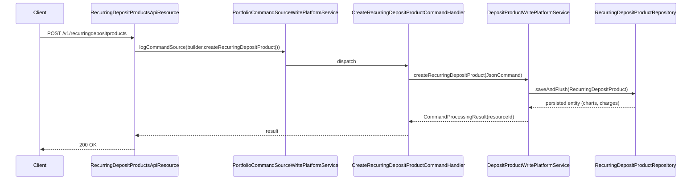

The Recurring Deposit Products API exposes CRUD for the `RecurringDepositProduct` definitions in Apache Fineract. Each product fixes the recurrence schedule, mandatory-deposit policy, interest chart, premature-closure penalties, charges and accounting rules used by every RD account created from it.

## Source

| Aspect | Value |
| --- | --- |
| Resource class | `org.apache.fineract.portfolio.savings.api.RecurringDepositProductsApiResource` |
| File | `fineract-provider/src/main/java/org/apache/fineract/portfolio/savings/api/RecurringDepositProductsApiResource.java` |
| JAX-RS `@Path` | `/v1/recurringdepositproducts` |
| Swagger tag | `Recurring Deposit Product` |
| Permission resource | `RECURRINGDEPOSITPRODUCT` |
| Read service | `DepositProductReadPlatformService` |
| Command source | `PortfolioCommandSourceWritePlatformService` |

## Endpoints

| Method | Path | Operation id | Command handler | Permission |
| --- | --- | --- | --- | --- |
| `POST` | `/v1/recurringdepositproducts` | `createRecurringDepositProduct` | `CommandWrapperBuilder.createRecurringDepositProduct()` | `CREATE_RECURRINGDEPOSITPRODUCT` |
| `PUT` | `/v1/recurringdepositproducts/{productId}` | `updateRecurringDepositProduct` | `CommandWrapperBuilder.updateRecurringDepositProduct(productId)` | `UPDATE_RECURRINGDEPOSITPRODUCT` |
| `GET` | `/v1/recurringdepositproducts` | `retrieveAllRecurringDepositProducts` | `retrieveAll(RECURRING_DEPOSIT)` | `READ_RECURRINGDEPOSITPRODUCT` |
| `GET` | `/v1/recurringdepositproducts/{productId}` | `retrieveOneRecurringDepositProduct` | `retrieveOne(productId)` | `READ_RECURRINGDEPOSITPRODUCT` |
| `GET` | `/v1/recurringdepositproducts/template` | `retrieveTemplateRecurringDepositProduct` | template aggregator | `READ_RECURRINGDEPOSITPRODUCT` |
| `DELETE` | `/v1/recurringdepositproducts/{productId}` | `deleteRecurringDepositProduct` | `CommandWrapperBuilder.deleteRecurringDepositProduct(productId)` | `DELETE_RECURRINGDEPOSITPRODUCT` |

## Template composition

`GET /v1/recurringdepositproducts/template` aggregates currency options, interest period/calculation type dropdowns, lock-in and deposit-term type dropdowns, recurrence-frequency dropdowns, applicable charges, pre-closure types, accounting rules and a blank `charts` skeleton.

## Request shapes

### Create

`POST /v1/recurringdepositproducts`:

```json
{
  "name": "Monthly RD 12m",
  "shortName": "RD12",
  "currencyCode": "USD",
  "digitsAfterDecimal": 2,
  "recurringDepositAmount": 100,
  "recurringDepositFrequency": 1,
  "recurringDepositFrequencyTypeId": 2,
  "interestCompoundingPeriodType": 1,
  "interestPostingPeriodType": 4,
  "interestCalculationType": 1,
  "interestCalculationDaysInYearType": 365,
  "minDepositTerm": 6,
  "minDepositTermTypeId": 2,
  "maxDepositTerm": 36,
  "maxDepositTermTypeId": 2,
  "isMandatoryDeposit": true,
  "allowWithdrawal": false,
  "adjustAdvanceTowardsFuturePayments": true,
  "preClosurePenalApplicable": true,
  "preClosurePenalInterest": 1,
  "preClosurePenalInterestOnTypeId": 1,
  "charts": [
    {
      "fromDate": "01 January 2026",
      "endDate": "31 December 2026",
      "chartSlabs": [
        { "fromPeriod": 6,  "toPeriod": 11, "periodType": 2, "annualInterestRate": 4.5 },
        { "fromPeriod": 12, "toPeriod": 23, "periodType": 2, "annualInterestRate": 5.5 }
      ]
    }
  ],
  "accountingRule": 1,
  "locale": "en",
  "dateFormat": "dd MMMM yyyy"
}
```

Key RD-only fields:

- `recurringDepositFrequency` × `recurringDepositFrequencyTypeId` — every n {days, weeks, months, years}.
- `isMandatoryDeposit` — when true the recurring scheduler flags missed deposits as arrears.
- `allowWithdrawal` — false for traditional contractual RDs.
- `adjustAdvanceTowardsFuturePayments` — when a member overpays, the surplus is applied to future installments.

### Update / response

`PUT /v1/recurringdepositproducts/{productId}` shares the create envelope (all fields optional). The standard `CommandProcessingResult` is `{ "resourceId": 1, "changes": { } }`.

### Retrieve (excerpt)

```json
{
  "id": 1,
  "name": "Monthly RD 12m",
  "shortName": "RD12",
  "currency": { "code": "USD" },
  "recurringDepositAmount": 100,
  "recurringDepositFrequency": 1,
  "recurringDepositFrequencyType": { "id": 2, "code": "depositPeriodFrequencyType.months" },
  "isMandatoryDeposit": true,
  "allowWithdrawal": false,
  "preClosurePenalApplicable": true,
  "activeChart": { "chartSlabs": [ { "fromPeriod": 6, "toPeriod": 11, "annualInterestRate": 4.5 } ] }
}
```

## Permissions

Read endpoints invoke `validateHasReadPermission("RECURRINGDEPOSITPRODUCT")`. Writes go through `PortfolioCommandSourceWritePlatformService.logCommandSource(...)` and are mapped to `CREATE_RECURRINGDEPOSITPRODUCT`, `UPDATE_RECURRINGDEPOSITPRODUCT`, `DELETE_RECURRINGDEPOSITPRODUCT`.

## Create flow



## Interest charts

Each product carries one or more `interestRateChart` records (`InterestRateChart` + `InterestRateChartSlab`). The slab applied to an account at activation is the chart whose `fromDate`–`endDate` window contains `activatedOnDate`, then the slab whose `(fromPeriod, toPeriod, periodType)` window contains the requested deposit period. There is one **active** chart per product at any given moment; older charts remain historical for already-active accounts.

| Field | Notes |
| --- | --- |
| `fromDate` | Required, start of validity. |
| `endDate` | Optional; null means open-ended. |
| `chartSlabs[].periodType` | `1` days, `2` months, `3` years. |
| `chartSlabs[].annualInterestRate` | Nominal annual rate applied if slab matches. |

## Common pitfalls

- **Overlapping charts.** Two charts whose `[fromDate, endDate]` windows overlap are rejected with `error.msg.product.deposit.chart.cannot.overlap.with.existing.chart`.
- **Min < Max term.** `minDepositTerm` must be ≤ `maxDepositTerm` (same `*TermTypeId`). The product validator raises `error.msg.product.deposit.min.term.must.be.less.than.or.equal.max.term`.
- **`preClosurePenalApplicable` requires both `preClosurePenalInterest` and `preClosurePenalInterestOnTypeId`** (`1` whole term, `2` till premature withdrawal).
- **Charts cannot be deleted in-place** once accounts are attached. Update the `endDate` instead and add a new chart.

## Sample curl — list products

```bash
curl -k -u mifos:password \
  -H "Fineract-Platform-TenantId: default" \
  https://localhost:8443/fineract-provider/api/v1/recurringdepositproducts
```

## Mandatory vs voluntary deposits

`isMandatoryDeposit=true` tells the savings scheduler to mark a missed deposit as arrears, surfacing it in the collection sheet. `adjustAdvanceTowardsFuturePayments=true` then lets an overpayment in any given installment be carried forward to fulfil future installments before being treated as surplus.

| Combination | Behaviour |
| --- | --- |
| `mandatory=true`, `adjustAdvance=true` | Strict schedule with carry-forward (default for traditional RD). |
| `mandatory=true`, `adjustAdvance=false` | Strict schedule, surplus parked as ledger balance. |
| `mandatory=false` | Voluntary recurring deposit; no arrears flag. |

## Pre-closure penalty math

For an active RD with deposit period `T`, accumulated balance `B`, and chart-derived nominal rate `r`, the pre-closure recompute is:

- If `preClosurePenalInterestOnTypeId == 1` (whole term): apply `(r − preClosurePenalInterest)%` for `[0, T_actual]`.
- If `preClosurePenalInterestOnTypeId == 2` (till premature withdrawal): apply `r%` until first deposit, then `(r − preClosurePenalInterest)%` only for the period after the premature flag.

The helper command `?command=calculatePrematureAmount` on the account API returns the resulting payout without persisting.

## Charge attachment

Charges defined here are inherited by every RD account created from the product. Charge time types supported include `1` specified due date, `5` monthly fee, `6` annual fee, and `12` deposit fee. The product validator rejects loan-only charge types (e.g. `disbursement fee`) with `error.msg.charge.cannot.be.applied.to.recurring.deposit.product`.

To add a charge after the product is in use, update the product and accept that only **new** accounts inherit it, or call `POST /v1/savingsaccounts/{id}/charges` per existing RD account.

## Related pages

- [/api/recurring-deposit-accounts](/api/recurring-deposit-accounts) — accounts instantiated from these products.
- [/savings/recurring-deposit](/savings/recurring-deposit) — domain model.
- [/api/fixed-deposit-products](/api/fixed-deposit-products) — sister term-deposit product resource.
- [/api/interest-rate-charts](/api/interest-rate-charts) — chart structure.
- [/api/conventions](/api/conventions) — envelope, locale and error model.
