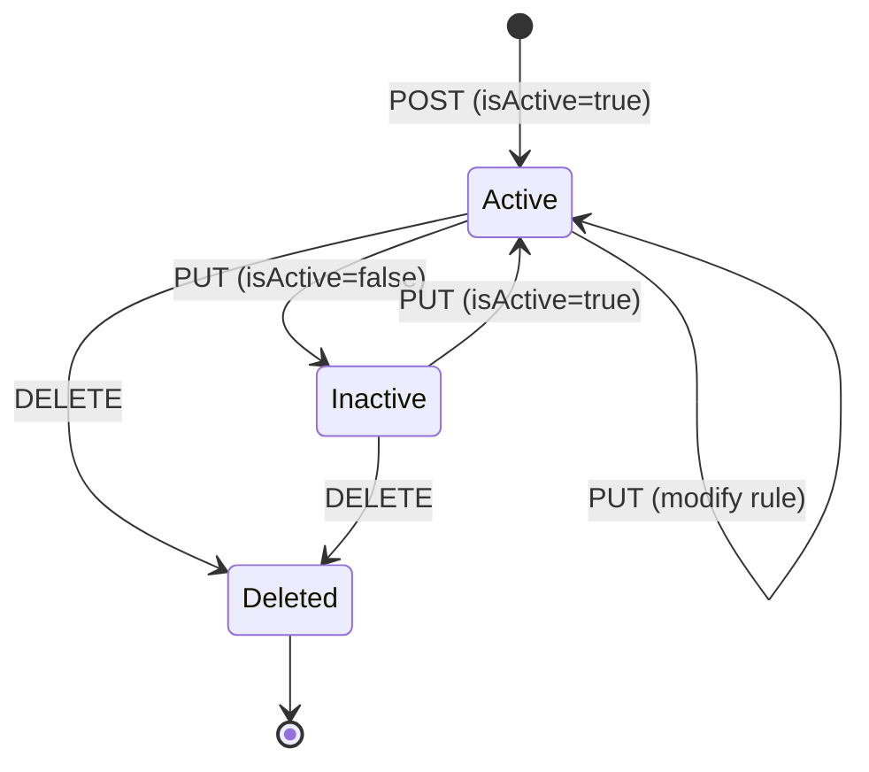

The Report Mailing Job resource is Apache Fineract's scheduled-delivery pipeline for reports. A job binds a stretchy (SQL/Pentaho) report from the [`/v1/reports`](/api/reports) catalog to a recurrence rule, a recipient list and an attachment format, and the background scheduler renders and emails it on tick. Run results — successful or failed — are recorded in [`/v1/reportmailingjobrunhistory`](/api/report-mailing-job-run-history).

## Source

- **File**: `fineract-provider/src/main/java/org/apache/fineract/infrastructure/reportmailingjob/api/ReportMailingJobApiResource.java`
- **Base path**: `@Path("/v1/" + REPORT_MAILING_JOB_RESOURCE_NAME)` → `/v1/reportmailingjobs`
- **Permission entity**: `REPORT_MAILING_JOB` (constant `REPORT_MAILING_JOB_ENTITY_NAME`)
- **Tag**: `Report Mailing Jobs`

Reads go through `ReportMailingJobReadPlatformService`; writes are command-sourced via `PortfolioCommandSourceWritePlatformService` and run through the `CREATE_*` / `UPDATE_*` / `DELETE_*` command handlers in the `reportmailingjob` package.

## Endpoints

| Method | Path | Description | Command handler | Permission |
| ------ | ---- | ----------- | --------------- | ---------- |
| POST | `/v1/reportmailingjobs` | Create a scheduled job | `CommandWrapperBuilder.createReportMailingJob` → `CREATE_REPORT_MAILING_JOB` | `CREATE_REPORT_MAILING_JOB` |
| PUT | `/v1/reportmailingjobs/{entityId}` | Update an existing job | `CommandWrapperBuilder.updateReportMailingJob` → `UPDATE_REPORT_MAILING_JOB` | `UPDATE_REPORT_MAILING_JOB` |
| DELETE | `/v1/reportmailingjobs/{entityId}` | Soft-delete a job | `CommandWrapperBuilder.deleteReportMailingJob` → `DELETE_REPORT_MAILING_JOB` | `DELETE_REPORT_MAILING_JOB` |
| GET | `/v1/reportmailingjobs/{entityId}` | Retrieve a job; `?template=true` appends enum/option lists | `ReportMailingJobReadPlatformService.retrieveReportMailingJob` | `READ_REPORT_MAILING_JOB` |
| GET | `/v1/reportmailingjobs/template` | Empty job + enum options for the create UI | `retrieveReportMailingJobEnumOptions` | `READ_REPORT_MAILING_JOB` |
| GET | `/v1/reportmailingjobs` | Paged list of all jobs | `retrieveAllReportMailingJobs` | `READ_REPORT_MAILING_JOB` |

The list endpoint accepts `offset`, `limit`, `orderBy` and `sortOrder` query parameters; `orderBy` and `sortOrder` are passed through `SqlValidator.validate` to block SQL injection.

## Request body — create

Mandatory fields per the `@Operation` description:

```text
name, startDateTime, stretchyReportId, emailRecipients,
emailSubject, emailMessage, emailAttachmentFileFormatId,
recurrence, isActive
```

Optional fields: `description`, `stretchyReportParamMap`.

### Example

`POST /v1/reportmailingjobs`

```json
{
  "name": "Daily Portfolio At Risk - Branch 1",
  "description": "PAR>30 by branch, emailed to risk managers every morning.",
  "startDateTime": "2024 03 04 06 00",
  "dateFormat": "yyyy MM dd HH mm",
  "locale": "en",
  "recurrence": "FREQ=DAILY;INTERVAL=1",
  "stretchyReportId": 12,
  "stretchyReportParamMap": "{\"OfficeIdSelectOne\":\"1\",\"loanOfficerIdSelectAll\":\"-1\"}",
  "emailRecipients": "risk@example.org,cfo@example.org",
  "emailSubject": "Daily PAR — Branch 1",
  "emailMessage": "Attached is today's PAR breakdown.",
  "emailAttachmentFileFormatId": 1,
  "isActive": true
}
```

`emailAttachmentFileFormatId` matches the `ReportMailingJobEmailAttachmentFileFormat` enum:

| id | format |
| -- | ------ |
| 1 | XLS |
| 2 | PDF |
| 3 | CSV |

Response:

```json
{
  "officeId": null,
  "clientId": null,
  "resourceId": 7,
  "changes": {}
}
```

### Example — update active flag

`PUT /v1/reportmailingjobs/7`

```json
{ "isActive": false }
```

## Recurrence

`recurrence` is an [RFC 5545 RRULE](https://datatracker.ietf.org/doc/html/rfc5545) string. The scheduler evaluates it against `startDateTime` to compute the next run after each successful execution. Examples:

- `FREQ=DAILY;INTERVAL=1` — once a day
- `FREQ=WEEKLY;INTERVAL=1;BYDAY=MO,FR` — Mondays and Fridays
- `FREQ=MONTHLY;INTERVAL=1;BYMONTHDAY=1` — first of every month

A blank `recurrence` causes the job to run once at `startDateTime`.

## Response data parameters

Defined by `ReportMailingJobConstants.REPORT_MAILING_JOB_DATA_PARAMETERS` and serialised by `DefaultToApiJsonSerializer<ReportMailingJobData>`. The base fields are: `id`, `name`, `description`, `startDateTime`, `recurrence`, `nextRunDateTime`, `numberOfRuns`, `previousRunStatus`, `previousRunErrorLog`, `previousRunErrorMessage`, `previousRunDateTime`, `emailRecipients`, `emailSubject`, `emailMessage`, `emailAttachmentFileFormat`, `stretchyReport`, `stretchyReportParamMap`, `isDeleted`, `isActive`.

When `template=true`, the payload is enriched with `emailAttachmentFileFormatOptions`, `stretchyReportList` and `stretchyReportParamDateOptions`.

## Subsystem cross-links

- **[Reports](/api/reports)** — defines the `stretchyReportId` consumed here.
- **[Report Mailing Job Run History](/api/report-mailing-job-run-history)** — past executions, success/failure logs and rendered file metadata.
- **[Email Configuration](/api/email-configuration)** — SMTP credentials used to send the attachments.
- **[Run Reports](/api/run-reports)** — the same `ReportingProcessService` used by the on-demand endpoint.

## Maker–checker

`REPORT_MAILING_JOB` participates in the maker–checker workflow. When the entity is registered for approval, `commandsSourceWritePlatformService.logCommandSource` stores the command in `m_portfolio_command_source` instead of applying it; a separate user must `approve` the command via `/v1/makercheckers/{id}?command=approve`.


## Source extract

```java
@Path("/v1/reportmailingjobs")
@Component
@RequiredArgsConstructor
public class ReportMailingJobApiResource {
    private final PlatformSecurityContext context;
    private final DefaultToApiJsonSerializer<ReportMailingJobData> toApiJsonSerializer;
    private final ApiRequestParameterHelper apiRequestParameterHelper;
    private final ReportMailingJobReadPlatformService readPlatformService;
    private final PortfolioCommandSourceWritePlatformService commandsSourceWritePlatformService;
}
```

Endpoints:

| Method | Path | Description |
| ------ | ---- | ----------- |
| POST | `/v1/reportmailingjobs` | Create job |
| GET | `/v1/reportmailingjobs` | List (paged) |
| GET | `/v1/reportmailingjobs/template` | UI skeleton + lists |
| GET | `/v1/reportmailingjobs/{id}` | Retrieve |
| PUT | `/v1/reportmailingjobs/{id}` | Update |
| DELETE | `/v1/reportmailingjobs/{id}` | Delete |

## Recurrence

A job's `recurrence` field is an iCalendar [RFC 5545](https://datatracker.ietf.org/doc/html/rfc5545) RRULE. The scheduler interprets it on tick:

```text
FREQ=WEEKLY;BYDAY=MO;BYHOUR=8;BYMINUTE=0
```

`startDateTime` anchors the first tick; `endDateTime` (optional) closes the window.

## Email attachment format

`emailAttachmentFileFormat` accepts the enum values `xls`, `xlsx`, `pdf`, `csv` — see `ReportMailingJobEmailAttachmentFileFormat`. The scheduler renders the bound `stretchyReportId` to bytes via the standard `ReportingProcessService` and attaches them with a filename of the shape `<reportName>-<runDate>.<ext>`.

## Lifecycle



## Run history

Each tick — successful or failed — writes a row in `m_report_mailing_job_run_history`, exposed via [`/v1/reportmailingjobrunhistory`](/api/report-mailing-job-run-history). Use it to audit deliveries.

## Permissions

`CREATE_REPORTMAILINGJOB`, `UPDATE_REPORTMAILINGJOB`, `DELETE_REPORTMAILINGJOB`; reads use `READ_REPORTMAILINGJOB`.

## cURL recipe

```bash
curl -u mifos:password      -H "Fineract-Platform-TenantId: default"      -H "Content-Type: application/json"      -d '{
       "name":"Weekly active clients",
       "description":"Monday morning",
       "emailRecipients":"ops@example.com",
       "emailSubject":"Active clients",
       "emailMessage":"Attached",
       "emailAttachmentFileFormat":"xls",
       "stretchyReportId":15,
       "stretchyReportParamMap":"{}",
       "recurrence":"FREQ=WEEKLY;BYDAY=MO;BYHOUR=8;BYMINUTE=0",
       "isActive":true,
       "startDateTime":"01 May 2025 08:00",
       "dateFormat":"dd MMMM yyyy HH:mm",
       "locale":"en"
     }'      "https://localhost:8443/fineract-provider/api/v1/reportmailingjobs"
```

## Cross-links

- [Reports](/api/reports) — defines the `stretchyReportId`.
- [Report Mailing Job Run History](/api/report-mailing-job-run-history) — execution log.
- [Email Configuration](/api/email-configuration) — SMTP credentials.
- [Run Reports](/api/run-reports) — the same processor used on-demand.
