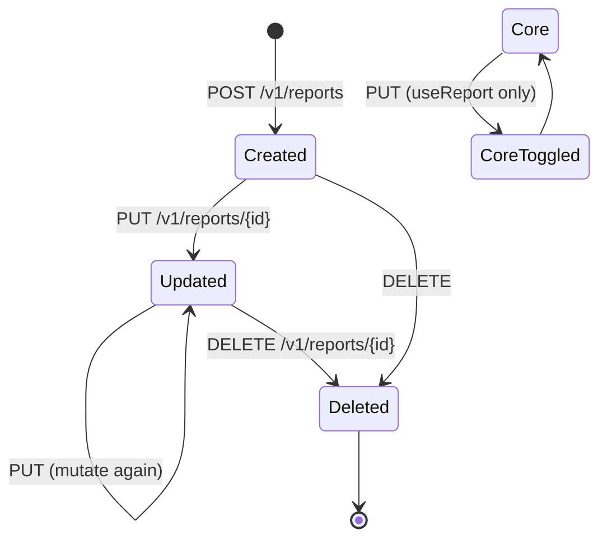

The Reports resource is Apache Fineract's catalog of non-core reports — the SQL, Pentaho and Jasper definitions that back the `runreports` execution endpoint. Each row maps an internal name and category to a stored report query, plus the parameters the UI should prompt for. Core reports shipped with the platform can have their `useReport` flag toggled but not their SQL; user-defined reports are fully mutable.

## Source

- **File**: `fineract-provider/src/main/java/org/apache/fineract/infrastructure/dataqueries/api/ReportsApiResource.java`
- **Base path**: `@Path("/v1/reports")`
- **Permission entity**: `REPORT`
- **Tag**: `Reports`

The resource is a thin JAX-RS facade. Reads go through `ReadReportingService`; mutations are dispatched as commands via `PortfolioCommandSourceWritePlatformService` and persisted by the maker–checker pipeline.

## Endpoints

| Method | Path | Description | Command / Service | Permission |
| ------ | ---- | ----------- | ----------------- | ---------- |
| GET    | `/v1/reports` | List all reports and their parameters | `ReadReportingService.retrieveReportList` | `READ_REPORT` |
| GET    | `/v1/reports/{id}` | Retrieve one report (use `?template=true` to embed allowed parameters and reporting types) | `ReadReportingService.retrieveReport` | `READ_REPORT` |
| GET    | `/v1/reports/template` | Empty report shell + allowed parameter list and reporting types for UI form scaffolding | `ReadReportingService.getAllowedParameters` + `ReportingProcessServiceProvider.findAllReportingTypes` | `READ_REPORT` |
| POST   | `/v1/reports` | Create a new (non-core) report definition | `CommandWrapperBuilder.createReport` → entity `REPORT`, action `CREATE` | `CREATE_REPORT` |
| PUT    | `/v1/reports/{id}` | Update a report. Only `useReport` is editable for core reports | `CommandWrapperBuilder.updateReport(id)` → action `UPDATE` | `UPDATE_REPORT` |
| DELETE | `/v1/reports/{id}` | Delete a non-core report | `CommandWrapperBuilder.deleteReport(id)` → action `DELETE` | `DELETE_REPORT` |

All mutating endpoints return a `CommandProcessingResult` with the affected `resourceId` and (when maker–checker is enabled for `REPORT`) a `commandId` for the queued command.

## Response data parameters

The following fields are emitted by the serializer (see `RESPONSE_DATA_PARAMETERS` in the source):

```text
id, reportName, reportType, reportSubType, reportCategory,
description, reportSql, coreReport, useReport, reportParameters
```

`reportParameters` is an array of `{id, parameterId, reportParameterName, parameterName}` entries linking a stored parameter (defined in the Reports template) to a placeholder inside the report SQL.

## Examples

### Create a report

`POST /v1/reports`

```json
{
  "reportName": "Active Loans By Office",
  "reportType": "SQL",
  "reportSubType": "",
  "reportCategory": "Loan",
  "description": "Active loan accounts grouped by office.",
  "reportSql": "select o.name as office, count(l.id) as active_loans from m_loan l join m_office o on o.id = l.office_id where l.loan_status_id = 300 group by o.name",
  "coreReport": false,
  "useReport": true,
  "reportParameters": [
    { "parameterId": 5, "reportParameterName": "officeIdSelectOne" }
  ]
}
```

Response:

```json
{
  "resourceId": 174,
  "commandId": null,
  "changes": {}
}
```

### Update a core report (toggle visibility)

`PUT /v1/reports/1`

```json
{ "useReport": false }
```

### Delete a custom report

`DELETE /v1/reports/174` → `{ "resourceId": 174 }`

## Subsystem cross-links

- **[Run Reports](/api/run-reports)** — execute a report by name and stream HTML/CSV/XLS/PDF output.
- **[Report Mailing Jobs](/api/report-mailing-job)** — schedule a report to be rendered and emailed.
- **[AdHoc Query](/api/adhoc-query)** — saved INSERT…SELECT jobs that materialise report-style aggregates.
- **[Datatables](/api/datatables)** — registered datatables that report SQL can JOIN against.

## Permissions notes

`coreReport = true` rows are seeded by the platform. The command handlers reject attempts to mutate `reportSql`, `reportName`, `reportType` or `reportCategory` on a core report and silently allow only the `useReport` toggle.


## Source extract

```java
@Path("/v1/reports")
@Component
@RequiredArgsConstructor
public class ReportsApiResource {

    private final PlatformSecurityContext context;
    private final ReadReportingService readReportingService;
    private final DefaultToApiJsonSerializer<ReportData> toApiJsonSerializer;
    private final PortfolioCommandSourceWritePlatformService commandsSourceWritePlatformService;
    private final ReportingProcessServiceProvider reportingProcessServiceProvider;
}
```

All endpoints below are members of this resource.

## Maker–checker

Every mutation goes through `PortfolioCommandSourceWritePlatformService.logCommandSource`. When `REPORT` is registered with `can_maker_checker=1` in `m_permission`, POST/PUT/DELETE returns immediately with a `commandId` and no DB change — the change applies only after the command is approved at [`/v1/makercheckers`](/api/maker-checkers).

## Template payload

`GET /v1/reports/template` returns a hollow `ReportData` plus two reference lists:

- `allowedParameters` — every row from `m_stretchy_parameter` the operator can attach to a report.
- `reportingTypes` — every concrete reporting processor registered via `ReportingProcessServiceProvider` (typically `SQL`, `Pentaho`, `Jasper`).

UI forms render this as a "create new report" wizard.

## Field semantics

| Field | Notes |
| ----- | ----- |
| `reportName` | Unique. Used by [`/v1/runreports`](/api/run-reports). |
| `reportType` | One of `SQL`, `Pentaho`, `Jasper`. |
| `reportSubType` | Free text; usually `null` for SQL, format for Pentaho/Jasper. |
| `reportCategory` | Buckets reports in the UI (e.g. `Client`, `Loan`). |
| `description` | Free text. |
| `reportSql` | SQL body for `SQL` reports; ignored for stretchy. |
| `coreReport` | True for system-shipped reports; only `useReport` is editable. |
| `useReport` | Toggle visibility in the UI. |
| `reportParameters` | Array of `{id, parameterId, reportParameterName, parameterName}` mappings. |

## Lifecycle



## Error semantics

| Failure | HTTP | Detail |
| ------- | ---- | ------ |
| Duplicate `reportName` | 403 | `report.duplicate.name` |
| Editing SQL of a core report | 403 | `report.core.cannot.edit.sql` |
| Deleting a core report | 403 | `report.core.cannot.delete` |
| Report not found | 404 | `report.not.found` |

## cURL recipes

Create a SQL report:

```bash
curl -u mifos:password      -H "Fineract-Platform-TenantId: default"      -H "Content-Type: application/json"      -d '{"reportName":"Active Clients","reportType":"SQL","reportCategory":"Client","reportSql":"SELECT id, display_name FROM m_client WHERE status_enum = 300","useReport":true}'      "https://localhost:8443/fineract-provider/api/v1/reports"
```

Toggle a core report off:

```bash
curl -u mifos:password -X PUT      -H "Content-Type: application/json"      -d '{"useReport":false}'      "https://localhost:8443/fineract-provider/api/v1/reports/15"
```

## Cross-links

- [Run Reports](/api/run-reports) — execute a report by name with parameter bindings.
- [Report Mailing Job](/api/report-mailing-job) — schedule the same report on a recurrence.
- [Datatables](/api/datatables) — registered datatables become joinable in SQL reports.


## Storage layout

A report row lives in `m_report` plus its parameter rows in `m_report_parameter_usage`. Editing through PUT replaces the parameter mapping wholesale — pass the complete intended list, not a delta.

## Self-service exposure

Reports with `useReport=true` and category `"Self Service"` are also reachable by the self-service tenant filter; the run endpoint enforces an additional tenant scope so a borrower only sees their own rows. To expose a non-self-service report, change the category and re-PUT.

## Related endpoints

- [Adhoc Query](/api/adhoc-query) — material storage of report-shaped output.
- [Mix Report](/api/mix-report) — XBRL renderer for MIX taxonomy.


## Field constants

The serializer's `RESPONSE_DATA_PARAMETERS` constant declares every emitted field name. Adding a column to the JSON output therefore requires a code change — clients can rely on the field set being stable per release.

## Parameter sourcing

`reportParameters` rows link to `m_stretchy_parameter`; the parameter definitions themselves live there and are reused across reports. Reuse the same `parameterId` across reports for consistent UI handling (date pickers, currency selectors).
