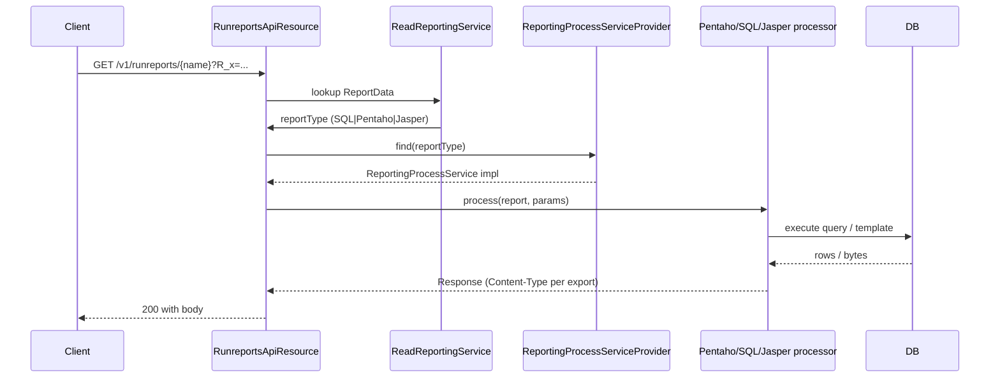

The Run Reports resource is the execution side of Apache Fineract's reporting subsystem. Where [`/v1/reports`](/api/reports) manages the definitions, `/v1/runreports/{reportName}` runs them — resolving the right `ReportingProcessService` (SQL, Pentaho, Jasper, etc.) and returning the rendered output in the format requested by the `output-type` query parameter.

## Source

- **File**: `fineract-provider/src/main/java/org/apache/fineract/infrastructure/dataqueries/api/RunreportsApiResource.java`
- **Base path**: `@Path("/v1/runreports")`
- **Tag**: `Run Reports`
- **Metric**: `fineract.report.execution` (Micrometer `@Timed`, tag `component=reporting`)

The handler delegates to `ReportingProcessServiceProvider.findReportingProcessService(reportType)` — if no provider is registered for the report type (for example, no Pentaho engine on the classpath) it throws `PlatformServiceUnavailableException` with code `err.msg.report.service.implementation.missing`.

## Endpoints

| Method | Path | Description | Handler | Permission |
| ------ | ---- | ----------- | ------- | ---------- |
| GET | `/v1/runreports/availableExports/{reportName}` | List export targets (HTML/CSV/XLS/PDF) supported by the reporting engine for this report | `ReportingProcessService.getAvailableExportTargets` | None (any authenticated user) |
| GET | `/v1/runreports/{reportName}` | Execute the named report and stream its output | `ReportingProcessService.processRequest` | `READ_{reportName}` (e.g. `READ_Client Listing`) unless `parameterType=true` |

The second endpoint produces `application/json`, `text/csv`, `application/vnd.ms-excel`, `application/pdf` and `text/html` — pick one with the `output-type` query parameter (default depends on the engine; SQL reports default to HTML).

## Query parameters for `/v1/runreports/{reportName}`

| Parameter | Type | Description |
| --------- | ---- | ----------- |
| `parameterType` | boolean | When `true`, the endpoint is being used to fetch dropdown values for a parameter rather than running the actual report. Bypasses the per-report permission check. |
| `output-type` | string | `HTML`, `XLS`, `CSV`, `PDF`. |
| `exportCSV` | boolean | Convenience flag equivalent to `output-type=CSV`. |
| `R_*` | string | Any number of report parameters. Names are prefixed with `R_` to distinguish them from framework parameters (e.g. `R_officeId`, `R_fromDate`, `R_toDate`, `R_loanOfficerId`, `R_currencyId`, `R_accountNo`). |

`R_*` values are substituted into the report SQL via `${name}` placeholders — see the parameter definitions surfaced by `/v1/reports/template`.

## Permission resolution

```java
if (!parameterType) {
  if (currentUser.hasNotPermissionForReport(reportName)) {
    throw new NoAuthorizationException("Not authorised to run report: " + reportName);
  }
}
```

`hasNotPermissionForReport` checks for either `ALL_FUNCTIONS`, `REPORTING_SUPER_USER` or an explicit `READ_<reportName>` permission. Parameter dropdowns are deliberately public to authenticated users so a UI can render filter widgets without leaking which reports the user can actually run.

## Examples

### List exports for a report

`GET /v1/runreports/availableExports/Client Listing`

```json
["HTML", "PDF", "XLS", "CSV"]
```

### Run an SQL report as HTML

`GET /v1/runreports/Client%20Listing?R_officeId=1&output-type=HTML`

Response body is an HTML document.

### Run an SQL report as JSON

`GET /v1/runreports/Client%20Listing?R_officeId=1`

```json
{
  "columnHeaders": [
    { "columnName": "Office", "columnType": "VARCHAR", "isColumnNullable": false },
    { "columnName": "Client Name", "columnType": "VARCHAR", "isColumnNullable": false }
  ],
  "data": [
    { "row": ["Head Office", "John Doe"] },
    { "row": ["Branch 1", "Jane Smith"] }
  ]
}
```

### Run as parameter dropdown

`GET /v1/runreports/OfficeIdSelectAll?parameterType=true`

The same machinery is used to populate cascading dropdowns; permission checks are skipped because the response is a list of allowed parameter values, not application data.

## Subsystem cross-links

- **[Reports](/api/reports)** — manage the underlying report catalog.
- **[Report Mailing Jobs](/api/report-mailing-job)** — schedule `runreports` output to be emailed.
- **[AdHoc Query](/api/adhoc-query)** — run-and-store style queries that materialise tables.

## Errors

| HTTP | Code | Cause |
| ---- | ---- | ----- |
| 400 | `error.msg.report.parameter.required` | A `${name}` placeholder in the SQL has no matching `R_name` value. |
| 401 | `error.msg.not.authorized` | User lacks `READ_<reportName>` (and is not parameterType). |
| 500 | `err.msg.report.service.implementation.missing` | No `ReportingProcessService` registered for the report's `reportType`. |


## Endpoint reference

```java
@Path("/v1/runreports")
public class RunreportsApiResource {

    @GET @Path("/availableExports/{reportName}")
    public Response retrieveAvailableExports(@PathParam("reportName") String reportName);

    @GET @Path("{reportName}")
    public Response runReport(@PathParam("reportName") String reportName,
                              @Context UriInfo uriInfo,
                              @QueryParam("isSelfServiceUserReport") @DefaultValue("false") boolean isSelfServiceUserReport,
                              @QueryParam("exportCSV") @DefaultValue("false") boolean exportCSV,
                              ...);
}
```

`/availableExports/{reportName}` returns the list of export formats (`CSV`, `PDF`, `XLS`, ...) that the resolved reporting processor supports for the given report. `/runreports/{reportName}` runs it.

## Parameter binding

Reports declare named parameters via [`/v1/reports`](/api/reports) (`reportParameters`). Callers pass them as query string entries on the run URL — `R_<parameterName>=<value>`. For example, a report with parameters `officeId` and `currencyCode` is invoked:

```http
GET /v1/runreports/Active%20Clients?R_officeId=1&R_currencyCode=USD
```

`UriInfo.getQueryParameters()` is iterated and the `R_` prefix is stripped before forwarding to the processor.

## Processor dispatch



## Export selection

The endpoint accepts several mutually exclusive booleans (typically supplied by the UI):

- `exportCSV=true` → `text/csv`
- `exportPDF=true` → `application/pdf`
- `exportXLS=true` → `application/vnd.ms-excel`
- `exportXLSX=true` → `application/vnd.openxmlformats-officedocument.spreadsheetml.sheet`

Without an explicit export flag, the processor's default (usually `application/json` for SQL, `application/pdf` for Pentaho) is returned.

## Self-service mode

`isSelfServiceUserReport=true` restricts the resolved report to the self-service subset and applies tenant-user scoping (e.g. only their own loans). Reports must opt in to self-service in the catalog before this flag has any effect.

## Permissions

Reads use `validateHasReadPermission("REPORT")`. Stretchy reports may have additional per-report permissions configured in `m_permission`.

## Error semantics

| Failure | HTTP | Detail |
| ------- | ---- | ------ |
| Unknown `reportName` | 404 | `report.not.found` |
| Missing required parameter | 400 | platform validation error |
| Processor not on classpath | 503 | `reporting.process.service.not.available` |

## cURL recipe

```bash
curl -u mifos:password      -H "Fineract-Platform-TenantId: default"      "https://localhost:8443/fineract-provider/api/v1/runreports/Active%20Clients?R_officeId=1&exportCSV=true"      -o active-clients.csv
```

## Cross-links

- [Reports](/api/reports) — define the report catalog.
- [Report Mailing Job](/api/report-mailing-job) — schedule the same report on a recurrence.
- [Mix Report](/api/mix-report) — separate XBRL renderer for MIX taxonomy.


## Stretchy reporting

"Stretchy" is the Mifos-era umbrella for the SQL + Pentaho + Jasper reporting stack. The `availableExports` endpoint reflects what the resolved processor implementation declares as supported. For SQL reports the default list is `CSV`, `XLS`, `XLSX`, `PDF`; for Pentaho it depends on the template (`HTML`, `PDF`, `XLS`).

## Caching considerations

The endpoint does not cache responses — every call re-runs the SQL or re-renders the Pentaho/Jasper template. Wrap your client with a short TTL cache if the report is invoked at scale (e.g. dashboard widgets).
