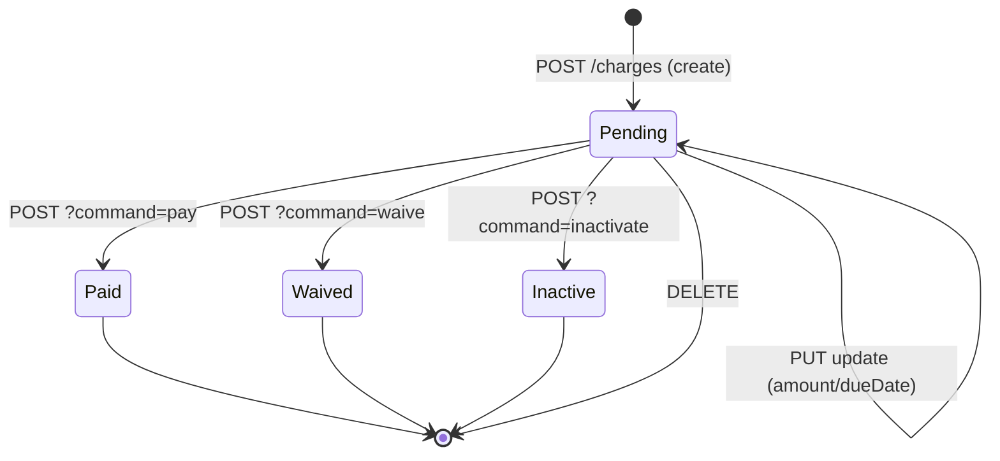

The Savings Account Charges API attaches fees and penalties to a Apache Fineract savings account and exposes the standard pay / waive / inactivate actions used to clear them. Recurring fees and overdraft penalties are typical examples.

## Source

| Aspect | Value |
| --- | --- |
| Resource class | `org.apache.fineract.portfolio.savings.api.SavingsAccountChargesApiResource` |
| File | `fineract-provider/src/main/java/org/apache/fineract/portfolio/savings/api/SavingsAccountChargesApiResource.java` |
| JAX-RS `@Path` | `/v1/savingsaccounts/{savingsAccountId}/charges` |
| Swagger tag | `Savings Charges` |
| Permission resource | `SAVINGSACCOUNTCHARGE` |
| Read service | `SavingsAccountChargeReadPlatformService` |
| Command source | `PortfolioCommandSourceWritePlatformService` |

## Endpoints

| Method | Path | Operation id | Command handler | Permission |
| --- | --- | --- | --- | --- |
| `GET` | `/v1/savingsaccounts/{savingsAccountId}/charges` | (`retrieveAllSavingsAccountCharges`) | `SavingsAccountChargeReadPlatformService.retrieveSavingsAccountCharges(...)` | `READ_SAVINGSACCOUNTCHARGE` |
| `GET` | `/v1/savingsaccounts/{savingsAccountId}/charges/template` | `retrieveTemplateSavingsAccountCharge` | charge options + dropdowns | `READ_SAVINGSACCOUNTCHARGE` |
| `GET` | `/v1/savingsaccounts/{savingsAccountId}/charges/{savingsAccountChargeId}` | (`retrieveSavingsAccountCharge`) | `retrieveSavingsAccountChargeDetails(savingsAccountChargeId, savingsAccountId)` | `READ_SAVINGSACCOUNTCHARGE` |
| `POST` | `/v1/savingsaccounts/{savingsAccountId}/charges` | (`addSavingsAccountCharge`) | `CommandWrapperBuilder.createSavingsAccountCharge(savingsAccountId)` | `CREATE_SAVINGSACCOUNTCHARGE` |
| `PUT` | `/v1/savingsaccounts/{savingsAccountId}/charges/{savingsAccountChargeId}` | (`updateSavingsAccountCharge`) | `CommandWrapperBuilder.updateSavingsAccountCharge(savingsAccountId, savingsAccountChargeId)` | `UPDATE_SAVINGSACCOUNTCHARGE` |
| `POST` | `/v1/savingsaccounts/{savingsAccountId}/charges/{savingsAccountChargeId}` | (`payOrWaiveSavingsAccountCharge`) | dispatched by `?command=`: `pay`, `waive`, `inactivate` | per-command |
| `DELETE` | `/v1/savingsaccounts/{savingsAccountId}/charges/{savingsAccountChargeId}` | (`deleteSavingsAccountCharge`) | `CommandWrapperBuilder.deleteSavingsAccountCharge(savingsAccountId, savingsAccountChargeId)` | `DELETE_SAVINGSACCOUNTCHARGE` |

### `payOrWaiveSavingsAccountCharge` dispatch

The `POST .../charges/{savingsAccountChargeId}?command=` query parameter selects:

| `command` | Builder | Effect |
| --- | --- | --- |
| `pay` | `payOrWaiveSavingsAccountCharge` → `paySavingsAccountCharge(savingsAccountId, savingsAccountChargeId)` | Charge the account and mark the entry paid. |
| `waive` | `waiveSavingsAccountCharge(savingsAccountId, savingsAccountChargeId)` | Waive the outstanding amount. |
| `inactivate` | `inactivateSavingsAccountCharge(savingsAccountId, savingsAccountChargeId)` | Inactivate the (recurring) charge going forward. |

## Request / response shapes

### Create a charge

`POST /v1/savingsaccounts/{savingsAccountId}/charges`:

```json
{
  "chargeId": 21,
  "amount": 5.00,
  "dueDate": "01 May 2026",
  "feeOnMonthDay": "01 May",
  "feeInterval": 1,
  "locale": "en",
  "dateFormat": "dd MMMM yyyy"
}
```

For one-time charges supply `dueDate`; for recurring monthly fees use `feeOnMonthDay` + `feeInterval`.

### Pay a charge

`POST /v1/savingsaccounts/{savingsAccountId}/charges/{savingsAccountChargeId}?command=pay`:

```json
{
  "amount": 5.00,
  "dueDate": "01 May 2026",
  "locale": "en",
  "dateFormat": "dd MMMM yyyy"
}
```

### Waive a charge

`POST /v1/savingsaccounts/{savingsAccountId}/charges/{savingsAccountChargeId}?command=waive`:

```json
{ "locale": "en" }
```

### Inactivate

`POST /v1/savingsaccounts/{savingsAccountId}/charges/{savingsAccountChargeId}?command=inactivate`:

```json
{ "locale": "en" }
```

### Standard write response

```json
{
  "officeId": 1,
  "clientId": 42,
  "savingsId": 88,
  "resourceId": 9,
  "changes": { "amount": 5.0 }
}
```

### Retrieve (excerpt)

`GET /v1/savingsaccounts/{savingsAccountId}/charges/{savingsAccountChargeId}` returns a `SavingsAccountChargeData`:

```json
{
  "id": 9,
  "chargeId": 21,
  "name": "Monthly fee",
  "chargeTimeType": { "id": 5, "code": "chargeTimeType.monthlyFee" },
  "chargeCalculationType": { "id": 1, "code": "chargeCalculationType.flat" },
  "currency": { "code": "USD" },
  "amount": 5.00,
  "amountPaid": 0.00,
  "amountWaived": 0.00,
  "amountOutstanding": 5.00,
  "dueDate": "2026-05-01",
  "feeInterval": 1
}
```

## Permissions

Read endpoints invoke `validateHasReadPermission("SAVINGSACCOUNTCHARGE")`. Writes use `PortfolioCommandSourceWritePlatformService.logCommandSource(...)` which maps builder action codes to `CREATE_SAVINGSACCOUNTCHARGE`, `UPDATE_SAVINGSACCOUNTCHARGE`, `DELETE_SAVINGSACCOUNTCHARGE`, `PAY_SAVINGSACCOUNTCHARGE`, `WAIVE_SAVINGSACCOUNTCHARGE`, `INACTIVATE_SAVINGSACCOUNTCHARGE`.

## Lifecycle diagram



## Recurring vs one-time

`chargeTimeType` on the parent charge decides which input shape applies:

| `chargeTimeType` | Required fields on POST | Notes |
| --- | --- | --- |
| `1` Specified due date | `amount`, `dueDate` | One-off charge fired on `dueDate`. |
| `5` Monthly fee | `amount`, `feeOnMonthDay`, `feeInterval` | Posts every `feeInterval` months on `feeOnMonthDay`. |
| `6` Annual fee | `amount`, `feeOnMonthDay` | Posts annually. |
| `7` Withdrawal fee | `amount` | Triggered automatically on each withdrawal. |
| `8` Saving no activity fee | `amount`, `feeInterval` | Triggered after the configured inactivity window. |

## Sample curl — pay a charge

```bash
curl -k -u mifos:password \
  -H "Fineract-Platform-TenantId: default" \
  -H "Content-Type: application/json" \
  -X POST "https://localhost:8443/fineract-provider/api/v1/savingsaccounts/88/charges/9?command=pay" \
  -d '{ "amount": 5.00, "dueDate": "01 May 2026", "locale": "en", "dateFormat": "dd MMMM yyyy" }'
```

## Template endpoint

`GET /v1/savingsaccounts/{savingsAccountId}/charges/template` returns the dropdown payload the UI needs to render the "Add charge" form. It bundles:

- `chargeOptions` — the catalogue of charges applicable to the account's product, filtered by currency and active flag.
- `chargeTimeTypeOptions`, `chargeCalculationTypeOptions` — the enum dropdowns for one-off charges.
- The product's default `feeOnMonthDay` and `feeInterval` for recurring fees.

It does **not** load existing charges on the account — call the list endpoint for that.

Operationally the template is requested once per "add charge" modal; the resulting `chargeOptions` array is cached client-side until the modal is closed. Browser tools should pre-warm this for the most common chargeIds to avoid jitter.

## Relationship to product charges

When a savings account is created the platform auto-attaches every charge marked `isOptional=false` on the parent `SavingsProduct`. Optional charges and ad-hoc charges (`chargeTimeType=specifiedDueDate`) are added through this resource later. Deleting a product-mandated charge from the account is rejected with `error.msg.savings.account.charge.cannot.be.deleted` — inactivate it instead.

## Common pitfalls

- **Inactive vs deleted.** `inactivate` stops further recurrences but keeps history; `DELETE` removes only charges in `pending`/`unpaid` state. The handler returns `error.msg.charge.cannot.be.deleted` for paid or partially-paid charges.
- **`payOrWaiveSavingsAccountCharge` requires a positive balance** when the parent product does not allow overdraft — the write path rejects with `error.msg.savingsaccount.transaction.insufficient.account.balance`.
- **`feeOnMonthDay` format** is locale-aware: `dateFormat=dd MMMM` is the conventional pattern (`"01 May"`); passing `"2026-05-01"` produces `error.msg.invalid.dateformat`.

## Related pages

- [/savings/savings-charges](/savings/savings-charges) — domain walk-through.
- [/api/savings-accounts](/api/savings-accounts) — parent account resource.
- [/api/savings-products](/api/savings-products) — charges are defined per-product.
- [/api/charges](/api/charges) — charge catalogue.
- [/api/conventions](/api/conventions) — envelope, locale and error model.
