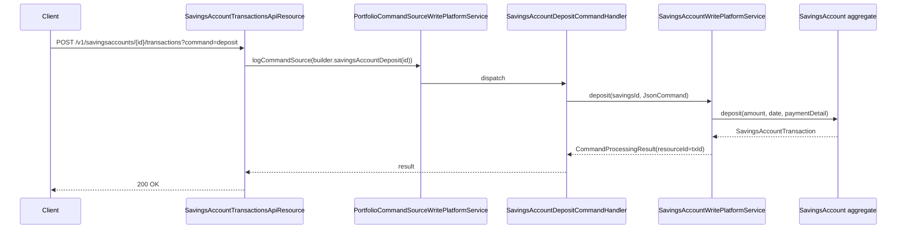

The Savings Account Transactions API is how Apache Fineract records every money movement on a savings account — deposits, withdrawals, holds, releases, interest postings and adjustments — plus the read-side endpoints used by reporting and reconciliation tools.

## Source

| Aspect | Value |
| --- | --- |
| Resource class | `org.apache.fineract.portfolio.savings.api.SavingsAccountTransactionsApiResource` |
| File | `fineract-provider/src/main/java/org/apache/fineract/portfolio/savings/api/SavingsAccountTransactionsApiResource.java` |
| JAX-RS `@Path` | `/v1/savingsaccounts/{savingsId}/transactions` |
| Swagger tag | `Savings Account Transactions` |
| Permission resource | `SAVINGSACCOUNT` (read) and per-command codes for writes |
| Read service | `SavingsAccountReadPlatformService` |
| Command source | `PortfolioCommandSourceWritePlatformService` |

## Endpoints

| Method | Path | Operation id | Description |
| --- | --- | --- | --- |
| `GET` | `/v1/savingsaccounts/{savingsId}/transactions/template` | `retrieveTemplateSavingsAccountTransaction` | Transaction-creation template (`?command=` chooses the prefilled action). |
| `GET` | `/v1/savingsaccounts/{savingsId}/transactions/{transactionId}` | `retrieveOneSavingsAccountTransaction` | Retrieve one transaction. |
| `GET` | `/v1/savingsaccounts/{savingsId}/transactions/search` | (`searchTransactions`) | Search transactions on the account by query params. |
| `POST` | `/v1/savingsaccounts/{savingsId}/transactions/query` | `advancedQuerySavingsAccountTransactions` | Advanced (`AdvancedQueryRequest`) search. |
| `POST` | `/v1/savingsaccounts/{savingsId}/transactions` | `createSavingsAccountTransaction` | Execute a transaction. See [Transaction commands](#transaction-commands). |
| `POST` | `/v1/savingsaccounts/{savingsId}/transactions/{transactionId}` | `adjustSavingsAccountTransaction` | Undo/Reverse/Modify/Release a transaction. See [Adjust commands](#adjust-commands). |

## Transaction commands

`POST /v1/savingsaccounts/{savingsId}/transactions?command={cmd}` is dispatched in `transaction(...)`:

```java
final CommandWrapper commandRequest = switch (StringUtils.trimToEmpty(commandParam)) {
    case "deposit"           -> builder.savingsAccountDeposit(savingsId).build();
    case "gsimDeposit"       -> builder.gsimSavingsAccountDeposit(savingsId).build();
    case "withdrawal"        -> builder.savingsAccountWithdrawal(savingsId).build();
    case "force-withdrawal"  -> builder.savingsAccountForceWithdrawal(savingsId).build();
    case "postInterestAsOn"  -> builder.savingsAccountInterestPosting(savingsId).build();
    case SavingsApiConstants.COMMAND_HOLD_AMOUNT
                             -> builder.holdAmount(savingsId).build();
    default -> throw new UnrecognizedQueryParamException("command", commandParam,
                "deposit", "withdrawal", "force-withdrawal", SavingsApiConstants.COMMAND_HOLD_AMOUNT);
};
```

| `command` | Outcome |
| --- | --- |
| `deposit` | Plain deposit. |
| `gsimDeposit` | Deposit on a GSIM parent that fans out to children. |
| `withdrawal` | Standard withdrawal subject to balance + minimum-balance checks. |
| `force-withdrawal` | Withdrawal that bypasses minimum-balance enforcement. |
| `postInterestAsOn` | Force interest posting through `postInterestAsOnDate`. |
| `holdAmount` | Place a hold (unavailable balance) for an external claim. |

## Adjust commands

`POST /v1/savingsaccounts/{savingsId}/transactions/{transactionId}?command={cmd}` dispatched in `adjustTransaction(...)`:

| `command` | Outcome | Builder |
| --- | --- | --- |
| `undo` (`SavingsApiConstants.COMMAND_UNDO_TRANSACTION`) | Undo a transaction. | `undoSavingsAccountTransaction(savingsId, transactionId)` |
| `reverse` (`COMMAND_REVERSE_TRANSACTION`) | Reverse a transaction (creates an offsetting entry). | `reverseSavingsAccountTransaction(savingsId, transactionId)` |
| `modify` (`COMMAND_ADJUST_TRANSACTION`) | Modify amount/date. | `adjustSavingsAccountTransaction(savingsId, transactionId)` |
| `releaseAmount` (`COMMAND_RELEASE_AMOUNT`) | Release a previously placed hold. | `releaseAmount(savingsId, transactionId)` |

## Request / response shapes

### Deposit / withdrawal

`POST /v1/savingsaccounts/{savingsId}/transactions?command=deposit`:

```json
{
  "transactionDate": "01 April 2026",
  "transactionAmount": 250.00,
  "paymentTypeId": 1,
  "accountNumber": "0000000088",
  "locale": "en",
  "dateFormat": "dd MMMM yyyy"
}
```

### Hold amount

`POST /v1/savingsaccounts/{savingsId}/transactions?command=holdAmount`:

```json
{
  "transactionDate": "01 April 2026",
  "transactionAmount": 100.00,
  "reasonForBlock": "Court order",
  "locale": "en",
  "dateFormat": "dd MMMM yyyy"
}
```

### Adjust / reverse

`POST /v1/savingsaccounts/{savingsId}/transactions/{transactionId}?command=reverse`:

```json
{ "locale": "en" }
```

### Release a hold

`POST /v1/savingsaccounts/{savingsId}/transactions/{holdTransactionId}?command=releaseAmount`:

```json
{ "locale": "en" }
```

### Retrieve a transaction (excerpt)

```json
{
  "id": 555,
  "transactionType": { "id": 1, "code": "savingsAccountTransactionType.deposit", "value": "Deposit" },
  "accountId": 88,
  "accountNo": "0000000088",
  "date": "2026-04-01",
  "currency": { "code": "USD" },
  "amount": 250.00,
  "runningBalance": 1050.00,
  "reversed": false
}
```

### Advanced query

`POST /v1/savingsaccounts/{savingsId}/transactions/query` accepts an `AdvancedQueryRequest` (the same shape used by the generic Fineract `SQLSearch` infrastructure). It supports column-level filters, `or`/`and` grouping, pagination and sort orders. The implementation calls `SavingsAccountReadPlatformService.advancedQuery(savingsId, request)`.

### Standard write response

```json
{
  "officeId": 1,
  "clientId": 42,
  "savingsId": 88,
  "resourceId": 555,
  "changes": {}
}
```

## Permissions

Read endpoints invoke `validateHasReadPermission("SAVINGSACCOUNT")`. The transaction-execution endpoints route through `PortfolioCommandSourceWritePlatformService.logCommandSource(...)` which maps the builder action codes to permissions such as `DEPOSIT_SAVINGSACCOUNT`, `WITHDRAWAL_SAVINGSACCOUNT`, `HOLDAMOUNT_SAVINGSACCOUNT`, `UNDOTRANSACTION_SAVINGSACCOUNT`, `ADJUSTTRANSACTION_SAVINGSACCOUNT`, `RELEASEAMOUNT_SAVINGSACCOUNT`.

## Deposit flow



## Hold / release semantics

`holdAmount` creates a `SavingsAccountTransaction` with `transactionType = withdrawal-hold` that does **not** debit the running balance but reduces `availableBalance`. The transaction is later resolved either by `releaseAmount` (returns funds to available) or by being consumed during loan-guarantor recovery.

| State | `runningBalance` impact | `availableBalance` impact |
| --- | --- | --- |
| `holdAmount` | none | -amount |
| `releaseAmount` | none | +amount |
| `withdrawal` | -amount | -amount |
| `deposit` | +amount | +amount |

## Search endpoint query parameters

`GET /transactions/search` supports:

- `fromDate` / `toDate` — inclusive range (locale-aware).
- `fromAmount` / `toAmount`.
- `types` — comma-separated `SavingsAccountTransactionType` ids.
- `currencyCode` — defaults to the account currency.
- `offset` / `limit` — `PaginationParameters`.

Results are wrapped as `Page<SavingsAccountTransactionData>` with `totalFilteredRecords` and `pageItems`.

## Common pitfalls

- **`force-withdrawal` is privileged** and requires `FORCEWITHDRAWAL_SAVINGSACCOUNT`; the user must hold the role explicitly because regulators audit it.
- **`postInterestAsOn` must be on or after the next posting date**; otherwise the platform raises `error.msg.postInterestAsOn.date.is.before.last.posting.date`.
- **Reversed transactions cannot be re-reversed.** A second `?command=reverse` on the same transaction returns `error.msg.savingsaccount.transaction.was.already.reversed`.
- **Adjust modifies amount + date in-place** but is rejected once any subsequent transaction has been booked — the account would have to be re-posted. The handler raises `error.msg.savingsaccount.transaction.update.not.allowed`.

## Sample curl — withdrawal

```bash
curl -k -u mifos:password \
  -H "Fineract-Platform-TenantId: default" \
  -H "Content-Type: application/json" \
  -X POST "https://localhost:8443/fineract-provider/api/v1/savingsaccounts/88/transactions?command=withdrawal" \
  -d '{ "transactionDate": "02 April 2026", "transactionAmount": 50, "locale": "en", "dateFormat": "dd MMMM yyyy" }'
```

## Related pages

- [/savings/savings-transactions](/savings/savings-transactions) — domain model.
- [/api/savings-accounts](/api/savings-accounts) — parent account resource (state transitions live there).
- [/api/deposit-on-hold-fund](/api/deposit-on-hold-fund) — guarantee-fund on-hold transactions.
- [/api/conventions](/api/conventions) — envelope, locale and error model.
