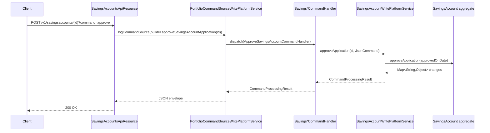

The Savings Accounts API is the entry point Apache Fineract clients use to drive the full savings application lifecycle — submit, approve/reject, activate, calculate or post interest, close, block credits or debits, and assign or unassign a savings officer. It also exposes GSIM (Group Savings Individual Monitoring) flows and the Excel-based bulk import / transaction import templates.

## Source

| Aspect | Value |
| --- | --- |
| Resource class | `org.apache.fineract.portfolio.savings.api.SavingsAccountsApiResource` |
| File | `fineract-provider/src/main/java/org/apache/fineract/portfolio/savings/api/SavingsAccountsApiResource.java` |
| JAX-RS `@Path` | `/v1/savingsaccounts` |
| Swagger tag | `Savings Account` |
| Permission resource | `SAVINGSACCOUNT` (general) and per-command codes for state transitions |
| Read service | `SavingsAccountReadPlatformService` |
| Command source | `PortfolioCommandSourceWritePlatformService` |

## Endpoints

### Application CRUD by id

| Method | Path | Operation id | Command handler | Permission |
| --- | --- | --- | --- | --- |
| `GET` | `/v1/savingsaccounts/template` | `retrieveSavingsAccountTemplate` | `SavingsAccountReadPlatformService.retrieveTemplate(...)` | `READ_SAVINGSACCOUNT` |
| `GET` | `/v1/savingsaccounts` | `retrieveAllSavingsAccounts` | paginated `retrieveAll(...)` | `READ_SAVINGSACCOUNT` |
| `POST` | `/v1/savingsaccounts` | `submitSavingsApplication` | `CommandWrapperBuilder.createSavingsAccount()` | `CREATE_SAVINGSACCOUNT` |
| `GET` | `/v1/savingsaccounts/{accountId}` | `retrieveSavingsAccount` | `retrieveOne(accountId)` | `READ_SAVINGSACCOUNT` |
| `PUT` | `/v1/savingsaccounts/{accountId}` | `updateSavingsAccount` | `updateSavingsAccount(accountId)` / `updateWithHoldTax(accountId)` (`?command=updateWithHoldTax`) | `UPDATE_SAVINGSACCOUNT` |
| `POST` | `/v1/savingsaccounts/{accountId}` | `handleCommandsSavingsAccount` | varies by `?command=` (see [Commands](#state-transition-commands)) | per-command |
| `DELETE` | `/v1/savingsaccounts/{accountId}` | `deleteSavingsAccount` | `deleteSavingsAccount(accountId)` | `DELETE_SAVINGSACCOUNT` |

### External-id variants

The same operations are exposed under `/v1/savingsaccounts/external-id/{externalId}`:

- `GET /v1/savingsaccounts/external-id/{externalId}` — `retrieveSavingsAccountByExternalId`
- `PUT /v1/savingsaccounts/external-id/{externalId}` — `updateSavingsAccountByExternalId`
- `POST /v1/savingsaccounts/external-id/{externalId}` — `handleCommandsSavingsAccountByExternalId`
- `DELETE /v1/savingsaccounts/external-id/{externalId}` — `deleteSavingsAccountByExternalId`

All variants resolve the account id via `getResolvedAccountId(accountId, accountExternalId)` and reuse the same downstream handlers.

### GSIM (Group Savings Individual Monitoring)

| Method | Path | Description | Command handler |
| --- | --- | --- | --- |
| `POST` | `/v1/savingsaccounts/gsim` | Submit a new GSIM application. | `CommandWrapperBuilder.createGSIMAccount()` |
| `PUT` | `/v1/savingsaccounts/gsim/{parentAccountId}` | Modify a GSIM application. | `CommandWrapperBuilder.updateGSIMAccount(parentAccountId)` |
| `POST` | `/v1/savingsaccounts/gsimcommands/{parentAccountId}` | GSIM state transitions: `reject`, `withdrawnByApplicant`, `undoapproval`, `close`. | builder dispatched by `?command=` |

### Excel import / download templates

| Method | Path | Description |
| --- | --- | --- |
| `GET` | `/v1/savingsaccounts/downloadtemplate` | Download the savings-import workbook. |
| `POST` | `/v1/savingsaccounts/uploadtemplate` | Upload a completed savings workbook. |
| `GET` | `/v1/savingsaccounts/transactions/downloadtemplate` | Download the savings-transactions workbook. |
| `POST` | `/v1/savingsaccounts/transactions/uploadtemplate` | Upload a completed transactions workbook. |

## State transition commands

`POST /v1/savingsaccounts/{accountId}?command={cmd}` is dispatched inside `handleCommands(...)` via `CommandParameterUtil.is(commandParam, ...)`. Recognised values:

| `command` | Command handler |
| --- | --- |
| `reject` | `rejectSavingsAccountApplication(accountId)` |
| `withdrawnByApplicant` | `withdrawSavingsAccountApplication(accountId)` |
| `approve` | `approveSavingsAccountApplication(accountId)` |
| `undoapproval` | `undoSavingsAccountApplication(accountId)` |
| `activate` | `savingsAccountActivation(accountId)` |
| `calculateInterest` | `savingsAccountInterestCalculation(accountId)` |
| `postInterest` | `savingsAccountInterestPosting(accountId)` |
| `applyAnnualFees` | `savingsAccountApplyAnnualFees(accountId)` |
| `close` | `closeSavingsAccountApplication(accountId)` |
| `assignSavingsOfficer` | `assignSavingsOfficer(accountId)` |
| `unassignSavingsOfficer` | `unassignSavingsOfficer(accountId)` |
| `blockDebit` (`SavingsApiConstants.COMMAND_BLOCK_DEBIT`) | `blockDebitsFromSavingsAccount(accountId)` |
| `unblockDebit` | `unblockDebitsFromSavingsAccount(accountId)` |
| `blockCredit` | `blockCreditsToSavingsAccount(accountId)` |
| `unblockCredit` | `unblockCreditsToSavingsAccount(accountId)` |
| `block` | `blockSavingsAccount(accountId)` |
| `unblock` | `unblockSavingsAccount(accountId)` |

Unknown commands raise `UnrecognizedQueryParamException`.

The GSIM variant exposes a smaller set: `reject`, `withdrawnByApplicant`, `undoapproval`, `close`, dispatched via `rejectGSIMAccountApplication`, `withdrawSavingsAccountApplication`, `undoGSIMApplicationApproval`, `closeGSIMApplication`.

## Request / response shapes

### Submit application

`POST /v1/savingsaccounts`:

```json
{
  "clientId": 42,
  "productId": 1,
  "submittedOnDate": "01 March 2026",
  "externalId": "savings-001",
  "nominalAnnualInterestRate": 5.0,
  "interestCompoundingPeriodType": 1,
  "interestPostingPeriodType": 4,
  "interestCalculationType": 1,
  "interestCalculationDaysInYearType": 365,
  "minRequiredOpeningBalance": 100,
  "locale": "en",
  "dateFormat": "dd MMMM yyyy"
}
```

### Approve

`POST /v1/savingsaccounts/{accountId}?command=approve`:

```json
{ "approvedOnDate": "05 March 2026", "locale": "en", "dateFormat": "dd MMMM yyyy" }
```

### Activate

`POST /v1/savingsaccounts/{accountId}?command=activate`:

```json
{ "activatedOnDate": "06 March 2026", "locale": "en", "dateFormat": "dd MMMM yyyy" }
```

### Close

`POST /v1/savingsaccounts/{accountId}?command=close`:

```json
{
  "closedOnDate": "10 December 2026",
  "withdrawBalance": true,
  "paymentTypeId": 1,
  "locale": "en",
  "dateFormat": "dd MMMM yyyy"
}
```

### Standard write response

```json
{
  "officeId": 1,
  "clientId": 42,
  "savingsId": 88,
  "resourceId": 88,
  "changes": { "status": { "id": 200, "code": "savingsAccountStatusType.approved" } }
}
```

### Retrieve (excerpt)

```json
{
  "id": 88,
  "accountNo": "0000000088",
  "externalId": "savings-001",
  "clientId": 42,
  "savingsProductId": 1,
  "status": { "id": 300, "code": "savingsAccountStatusType.active" },
  "currency": { "code": "USD" },
  "nominalAnnualInterestRate": 5.0,
  "summary": {
    "totalDeposits": 1000,
    "totalWithdrawals": 200,
    "accountBalance": 800
  }
}
```

## Permissions

Read endpoints invoke `validateHasReadPermission("SAVINGSACCOUNT")`. State-transition commands are routed through `PortfolioCommandSourceWritePlatformService` which maps each builder action code to permissions such as `APPROVE_SAVINGSACCOUNT`, `ACTIVATE_SAVINGSACCOUNT`, `CLOSE_SAVINGSACCOUNT`, `BLOCKDEBIT_SAVINGSACCOUNT`, etc.

## Command pipeline

Every write goes through the `PortfolioCommandSourceWritePlatformService.logCommandSource(...)` envelope: the resource serialises the JSON body, builds a `CommandWrapper` keyed by the action code, and either executes synchronously or persists a maker-checker entry depending on the `Permission.makerCheckerEnabled` flag for that action code.



## Common pitfalls

- **Locale required on every write.** `JsonCommand` parses every monetary, date and decimal field using the supplied `locale`/`dateFormat`. Submitting without them produces `400` with `error.msg.platform.unknown.data.integrity.issue`.
- **`accountActivation` ordering.** Activation requires the account to be in `submitted` and approved or in `approved` state — calling `activate` before `approve` returns `error.msg.savingsaccount.activation.not.allowed.account.is.in.invalid.state.with.value`.
- **`assignSavingsOfficer` uses both account and staff scope.** The handler validates that the assigned staff record is in the same office hierarchy as the account; otherwise it raises `SavingsOfficerAssignmentException`.
- **`blockDebit` / `blockCredit` versus `block`.** The two former block one direction, the latter blocks both. Unblocking the umbrella `block` does not re-enable a pre-existing one-sided block.

## Sample curl — submit application

```bash
curl -k -u mifos:password \
  -H "Fineract-Platform-TenantId: default" \
  -H "Content-Type: application/json" \
  -X POST https://localhost:8443/fineract-provider/api/v1/savingsaccounts \
  -d '{
        "clientId": 42,
        "productId": 1,
        "submittedOnDate": "01 March 2026",
        "locale": "en",
        "dateFormat": "dd MMMM yyyy"
      }'
```

## Related pages

- [/savings/overview](/savings/overview) — savings module overview.
- [/savings/savings-account-domain](/savings/savings-account-domain) — `SavingsAccount` domain model.
- [/savings/savings-write-service](/savings/savings-write-service) — service-tier implementation.
- [/api/savings-account-transactions](/api/savings-account-transactions) — transaction sub-resource.
- [/api/savings-account-charges](/api/savings-account-charges) — charge sub-resource.
- [/savings/gsim-group-savings](/savings/gsim-group-savings) — GSIM domain.
- [/api/conventions](/api/conventions) — envelope, locale and error model.
