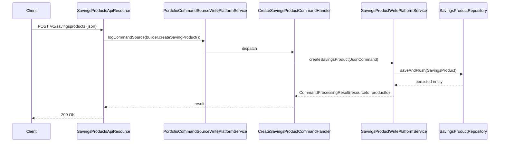

The Savings Products API exposes CRUD for the `SavingsProduct` templates that every Apache Fineract savings account is created from. Each product fixes the currency, interest rules, allowed charges, accounting rules and overdraft behaviour for its child accounts.

## Source

| Aspect | Value |
| --- | --- |
| Resource class | `org.apache.fineract.portfolio.savings.api.SavingsProductsApiResource` |
| File | `fineract-provider/src/main/java/org/apache/fineract/portfolio/savings/api/SavingsProductsApiResource.java` |
| JAX-RS `@Path` | `/v1/savingsproducts` |
| Swagger tag | `Savings Product` |
| Permission resource | `SAVINGSPRODUCT` |
| Read service | `SavingsProductReadPlatformService` |
| Command source | `PortfolioCommandSourceWritePlatformService` |

## Endpoints

| Method | Path | Operation id | Command handler | Permission |
| --- | --- | --- | --- | --- |
| `POST` | `/v1/savingsproducts` | `createSavingsProduct` | `CommandWrapperBuilder.createSavingProduct()` | `CREATE_SAVINGSPRODUCT` |
| `PUT` | `/v1/savingsproducts/{productId}` | `updateSavingsProduct` | `CommandWrapperBuilder.updateSavingProduct(productId)` | `UPDATE_SAVINGSPRODUCT` |
| `GET` | `/v1/savingsproducts` | `retrieveAllSavingsProducts` | `SavingsProductReadPlatformService.retrieveAll()` | `READ_SAVINGSPRODUCT` |
| `GET` | `/v1/savingsproducts/{productId}` | `retrieveOneSavingsProduct` | `retrieveOne(productId)` | `READ_SAVINGSPRODUCT` |
| `GET` | `/v1/savingsproducts/template` | `retrieveTemplateSavingsProduct` | template aggregator | `READ_SAVINGSPRODUCT` |
| `DELETE` | `/v1/savingsproducts/{productId}` | `deleteSavingsProduct` | `CommandWrapperBuilder.deleteSavingProduct(productId)` | `DELETE_SAVINGSPRODUCT` |

Note the slight asymmetry in the builder method names: `createSavingProduct` / `updateSavingProduct` / `deleteSavingProduct` (singular `Saving`) — these are the literal action codes the command source recognises.

## Template composition

`GET /v1/savingsproducts/template` aggregates:

- Currency options via `CurrencyReadPlatformService.retrieveAllowedCurrencies()`.
- Interest compounding/posting/calculation period type dropdowns from `SavingsDropdownReadPlatformService`.
- `SavingsAccountTransactionType` and `LockinPeriodFrequencyType` enums.
- Allowed charges via `ChargeReadPlatformService.retrieveSavingsProductApplicableCharges(...)`.
- Accounting rule type and GL account dropdowns via `AccountingDropdownReadPlatformService`.
- Tax group options for withholding-tax setup.

## Request shapes

### Create

`POST /v1/savingsproducts`:

```json
{
  "name": "Passbook savings",
  "shortName": "PASS",
  "description": "Standard passbook savings product",
  "currencyCode": "USD",
  "digitsAfterDecimal": 2,
  "inMultiplesOf": 0,
  "nominalAnnualInterestRate": 5.0,
  "interestCompoundingPeriodType": 1,
  "interestPostingPeriodType": 4,
  "interestCalculationType": 1,
  "interestCalculationDaysInYearType": 365,
  "minRequiredOpeningBalance": 100,
  "lockinPeriodFrequency": 0,
  "lockinPeriodFrequencyType": 0,
  "allowOverdraft": false,
  "accountingRule": 1,
  "locale": "en"
}
```

### Update

`PUT /v1/savingsproducts/{productId}` accepts the same shape with every field optional.

### Response

```json
{ "resourceId": 1, "changes": { } }
```

### Retrieve (excerpt)

`GET /v1/savingsproducts/{productId}`:

```json
{
  "id": 1,
  "name": "Passbook savings",
  "shortName": "PASS",
  "currency": { "code": "USD", "decimalPlaces": 2 },
  "nominalAnnualInterestRate": 5.0,
  "interestCompoundingPeriodType": { "id": 1, "code": "savings.interest.period.daily" },
  "interestPostingPeriodType": { "id": 4, "code": "savings.interest.posting.period.monthly" },
  "interestCalculationType": { "id": 1, "code": "savings.interest.calculation.dailyBalance" },
  "interestCalculationDaysInYearType": { "id": 365, "code": "savings.interest.dayInYear.365" },
  "minRequiredOpeningBalance": 100.00,
  "allowOverdraft": false,
  "withdrawalFeeForTransfers": false,
  "accountingRule": { "id": 1, "code": "accountingRuleType.none" }
}
```

## Permissions

Read endpoints explicitly call `validateHasReadPermission("SAVINGSPRODUCT")`. Writes are routed through `PortfolioCommandSourceWritePlatformService.logCommandSource(...)` which applies `CREATE_SAVINGSPRODUCT`, `UPDATE_SAVINGSPRODUCT`, `DELETE_SAVINGSPRODUCT` based on the builder action code.

## Create flow



## Validation highlights

- `name` and `shortName` are unique across active products. Violations raise `error.msg.product.savings.duplicate.name`.
- `digitsAfterDecimal` and `inMultiplesOf` must match the currency's decimal places — checked inside `SavingsProductDataValidator.validate(...)`.
- When `accountingRule` is `2` (cash-based) or `3` (accrual-periodic), the `savingsReferenceAccountId`, `savingsControlAccountId`, `transfersInSuspenseAccountId`, `interestOnSavingsAccountId`, `incomeFromFeeAccountId` and `incomeFromPenaltyAccountId` GL mappings are required.
- `lockinPeriodFrequency > 0` requires `lockinPeriodFrequencyType` to be supplied.

## Common pitfalls

- **Currency mismatch with charges.** Charges added to a product must share the product currency — `ChargeReadPlatformService.retrieveSavingsProductApplicableCharges(...)` already filters the dropdown but a malicious client can still POST a foreign charge id and trigger `error.msg.charge.currency.mismatch`.
- **Withholding tax.** Setting `withHoldTax = true` requires `taxGroupId`; the product validator enforces that the tax group has both savings and recurring-deposit mapped.
- **Overdraft.** When `allowOverdraft` is true the `overdraftLimit`, `nominalAnnualInterestRateOverdraft` and `minOverdraftForInterestCalculation` must be present.

## Sample curl

```bash
curl -k -u mifos:password \
  -H "Fineract-Platform-TenantId: default" \
  -H "Content-Type: application/json" \
  -X POST https://localhost:8443/fineract-provider/api/v1/savingsproducts \
  -d '{
        "name": "Passbook savings",
        "shortName": "PASS",
        "currencyCode": "USD",
        "digitsAfterDecimal": 2,
        "nominalAnnualInterestRate": 5,
        "interestCompoundingPeriodType": 1,
        "interestPostingPeriodType": 4,
        "interestCalculationType": 1,
        "interestCalculationDaysInYearType": 365,
        "accountingRule": 1,
        "locale": "en"
      }'
```

## Accounting rule choices

`accountingRule` selects how journal entries are produced when accounts created from this product transact:

| Code | Behaviour |
| --- | --- |
| `1` | None — no journal postings. |
| `2` | Cash-based — every deposit/withdrawal triggers a paired posting. |
| `3` | Accrual (periodic) — interest accrues separately from cash movements. |

For cash-based products the GL mapping fields `savingsReferenceAccountId`, `savingsControlAccountId`, `transfersInSuspenseAccountId`, `interestOnSavingsAccountId`, `incomeFromFeeAccountId`, `incomeFromPenaltyAccountId`, `overdraftPortfolioControlAccountId`, `incomeFromInterestAccountId`, and `writeOffAccountId` are required and must be DETAIL-level GL accounts.

`paymentChannelToFundSourceMappings` can optionally route a specific payment type to a non-default fund-source GL account; `feeToIncomeAccountMappings` and `penaltyToIncomeAccountMappings` can split fee/penalty income by `chargeId`.

## Charges attached at product level

`charges` on a `SavingsProduct` is a list of `{ id }` references to entries in the catalogue. Every savings account created from the product inherits those charges. To add a charge after the fact, either:

- update the product and accept that **only new accounts** pick up the additional charge, or
- call [`POST /v1/savingsaccounts/{id}/charges`](/api/savings-account-charges) per existing account.

## Related pages

- [/savings/overview](/savings/overview) — savings module overview.
- [/api/savings-accounts](/api/savings-accounts) — accounts created from these products.
- [/api/savings-account-charges](/api/savings-account-charges) — charges configured here are attached automatically to new accounts.
- [/api/charges](/api/charges) — charge catalogue.
- [/api/conventions](/api/conventions) — envelope, locale and error model.
