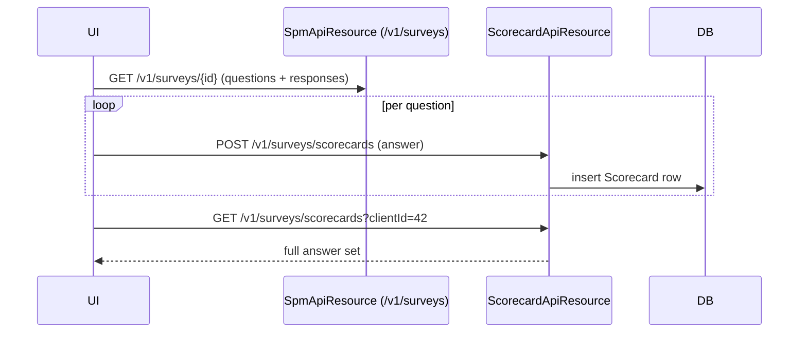

The Scorecards resource is Apache Fineract's **Social Performance Management** (SPM) survey scoring endpoint. It is structurally separate from the [Surveys](/api/surveys) / [PPI](/api/likelihood) machinery: SPM surveys live in the `org.apache.fineract.spm` package, use JPA entities (`Survey`, `Question`, `Response`, `Scorecard`) rather than dynamic datatables, and are managed by [`/v1/surveys`](#related-spm-surveys-endpoint) (`SpmApiResource`). This page documents `ScorecardApiResource`, which captures answers and exposes the per-client scorecard.

## Source

- **File**: `fineract-provider/src/main/java/org/apache/fineract/spm/api/ScorecardApiResource.java`
- **Base path**: `@Path("/v1/surveys/scorecards")`
- **Tag**: `Score Card`

Companion resource (survey CRUD, not scoring):

- `fineract-provider/src/main/java/org/apache/fineract/spm/api/SpmApiResource.java` — `@Path("/v1/surveys")`, tag `Spm-Surveys`. Provides `GET /v1/surveys`, `GET /v1/surveys/{id}`, `POST /v1/surveys`, `PUT /v1/surveys/{id}` and `POST /v1/surveys/{id}?command=activate|deactivate`.

## Endpoints

| Method | Path | Description | Handler | Permission |
| ------ | ---- | ----------- | ------- | ---------- |
| GET | `/v1/surveys/scorecards/{surveyId}` | List every scorecard entry for a survey | `ScorecardReadPlatformService.retrieveScorecardBySurvey` | authenticated user |
| POST | `/v1/surveys/scorecards/{surveyId}` | Append a single answer (one `questionId` + `responseId`) | `ScorecardService.createScorecard` | authenticated user |
| GET | `/v1/surveys/scorecards/{surveyId}/clients/{clientId}` | Filter scorecards to a single client and survey | `ScorecardReadPlatformService.retrieveScorecardBySurveyAndClient` | authenticated user |
| GET | `/v1/surveys/scorecards/clients/{clientId}` | All scorecards (across surveys) for one client | `ScorecardReadPlatformService.retrieveScorecardByClient` | authenticated user |

The handlers call `securityContext.authenticatedUser()` only — they do **not** call `validateHasReadPermission`. Anyone with a valid Fineract login can access scorecards.

All POSTs and GETs run inside `@Transactional`. The POST resolves the survey (`SpmService.findById`) and the client (`ClientRepositoryWrapper.findOneWithNotFoundDetection`) before constructing the entity via `ScorecardMapper.map`.

## Request body — POST `/v1/surveys/scorecards/{surveyId}`

Mandatory fields per the `@Operation` description: `clientId`, `createdOn`, `questionId`, `responseId`, `staffId`.

```json
{
  "clientId": 41,
  "staffId": 3,
  "createdOn": "2024-03-04T10:00:00",
  "questionId": 11,
  "responseId": 35
}
```

The POST returns `204 No Content` (the method signature is `void`).

## Response shape — `ScorecardData`

```json
{
  "surveyId": 2,
  "surveyName": "Client Protection",
  "clientId": 41,
  "clientName": "John Doe",
  "userId": 3,
  "userName": "loan-officer-1",
  "createdOn": "2024-03-04T10:00:00",
  "questionId": 11,
  "questionText": "Has the client been informed of all fees?",
  "responseId": 35,
  "responseText": "Yes",
  "responseValue": 10
}
```

Each row is one (survey, client, question, response) tuple. A complete fulfilment of a survey produces N rows where N is the number of questions.

## Examples

### List a survey's scorecards

`GET /v1/surveys/scorecards/2`

```json
[
  { "surveyId": 2, "clientId": 41, "questionId": 11, "responseId": 35, "responseValue": 10 },
  { "surveyId": 2, "clientId": 41, "questionId": 12, "responseId": 41, "responseValue": 5 }
]
```

### Client's history across all surveys

`GET /v1/surveys/scorecards/clients/41`

### Append an answer

`POST /v1/surveys/scorecards/2`

```json
{
  "clientId": 41,
  "staffId": 3,
  "createdOn": "2024-03-04T10:00:00",
  "questionId": 12,
  "responseId": 41
}
```

## Related — SPM surveys endpoint

To create or list SPM surveys (the parent of these scorecards), use `SpmApiResource` at `/v1/surveys`:

- `GET /v1/surveys` — list (`SpmApiResource.fetchAllSurveys`).
- `GET /v1/surveys/{id}` — retrieve one.
- `POST /v1/surveys` — create.
- `PUT /v1/surveys/{id}` — edit.
- `POST /v1/surveys/{id}?command=activate` / `?command=deactivate` — lifecycle.

The survey body contains `name`, `description`, `questions[]` (each with `responses[]` carrying a `value` used as the score).

## Subsystem cross-links

- **[Surveys](/api/surveys)** — the PPI/datatable-style survey resource (different code path).
- **[Likelihood](/api/likelihood)** / **[Poverty Line](/api/poverty-line)** — PPI scoring engine; not used by SPM.
- **[Clients](/api/clients)** — the `clientId` foreign key.
- **[Staff](/api/staff)** — the `staffId` capturing who completed the answer.

## Notes

- The SPM module has **no maker–checker integration**; scorecard rows are written immediately on POST.
- `SpmApiResource` and `ScorecardApiResource` both sit under `/v1/surveys/*` but are unrelated to `SurveyApiResource` (under `/v1/survey`). Mind the singular vs plural prefix.
- The POST endpoint adds one answer at a time. To fulfil an entire survey, issue N POSTs (typically batched by the UI).


## Endpoint reference

```java
@Path("/v1/surveys/scorecards")
public class ScorecardApiResource {

    @GET  @Path("{surveyId}")
    public List<ScorecardData> findBySurvey(@PathParam("surveyId") Long surveyId);

    @POST @Path("{surveyId}")
    public void createScorecard(@PathParam("surveyId") Long surveyId, ScorecardData data);

    @GET  @Path("{surveyId}/clients/{clientId}")
    public List<ScorecardData> findBySurveyAndClient(@PathParam("surveyId") Long, @PathParam("clientId") Long);

    @GET  @Path("clients/{clientId}")
    public List<ScorecardData> findByClient(@PathParam("clientId") Long clientId);
}
```

The resource sits at `/v1/surveys/scorecards`, not under the PPI `/v1/survey/...` (mind the singular vs plural prefix). It is paired with [`SpmApiResource`](/surveys/overview) at `/v1/surveys` which manages survey definitions, questions and responses.

## Data model

| Entity | Field | Notes |
| ------ | ----- | ----- |
| `Scorecard` | `id` | surrogate key |
| `Scorecard` | `surveyId` | references the SPM survey |
| `Scorecard` | `clientId` | the answered-for client |
| `Scorecard` | `staffId` | who captured the answer |
| `Scorecard` | `questionId` / `responseId` | one answer per row |
| `Scorecard` | `value` | integer score from the response definition |
| `Scorecard` | `createdOn` | capture timestamp |

A complete scorecard for a survey is therefore composed of N rows — one per answered question — and POSTs are typically issued in a loop by the UI.

## Lifecycle



## Permissions

The endpoints call `securityContext.authenticatedUser()` and verify `READ_SCORECARD` / `CREATE_SCORECARD` permissions. SPM does **not** integrate with maker–checker — writes apply immediately.

## Error semantics

| Failure | HTTP | Detail |
| ------- | ---- | ------ |
| Survey not found | 404 | `survey.not.found` |
| Question/response not found | 404 | `question.not.found` / `response.not.found` |
| Client not found | 404 | `client.not.found` |
| Missing `value` | 400 | platform validation error |

## cURL recipes

List a client's answers:

```bash
curl -u mifos:password      -H "Fineract-Platform-TenantId: default"      "https://localhost:8443/fineract-provider/api/v1/surveys/scorecards?clientId=42"
```

Post an answer:

```bash
curl -u mifos:password -X POST      -H "Content-Type: application/json"      -d '{"surveyId":3,"clientId":42,"staffId":7,"questionId":11,"responseId":33,"value":5}'      "https://localhost:8443/fineract-provider/api/v1/surveys/scorecards"
```

## Cross-links

- [Surveys (PPI)](/api/surveys) — the unrelated PPI/datatable survey resource.
- [Likelihood](/api/likelihood) / [Poverty Line](/api/poverty-line) — PPI scoring inputs (not used by SPM).
- [Clients](/api/clients), [Staff](/api/staff) — referenced foreign keys.
