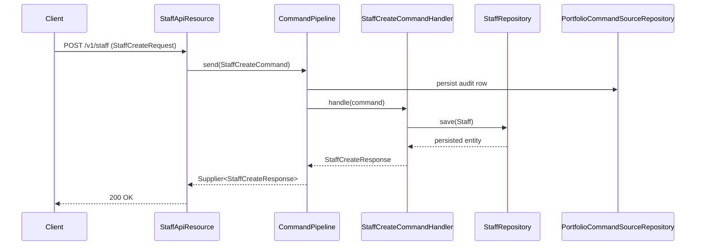

`StaffApiResource` manages people working for the financial institution — primarily loan officers, but also other staff. It is notable for using the **new typed command pipeline** (`CommandPipeline`) rather than the legacy `commandsSourceWritePlatformService.logCommandSource(...)` String round-trip, even though it stays under `/v1`.

## Source

```
fineract-provider/src/main/java/org/apache/fineract/organisation/staff/api/StaffApiResource.java
```

| Annotation | Value |
| --- | --- |
| `@Path` | `/v1/staff` |
| `@Component` | yes |
| `@Tag` | `Staff` |

Injected collaborators:

- `StaffReadService readPlatformService` — note this is the **new** `StaffReadService` (not `StaffReadPlatformService`).
- `OfficeReadPlatformService officeReadPlatformService` — used to bundle `allowedOffices` when `template=true`.
- `BulkImportWorkbookPopulatorService bulkImportWorkbookPopulatorService`
- `CommandPipeline commandPipeline` — the v2 command bus.

## Permissions

The resource itself does not call `validateHasReadPermission`. Permission checks are performed inside each `StaffReadService` method and inside each command handler (`StaffCreateCommandHandler`, `StaffUpdateCommandHandler`, `StaffUploadCommandHandler`). Required codes: `READ_STAFF`, `CREATE_STAFF`, `UPDATE_STAFF`.

## Endpoint inventory

| HTTP | Path | Description | Command / Read service |
| --- | --- | --- | --- |
| `GET` | `/v1/staff` | List staff with status filter | `readPlatformService.retrieveAllStaff(officeId, loanOfficersOnly, status)` |
| `GET` | `/v1/staff/{staffId}` | Fetch one staff, optionally with allowed-offices template | `readPlatformService.retrieveStaff(staffId)` |
| `POST` | `/v1/staff` | Create a staff member | `StaffCreateCommand` via `commandPipeline.send(...)` |
| `PUT` | `/v1/staff/{staffId}` | Update a staff member | `StaffUpdateCommand` |
| `GET` | `/v1/staff/downloadtemplate` | Excel import template | `bulkImportWorkbookPopulatorService.getTemplate("STAFF", officeId, null, dateFormat)` |
| `POST` | `/v1/staff/uploadtemplate` | Excel upload | `StaffUploadCommand` |

There is no `DELETE` — staff records are never deleted because they would orphan loans and historical entries.

## Source excerpt — list

```java
@GET
@Operation(summary = "Retrieve Staff", operationId = "retrieveAllStaff", ...)
public List<StaffData> retrieveAll(
        @QueryParam("officeId") final Long officeId,
        @DefaultValue("false") @QueryParam("staffInOfficeHierarchy") final boolean staffInOfficeHierarchy,
        @DefaultValue("false") @QueryParam("loanOfficersOnly") final boolean loanOfficersOnly,
        @DefaultValue("active") @QueryParam("status") final String status) {
    return staffInOfficeHierarchy
        ? readPlatformService.retrieveAllStaffInOfficeAndItsParentOfficeHierarchy(officeId, loanOfficersOnly)
        : readPlatformService.retrieveAllStaff(officeId, loanOfficersOnly, Optional.ofNullable(status).orElse("active"));
}
```

Query parameters:

| Param | Default | Notes |
| --- | --- | --- |
| `officeId` | null | Filter to a single office (and optionally its hierarchy) |
| `staffInOfficeHierarchy` | false | Include staff from parent offices |
| `loanOfficersOnly` | false | Filter to `isLoanOfficer=true` |
| `status` | `active` | `active`, `inactive`, or `all` |

## Source excerpt — create (typed pipeline)

```java
@POST
public StaffCreateResponse createStaff(@RequestBody @Valid StaffCreateRequest request) {
    final var command = new StaffCreateCommand();
    command.setPayload(request);
    final Supplier<StaffCreateResponse> response = commandPipeline.send(command);
    return response.get();
}
```

This bypasses the legacy `CommandWrapperBuilder` entirely. The `commandPipeline.send(command)` lookups the matching `CommandHandler<StaffCreateCommand>`, runs validation, persists the audit row, dispatches, and returns the typed response. See [Command](/command/synchronous-command-processing) for the bus implementation.

## Canonical curl

```bash
curl -k -u mifos:password \
  -H "Fineract-Platform-TenantId: default" \
  -H "Content-Type: application/json" \
  -X POST https://localhost:8443/fineract-provider/api/v1/staff \
  -d '{
    "officeId": 1,
    "firstname": "Sam",
    "lastname": "Officer",
    "isLoanOfficer": true,
    "isActive": true,
    "joiningDate": "01 January 2024",
    "locale": "en",
    "dateFormat": "dd MMMM yyyy"
  }'
```

Sample response:

```json
{
  "officeId": 1,
  "resourceId": 12
}
```

## Read DTO

`org.apache.fineract.organisation.staff.data.StaffData`:

```json
{
  "id": 12,
  "firstname": "Sam",
  "lastname": "Officer",
  "displayName": "Officer, Sam",
  "mobileNo": null,
  "externalId": null,
  "officeId": 1,
  "officeName": "Head Office",
  "isLoanOfficer": true,
  "isActive": true,
  "joiningDate": [2024, 1, 1],
  "allowedOffices": null
}
```

When the single-staff endpoint is called with `?template=true`, `allowedOffices` is populated with every office the caller can reassign the staff to.

## Request body DTOs

- **`StaffCreateRequest`** — `officeId` (required), `firstname` (required), `lastname` (required), `mobileNo`, `externalId`, `isLoanOfficer`, `isActive`, `joiningDate`, `locale`, `dateFormat`.
- **`StaffUpdateRequest`** — same shape, all optional except `id` (set from the path).
- **`StaffUploadRequest`** — multipart wrapper: `file`, `locale`, `dateFormat`.

## Bulk import

`GET /v1/staff/downloadtemplate?officeId=1&dateFormat=dd MMMM yyyy` returns an Excel sheet pre-populated with the office list. The user fills in staff rows and uploads via `POST /v1/staff/uploadtemplate` as `multipart/form-data` with the file, `locale`, and `dateFormat` form fields. The endpoint returns the staff id of the last row created (the resource has a TODO to return a richer body).

## Why the typed pipeline?

`StaffApiResource` is one of the first resources to adopt the v2 command-pipeline pattern under a v1 path. Benefits:

- Strongly typed request / response — no String JSON round-trip.
- Validation runs via `@Valid` Bean Validation.
- The pipeline persists `m_portfolio_command_source` exactly like the legacy flow, so audit, idempotency, and replay continue to work.
- Generated SDKs are cleaner — no opaque "apiRequestBodyAsJson" parameter.

## Command pipeline flow



## Assignment to portfolio entities

Staff records are referenced from clients, groups, loans, and savings accounts. Re-assignment is performed on those resources via dedicated commands rather than on `/v1/staff`:

| Resource | Assignment command |
| --- | --- |
| Clients | `POST /v1/clients/{id}?command=assignStaff` |
| Groups | `POST /v1/groups/{id}?command=assignStaff` |
| Loans | `POST /v1/loans/{id}?command=assignLoanOfficer` |
| Savings | `POST /v1/savingsaccounts/{id}?command=assignSavingsOfficer` |

The receiving handler validates that the staff is in the same office hierarchy as the target entity before persisting.

## Common pitfalls

- **Inactive staff cannot be assigned.** Re-activating a staff (`isActive=true` via PUT) is required first; otherwise the assignment fails with `error.msg.staff.not.active`.
- **`isLoanOfficer=false` blocks assignment as a loan officer** — `error.msg.staff.not.a.loan.officer`.
- **Re-parenting an office triggers a check on its staff**: if a staff member is referenced from a loan/savings outside the new hierarchy, the office update fails to preserve referential integrity.

## Related pages

- [Offices](/api/offices) — staff are scoped to an office.
- [Clients](/api/clients) — `?command=assignStaff` binds a staff to a client.
- [Groups](/api/groups) / [Centers](/api/centers) — same staff binding pattern.
- [Organisation → Staff](/organisation/staff) — domain model and history.
- [Command pipeline](/command/synchronous-command-processing) — `CommandPipeline.send(...)` internals.
- [/api/conventions](/api/conventions) — envelope, locale and error model.
