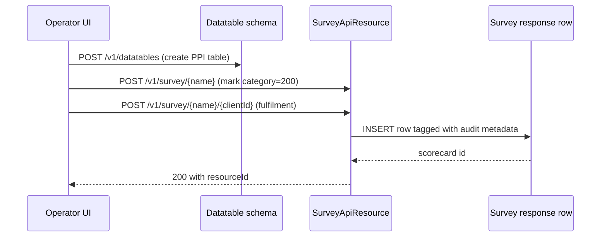

The Surveys resource exposes [Datatables](/api/datatables) registered with category `200` (PPI / Progress out of Poverty Index) as **questionnaires** that can be answered for a client. Each survey is a datatable whose rows are individual fulfilments; this resource adds the convenience operations to list, fulfil, retrieve, register and delete those rows in a survey-shaped way.

Survey scoring is provided by the related [Likelihood](/api/likelihood), [Poverty Line](/api/poverty-line) and [SPM Scorecards](/api/spm-scorecards) resources.

## Source

- **File**: `fineract-provider/src/main/java/org/apache/fineract/infrastructure/survey/api/SurveyApiResource.java`
- **Base path**: `@Path("/v1/survey")`
- **Permission entity**: `SURVEY` (`SurveyApiConstants.SURVEY_RESOURCE_NAME`)
- **Tag**: `Survey`

Reads use `ReadSurveyService` and `GenericDataService`; writes are command-sourced via `PortfolioCommandSourceWritePlatformService`.

## Endpoints

| Method | Path | Description | Command handler | Permission |
| ------ | ---- | ----------- | --------------- | ---------- |
| GET | `/v1/survey` | List all registered survey datatables | `ReadSurveyService.retrieveAllSurveys` | `READ_SURVEY` |
| GET | `/v1/survey/{surveyName}` | Retrieve one survey's column metadata | `ReadSurveyService.retrieveSurvey` | `READ_SURVEY` |
| GET | `/v1/survey/{surveyName}/{clientId}` | Overview of all scores a client has accumulated against any survey | `ReadSurveyService.retrieveClientSurveyScoreOverview` | `READ_SURVEY` |
| GET | `/v1/survey/{surveyName}/{clientId}/{entryId}` | Single fulfilment row | `ReadSurveyService.retrieveSurveyEntry` | `READ_SURVEY` |
| POST | `/v1/survey/{surveyName}/{apptableId}` | Fulfil the survey for an application entity (typically `{apptableId}` is a client id) | `CommandWrapperBuilder.fullFilSurvey` → command `CREATE_SURVEY` | `CREATE_SURVEY` |
| PUT | `/v1/survey/register/{surveyName}/{apptable}` | Register an existing datatable as a survey against an application table | `CommandWrapperBuilder.registerSurvey` → command `REGISTER_SURVEY` | `REGISTER_SURVEY` |
| DELETE | `/v1/survey/{surveyName}/{clientId}/{fulfilledId}` | Delete a fulfilment row | `CommandWrapperBuilder.deleteDatatableEntry` → command `DELETE_SURVEY` | `DELETE_SURVEY` |

The `{surveyName}/{clientId}` GET is internally a "client survey score overview" — the source includes the comment `FIXME Vishwas what does this API really do?` reflecting that the `{surveyName}` is currently unused by the handler and only the `clientId` matters.

## Examples

### List surveys

`GET /v1/survey`

```json
[
  {
    "registeredTableName": "PPI Bangladesh",
    "applicationTableName": "m_client",
    "category": 200,
    "questionDatatables": [
      {
        "componentKey": "pq1",
        "key": "What is the household size?",
        "responseDatas": [
          { "id": 1, "score": 0, "text": "8+ members" },
          { "id": 2, "score": 4, "text": "6-7 members" },
          { "id": 3, "score": 8, "text": "4-5 members" },
          { "id": 4, "score": 16, "text": "≤3 members" }
        ]
      }
    ]
  }
]
```

### Register a datatable as a survey

`PUT /v1/survey/register/PPI%20Bangladesh/m_client`

```json
{ "category": 200 }
```

### Fulfil a survey

`POST /v1/survey/PPI%20Bangladesh/41`

```json
{
  "locale": "en",
  "dateFormat": "yyyy-MM-dd",
  "date": "2024-03-04",
  "userId": 1,
  "pq1_cd_score": 16,
  "pq2_cd_score": 4
}
```

Response:

```json
{
  "officeId": null,
  "clientId": 41,
  "resourceId": 12,
  "changes": {}
}
```

### Retrieve a fulfilment

`GET /v1/survey/PPI%20Bangladesh/41/12`

```json
{
  "columnHeaders": [
    { "columnName": "id", "columnType": "BIGINT" },
    { "columnName": "client_id", "columnType": "BIGINT" },
    { "columnName": "date", "columnType": "DATE" },
    { "columnName": "pq1_cd_score", "columnType": "INT" }
  ],
  "data": [
    { "row": [12, 41, "2024-03-04", 16] }
  ]
}
```

### Delete a fulfilment

`DELETE /v1/survey/PPI%20Bangladesh/41/12` → `{ "resourceId": 12 }`

## Subsystem cross-links

- **[Datatables](/api/datatables)** — surveys are datatables with `category=200`; non-PPI datatables are managed there.
- **[Likelihood](/api/likelihood)** — per-PPI list of demographic groups used by scorers.
- **[Poverty Line](/api/poverty-line)** — poverty thresholds for a (PPI, likelihood) pair.
- **[SPM Scorecards](/api/spm-scorecards)** — alternative SPM survey/scorecard model (in the `spm` package).

## Notes

- The survey resource only handles datatables registered with `category=200`. Generic CRUD on the underlying SQL table still works through [`/v1/datatables`](/api/datatables).
- Permissions reuse the single `SURVEY` resource name regardless of the specific survey, so granting `CREATE_SURVEY` lets a user fulfil any registered survey.
- The `{surveyName}/{apptableId}` POST signature mirrors `POST /v1/datatables/{datatable}/{apptableId}`; the command pipeline difference is the `fullFilSurvey` builder which records survey-specific audit metadata.


## Endpoint reference

```java
@Path("/v1/survey")
public class SurveyApiResource {
    @GET                              List<DatatableData> retrieveAllSurveys();
    @GET  @Path("{surveyName}")       DatatableData retrieveSurvey(@PathParam("surveyName") String);
    @POST @Path("{surveyName}")       String registerSurvey(@PathParam("surveyName") String, String json);
    @POST @Path("{surveyName}/{apptableId}") String fullFilSurvey(@PathParam("surveyName") String, @PathParam("apptableId") Long, String json);
    @DELETE @Path("{surveyName}")     String deleteSurvey(@PathParam("surveyName") String);
}
```

The resource sits at `/v1/survey` (note: singular), distinct from the SPM `/v1/surveys` (plural) endpoint backed by `SpmApiResource`. PPI surveys are datatables tagged `category=200`; this resource scopes the generic datatable endpoints to that subset.

## Fulfilment vs registration

- **Register** — convert an existing datatable into a survey by ensuring `category=200` and exposing it through this URL space. Idempotent.
- **Fulfil** — `POST /{surveyName}/{apptableId}` stores one answer set for the given client (apptable id). Equivalent to `POST /v1/datatables/{datatable}/{apptableId}` but routed through the `fullFilSurvey` command builder so audit logs label the entry as a survey response.

## Lifecycle



## Scoring (PPI vs SPM)

The PPI route consults [Likelihood](/api/likelihood) and [Poverty Line](/api/poverty-line) to convert the answer set into a poverty probability. This is read-side: the survey resource only captures answers — scoring is done by callers using the lookup endpoints. The unrelated SPM model uses [SPM Scorecards](/api/spm-scorecards) instead and does **not** consult the likelihood/poverty-line tables.

## Permissions

A single `SURVEY` resource name covers every PPI: granting `CREATE_SURVEY` lets a user fulfil any registered PPI. Use the underlying datatable's permissions (`READ_<datatable>` etc.) for finer-grained access.

## Error semantics

| Failure | HTTP | Detail |
| ------- | ---- | ------ |
| Survey not found | 404 | `survey.not.registered` |
| Datatable category != 200 | 400 | `datatable.not.a.survey` |
| Fulfilment payload missing required column | 400 | platform validation error |

## cURL recipes

List surveys:

```bash
curl -u mifos:password      -H "Fineract-Platform-TenantId: default"      "https://localhost:8443/fineract-provider/api/v1/survey"
```

Fulfil a PPI for client 42:

```bash
curl -u mifos:password -X POST      -H "Content-Type: application/json"      -d '{"q1":"yes","q2":"no","q3":3,"capturedOn":"01 May 2025","dateFormat":"dd MMMM yyyy","locale":"en"}'      "https://localhost:8443/fineract-provider/api/v1/survey/ppi_kenya_2010/42"
```

## Cross-links

- [Datatables](/api/datatables) — underlying schema.
- [Likelihood](/api/likelihood) / [Poverty Line](/api/poverty-line) — PPI scoring inputs.
- [SPM Scorecards](/api/spm-scorecards) — alternative SPM scoring path under `/v1/surveys/scorecards`.
