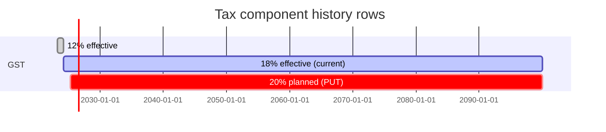
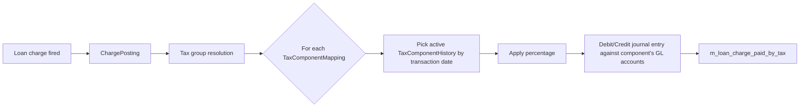

`TaxComponentApiResource` manages individual tax-rate definitions. Each component records a percentage that takes effect on a given start date and stays in force until superseded; the [tax group](/api/tax-groups) layer composes these components into the actual taxes applied to loans, savings, charges, and account fees. Note that **debit/credit GL mappings are immutable** after creation.

## Source

```
fineract-tax/src/main/java/org/apache/fineract/portfolio/tax/api/TaxComponentApiResource.java
```

| Annotation | Value |
| --- | --- |
| `@Path` | `/v1/taxes/component` |
| `@Component` | yes |
| `@Tag` | `Tax Components` |
| Module | `fineract-tax` |

Injected collaborators:

- `PlatformSecurityContext context`
- `TaxReadPlatformService readPlatformService`
- `PortfolioCommandSourceWritePlatformService commandsSourceWritePlatformService`
- `DefaultToApiJsonSerializer<String> toApiJsonSerializer`

## Permissions

Resource string: `TAXCOMPONENT` (`RESOURCE_NAME_FOR_PERMISSIONS`). Reads use `validateHasReadPermission("TAXCOMPONENT")`. Writes use `CREATE_TAXCOMPONENT`, `UPDATE_TAXCOMPONENT`. There is no `DELETE` — components must remain forever to preserve audit trails on historical taxed transactions.

## Endpoint inventory

| HTTP | Path | Description | Command / Read service |
| --- | --- | --- | --- |
| `GET` | `/v1/taxes/component` | List all tax components | `readPlatformService.retrieveAllTaxComponents()` |
| `GET` | `/v1/taxes/component/template` | GL-account dropdowns for the create form | `readPlatformService.retrieveTaxComponentTemplate()` |
| `GET` | `/v1/taxes/component/{taxComponentId}` | Fetch one tax component | `readPlatformService.retrieveTaxComponentData(taxComponentId)` |
| `POST` | `/v1/taxes/component` | Create tax component | `createTaxComponent` |
| `PUT` | `/v1/taxes/component/{taxComponentId}` | Update — percentage replaces all **future** entries; GL mappings cannot change | `updateTaxComponent(taxComponentId)` |

## Source excerpt — create

```java
@POST
@Consumes(MediaType.APPLICATION_JSON)
@Produces(MediaType.APPLICATION_JSON)
public CommandProcessingResult createTaxComponent(TaxComponentRequest taxComponentRequest) {
    final CommandWrapper commandRequest = new CommandWrapperBuilder()
        .createTaxComponent()
        .withJson(toApiJsonSerializer.serialize(taxComponentRequest))
        .build();
    return commandsSourceWritePlatformService.logCommandSource(commandRequest);
}
```

## Canonical curl

```bash
curl -k -u mifos:password \
  -H "Fineract-Platform-TenantId: default" \
  -H "Content-Type: application/json" \
  -X POST https://localhost:8443/fineract-provider/api/v1/taxes/component \
  -d '{
    "name": "GST 18%",
    "percentage": 18.0,
    "debitAccountType": 2,
    "debitAccountId": 41,
    "creditAccountType": 2,
    "creditAccountId": 25,
    "startDate": "01 April 2024",
    "locale": "en",
    "dateFormat": "dd MMMM yyyy"
  }'
```

Sample response:

```json
{
  "resourceId": 4
}
```

## Request body — POST/PUT

| Field | Required (POST) | Notes |
| --- | --- | --- |
| `name` | yes | Unique among components |
| `percentage` | yes | 0–100, can carry up to 6 decimal places |
| `debitAccountType`, `debitAccountId` | optional | GL account type code (e.g. `2` = Asset, `5` = Expense) + id |
| `creditAccountType`, `creditAccountId` | optional | Same shape — typically a Liability/Income account |
| `startDate` | yes | Effective date of this percentage |
| `locale`, `dateFormat` | yes | Standard date envelope |

On PUT, `debitAccountType`, `debitAccountId`, `creditAccountType`, `creditAccountId` are silently ignored — the resource description says: *"Debit and credit account details cannot be modified. All the future tax components would be replaced with the new percentage."* In practice, a PUT inserts a new history row with the new percentage and start date.

## Read DTO

`org.apache.fineract.portfolio.tax.data.TaxComponentData`:

```json
{
  "id": 4,
  "name": "GST 18%",
  "percentage": 18.0,
  "debitAccountType": { "id": 2, "code": "GLAccountType.assets", "value": "ASSET" },
  "debitAccount": { "id": 41, "glCode": "60100", "name": "Tax Receivable" },
  "creditAccountType": { "id": 2, "code": "GLAccountType.liabilities", "value": "LIABILITY" },
  "creditAccount": { "id": 25, "glCode": "20100", "name": "Tax Payable" },
  "startDate": [2024, 4, 1],
  "taxComponentHistories": [
    { "percentage": 12.0, "startDate": [2023, 4, 1], "endDate": [2024, 3, 31] }
  ]
}
```

The `taxComponentHistories` array records every prior percentage and its effective range. Application code reads the active percentage for a given date by scanning the histories plus the current row.

## Histories vs replacement

When you `PUT` a new percentage:

- The currently active row's `endDate` is set to one day before `startDate`.
- A new history entry is appended.
- The component's `percentage` is updated to the new value.
- Any **future-dated** history rows (start date after now) are deleted — they are replaced.

This semantics means: PUT can only adjust the *next* rate or fix a near-future change; you cannot retro-edit past rates.

## History semantics



A subsequent `PUT` with `startDate=2025-04-01` would replace the planned 20% row only — it cannot retro-edit either 12% or 18% history.

## Application — how components contribute to a tax group



The component's persistent debit/credit accounts are recorded on every tax journal entry; that is why the API freezes them at creation time.

## Validation rules

- `percentage` must be between 0 and 100. Decimals are persisted with the `m_tax_component` row's column scale (typically 6).
- `name` is unique within the tenant (`error.msg.taxcomponent.name.exists`).
- `startDate` cannot be earlier than the previous active row's start date.
- `debitAccountId`/`creditAccountId` must reference valid `m_gl_account` rows with non-null `disabled=false`.

## Canonical curl — read

```bash
# Read all components
curl -k -u mifos:password \
  -H "Fineract-Platform-TenantId: default" \
  https://localhost:8443/fineract-provider/api/v1/taxes/component

# Read a single component (with histories)
curl -k -u mifos:password \
  -H "Fineract-Platform-TenantId: default" \
  https://localhost:8443/fineract-provider/api/v1/taxes/component/4

# Template (GL account options)
curl -k -u mifos:password \
  -H "Fineract-Platform-TenantId: default" \
  https://localhost:8443/fineract-provider/api/v1/taxes/component/template

# PUT new percentage — replaces the future-dated row, leaves the active row untouched
curl -k -u mifos:password \
  -H "Fineract-Platform-TenantId: default" \
  -H "Content-Type: application/json" \
  -X PUT https://localhost:8443/fineract-provider/api/v1/taxes/component/4 \
  -d '{
    "percentage": 20.0,
    "startDate": "01 April 2025",
    "locale": "en",
    "dateFormat": "dd MMMM yyyy"
  }'
```

## Error responses

| HTTP | When |
| --- | --- |
| `400 Bad Request` | `percentage` out of bounds; `startDate` predates the active row. |
| `403 Forbidden` | Missing `READ_TAXCOMPONENT` / `CREATE_TAXCOMPONENT` / `UPDATE_TAXCOMPONENT`. |
| `404 Not Found` | `taxComponentId` unknown; referenced GL account missing. |
| `409 Conflict` | Duplicate `name`. |

## Cross-references

- [Tax groups](/api/tax-groups) — compose components into a taxable bundle for loans/savings.
- [Tax → Tax component](/tax/tax-component) — domain model and history semantics.
- [Accounting → GL accounts](/accounting/gl-accounts) — debit/credit account targets.
- [Charges that consume tax groups](/api/charges) — the `taxGroupId` field.
- [API conventions](/api/conventions) — envelope and dates.
