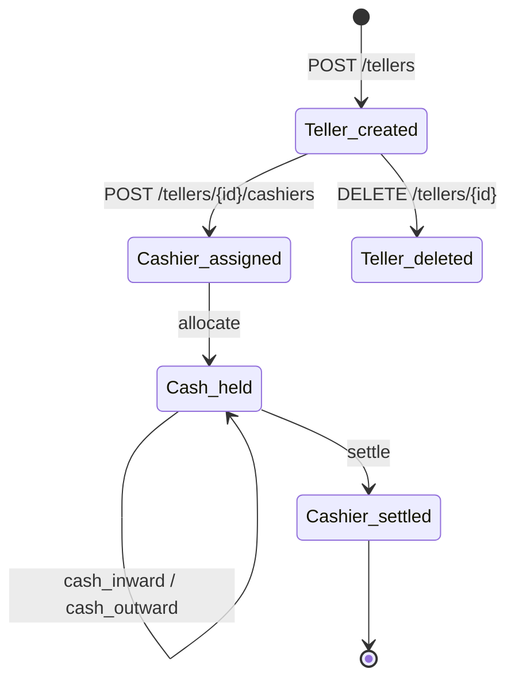

`TellerApiResource` is the JAX-RS resource for Apache Fineract's **teller cash management** subsystem. A *teller* is a physical or logical cash drawer attached to a branch office. Staff are assigned to the teller as *cashiers* for time-bounded shifts; cash flows in via `allocate` and out via `settle` transactions, and the running balance plus a journal of every operation is exposed through this resource.

Cashiers and journals also have lightweight standalone read-only resources — see [cashiers](/api/cashiers) and [teller-journal](/api/teller-journal). Higher-level subsystem notes are at [/branch/teller-management](/branch/overview).

## Source

- **File:** `fineract-branch/src/main/java/org/apache/fineract/organisation/teller/api/TellerApiResource.java`
- **Class path annotation:** `@Path("/v1/tellers")`
- **OpenAPI tag:** `Teller Cash Management` — *"Teller cash management which will allow an organization to manage their cash transactions at branches or head office more effectively."*
- **Spring stereotype:** `@Component`

Constructor-injected dependencies:

- `TellerManagementReadPlatformService readPlatformService`
- `PortfolioCommandSourceWritePlatformService commandWritePlatformService`
- `DefaultToApiJsonSerializer<String> apiJsonSerializer`

## Endpoints

### Teller CRUD

| Method | Path | Description | Command / Handler | Permission |
| ------ | ---- | ----------- | ----------------- | ---------- |
| GET | `/v1/tellers?officeId={id}` | List tellers, optionally scoped to an office. | `readPlatformService.getTellers(officeId)` | Authenticated |
| GET | `/v1/tellers/{tellerId}` | Retrieve a teller. | `readPlatformService.findTeller(tellerId)` | Authenticated |
| POST | `/v1/tellers` | Create a teller. Mandatory: name, officeId, description, startDate, status. | `CommandWrapperBuilder.createTeller()` | `CREATE_TELLER` |
| PUT | `/v1/tellers/{tellerId}` | Update a teller. | `CommandWrapperBuilder.updateTeller(tellerId)` | `UPDATE_TELLER` |
| DELETE | `/v1/tellers/{tellerId}` | Delete a teller. | `CommandWrapperBuilder.deleteTeller(tellerId)` | `DELETE_TELLER` |

### Cashier allocation

| Method | Path | Description | Command / Handler | Permission |
| ------ | ---- | ----------- | ----------------- | ---------- |
| GET | `/v1/tellers/{tellerId}/cashiers?fromdate=&todate=` | List cashiers for a teller in a date window. | `readPlatformService.getCashiersForTeller(...)` | Authenticated |
| GET | `/v1/tellers/{tellerId}/cashiers/{cashierId}` | Retrieve a single cashier. | `readPlatformService.findCashier(cashierId)` | Authenticated |
| GET | `/v1/tellers/{tellerId}/cashiers/template` | Cashier template (staff options, currency options, …). | `readPlatformService.retrieveCashierTemplate(officeId, tellerId, true)` | Authenticated |
| POST | `/v1/tellers/{tellerId}/cashiers` | Allocate a cashier (assign staff). | `CommandWrapperBuilder.allocateTeller(tellerId)` | `ALLOCATE_TELLER` |
| PUT | `/v1/tellers/{tellerId}/cashiers/{cashierId}` | Update a cashier allocation. | `CommandWrapperBuilder.updateAllocationTeller(tellerId, cashierId)` | `UPDATE_ALLOCATION_TELLER` |
| DELETE | `/v1/tellers/{tellerId}/cashiers/{cashierId}` | Remove the allocation. | `CommandWrapperBuilder.deleteAllocationTeller(tellerId, cashierId)` | `DELETE_ALLOCATION_TELLER` |

### Cash flow

| Method | Path | Description | Command / Handler | Permission |
| ------ | ---- | ----------- | ----------------- | ---------- |
| POST | `/v1/tellers/{tellerId}/cashiers/{cashierId}/allocate` | Allocate cash to the cashier. Mandatory: date, amount, currency, notes. | `CommandWrapperBuilder.allocateCashToCashier(tellerId, cashierId)` | `ALLOCATECASH_CASHIER` |
| POST | `/v1/tellers/{tellerId}/cashiers/{cashierId}/settle` | Settle (return) cash from the cashier. | `CommandWrapperBuilder.settleCashFromCashier(tellerId, cashierId)` | `SETTLECASH_CASHIER` |

### Reporting / journals

| Method | Path | Description | Command / Handler | Permission |
| ------ | ---- | ----------- | ----------------- | ---------- |
| GET | `/v1/tellers/{tellerId}/cashiers/{cashierId}/transactions?currencyCode=&offset=&limit=&orderBy=&sortOrder=` | Paged cashier transactions. | `readPlatformService.retrieveCashierTransactions(...)` | Authenticated |
| GET | `/v1/tellers/{tellerId}/cashiers/{cashierId}/summaryandtransactions` | Same paged list plus opening/closing/running totals. | `readPlatformService.retrieveCashierTransactionsWithSummary(...)` | Authenticated |
| GET | `/v1/tellers/{tellerId}/cashiers/{cashierId}/transactions/template` | Template for posting a cashier transaction (currency options, types). | `readPlatformService.retrieveCashierTxnTemplate(cashierId)` | Authenticated |
| GET | `/v1/tellers/{tellerId}/transactions?dateRange=…` | List teller-scope transactions in a date range. | `readPlatformService.fetchTellerTransactionsByTellerId(...)` | Authenticated |
| GET | `/v1/tellers/{tellerId}/transactions/{transactionId}` | Retrieve a teller transaction. | `readPlatformService.findTellerTransaction(transactionId)` | Authenticated |
| GET | `/v1/tellers/{tellerId}/journals?cashierId=&dateRange=…` | List teller journals (allocate/settle pairs). | `readPlatformService.fetchTellerJournals(...)` | Authenticated |

`dateRange` is parsed by `DateRange.fromString` and supports tokens like `2025-01-01..2025-01-31` or the keyword `today`.

## Request / response examples

### Create a teller

`POST /v1/tellers`

```json
{
  "officeId": 1,
  "name": "Main Branch – Window 1",
  "description": "Walk-in counter 1",
  "startDate": "01 January 2025",
  "status": 300,
  "locale": "en",
  "dateFormat": "dd MMMM yyyy"
}
```

```json
{
  "officeId": 1,
  "resourceId": 5,
  "changes": {}
}
```

### Allocate a cashier

`POST /v1/tellers/5/cashiers`

```json
{
  "staffId": 42,
  "description": "Alice on counter",
  "isFullDay": true,
  "startDate": "20 January 2025",
  "endDate": "20 January 2025",
  "locale": "en",
  "dateFormat": "dd MMMM yyyy"
}
```

### Allocate cash to the cashier

`POST /v1/tellers/5/cashiers/8/allocate`

```json
{
  "date": "20 January 2025",
  "amount": 5000.00,
  "currencyCode": "USD",
  "notes": "Opening float",
  "locale": "en",
  "dateFormat": "dd MMMM yyyy"
}
```

```json
{
  "resourceId": 1001,
  "changes": {}
}
```

Internally this builds:

```java
new CommandWrapperBuilder().allocateCashToCashier(tellerId, cashierId)
    .withJson(apiJsonSerializer.serialize(cashierTxnData)).build();
```

### Settle cash from cashier

`POST /v1/tellers/5/cashiers/8/settle`

```json
{
  "date": "20 January 2025",
  "amount": 4250.00,
  "currencyCode": "USD",
  "notes": "End-of-day return",
  "locale": "en",
  "dateFormat": "dd MMMM yyyy"
}
```

### Cashier transactions with summary

`GET /v1/tellers/5/cashiers/8/summaryandtransactions`

```json
{
  "cashierData": { "id": 8, "name": "Alice" },
  "sumCashAllocation": 5000.00,
  "sumInwardCash": 1200.00,
  "sumOutwardCash": 950.00,
  "sumCashSettle": 4250.00,
  "netCash": 0.00,
  "cashierTransactions": {
    "totalFilteredRecords": 4,
    "pageItems": [
      { "id": 1001, "txnType": 101, "txnAmount": 5000.00, "txnDate": [2025,1,20], "txnNote": "Opening float" },
      { "id": 1002, "txnType": 103, "txnAmount":  900.00, "txnDate": [2025,1,20], "txnNote": "Loan repayment" }
    ]
  }
}
```

## Data carriers

- **Requests:** `TellerRequest`, `CashierRequest`, `CashierTransactionRequest`.
- **Read responses:** `TellerData`, `CashierData`, `CashiersForTeller`, `CashierTransactionData`, `CashierTransactionsWithSummaryData`, `TellerTransactionData`, `TellerJournalData`.
- **Write responses:** `CommandProcessingResult`. Swagger types live in `TellerApiResourceSwagger`.

## Permissions

Read endpoints rely on the authenticated principal; the resource does not call `validateHasReadPermission` itself. Write actions resolve through `PortfolioCommandSourceWritePlatformService` against `CREATE_TELLER`, `UPDATE_TELLER`, `ALLOCATE_TELLER`, `ALLOCATECASH_CASHIER`, `SETTLECASH_CASHIER`, etc.

## Cross-links

- [Cashiers](/api/cashiers) — read-only top-level resource over the same model.
- [Teller journal](/api/teller-journal) — read-only journal across offices.
- [Branch/teller subsystem](/branch/overview)
- [Offices](/organisation/offices) — `officeId` referenced by `TellerRequest`.
- [Staff](/organisation/staff) — `staffId` referenced by `CashierRequest`.


## Cashier journal sub-endpoints

| Method | Path | Description |
| ------ | ---- | ----------- |
| POST   | `/v1/tellers/{tellerId}/cashiers/{cashierId}/allocate` | Cash inwards: record cash given to the cashier |
| POST   | `/v1/tellers/{tellerId}/cashiers/{cashierId}/settle`   | Cash outwards: record cash returned by the cashier |
| GET    | `/v1/tellers/{tellerId}/cashiers/{cashierId}/transactions` | Per-cashier journal |
| GET    | `/v1/tellers/{tellerId}/cashiers/{cashierId}/summaryandtransactions` | Net balance + journal in one call |
| GET    | `/v1/tellers/{tellerId}/journals` | Teller-scoped journal alias for [/v1/cashiersjournal](/api/teller-journal) |

These commands are dispatched by `PortfolioCommandSourceWritePlatformService` and produce `CASH_INWARD`/`CASH_OUTWARD` rows in `m_cashier_transactions`; the same rows appear on [`/v1/cashiersjournal`](/api/teller-journal).

## Lifecycle



## Field reference (Teller)

- `officeId` — branch the teller belongs to; required.
- `name` — human label.
- `description` — free text.
- `startDate` / `endDate` — service window; `endDate` may be null.
- `status` — `ACTIVE` / `INACTIVE`. Inactive tellers cannot accept new cashiers.

## Field reference (Cashier allocation)

- `staffId` — principal allocated as cashier.
- `description`
- `startDate` / `endDate` / `startTime` / `endTime` — service window.
- `fullDay` — boolean; if true, time parts are ignored.

## Error semantics

| Failure | HTTP | Detail |
| ------- | ---- | ------ |
| Office not found | 404 | `office.not.found` |
| Cashier overlap | 403 | `cashier.allocation.overlap` |
| Settle without prior allocate | 403 | `cashier.settlement.exceeds.allocation` |
| Maker–checker pending | 200 | `commandId` returned, no state change |

## Permissions

All write endpoints require the `TELLER` / `CASHIER` permission family (`CREATE_TELLER`, `UPDATE_TELLER`, `DELETE_TELLER`, `ALLOCATE_CASHIER`, `SETTLE_CASHIER`). Reads use the per-action `READ_TELLER` / `READ_CASHIER`.

## Cross-links

- [Cashiers](/api/cashiers) — flat cashier list across tellers.
- [Cashier journals](/api/teller-journal) — top-level alias for journal data.
- [Branch domain overview](/branch/overview).
