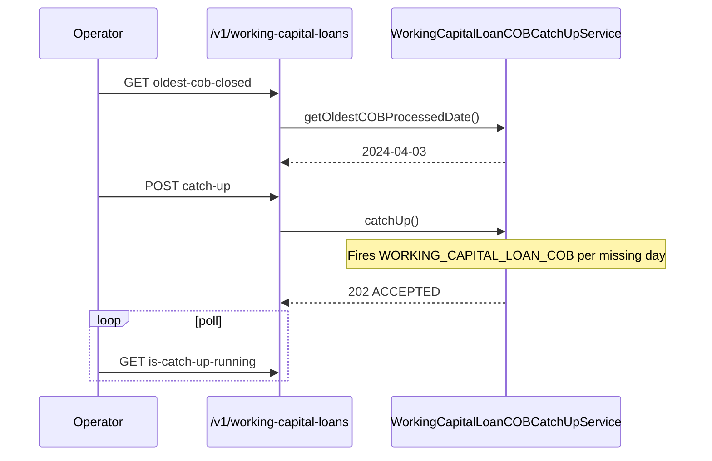

The Working Capital Loan COB Catch-Up API mirrors [Loan COB Catch-Up](/api/cob-catchup) for the working-capital-loan (WCL) product family. It exists in the `fineract-working-capital-loan` extension and operates against the WCL COB pipeline. The handler shape and HTTP semantics are deliberately identical to the loan variant so existing tooling and runbooks port without changes.

## Source

| Aspect | Value |
| --- | --- |
| Resource class | `org.apache.fineract.cob.api.WorkingCapitalLoanCOBCatchUpApiResource` |
| File | `fineract-provider/src/main/java/org/apache/fineract/cob/api/WorkingCapitalLoanCOBCatchUpApiResource.java` |
| JAX-RS `@Path` | `/v1/working-capital-loans` |
| Swagger tag | `Working Capital Loan COB Catch Up` |
| Service | `WorkingCapitalLoanCOBCatchUpServiceImpl` (`Optional<>` — present only when the WCL COB job is enabled) |
| Helper | `COBCatchUpExecutorHelper` |
| Job | `JobName.LOAN_COB` (the helper reuses the constant; `WORKING_CAPITAL_LOAN_COB` is the actual job name on the WCL pipeline) |

## Endpoints

| Method | Path | Description | Command / handler | Permission |
| --- | --- | --- | --- | --- |
| `GET` | `/v1/working-capital-loans/oldest-cob-closed` | Return the oldest COB business date that still has WCLs waiting to be processed, plus the oldest WCL id at that date. | `COBCatchUpService.getOldestCOBProcessedLoan()` | Authenticated |
| `POST` | `/v1/working-capital-loans/catch-up` | Trigger a sequential catch-up: for every business date between the oldest open day and `COB_DATE`, run the WCL COB job inline. | `COBCatchUpExecutorHelper.executeLoanCOBCatchUp(workingCapitalCatchUpService)` | Authenticated |
| `GET` | `/v1/working-capital-loans/is-catch-up-running` | Tell whether a catch-up is in flight, and if so, which business date is currently being processed. | `COBCatchUpService.isCatchUpRunning()` | Authenticated |

The `POST` endpoint returns one of three statuses, just like the loan variant:

| Status | Meaning |
| --- | --- |
| `200 OK` | Nothing to do — all working capital loans are already up to date. |
| `202 Accepted` | Catch-up has been started. |
| `400 Bad Request` | A catch-up is already running. |

If the WCL COB service is not present on the instance (the optional bean is empty), the `oldest-cob-closed` and `catch-up` endpoints throw `JobIsNotFoundOrNotEnabledException("LOAN_COB")`. `is-catch-up-running` falls back to `new IsCatchUpRunningDTO(false, null)`.

## Inspecting the oldest open day

```bash
curl -u mifos:password \
  -H 'fineract-platform-tenantid: default' \
  'https://fineract.example.org/fineract-provider/api/v1/working-capital-loans/oldest-cob-closed'
```

```json
{
  "cobBusinessDate": "2024-04-10",
  "oldestCOBProcessedLoan": 5021
}
```

`OldestCOBProcessedLoanDTO` is shared with the loan resource; the `oldestCOBProcessedLoan` field carries a WCL id rather than a loan id, but the wire format is identical.

## Triggering a catch-up

```bash
curl -X POST -u mifos:password \
  -H 'fineract-platform-tenantid: default' \
  -H 'Content-Type: application/json' \
  'https://fineract.example.org/fineract-provider/api/v1/working-capital-loans/catch-up'
```

The handler delegates to `COBCatchUpExecutorHelper.executeLoanCOBCatchUp(...)` with the WCL catch-up service. Internally that helper:

1. Computes the gap between `oldest-cob-closed` and `COB_DATE`.
2. For each missing day, submits an inline run of the WCL COB job via [Inline Jobs](/api/inline-jobs).
3. Advances the in-memory `currentDate` after each successful day so `is-catch-up-running` can report progress.

## Polling progress

```bash
curl -u mifos:password \
  -H 'fineract-platform-tenantid: default' \
  'https://fineract.example.org/fineract-provider/api/v1/working-capital-loans/is-catch-up-running'
```

```json
{
  "catchUpRunning": true,
  "currentDate": "2024-04-12"
}
```

## When to use the WCL variant

WCL accounts have their own COB pipeline because the working-capital amortisation engine (see [Working Capital Loan Amortization Schedule](/api/working-capital-loan-amortization-schedule)) needs to drive a different set of business steps than the standard loan COB. If your tenant uses both the loan and WCL products, you typically run *both* catch-up flows independently in this order:

1. `POST /v1/loans/catch-up` (see [Loan COB Catch-Up](/api/cob-catchup)).
2. `POST /v1/working-capital-loans/catch-up`.

Either one can run while the scheduler is in `Standby`. The catch-up loops do not contend for the same locks because they operate on different tables, but pausing the [Scheduler](/api/scheduler) avoids interference with regular Quartz triggers.

## Operational notes

- **Single-runner guarantee.** The 400 response from `catch-up` while one is already running prevents two simultaneous WCL catch-ups on the same node. In a clustered deployment this guard runs per-node, so confine catch-ups to the batch-manager node.
- **Failure parking.** If the inline WCL COB step parks a loan on a lock with an error, inspect via [Loan Account Lock](/api/loan-account-lock) — the WCL pipeline uses the same `LoanAccountLock` table.
- **Schedule alignment.** Catch-ups race the cron schedule. The standard operational pattern is: stop the scheduler ([Scheduler](/api/scheduler)) → run the catch-up → start the scheduler.

## Related resources

- [Loan COB Catch-Up](/api/cob-catchup) — the loan-pipeline equivalent.
- [Working Capital Loans](/api/working-capital-loans) and [Working Capital Loan Products](/api/working-capital-loan-products).
- [Working Capital Loan Amortization Schedule](/api/working-capital-loan-amortization-schedule) — the per-WCL schedule the WCL COB job advances.
- [Loan Account Lock](/api/loan-account-lock) — inspect WCL locks held by the pipeline.
- [Inline Jobs](/api/inline-jobs) — the helper uses inline execution to drive the WCL COB job.
- [Scheduler](/api/scheduler) and [Scheduler Jobs](/api/scheduler-jobs).
- [Configure Business Step](/api/configure-business-step) — order the steps inside the WCL COB job.

## Curl reference

Oldest open WCL business day:

```bash
curl -u mifos:password \
  -H "Fineract-Platform-TenantId: default" \
  https://example.org/fineract-provider/api/v1/working-capital-loans/oldest-cob-closed
```

Trigger:

```bash
curl -u mifos:password \
  -H "Fineract-Platform-TenantId: default" \
  -X POST https://example.org/fineract-provider/api/v1/working-capital-loans/catch-up
```

Poll:

```bash
curl -u mifos:password \
  -H "Fineract-Platform-TenantId: default" \
  https://example.org/fineract-provider/api/v1/working-capital-loans/is-catch-up-running
```

## Response shapes

Identical to the loan variant — `OldestCOBProcessedLoanDTO` and `IsCatchUpRunningDTO`, but the underlying service is `WorkingCapitalLoanCOBCatchUpService` and the rows queried come from `m_working_capital_loan`.

## Module guard

The WCL COB API is part of the `fineract-working-capital-loan` module — a node built without that module does not register the resource and clients receive `404 NOT_FOUND`. Use [Loan COB Catch-up](/api/cob-catchup) for plain loans regardless of WCL availability.

## When to use this vs the loan variant

| Need | Endpoint |
| --- | --- |
| Catch up Loan COB on plain `m_loan` rows | [`/v1/loans/catch-up`](/api/cob-catchup) |
| Catch up Loan COB on `m_working_capital_loan` rows | this resource |
| Inspect partitions / fast-forward / reprocess | [Internal COB](/api/internal-cob) |
| Manually place a synthetic lock | [Internal Loan Account Lock](/api/internal-loan-account-lock) |

The two catch-up resources can be triggered in parallel — they work against different job names (`LOAN_COB` vs `WORKING_CAPITAL_LOAN_COB`) and different lock sets.

## Sequence



## Permissions

Reads check `READ_WORKING_CAPITAL_LOAN`; the catch-up trigger checks `EXECUTEJOB_SCHEDULER`. No bespoke permissions are introduced.

## Related resources

- [COB Catch-up](/api/cob-catchup) — plain loan variant.
- [Working Capital Loans](/api/working-capital-loans) — domain entity that needs catching up.
- [Scheduler Jobs](/api/scheduler-jobs) — the `WORKING_CAPITAL_LOAN_COB` job.

## Sample responses

```json
{ "cobBusinessDate": "2024-04-03" }
```

```json
{ "catchUpRunning": true }
```

## Failure modes

| Symptom | Likely cause |
| --- | --- |
| `404 NOT_FOUND` on every endpoint | Module `fineract-working-capital-loan` not in the build. |
| `405 Method Not Allowed` on POST | Targeted a non-batch-manager node — see [Instance Mode](/api/instance-mode). |
| Catch-up flag stuck on `true` | Underlying `WORKING_CAPITAL_LOAN_COB` Quartz fire crashed mid-run; inspect logs and `m_working_capital_loan_account_locks`. |
