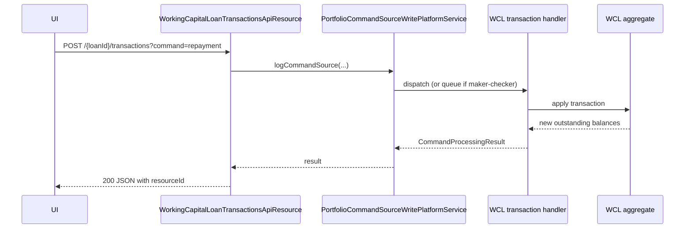

`WorkingCapitalLoanTransactionsApiResource` is a thin JAX-RS resource that returns **action templates** for Working Capital Loan (WCL) transactions in Apache Fineract. The template carries the data the UI needs to render a disbursement, repayment, charge or write-off form against a specific WCL account — the actual transaction *commands* are submitted to the existing `LoansApiResource`-style `/v1/working-capital-loans/{loanId}/transactions` endpoints that live in the platform-internal command handler layer (not bound to this resource).

The class shares its `@Path("/v1/working-capital-loans")` with `WorkingCapitalLoanApiResource`; JAX-RS dispatch picks the right method by the `{loanId}/template` sub-path.

## Source

- **File:** `fineract-working-capital-loan/src/main/java/org/apache/fineract/portfolio/workingcapitalloan/api/WorkingCapitalLoanTransactionsApiResource.java`
- **Class path annotation:** `@Path("/v1/working-capital-loans")`
- **OpenAPI tag:** `Working Capital Loan Transactions`
- **Spring stereotype:** `@Component`

Constructor-injected dependencies:

- `PlatformSecurityContext context`
- `WorkingCapitalLoanApplicationReadPlatformService readPlatformService` — resolves loan id from external id.
- `WorkingCapitalLoanTransactionReadPlatformService readTransactionPlatformService` — builds the per-template data.

Static config:

```java
private static final String RESOURCE_NAME_FOR_PERMISSIONS = WorkingCapitalLoanConstants.WCL_RESOURCE_NAME;
// = "WORKINGCAPITALLOAN"
```

## Endpoints

| Method | Path | Description | Command / Handler | Permission |
| ------ | ---- | ----------- | ----------------- | ---------- |
| GET | `/v1/working-capital-loans/{loanId}/template?templateType=…` | Return template data for a WCL transaction action (disburse, repayment, charge, write-off, …). | `readTransactionPlatformService.retrieveLoanTransactionTemplate(resolvedLoanId, templateType)` | Read permission `WORKINGCAPITALLOAN` |

The `templateType` query parameter is mandatory. Supplying a value that the read service doesn't recognise causes the helper to return `null`, which the handler converts to `UnrecognizedQueryParamException` (HTTP 400). Known values mirror the classic loan template types: `disbursement`, `repayment`, `chargepayment`, `writeoff`, `closeasrescheduled`, `recoverypayment`, `merchantissuedrefund`, `payoutrefund`.

## Code

```java
@GET
@Path("{loanId}/template")
@Operation(operationId = "retrieveWorkingCapitalLoanTemplate",
           summary = "Retrieve Working Capital Loan action template")
public WorkingCapitalLoanCommandTemplateData retrieveWorkingCapitalLoanTemplate(
        @PathParam("loanId") final Long loanId,
        @QueryParam("templateType") final String templateType,
        @Context final UriInfo uriInfo) {

    this.context.authenticatedUser()
        .validateHasReadPermission(RESOURCE_NAME_FOR_PERMISSIONS);

    return handleLoanTransactionTemplate(loanId, null, templateType);
}

private WorkingCapitalLoanCommandTemplateData handleLoanTransactionTemplate(
        final Long loanId, final String loanExternalIdStr, final String templateType) {
    final Long resolvedLoanId = loanId != null
        ? loanId
        : readPlatformService.getResolvedLoanId(ExternalIdFactory.produce(loanExternalIdStr));
    if (resolvedLoanId == null) {
        throw new WorkingCapitalLoanNotFoundException(ExternalIdFactory.produce(loanExternalIdStr));
    }

    final WorkingCapitalLoanCommandTemplateData loanTransactionTemplateData =
        readTransactionPlatformService.retrieveLoanTransactionTemplate(resolvedLoanId, templateType);
    if (loanTransactionTemplateData == null) {
        throw new UnrecognizedQueryParamException("command", templateType);
    }

    return loanTransactionTemplateData;
}
```

## Request / response example

### Repayment template

`GET /v1/working-capital-loans/1001/template?templateType=repayment`

```json
{
  "loanId": 1001,
  "accountNumber": "WCL000001001",
  "transactionType": { "id": 2, "code": "loanTransactionType.repayment", "value": "Repayment" },
  "date": [2025, 1, 31],
  "currency": { "code": "USD", "decimalPlaces": 2 },
  "amount": 1500.00,
  "principalPortion": 1300.00,
  "interestPortion": 200.00,
  "paymentTypeOptions": [
    { "id": 1, "name": "Cash" },
    { "id": 2, "name": "Cheque" }
  ]
}
```

### Disbursement template

`GET /v1/working-capital-loans/1001/template?templateType=disbursement`

```json
{
  "loanId": 1001,
  "accountNumber": "WCL000001001",
  "transactionType": { "id": 1, "code": "loanTransactionType.disbursement", "value": "Disbursement" },
  "date": [2025, 1, 5],
  "amount": 10000.00,
  "currency": { "code": "USD", "decimalPlaces": 2 }
}
```

### Error: unknown template type

`GET /v1/working-capital-loans/1001/template?templateType=bogus`

```json
{
  "developerMessage": "Unrecognised query parameter [command] passed with value [bogus]",
  "httpStatusCode": "400"
}
```

## Data carriers

- **Read response:** `WorkingCapitalLoanCommandTemplateData` — a polymorphic envelope whose populated fields depend on `templateType`. The disbursement template carries `principal`, repayment templates carry `principalPortion` / `interestPortion`, charge templates carry the charges list, etc.

## Permissions

```java
this.context.authenticatedUser().validateHasReadPermission(RESOURCE_NAME_FOR_PERMISSIONS);
```

where `RESOURCE_NAME_FOR_PERMISSIONS = "WORKINGCAPITALLOAN"`.

## Related transaction commands

Posting the actual transaction (e.g. a repayment) is handled by `WorkingCapitalLoanTransactionsCommandHandler` instances registered under names like `REPAYMENT_WORKINGCAPITALLOAN`, `DISBURSE_WORKINGCAPITALLOAN`, etc. They are submitted through the same `/v1/working-capital-loans/{loanId}/transactions?command=…` URL pattern (parsed by the platform request-routing layer) and are not bound to this resource.

## Cross-links

- [Working capital loans (application lifecycle)](/api/working-capital-loans)
- [Working capital loan amortization schedule](/api/working-capital-loan-amortization-schedule)
- [Working capital loan products](/api/working-capital-loan-products)
- [Payment types API](/api/payment-types) — populates `paymentTypeOptions` on the templates.


## Endpoint reference

| Method | Path | Description |
| ------ | ---- | ----------- |
| GET | `/v1/working-capital-loans/{loanId}/template?command=<cmd>` | Pre-populated payload skeleton for the requested transaction command |
| POST | `/v1/working-capital-loans/{loanId}/transactions?command=<cmd>` | Apply a transaction |
| POST | `/v1/working-capital-loans/external-id/{loanExternalId}/transactions?command=<cmd>` | Same, addressed by external id |
| POST | `/v1/working-capital-loans/{loanId}/transactions/{transactionId}?command=<cmd>` | Per-transaction commands (adjust / reverse) |

## Supported commands

The `?command=` selector dispatches a `CommandWrapperBuilder` against `WORKINGCAPITALLOAN_TRANSACTION`. Typical values:

| `command` | Behaviour |
| --------- | --------- |
| `repayment` | Apply a repayment in the principal/interest priority configured on the product |
| `chargePayment` | Pay a specific charge attached to the loan |
| `waiveInterest` | Waive accrued interest |
| `waiveCharges` | Waive an outstanding charge |
| `writeOff` | Write off the remaining principal |
| `recoveryPayment` | Recover a previously written-off balance |
| `adjustTransaction` (on `{transactionId}`) | Reverse + reapply with a corrected amount |
| `undo` (on `{transactionId}`) | Reverse a single transaction |

Unknown commands produce `UnrecognizedQueryParamException` (400).

## Lifecycle



## Template

`GET /{loanId}/template?command=repayment` returns a JSON skeleton with default `transactionDate`, currency, and amount caps (e.g. outstanding balance for `repayment`). UI clients use this to pre-fill the action dialog.

## Error semantics

| Failure | HTTP | Detail |
| ------- | ---- | ------ |
| Loan not found | 404 | `working.capital.loan.not.found` |
| Loan not ACTIVE | 403 | `working.capital.loan.transaction.invalid.state` |
| Amount > outstanding | 400 | validation builder error |
| Unknown command | 400 | `UnrecognizedQueryParamException` |

## Cross-links

- [Working capital loans](/api/working-capital-loans) — application lifecycle.
- [Working capital amortization schedule](/api/working-capital-loan-amortization-schedule) — projected vs realised view.
- [Loan transactions (classic)](/api/loan-transactions) — equivalent for the classic loan product.
