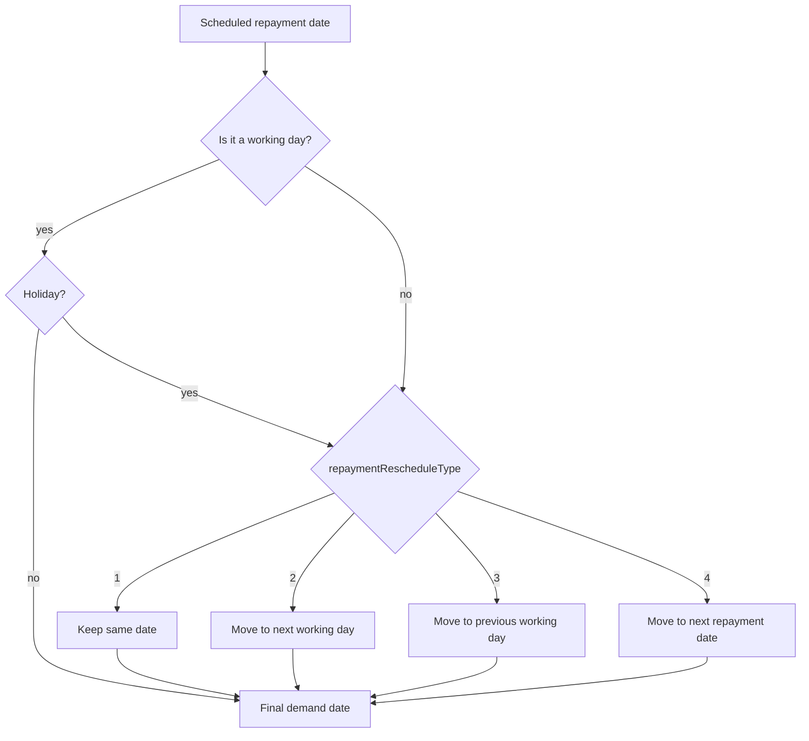

`WorkingDaysApiResource` configures the single global rule for which days of the week count as business days. There is exactly one row per tenant in `m_working_days`. The same data feeds the loan-repayment scheduler — combined with [holidays](/api/holidays) it determines when payments are demanded and how the schedule shifts when a due date lands on a non-working day.

## Source

```
fineract-provider/src/main/java/org/apache/fineract/organisation/workingdays/api/WorkingDaysApiResource.java
```

| Annotation | Value |
| --- | --- |
| `@Path` | `/v1/workingdays` |
| `@Component` | yes |
| `@Tag` | `Working days` |

Injected collaborators:

- `WorkingDaysReadPlatformService workingDaysReadPlatformService`
- `WorkingDaysUpdateRequestValidator workingDaysUpdateRequestValidator`
- `CommandPipeline commandPipeline` — typed v2-style command pipeline

## Permissions

Permission checks are performed inside the underlying service and the command handler. Required codes: `READ_WORKINGDAYS`, `UPDATE_WORKINGDAYS`.

## Endpoint inventory

| HTTP | Path | Description | Command / Read service |
| --- | --- | --- | --- |
| `GET` | `/v1/workingdays` | Fetch the current working-day rule | `workingDaysReadPlatformService.retrieve()` |
| `PUT` | `/v1/workingdays` | Update the working-day rule | `WorkingDaysUpdateCommand` via `commandPipeline.send(...)` |
| `GET` | `/v1/workingdays/template` | Repayment-reschedule type options | `workingDaysReadPlatformService.repaymentRescheduleType()` |

There is no `POST` (only ever one row) and no `DELETE`.

## Source excerpt

```java
@Path("/v1/workingdays")
@Component
@Tag(name = "Working days")
@RequiredArgsConstructor
public class WorkingDaysApiResource {

    @GET
    @Consumes(MediaType.APPLICATION_JSON)
    @Produces(MediaType.APPLICATION_JSON)
    public WorkingDaysData retrieveAll() {
        return workingDaysReadPlatformService.retrieve();
    }

    @PUT
    @Consumes(MediaType.APPLICATION_JSON)
    @Produces(MediaType.APPLICATION_JSON)
    public WorkingDaysUpdateResponse update(@Valid WorkingDaysUpdateRequest request) {
        final var command = new WorkingDaysUpdateCommand();
        command.setCommandId(System.currentTimeMillis());
        command.setCreatedAt(Instant.now());
        command.setPayload(request);
        final Supplier<WorkingDaysUpdateResponse> response = commandPipeline.send(command);
        return response.get();
    }

    @GET
    @Path("/template")
    public WorkingDaysData template() {
        return workingDaysReadPlatformService.repaymentRescheduleType();
    }
}
```

## Canonical curl

```bash
# Fetch current settings
curl -k -u mifos:password \
  -H "Fineract-Platform-TenantId: default" \
  https://localhost:8443/fineract-provider/api/v1/workingdays

# Switch to Mon-Sat with "move to next working day"
curl -k -u mifos:password \
  -H "Fineract-Platform-TenantId: default" \
  -H "Content-Type: application/json" \
  -X PUT https://localhost:8443/fineract-provider/api/v1/workingdays \
  -d '{
    "recurrence": "FREQ=WEEKLY;INTERVAL=1;BYDAY=MO,TU,WE,TH,FR,SA",
    "repaymentRescheduleType": 2,
    "extendTermForDailyRepayments": false,
    "extendTermForRepaymentsOnHolidays": false,
    "locale": "en"
  }'
```

## Read DTO

`org.apache.fineract.organisation.workingdays.data.WorkingDaysData`:

```json
{
  "id": 1,
  "recurrence": "FREQ=WEEKLY;INTERVAL=1;BYDAY=MO,TU,WE,TH,FR,SA",
  "repaymentRescheduleType": {
    "id": 2,
    "code": "WorkingDayExemptionType.move.to.next.working.day",
    "value": "Move to next working day"
  },
  "extendTermForDailyRepayments": false,
  "extendTermForRepaymentsOnHolidays": false,
  "repaymentRescheduleOptions": null
}
```

When fetched via `/template`, `repaymentRescheduleOptions` is populated with the full list of options for UI dropdowns.

## Request body — PUT

| Field | Required | Notes |
| --- | --- | --- |
| `recurrence` | yes | RFC 5545 RRULE (`FREQ=WEEKLY;INTERVAL=1;BYDAY=MO,TU,WE,TH,FR`). `BYDAY` is the set of working days |
| `repaymentRescheduleType` | yes | `1`=Same day; `2`=Move to next working day; `3`=Move to previous working day; `4`=Move to next repayment date |
| `extendTermForDailyRepayments` | yes | If true, daily loans push their final repayment forward when a non-working day is skipped |
| `extendTermForRepaymentsOnHolidays` | yes | If true, holiday-displaced repayments extend the term rather than compacting it |
| `locale` | yes | |

`dateFormat` is **not** required here because the body carries no dates.

## Interaction with holidays and globals

The working-day rule is the **first** filter consulted by the loan-repayment scheduler:

1. Each scheduled date is checked against `recurrence`. If it lands on a non-working day, `repaymentRescheduleType` decides how to shift.
2. The shifted date is then checked against active [holidays](/api/holidays) — and shifted again if it falls inside one.
3. The final shift behaviour is gated by `reschedule-future-repayments` and `allow-transactions-on-non-workingday` in [Global configurations](/config/global-configuration-api).

## Repayment shift logic



## Common pitfalls

- **`BYDAY` ordering does not matter** for evaluation — the platform treats it as a set.
- **`extendTermForRepaymentsOnHolidays=true` may push the maturity date** beyond the original term. Loan-product validation in turn checks the new term against `maxLoanTerm` and may reject the disbursement.
- **`repaymentRescheduleType=1` (same day) is risky** for daily-repayment products: it skips the calendar but does not skip the demand, so cash collection mismatches arise.
- **A misformed `recurrence`** rejects the PUT with a validation error from `WorkingDaysUpdateRequestValidator` (`error.msg.workingdays.recurrence.invalid`).

## Worked example — Mon-Fri with same-day repayments

```bash
curl -k -u mifos:password \
  -H "Fineract-Platform-TenantId: default" \
  -H "Content-Type: application/json" \
  -X PUT https://localhost:8443/fineract-provider/api/v1/workingdays \
  -d '{
    "recurrence": "FREQ=WEEKLY;INTERVAL=1;BYDAY=MO,TU,WE,TH,FR",
    "repaymentRescheduleType": 1,
    "extendTermForDailyRepayments": false,
    "extendTermForRepaymentsOnHolidays": false,
    "locale": "en"
  }'
```

In this configuration, weekend-scheduled payments stay on the same date — collection happens on the next Monday but the schedule does not move.

## Cross-references

- [Holidays](/api/holidays) — date-range exceptions.
- [Organisation → Working days](/organisation/working-days) — domain model.
- [Config → Global configuration](/config/global-configuration-api) — the global flags that gate behaviour.
- [API conventions](/api/conventions) — envelope and validation errors.
- [Command pipeline](/command/synchronous-command-processing) — `commandPipeline.send(WorkingDaysUpdateCommand)`.
