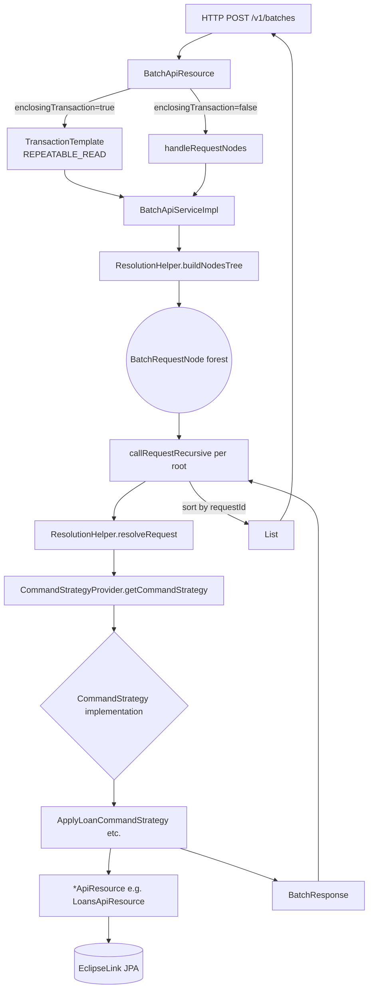

The Apache Fineract Batch API at `POST /v1/batches` lets a consumer pack many logical HTTP requests — create a client, then apply a loan against that client's id, then approve and disburse it — into a single round trip. Each sub-request is dispatched by a `CommandStrategy`, dependent sub-requests reference their parents and pull fields via JSONPath substitutions, and the caller can opt into an enclosing JDBC transaction so the whole batch either commits or rolls back. The endpoint is defined in `fineract-core` (`BatchApiResource`, `BatchApiServiceImpl`, `ResolutionHelper`), and the per-resource strategy beans live in `fineract-provider/.../batch/command/internal`.

This overview page wires the pieces together. Follow-up pages dive into the resource and transaction modes, every shipped strategy, and the JSONPath / topological resolution logic.

## Why this exists

REST APIs that mutate multiple resources for one user-visible action — "onboard a borrower with a loan and a savings account" — often require several round-trips. Each adds TLS handshake, auth, tenant header propagation, and JSON parse / serialize cost; each also opens a separate JPA transaction. The Batch API folds the work into one HTTP exchange and lets the caller opt into a single JPA transaction across the whole batch. Three properties make it different from a generic "bulk endpoint":

* **Per-request dispatch.** Every sub-request is routed to the same `*ApiResource` you would have called individually. The Batch API does not re-implement business logic.
* **Dependency references.** A child sub-request can pull values from a parent's response via JSONPath, so the second call's body can include the id the first call created.
* **Mode-aware atomicity.** A flag flips between independent commits per root and a single enclosing JPA transaction with retries on transient concurrency errors.

## What the endpoint is for

<CardGroup cols={2}>
  <Card title="Reduce round-trips" icon="bolt">
    Frontends that need to chain 5–10 calls (create client → loan → approve → disburse → repayment) collapse them into a single HTTP request with one auth, one tenant header, one network hop.
  </Card>
  <Card title="Express dependencies" icon="diagram-project">
    A child request can set `reference` to a parent `requestId`. Path or body fields can use `$.fieldName` to pull from the parent response — `ResolutionHelper` substitutes via JSONPath before the child runs.
  </Card>
  <Card title="All-or-nothing mode" icon="rotate-left">
    Add `?enclosingTransaction=true` to wrap the whole batch in a `REPEATABLE_READ` JPA transaction. A single failure rolls everything back and returns one error response describing the first failing request.
  </Card>
  <Card title="Per-request mode" icon="circle-check">
    The default `?enclosingTransaction=false` runs each root request in its own transaction; one failure marks descendants as `409` but does not affect siblings.
  </Card>
</CardGroup>

## Request / response shape

The body is a JSON array of `BatchRequest`:

```java
// fineract-core/src/main/java/org/apache/fineract/batch/domain/BatchRequest.java
@NoArgsConstructor @Data @Accessors(chain = true)
public class BatchRequest {
    private Long requestId;      // caller-assigned id, used by `reference`
    private String relativeUrl;  // e.g. "v1/clients" or "loans/$.clientId/charges"
    private String method;       // "GET" | "POST" | "PUT" | "DELETE"
    private Set<Header> headers; // optional, merged into the response
    private Long reference;      // optional, parent requestId
    private String body;         // optional, raw JSON for POST/PUT
}
```

The response is a JSON array of `BatchResponse`:

```java
// fineract-core/src/main/java/org/apache/fineract/batch/domain/BatchResponse.java
@NoArgsConstructor @Data @Accessors(chain = true)
public class BatchResponse {
    private Long requestId;
    private Integer statusCode;
    private Set<Header> headers;
    private String body;     // serialized JSON of the underlying API response
}
```

Both classes are in `fineract-core`. They are pure DTOs — no JPA, no JAX-RS, no JSON helpers.

## A minimal example

The canonical example from the docstring on `BatchApiResource` is a three-step chain: create a client (1), apply a loan for that client (2), approve the loan (3). Request 2 references 1 and substitutes the new `clientId` from the create-client response via JSONPath; request 3 references 2 and substitutes the new `loanId`.

```json
[
  {
    "requestId": 1,
    "relativeUrl": "v1/clients",
    "method": "POST",
    "body": "{ \"officeId\": 1, \"firstname\": \"Petra\", \"lastname\": \"Yton\", ... }"
  },
  {
    "requestId": 2,
    "relativeUrl": "v1/loans",
    "method": "POST",
    "reference": 1,
    "body": "{ \"clientId\": \"$.clientId\", \"productId\": 1, ... }"
  },
  {
    "requestId": 3,
    "relativeUrl": "v1/loans/$.loanId?command=approve",
    "method": "POST",
    "reference": 2,
    "body": "{ \"approvedOnDate\": \"01 January 2024\", \"locale\": \"en\", \"dateFormat\": \"dd MMMM yyyy\" }"
  }
]
```

What happens at runtime:

1. `BatchApiResource.handleBatchRequests` receives the deserialized list and forwards to `BatchApiServiceImpl`.
2. `ResolutionHelper.buildNodesTree` topologically arranges requests into a forest of `BatchRequestNode`s — request 1 is a root, request 2 is its child, request 3 is request 2's child.
3. Each root subtree runs in depth-first order. Before a child runs, `ResolutionHelper.resolveRequest(child, parentResponse)` rewrites `$.clientId`, `$.loanId`, etc. by reading the parent's JSON body with JSONPath.
4. For each request the `CommandStrategyProvider` picks the right `CommandStrategy` by regex-matching the (method, relativeUrl) pair, then `commandStrategy.execute(request, uriInfo)` calls into the underlying `*ApiResource`.

## Wiring map



## Two transaction modes

| Mode | Query | Behaviour on failure | Use when |
| --- | --- | --- | --- |
| Per-request (default) | `?enclosingTransaction=false` or omitted | The failing root subtree's root returns the error; its descendants get `409` with body `"Parent request with id N was erroneous!"`; siblings continue. | Independent requests; you want each to commit on its own. |
| Enclosing transaction | `?enclosingTransaction=true` | The whole batch rolls back via `TransactionExecution.setRollbackOnly()`; the response is a **single-element** list with status `400` and `"Transaction is being rolled back. First erroneous request: …"`. Resilience4j retries the batch when JPA throws transient concurrency errors. | All-or-nothing atomicity — create a client and a loan together, or neither. |

See [`batch-api-resource`](/batch-api/batch-api-resource) for the full transaction lifecycle, JPA flush semantics, and retry configuration.

## The strategy pattern

`CommandStrategy` is a one-method interface:

```java
// fineract-core/src/main/java/org/apache/fineract/batch/command/CommandStrategy.java
public interface CommandStrategy {
    BatchResponse execute(BatchRequest batchRequest, UriInfo uriInfo);
}
```

`CommandStrategyProvider` keeps a static map of `CommandContext` (regex on relative URL + HTTP method) to Spring bean name. `init()` registers each one. A miss returns the catch-all `UnknownCommandStrategy` that responds `501 Not Implemented`.

There are 48 concrete strategies today, covering clients, loans, savings accounts, loan transactions, charges, datatable entries, loan reschedules, and loan interest pauses — see [`command-strategies`](/batch-api/command-strategies) for the full catalogue.

## JSONPath substitution

`ResolutionHelper.resolveRequest` walks the child request and rewrites two things using the parent response body parsed by `JsonPath.parse(parentResponse.getBody())`:

* Every JSON primitive inside the request `body` that contains `$.` is replaced by the corresponding parent value. Object and array elements recurse.
* Every path segment in `relativeUrl` that contains `$.` is replaced by the parent value. Query string is preserved.
* A special `$[ARRAYDATE]` token in a primitive resolves a `[yyyy, M, d]` array from the parent into a date string using the child's `dateFormat`.

If a referenced parent does not exist or a JSONPath is invalid, `BatchReferenceInvalidException` or `JsonPathException` is raised and turned into a `400` response for the offending child only. See [`resolution-helper`](/batch-api/resolution-helper).

## Where the modules live

| Concern | Module | Key files |
| --- | --- | --- |
| Resource + Service interface + Default impl + ResolutionHelper + DTOs + Exceptions + JSON helper | `fineract-core` | `batch/api/BatchApiResource.java`, `batch/service/BatchApiServiceImpl.java`, `batch/service/ResolutionHelper.java`, `batch/domain/{BatchRequest,BatchResponse,Header}.java`, `batch/exception/{BatchReferenceInvalidException,ErrorInfo}.java`, `batch/serialization/BatchRequestJsonHelper.java` |
| Strategy provider + Strategy interface + Strategy utils + `UnknownCommandStrategy` | `fineract-core` | `batch/command/{CommandStrategy,CommandStrategyProvider,CommandStrategyUtils,CommandContext,CommandHandlerRegistry}.java`, `batch/command/internal/UnknownCommandStrategy.java` |
| Concrete `*CommandStrategy` beans | `fineract-provider` | 48 files under `batch/command/internal/` |

A downstream module can add a new strategy by creating a Spring `@Component` and registering its `(method, resourceUrl)` key in `CommandStrategyProvider.init()` — see [`command-strategies`](/batch-api/command-strategies) for the recipe.

## Authentication, tenancy, and instance mode

`BatchApiResource.handleBatchRequests` calls `context.authenticatedUser()` first — the entire batch executes as the authenticated user. The tenant header travels with the outer request and lands in `ThreadLocalContextUtil`, then propagates to each sub-request because the strategies call directly into in-process `*ApiResource` beans (no HTTP rebound).

Read-only mode is enforced before the batch starts:

```java
private void validateRequestMethodsAllowedOnInstanceType(final List<BatchRequest> requestList) {
    if (fineractProperties.getMode().isReadOnlyMode()) {
        final Optional<BatchRequest> nonGetRequest = requestList.stream()
                .filter(batchRequest -> !HttpMethod.GET.equals(batchRequest.getMethod())).findFirst();
        if (nonGetRequest.isPresent()) {
            throw new InvalidInstanceTypeMethodException(nonGetRequest.get().getMethod());
        }
    }
}
```

So on a read-only Fineract instance a batch containing any non-`GET` is rejected wholesale. See [`/core/instance-mode`](/core/instance-mode) for the mode matrix.

## Filters and preprocessors

`BatchApiServiceImpl` accepts a `List<BatchFilter>` and a `List<BatchRequestPreprocessor>` from Spring. Preprocessors mutate (or reject) each `BatchRequest` before dispatch — they're typically used for idempotency-key handling. Filters wrap the strategy execution via `BatchCallHandler`. Both are extension points — see [`/core/batch-api-internals`](/core/batch-api-internals) for the current preprocessor / filter beans and [`/command/overview`](/command/overview) for how the command framework hooks into the same flow.

## When to use it (and when not to)

| Use the Batch API when | Use plain REST when |
| --- | --- |
| You need to chain dependent writes in one user-visible operation | Each call is independent and runs from a robust client |
| You want all-or-nothing semantics across resources | You already have a higher-level orchestration layer |
| You want to reduce TLS / auth overhead from a thick client | You need streaming, websockets, or async callbacks |
| You're fronting a UI workflow that creates an entity + initialises N children | The workflow involves files / multipart bodies (not supported) |

Limitations to know:

* Only JSON bodies — no multipart, no file uploads.
* `relativeUrl` is matched against versioned `v1\\/…` regexes; unversioned URLs are accepted but rewritten with a `v1/` prefix for backward compatibility.
* Cycles in `reference` are not supported — a child whose reference points to a non-root non-ancestor will be reported as `BatchReferenceInvalidException`.
* The transactional mode only protects what the underlying `*ApiResource` calls within JPA — external system effects (events published, external services called) are not rolled back.

## File pointer reference

The full module map at one glance:

| Concern | File |
| --- | --- |
| REST resource | `fineract-core/src/main/java/org/apache/fineract/batch/api/BatchApiResource.java` |
| Service interface | `fineract-core/src/main/java/org/apache/fineract/batch/service/BatchApiService.java` |
| Dispatcher impl | `fineract-core/src/main/java/org/apache/fineract/batch/service/BatchApiServiceImpl.java` |
| Dependency forest + JSONPath substitution | `fineract-core/src/main/java/org/apache/fineract/batch/service/ResolutionHelper.java` |
| `BatchRequest` / `BatchResponse` / `Header` DTOs | `fineract-core/src/main/java/org/apache/fineract/batch/domain/` |
| Exceptions (`BatchReferenceInvalidException`, `ErrorInfo`) | `fineract-core/src/main/java/org/apache/fineract/batch/exception/` |
| Strategy interface + provider + utilities | `fineract-core/src/main/java/org/apache/fineract/batch/command/` |
| Catch-all `UnknownCommandStrategy` | `fineract-core/src/main/java/org/apache/fineract/batch/command/internal/UnknownCommandStrategy.java` |
| Concrete strategy beans (48) | `fineract-provider/src/main/java/org/apache/fineract/batch/command/internal/*.java` |
| Gson `List<BatchRequest>` deserializer | `fineract-core/src/main/java/org/apache/fineract/batch/serialization/BatchRequestJsonHelper.java` |
| Retry assembler (enclosing-transaction mode) | `fineract-provider/src/main/java/org/apache/fineract/commands/configuration/RetryConfigurationAssembler.java` |

## Key invariants

1. **Roots come first.** A request whose `reference` points to a `requestId` that has not yet appeared in the input list causes `BatchReferenceInvalidException` and the whole batch is rejected.
2. **Failure of a parent collapses its descendants.** Each descendant gets a 409 with body `"Parent request with id N was erroneous!"`. Siblings of the parent are unaffected.
3. **Per-request mode → per-request transactions.** Each strategy's `*ApiResource` opens its own JPA transaction. Sub-requests see each other's *committed* state.
4. **Enclosing mode → one `REPEATABLE_READ` transaction.** Combined with `entityManager.flush()` before each leaf, this gives child requests visibility of parent JPA writes. First failure triggers `setRollbackOnly()`.
5. **Responses are sorted by `requestId`.** The output order is deterministic and independent of execution order.
6. **JSON only.** No multipart, no file uploads. Bodies are forwarded verbatim to the underlying resource.

## Quick recipe — adding Batch support for a new endpoint

1. Read [`command-strategies`](/batch-api/command-strategies) — pick the closest existing strategy as a template.
2. Create `YourCommandStrategy` in `fineract-provider/.../batch/command/internal/`, inject the relevant `*ApiResource` (or read service), and implement `execute(BatchRequest, UriInfo)`.
3. Add a row to `CommandStrategyProvider.init()` mapping `(method, regex)` → Spring bean name.
4. Add a unit test under `fineract-provider/src/test/java/org/apache/fineract/batch/command/internal/`.
5. (Optional) If your endpoint needs idempotency on the batch path, ensure the `BatchRequestPreprocessor` for idempotency keys recognises the URL — see [`/core/batch-api-internals`](/core/batch-api-internals).

## Cross references

| Topic | Page |
| --- | --- |
| `BatchApiResource` paths, transaction modes, instance mode guard | [`/batch-api/batch-api-resource`](/batch-api/batch-api-resource) |
| The 48 shipped `*CommandStrategy` beans | [`/batch-api/command-strategies`](/batch-api/command-strategies) |
| JSONPath substitution, topological order, error paths | [`/batch-api/resolution-helper`](/batch-api/resolution-helper) |
| Filters, preprocessors, retry, and overall batch internals | [`/core/batch-api-internals`](/core/batch-api-internals) |
| Underlying command framework that each strategy ultimately reaches | [`/command/overview`](/command/overview) |
