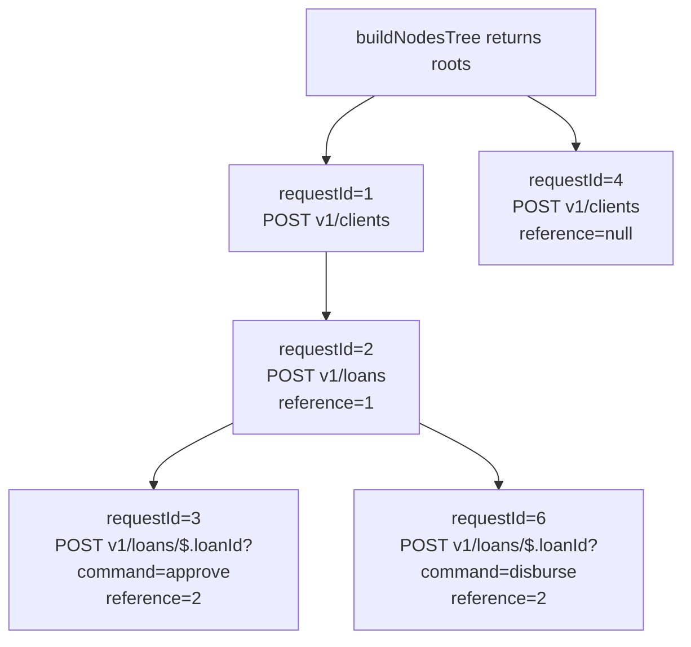
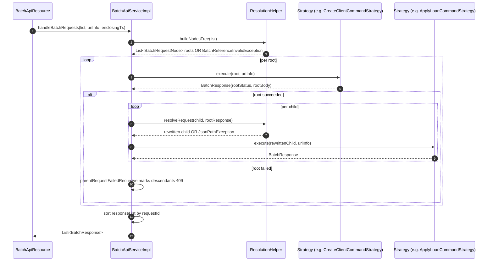

`ResolutionHelper` is the part of the Apache Fineract Batch API that makes sub-requests *referentially* dependent on each other. It turns a flat `List<BatchRequest>` into a forest of `BatchRequestNode`s keyed by the `reference` field, and at runtime it rewrites every `$.fieldName` occurrence in a child's body or relative URL by reading the parent's response with JSONPath. This page is the deep dive: the data structure, the two passes, the JSONPath conventions, the date-array helper, the error model, and the integration points back into `BatchApiServiceImpl`.

## Source

```java
// fineract-core/src/main/java/org/apache/fineract/batch/service/ResolutionHelper.java
@Component
@RequiredArgsConstructor
public class ResolutionHelper {

    public static class BatchRequestNode {
        private BatchRequest request;
        private final List<BatchRequestNode> childRequests = new ArrayList<>();

        public BatchRequestNode(BatchRequest request) { this.request = request; }
        public BatchRequest getRequest()              { return this.request; }
        public List<BatchRequestNode> getChildNodes() { return this.childRequests; }
        public void addChildNode(final BatchRequestNode batchRequest) { this.childRequests.add(batchRequest); }
    }

    private final FromJsonHelper fromJsonHelper;
    ...
}
```

`BatchRequestNode` is intentionally tiny — one request, one list of children. There is no metadata about traversal order; depth-first traversal is enforced by `BatchApiServiceImpl.callRequestRecursive`.

## Two passes

The lifecycle of a batch involves `ResolutionHelper` twice:

1. **Build pass — once per batch.** `buildNodesTree(requestList)` walks the input list in order and either makes a root or attaches the request to its parent. Output: list of roots.
2. **Resolve pass — once per child.** Immediately before a child runs, `resolveRequest(childRequest, parentResponse)` rewrites `$.fieldName` placeholders by reading the parent's JSON response.

The build pass is structural — it reports `BatchReferenceInvalidException` if a reference can't be resolved. The resolve pass is value-level — it raises `JsonPathException` if a `$.field` does not exist on the parent.

## Build pass — `buildNodesTree`

```java
public List<BatchRequestNode> buildNodesTree(final List<BatchRequest> requests) {
    final List<BatchRequestNode> rootNodes = new ArrayList<>();
    for (BatchRequest request : requests) {
        if (request.getReference() == null) {
            final BatchRequestNode node = new BatchRequestNode(request);
            rootNodes.add(node);
        } else {
            if (!addDependingRequest(request, rootNodes)) {
                throw new BatchReferenceInvalidException(request.getReference());
            }
        }
    }
    return rootNodes;
}

private boolean addDependingRequest(final BatchRequest request, final List<BatchRequestNode> parentNodes) {
    for (BatchRequestNode parentNode : parentNodes) {
        if (parentNode.getRequest().getRequestId().equals(request.getReference())) {
            final BatchRequestNode childNode = new BatchRequestNode(request);
            parentNode.addChildNode(childNode);
            return true;
        } else {
            if (addDependingRequest(request, parentNode.getChildNodes())) {
                return true;
            }
        }
    }
    return false;
}
```

What this does and does not do:

| Property | Behaviour |
| --- | --- |
| Roots | Any request with `reference == null`. There can be many roots — `BatchApiServiceImpl` iterates them. |
| Parent lookup | Recursive across the entire forest already built. If the referenced parent is deeper in another subtree, it is still found. |
| Order assumption | The input list is processed top-to-bottom. **A parent must appear before its child** — otherwise the child's lookup fails and a `BatchReferenceInvalidException` is raised. |
| Unique requestId | Not validated. Two requests with the same `requestId` end up arbitrary winners during reference matching. Callers must keep ids unique. |
| Cycles | Not possible because `reference` is a `Long` pointing backwards. The build pass cannot model A → B → A. |

### `BatchReferenceInvalidException`

```java
// fineract-core/src/main/java/org/apache/fineract/batch/exception/BatchReferenceInvalidException.java
public class BatchReferenceInvalidException extends AbstractPlatformDomainRuleException {

    public BatchReferenceInvalidException() {
        super("validation.msg.batch.root.invalid", "Root request not found");
    }

    public BatchReferenceInvalidException(Long reference) {
        super("validation.msg.batch.reference.invalid", "Referenced request not found", reference);
    }
}
```

Raised once per batch when build fails. `BatchApiServiceImpl.handleRequestNodes` catches it, returns a one-element response list with the error mapped to a 400 by `ErrorHandler`, and the rest of the batch is **not** executed. This is intentional — a structurally broken batch is rejected wholesale.

## Topological order of execution

After `buildNodesTree`, `BatchApiServiceImpl` simply iterates the root list:

```java
for (BatchRequestNode rootNode : rootNodes) {
    this.callRequestRecursive(rootNode.getRequest(), rootNode, responseList, uriInfo);
}
```

…and `callRequestRecursive` runs each root, then walks its children depth-first only **if** the root succeeded:

```java
if (response.getStatusCode() != null && response.getStatusCode() == SC_OK) {
    requestNode.getChildNodes().forEach(childNode -> {
        BatchRequest childRequest = childNode.getRequest();
        BatchRequest resolvedChildRequest;
        try {
            resolvedChildRequest = this.resolutionHelper.resolveRequest(childRequest, response);
            callRequestRecursive(resolvedChildRequest, childNode, responseList, uriInfo);
        } catch (JsonPathException jpex) {
            responseList.add(buildOrThrowErrorResponse(jpex, childRequest));
        }
    });
} else {
    responseList.addAll(parentRequestFailedRecursive(request, requestNode, response, null));
}
```

So the effective ordering is:

* **Depth-first per root**, parent then children, in the order they appear in the original list.
* **Siblings are independent** — siblings of a failed child still run if they belong to a different parent path.
* **Failed parent collapses descendants** — every descendant of a failed parent is reported with status 409 and body `"Parent request with id N was erroneous!"` (see `parentRequestFailedRecursive`).

After the walk, `BatchApiServiceImpl` sorts the response list by `requestId` so the caller can read it in client-assigned id order regardless of execution order.



## Resolve pass — `resolveRequest`

`resolveRequest` is called per child, with the just-completed parent response in hand:

```java
public BatchRequest resolveRequest(final BatchRequest request, final BatchResponse parentResponse) {
    final ReadContext responseCtx = JsonPath.parse(parentResponse.getBody());

    String requestBody = request.getBody();
    if (requestBody != null) {
        final JsonObject jsonRequestBody = this.fromJsonHelper.parse(requestBody).getAsJsonObject();
        JsonObject jsonResultBody = new JsonObject();
        for (Map.Entry<String, JsonElement> element : jsonRequestBody.entrySet()) {
            final String key = element.getKey();
            final JsonElement value = resolveDependentVariables(element.getValue(), requestBody, responseCtx);
            jsonResultBody.add(key, value);
        }
        request.setBody(jsonResultBody.toString());
    }

    String relativeUrl = request.getRelativeUrl();
    if (relativeUrl.contains("$.")) {
        String queryParams = "";
        if (relativeUrl.contains("?")) {
            queryParams = relativeUrl.substring(relativeUrl.indexOf("?"));
            relativeUrl = relativeUrl.substring(0, relativeUrl.indexOf("?"));
        }

        final Iterable<String> parameters = Splitter.on('/').split(relativeUrl);
        for (String parameter : parameters) {
            if (parameter.contains("$.")) {
                final String resParamValue = responseCtx.read(parameter).toString();
                relativeUrl = relativeUrl.replace(parameter, resParamValue);
                request.setRelativeUrl(relativeUrl + queryParams);
            }
        }
    }

    return request;
}
```

Two distinct rewrites happen.

### Body rewrite

For every top-level key in the request body, `resolveDependentVariables` walks recursively:

* **`JsonObject`** — descend into each property.
* **`JsonArray`** — descend into each element.
* **`JsonNull`** — pass through.
* **`JsonPrimitive`** — call `processJsonPrimitive`.

`processJsonPrimitive` is the leaf:

```java
private JsonElement processJsonPrimitive(final JsonElement element, final String requestBody, final ReadContext responseCtx) {
    JsonElement value = element;
    if (element instanceof JsonPrimitive) {
        String paramVal = element.getAsString();
        if (paramVal.contains("$[ARRAYDATE]")) {
            String resolvableParamVal = paramVal.replace("$[ARRAYDATE]", "$");
            final String resParamValue = responseCtx.read(resolvableParamVal).toString();
            JsonArray date = (JsonArray) this.fromJsonHelper.parse(resParamValue);
            String dateFormat = JsonPath.read(requestBody, "$.dateFormat");
            return new JsonPrimitive(DateTimeFormatter.ofPattern(dateFormat)
                    .format(LocalDate.of(date.get(0).getAsInt(), date.get(1).getAsInt(), date.get(2).getAsInt())));
        } else if (paramVal.contains("$.")) {
            final String resParamValue = responseCtx.read(paramVal).toString();
            value = this.fromJsonHelper.parse(resParamValue);
        }
    }
    return value;
}
```

So a primitive whose string value:

* contains `$.` → use the value as a JSONPath against the parent response, read it, then re-parse it as JSON. This is the standard substitution.
* contains `$[ARRAYDATE]` → resolve the JSONPath (with the marker replaced by `$`), expect a `[year, month, day]` array, format it using the child's `dateFormat` field, and return a string.

### URL rewrite

The URL is split on `/`. Any segment that contains `$.` is replaced by the JSONPath result. The query string is preserved verbatim by being detached before split and re-appended after the rewrites. Only the first `$.` segment per loop iteration is rewritten and the entire `relativeUrl` is overwritten with each replace — practical scripts therefore tend to use one substitution per URL.

## JSONPath conventions

`JsonPath.parse(parentResponse.getBody())` produces a `ReadContext`. The placeholders you can use:

| Placeholder | Means | Example |
| --- | --- | --- |
| `$.fieldName` | Top-level field of the parent response. | `"clientId": "$.clientId"` becomes the new client's id. |
| `$.nested.field` | Nested path. | `"officeId": "$.client.officeId"` (depending on the parent's JSON shape). |
| `$.field[0]` | First element of an array. | `"transactionId": "$.changes.transactions[0]"`. |
| `$[ARRAYDATE]field` | Array date of the form `[yyyy, M, d]` rendered using the child request's `dateFormat`. | `"approvedOnDate": "$[ARRAYDATE]approvedOnDate"`. |

A few practical notes:

* The placeholder must be the **entire** string value, not a substring — `resolveDependentVariables` parses the result with `fromJsonHelper.parse` and substitutes the whole node, so partial-string templating like `"prefix-$.foo"` won't work for primitives.
* The substituted value can itself be an object or array — `value = this.fromJsonHelper.parse(resParamValue)` will produce whatever JSON node the JSONPath resolved to. This lets a child inherit a whole nested structure.
* The URL rewrite is purely textual replacement. The path segment becomes a string interpolation; numeric ids are emitted as their string form, which is what URLs need.

## End-to-end resolution example

Parent — `POST v1/clients` — response body:

```json
{
  "officeId": 1,
  "clientId": 532,
  "resourceId": 532
}
```

Child — `POST v1/loans` — submitted body:

```json
{
  "clientId": "$.clientId",
  "productId": 1,
  "principal": "10000",
  "expectedDisbursementDate": "$[ARRAYDATE]changes.expectedDisbursementDate",
  "dateFormat": "dd MMMM yyyy",
  "locale": "en"
}
```

After `resolveRequest`:

* `"$.clientId"` becomes the JSON number `532`.
* `"$[ARRAYDATE]..."` reads the array (if the parent had one) and renders e.g. `"01 January 2024"` per the `dateFormat`.

The child's URL stays `v1/loans` because there is no `$.` in it.

Grandchild — `POST v1/loans/$.loanId?command=approve` — `reference: 2`:

* URL `$.loanId` is replaced with the loan id from the parent loan-application response.
* The query string `?command=approve` is preserved.

## Error model

| Error | Raised by | Caught by | Visible to caller |
| --- | --- | --- | --- |
| `BatchReferenceInvalidException(Long reference)` | `buildNodesTree` | `BatchApiServiceImpl.handleRequestNodes` | Whole batch fails with one error response describing the broken reference. |
| `BatchReferenceInvalidException()` (no-arg, "Root request not found") | Constructed when a stray request lacks a root. Currently only the parameterized form is thrown by `buildNodesTree`. | Same as above. | Whole batch fails. |
| `JsonPathException` | `resolveRequest` (specifically `responseCtx.read(...)`) | `BatchApiServiceImpl.callRequestRecursive` `catch (JsonPathException jpex)` | A 400-level response per failing child; siblings continue. Under `enclosingTransaction=true`, this triggers rollback. |
| Other `RuntimeException` from the underlying API | `commandStrategy.execute` | `executeRequest` | Mapped via `ErrorHandler`; sets `setRollbackOnly()` if in an enclosing transaction. |

The `BatchReferenceInvalidException` makes the batch unrunnable, so it short-circuits before any sub-request executes. JSONPath failures are per-child — earlier siblings have already run and committed (in per-request mode).

## Build-time vs run-time order

You will sometimes see a question like "can I put a child before its parent in the JSON array?". The answer is **no**:

* `buildNodesTree` processes the array in order.
* When it sees a child whose `reference` does not yet exist in `rootNodes`, it raises `BatchReferenceInvalidException` immediately.

This is a deliberately strict topological constraint and is part of why the Batch API is straightforward to reason about — execution order matches `requestId` ascending in practice.

## Diagnostic checklist

Symptoms you might see and the right place to look:

| Symptom | Likely cause | Where to fix |
| --- | --- | --- |
| Whole batch returns one error referring to `reference X not found` | Child appears before parent in the array, or `reference` points to a non-existent `requestId`. | Reorder, or correct the `reference`. |
| A single child returns 400 with a JSONPath error | The parent response did not contain the field the child asked for via `$.…`. | Check the parent's actual response shape; e.g. `resourceId` vs `clientId`. |
| `$[ARRAYDATE]` returns a malformed date | The parent response did not contain a `[y, m, d]` JSON array at that path, or the child body did not include a `dateFormat` field. | Confirm both. |
| URL substitution leaves the literal `$.foo` in the URL | The path segment didn't pass the `parameter.contains("$.")` test — typically extra whitespace or a substring not matching a full segment. | Quote / format the URL so the segment is exactly `$.foo`. |
| Body substitution produces a string `"532"` instead of a number `532` | `JsonPath.read(...).toString()` is then re-parsed with `fromJsonHelper.parse`; for a primitive int the parse yields a `JsonPrimitive` number. If you wrap the placeholder in extra quotes in the original JSON, Gson may keep it as a string. | Make sure the placeholder *is* the value, not wrapped: `"clientId": "$.clientId"` not `"clientId": "\"$.clientId\""`. |

## Integration recap



## Cross references

| Topic | Page |
| --- | --- |
| The dispatcher and transaction modes that drive `ResolutionHelper` | [`/batch-api/batch-api-resource`](/batch-api/batch-api-resource) |
| Every concrete strategy that consumes the resolved request | [`/batch-api/command-strategies`](/batch-api/command-strategies) |
| End-to-end overview, mermaid, and the bigger picture | [`/batch-api/overview`](/batch-api/overview) |
| Preprocessor / filter chain that wraps each strategy invocation | [`/core/batch-api-internals`](/core/batch-api-internals) |
| `ErrorHandler` and `ErrorInfo` used to map JSONPath / reference exceptions to responses | [`/core/exception-mappers`](/core/exception-mappers) |
| JSON helpers (`FromJsonHelper`, Gson) used by the body rewrite | [`/core/serialization-and-json`](/core/serialization-and-json) |
