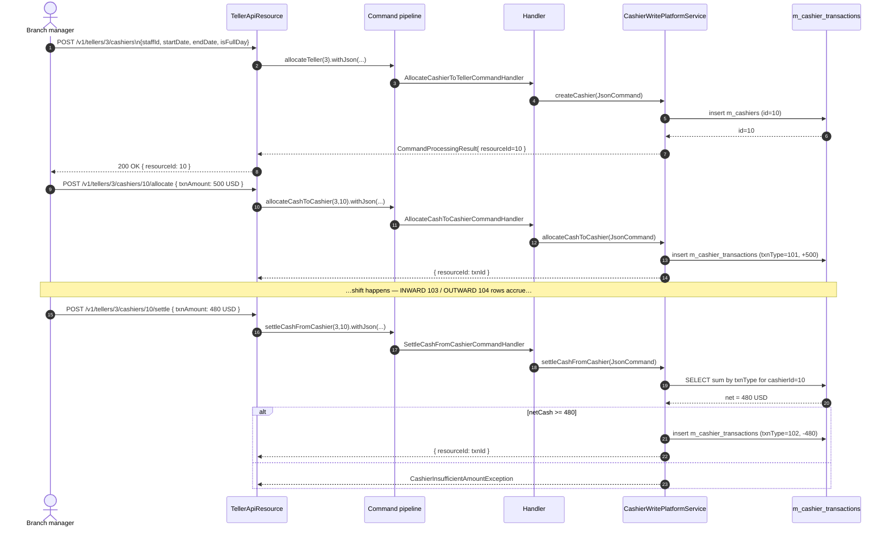

The Apache Fineract cashier API is split across two JAX-RS resources: `TellerApiResource` hosts the **nested** routes (`/v1/tellers/{tellerId}/cashiers/...`) for cashier allocation, cash allocation, and cash settlement, while `CashierApiResource` exposes a single **flat lookup** at `/v1/cashiers` used to find which cashier(s) are on duty for a given office / teller / staff / date. This page walks the create-cashier, allocate-cash, and settle-cash flows end-to-end — including the request DTOs, the command handlers, and the cashier float invariant that ties them together.

<Info>
Cashier writes always go through Fineract's command framework. `TellerApiResource` builds a `CommandWrapper` via `CommandWrapperBuilder`, serialises the typed DTO back to JSON with `DefaultToApiJsonSerializer`, and dispatches via `PortfolioCommandSourceWritePlatformService.logCommandSource(...)`. The matching `*CommandHandler` then delegates to `CashierWritePlatformService`.
</Info>

## Endpoint summary

| Method | Path | Action | Entity | Handler |
| --- | --- | --- | --- | --- |
| `GET` | `/v1/cashiers?officeId=&tellerId=&staffId=&date=` | List on-duty cashiers | — | `CashierApiResource.getCashierData` |
| `POST` | `/v1/tellers/{tellerId}/cashiers` | Allocate cashier | `CASHIER` / `CREATE` | `AllocateCashierToTellerCommandHandler` |
| `PUT` | `/v1/tellers/{tellerId}/cashiers/{cashierId}` | Update allocation | `CASHIER` / `UPDATE` | `UpdateCashierAllocationCommandHandler` |
| `DELETE` | `/v1/tellers/{tellerId}/cashiers/{cashierId}` | Delete allocation | `CASHIER` / `DELETE` | `DeleteCashierAllocationCommandHandler` |
| `POST` | `/v1/tellers/{tellerId}/cashiers/{cashierId}/allocate` | Allocate cash | `ALLOCATECASH` / `CASHIERTRANSACTION` | `AllocateCashToCashierCommandHandler` |
| `POST` | `/v1/tellers/{tellerId}/cashiers/{cashierId}/settle` | Settle cash | `SETTLECASH` / `CASHIERTRANSACTION` | `SettleCashFromCashierCommandHandler` |
| `GET` | `/v1/tellers/{tellerId}/cashiers/{cashierId}/transactions` | Paginated transactions | — | Read service |
| `GET` | `/v1/tellers/{tellerId}/cashiers/{cashierId}/summaryandtransactions` | Transactions + summary | — | Read service |

Cashier lookup and CRUD are introduced in [Teller API](/branch/teller-api); this page focuses on the three write flows and the flat lookup.

## /v1/cashiers — flat lookup

```java
@Path("/v1/cashiers")
@Component
@Tag(name = "Cashiers")
@RequiredArgsConstructor
public class CashierApiResource {

    private final TellerManagementReadPlatformService readPlatformService;

    @GET
    public Collection<CashierData> getCashierData(
            @QueryParam("officeId") final Long officeId,
            @QueryParam("tellerId") final Long tellerId,
            @QueryParam("staffId")  final Long staffId,
            @QueryParam("date")     final String date) {
        final LocalDate dateRestriction = date != null
                ? LocalDate.parse(date, DateTimeFormatter.BASIC_ISO_DATE)
                : DateUtils.getBusinessLocalDate();
        return readPlatformService.getCashierData(
                officeId, tellerId, staffId, dateRestriction);
    }
}
```

| Query param | Type | Notes |
| --- | --- | --- |
| `officeId` | Long | Restrict to one office. Optional. |
| `tellerId` | Long | Restrict to one teller. Optional. |
| `staffId` | Long | Restrict to one staff member. Optional. |
| `date` | String (`yyyyMMdd`) | The business date the cashier must be on duty for. Defaults to `DateUtils.getBusinessLocalDate()`. |

All four parameters are optional — without any of them you get every active cashier today across the platform. The date format is `BASIC_ISO_DATE` (`20240115`), not the usual `dd MMMM yyyy`. The underlying query joins `m_cashiers` to `m_tellers` and `m_staff` and filters by `start_date <= date <= end_date`.

## POST /v1/tellers/{tellerId}/cashiers — create cashier

```java
@POST
@Path("{tellerId}/cashiers")
@Operation(summary = "Create Cashiers", description = """
        Mandatory Fields: 
        Cashier/staff, Fromm Date, To Date, Full Day or From time and To time

        Optional Fields: 
        Description/Notes""")
public CommandProcessingResult createCashier(
        @PathParam("tellerId") final Long tellerId,
        @Parameter(hidden = true) final CashierRequest cashierData) {
    final CommandWrapper request = new CommandWrapperBuilder()
            .allocateTeller(tellerId)
            .withJson(apiJsonSerializer.serialize(cashierData))
            .build();
    return commandWritePlatformService.logCommandSource(request);
}
```

### CashierRequest fields

The inbound DTO is `org.apache.fineract.organisation.teller.domain.model.request.CashierRequest`. The JSON shape that `Cashier.fromJson(...)` reads is:

| Field | Required | Notes |
| --- | --- | --- |
| `staffId` | yes | The `Staff` to attach. Must belong to the teller's office (or any office if cross-office staff are allowed). |
| `startDate` | yes | First day of the assignment. Must lie within the teller's `[valid_from, valid_to]` window. |
| `endDate` | yes | Last day of the assignment. |
| `isFullDay` | yes | When `true`, the cashier covers the whole day. |
| `hourStartTime`, `minStartTime`, `hourEndTime`, `minEndTime` | only when `isFullDay = false` | Integer hour and minute pieces. The write service composes `startTime` / `endTime` strings as `HH:MM`. |
| `description` | no | Free text. |
| `locale`, `dateFormat` | yes (when dates present) | Standard Fineract locale envelope (e.g. `en`, `dd MMMM yyyy`). |

### Validation gates

`CashierTransactionDataValidator` and `CashierWritePlatformService` enforce:

1. The teller exists (`TellerNotFoundException` otherwise).
2. The staff is not already assigned to the same teller for an overlapping window (`CashierAlreadyAllocated`).
3. `[startDate, endDate]` is fully inside the teller's `[valid_from, valid_to]` window (`CashierDateRangeOutOfTellerDateRangeException`).
4. When `isFullDay = false`, all four `hour*` / `min*` integers are present.
5. `startDate <= endDate`.

On success the handler persists a new `Cashier` row, returns `CommandProcessingResult` with `resourceId` set to the new cashier id, and emits no business event (the teller subsystem predates the modern business-event bus).

### CommandWrapperBuilder method

```java
public CommandWrapperBuilder allocateTeller(final Long tellerId) {
    this.actionName = "CREATE";
    this.entityName = "CASHIER";
    this.entityId   = null;
    this.subentityId = null;
    this.tellerId   = tellerId;
    this.href       = "/tellers/" + tellerId + "/cashiers/template";
    return this;
}
```

The handler `AllocateCashierToTellerCommandHandler` is `@CommandType(entity = "CASHIER", action = "CREATE")`.

## PUT and DELETE cashier allocation

```java
@PUT @Path("{tellerId}/cashiers/{cashierId}")
public CommandProcessingResult updateCashier(...) {
    final CommandWrapper request = new CommandWrapperBuilder()
            .updateAllocationTeller(tellerId, cashierId)
            .withJson(apiJsonSerializer.serialize(cashierDate))   // sic: variable name
            .build();
    return commandWritePlatformService.logCommandSource(request);
}

@DELETE @Path("{tellerId}/cashiers/{cashierId}")
public CommandProcessingResult deleteCashier(...) {
    final CommandWrapper request = new CommandWrapperBuilder()
            .deleteAllocationTeller(tellerId, cashierId).build();
    return commandWritePlatformService.logCommandSource(request);
}
```

Update follows the dirty-checking pattern in `Cashier.update(JsonCommand)` — only fields that actually changed are written back. Delete checks that no `CashierTransaction` rows remain for the cashier; if any do, the row stays.

## POST /v1/tellers/{tellerId}/cashiers/{cashierId}/allocate — allocate cash

```java
@POST
@Path("{tellerId}/cashiers/{cashierId}/allocate")
@Operation(summary = "Allocate Cash To Cashier",
           description = "Mandatory Fields: \nDate, Amount, Currency, Notes/Comments")
public CommandProcessingResult allocateCashToCashier(
        @PathParam("tellerId") final Long tellerId,
        @PathParam("cashierId") final Long cashierId,
        @Parameter(hidden = true) CashierTransactionRequest cashierTxnData) {
    final CommandWrapper request = new CommandWrapperBuilder()
            .allocateCashToCashier(tellerId, cashierId)
            .withJson(apiJsonSerializer.serialize(cashierTxnData))
            .build();
    return commandWritePlatformService.logCommandSource(request);
}
```

### CashierTransactionRequest payload

```json
{
  "locale": "en",
  "dateFormat": "dd MMMM yyyy",
  "txnDate": "15 January 2024",
  "txnAmount": "500.00",
  "currencyCode": "USD",
  "txnNote": "Opening float for morning shift"
}
```

| Field | Required | Notes |
| --- | --- | --- |
| `txnDate` | yes | Business date for the cash movement. |
| `txnAmount` | yes | Positive `BigDecimal`. The sign is implicit in the endpoint (allocate is positive on the cashier float). |
| `currencyCode` | yes | ISO 4217 (`USD`, `EUR`, `INR`, …). The cashier float is tracked per currency. |
| `txnNote` | yes | Free text. Persisted in `txn_note`. |
| `entityType`, `entityId` | no | Caller-provided back-link. Usually left null for manual allocations. |
| `locale`, `dateFormat` | yes | Standard envelope. |

### Server-side mutations

`CashierWritePlatformService.allocateCashToCashier(...)` does the following:

1. Loads the cashier via `CashierRepositoryWrapper.findOneWithNotFoundDetection(cashierId)` (throws `CashierNotFoundException` on miss).
2. Builds a `CashierTransaction` via `CashierTransaction.fromJson(cashier, command)`.
3. **Stamps `txnType = CashierTxnType.ALLOCATE.id` (101)**, overriding whatever the caller sent.
4. Persists the row. `created_date` is auto-stamped from `DateUtils.getLocalDateTimeOfSystem()`.
5. Returns `CommandProcessingResult` with `resourceId = transaction.getId()`.

### Float side-effect

Each `ALLOCATE` row increases the cashier's net float by `txnAmount` for `currencyCode`. The float is computed at read time by the `summaryandtransactions` endpoint via `CashierTransactionTypeTotalsData`:

```
netCash = sum(ALLOCATE) + sum(INWARD) − sum(OUTWARD) − sum(SETTLE)
```

This invariant is **not** enforced as a database constraint — the system trusts higher-level workflows to keep the math consistent. The only run-time check is on settlement (see next section).

## POST /v1/tellers/{tellerId}/cashiers/{cashierId}/settle — settle cash

```java
@POST
@Path("{tellerId}/cashiers/{cashierId}/settle")
@Operation(summary = "Settle Cash From Cashier",
           description = "Mandatory Fields\nDate, Amount, Currency, Notes/Comments")
public CommandProcessingResult settleCashFromCashier(
        @PathParam("tellerId") final Long tellerId,
        @PathParam("cashierId") final Long cashierId,
        @Parameter(hidden = true) CashierTransactionRequest cashierTxnData) {
    final CommandWrapper request = new CommandWrapperBuilder()
            .settleCashFromCashier(tellerId, cashierId)
            .withJson(apiJsonSerializer.serialize(cashierTxnData))
            .build();
    return commandWritePlatformService.logCommandSource(request);
}
```

The payload is identical to `allocate`. The handler `SettleCashFromCashierCommandHandler` calls `CashierWritePlatformService.settleCashFromCashier(...)` which:

1. Loads the cashier.
2. Computes the net float for `currencyCode` from the existing `m_cashier_transactions` rows.
3. Verifies that `netCash >= txnAmount` — otherwise raises `CashierInsufficientAmountException`.
4. Persists a `CashierTransaction` with `txnType = CashierTxnType.SETTLE.id` (102).
5. Returns the new row id in the `CommandProcessingResult`.

### When to use settle

Settlement is typically performed at end of shift to zero (or reduce) the cashier float. A single shift may have multiple settles followed by another allocate the next day. After full settlement (`netCash == 0`) the cashier can safely be deleted via `DELETE /v1/tellers/{tellerId}/cashiers/{cashierId}` if no further transactions are expected.

## End-to-end timeline



## Read endpoints on cashier transactions

These reads pair with the write flows above.

### Paginated transactions

```http
GET /v1/tellers/{tellerId}/cashiers/{cashierId}/transactions
    ?currencyCode=USD&offset=0&limit=50&orderBy=txn_date&sortOrder=DESC
```

Returns `Page<CashierTransactionData>` where each entry exposes id, txn type, amount, date, optional `entity_type` + `entity_id`, and creation timestamp.

### Transactions with summary

```http
GET /v1/tellers/{tellerId}/cashiers/{cashierId}/summaryandtransactions
    ?currencyCode=USD
```

Returns `CashierTransactionsWithSummaryData`:

```java
class CashierTransactionsWithSummaryData {
    BigDecimal sumCashAllocation;
    BigDecimal sumInwardCash;
    BigDecimal sumOutwardCash;
    BigDecimal sumCashSettlement;
    BigDecimal netCash;
    String     officeName;
    String     tellerName;
    String     cashierName;
    Page<CashierTransactionData> cashierTransactions;
    Collection<CashierTransactionTypeTotalsData> cashierTxnTypeTotals;
}
```

The `cashierTxnTypeTotals` array breaks the totals down per `CashierTxnType` and per currency — useful for renderers that need totals before the page is loaded.

### Template

```http
GET /v1/tellers/{tellerId}/cashiers/{cashierId}/transactions/template
```

Returns an empty `CashierTransactionData` with `currencyOptions` populated.

## Errors

| HTTP | Exception | Cause |
| --- | --- | --- |
| 400 | `InvalidDateInputException` | Date string unparseable. |
| 400 | Validator failure | Missing `staffId`, `txnAmount`, etc. |
| 404 | `TellerNotFoundException` | Bad `tellerId`. |
| 404 | `CashierNotFoundException` | Bad `cashierId`. |
| 409 | `CashierAlreadyAllocated` | Overlapping assignment for the same staff + teller. |
| 409 | `CashierDateRangeOutOfTellerDateRangeException` | Cashier window outside teller window. |
| 409 | `CashierInsufficientAmountException` | Settle amount > current net float. |
| 409 | `CashierExistForTellerException` | Trying to delete a teller with attached cashiers. |

## Cross-references

- [Branch overview](/branch/overview) — module-level layout.
- [Domain model](/branch/teller-and-cashier-domain) — `Cashier`, `CashierTransaction`, `CashierTxnType` reference.
- [Teller API](/branch/teller-api) — surrounding teller CRUD.
- [Teller Journal API](/branch/teller-journal-api) — journal queries.
- [API / Teller APIs](/api/tellers) — published OpenAPI reference.
- [Portfolio / Clients](/portfolio/clients) — for the `entityType=client / loan / savings` back-links.
