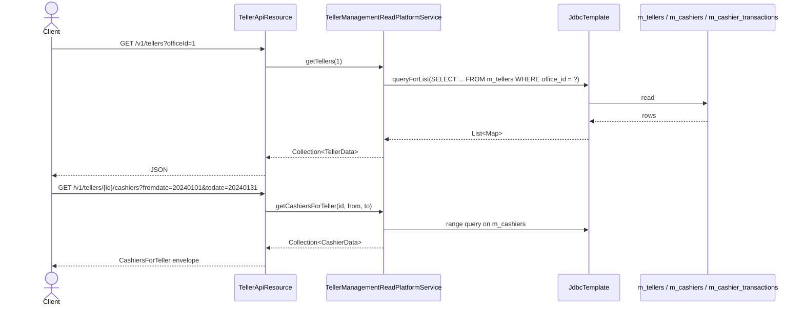
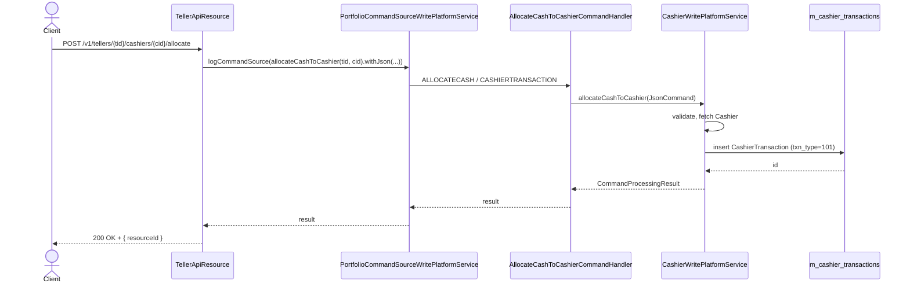

The Apache Fineract `fineract-branch` Gradle module is a small, self-contained slice of code under the `org.apache.fineract.organisation.teller` package that gives a branch (an `Office` in Fineract terminology) the ability to define **tellers** (physical or logical cash points), assign **cashiers** (members of staff) to those tellers for date / time windows, and record **cashier transactions** that allocate cash to a cashier at the start of a shift and settle the float back to the teller at the end. This page is the entry point for the wiki sub-section on that subsystem.

<Info>
All teller and cashier code now lives in `fineract-branch` — the older monolithic location under `fineract-provider` has been folded into this module. The package root is `org.apache.fineract.organisation.teller` with sub-packages `api`, `data`, `domain`, `domain.model`, `exception`, `handler`, `serialization`, `service`, and `util`.
</Info>

## Where teller code lives

```text
fineract-branch/src/main/java/org/apache/fineract/organisation/teller
├── api
│   ├── CashierApiResource.java                 ─ /v1/cashiers
│   ├── TellerApiResource.java                  ─ /v1/tellers
│   ├── TellerApiResourceSwagger.java           ─ OpenAPI request / response schemas
│   └── TellerJournalApiResource.java           ─ /v1/cashiersjournal
├── data
│   ├── TellerData.java                         ─ DTO for m_tellers
│   ├── CashierData.java                        ─ DTO for m_cashiers
│   ├── CashierTransactionData.java             ─ DTO for m_cashier_transactions
│   ├── CashierTransactionTypeTotalsData.java   ─ Allocate / Settle totals per currency
│   ├── CashierTransactionsWithSummaryData.java ─ Paged page + summary
│   ├── CashierTransactionDataValidator.java    ─ JSON command validator
│   ├── TellerJournalData.java                  ─ Daily balance roll-up
│   └── TellerTransactionData.java              ─ Posted client / loan / savings txn
├── domain
│   ├── Teller.java                             ─ @Entity m_tellers
│   ├── TellerRepository.java                   ─ Spring Data JPA
│   ├── TellerRepositoryWrapper.java            ─ findOneWithNotFoundDetection wrapper
│   ├── TellerStatus.java                       ─ PENDING / ACTIVE / INACTIVE / CLOSED
│   ├── Cashier.java                            ─ @Entity m_cashiers
│   ├── CashierRepository.java
│   ├── CashierRepositoryWrapper.java
│   ├── CashierTransaction.java                 ─ @Entity m_cashier_transactions
│   ├── CashierTransactionRepository.java
│   ├── CashierTxnType.java                     ─ 101 ALLOCATE / 102 SETTLE / 103 IN / 104 OUT
│   ├── TellerJournal.java                      ─ marker (read-only view, no rows owned)
│   ├── TellerTransaction.java                  ─ @Entity m_teller_transactions
│   └── TellerTransactionRepository.java
├── domain/model
│   ├── CashiersForTeller.java                  ─ List-cashiers response envelope
│   └── request/{TellerRequest, CashierRequest, CashierTransactionRequest}.java
├── exception
│   ├── TellerNotFoundException.java
│   ├── CashierNotFoundException.java
│   ├── CashierAlreadyAllocated.java
│   ├── CashierExistForTellerException.java
│   ├── CashierDateRangeOutOfTellerDateRangeException.java
│   ├── CashierInsufficientAmountException.java
│   └── InvalidDateInputException.java
├── handler
│   ├── CreateTellerCommandHandler.java         ─ TELLER  / CREATE
│   ├── UpdateTellerCommandHandler.java         ─ TELLER  / UPDATE
│   ├── DeleteTellerCommandHandler.java         ─ TELLER  / DELETE
│   ├── AllocateCashierToTellerCommandHandler.java        ─ CASHIER / CREATE
│   ├── UpdateCashierAllocationCommandHandler.java        ─ CASHIER / UPDATE
│   ├── DeleteCashierAllocationCommandHandler.java        ─ CASHIER / DELETE
│   ├── ModifyCashierCommandHandler.java
│   ├── AllocateCashToCashierCommandHandler.java          ─ ALLOCATECASH
│   ├── SettleCashFromCashierCommandHandler.java          ─ SETTLECASH
│   └── CreateTellerTransactionCommandHandler.java
├── serialization
│   └── TellerCommandFromApiJsonDeserializer.java         ─ JSON → JsonCommand
├── service
│   ├── TellerManagementReadPlatformService.java          ─ JdbcTemplate-backed reads
│   ├── TellerWritePlatformService.java                   ─ create / update / delete teller
│   ├── CashierWritePlatformService.java                  ─ allocate / settle cash
│   └── TellerTransactionWritePlatformService.java
└── util
    └── DateRange.java                          ─ Parses ?dateRange=START_DATE_END_DATE
```

## Concept map

```mermaid
flowchart LR
    OFFICE[Office\nm_office]
    STAFF[Staff\nm_staff]
    TELLER[Teller\nm_tellers\n+ status\n+ debit/credit GL]
    CASHIER[Cashier\nm_cashiers\n+ staff_id, teller_id\n+ start_date, end_date\n+ full_day or hh:mm window]
    CASHTXN[CashierTransaction\nm_cashier_transactions\n+ txn_type 101 / 102 / 103 / 104\n+ txn_amount, currency_code\n+ entity_type, entity_id]
    TELLERTXN[TellerTransaction\nm_teller_transactions\n+ client_id, amount, posting_date]
    GL[GLAccount\nacc_gl_account\n(debit / credit float)]

    OFFICE -->|1..N| TELLER
    TELLER -->|0..N| CASHIER
    STAFF -->|0..N| CASHIER
    CASHIER -->|0..N| CASHTXN
    TELLER -->|0..N| TELLERTXN
    TELLER -->|0..2| GL
```

A `Teller` is owned by exactly one `Office` and may have at most one debit GL account and one credit GL account (used by accounting when the teller posts a customer transaction). A `Cashier` row links a `Staff` member to a `Teller` for a contiguous `[start_date, end_date]` window — either full day or with an `hh:mm` time slice. Each `CashierTransaction` records a cash movement against that cashier: 101 (Allocate Cash from teller → cashier), 102 (Settle Cash back to teller), 103 (Cash In, e.g. a deposit by a client), 104 (Cash Out, e.g. a withdrawal).

## Data flow per use case

The branch module has three primary use cases that exercise different combinations of the components above.

| Use case | Trigger | Tables touched | Handler chain |
| --- | --- | --- | --- |
| **Branch setup** | Operations team creates a teller for a new branch office and assigns the cash GLs. | `m_tellers` (insert) | `CreateTellerCommandHandler` → `TellerWritePlatformService.createTeller` → `Teller.fromJson` → `TellerRepositoryWrapper.save`. |
| **Daily shift start** | Branch manager allocates a cashier (staff member) to a teller and then allocates cash to that cashier. | `m_cashiers` (insert), `m_cashier_transactions` (insert with `txn_type=101`) | `AllocateCashierToTellerCommandHandler` followed by `AllocateCashToCashierCommandHandler`. |
| **Daily shift end** | Branch manager settles the cashier's float back to the teller drawer. | `m_cashier_transactions` (insert with `txn_type=102`) | `SettleCashFromCashierCommandHandler` → `CashierWritePlatformService.settleCashFromCashier` (which first verifies `netCash >= settleAmount`). |

The journal endpoints aggregate the resulting `m_cashier_transactions` rows into daily roll-ups — no separate journal table is maintained.

## REST surface at a glance

| Resource | Path | JAX-RS class | What it does |
| --- | --- | --- | --- |
| Tellers | `/v1/tellers` | `TellerApiResource` | CRUD on `Teller`, plus nested cashier and cashier-transaction routes. |
| Cashiers (lookup) | `/v1/cashiers` | `CashierApiResource` | Find the cashier(s) on duty for an office / teller / staff on a given date. |
| Cashier journal | `/v1/cashiersjournal` | `TellerJournalApiResource` | Daily balance roll-up across office / teller / cashier in a date range. |

`TellerApiResource` is the workhorse — it hosts not only the teller endpoints but every nested cashier and cashier-transaction endpoint (`{tellerId}/cashiers/...`). There is no separate `TellerManagementApiResource`; the read methods are served by [`TellerManagementReadPlatformService`](teller-and-cashier-domain) and exposed through `TellerApiResource`.

## Command pattern integration

All writes go through Fineract's [command framework](/command/overview). The relevant `CommandWrapperBuilder` factory methods are:

| Builder method | Action | URL it backs |
| --- | --- | --- |
| `createTeller()` | `TELLER` / `CREATE` | `POST /v1/tellers` |
| `updateTeller(id)` | `TELLER` / `UPDATE` | `PUT /v1/tellers/{tellerId}` |
| `deleteTeller(id)` | `TELLER` / `DELETE` | `DELETE /v1/tellers/{tellerId}` |
| `allocateTeller(tellerId)` | `CASHIER` / `CREATE` | `POST /v1/tellers/{tellerId}/cashiers` |
| `updateAllocationTeller(tellerId, cashierId)` | `CASHIER` / `UPDATE` | `PUT /v1/tellers/{tellerId}/cashiers/{cashierId}` |
| `deleteAllocationTeller(tellerId, cashierId)` | `CASHIER` / `DELETE` | `DELETE /v1/tellers/{tellerId}/cashiers/{cashierId}` |
| `allocateCashToCashier(tellerId, cashierId)` | `ALLOCATECASH` / `CASHIERTRANSACTION` | `POST .../allocate` |
| `settleCashFromCashier(tellerId, cashierId)` | `SETTLECASH` / `CASHIERTRANSACTION` | `POST .../settle` |

Every handler is a `@CommandType` annotated class that translates the `JsonCommand` into the appropriate domain method on the service.

## Permissions

The teller and cashier endpoints are protected by the standard Fineract permission model. Each command-handler combination maps to a permission code that the caller's role must grant. Typical codes:

| Code | Endpoint(s) |
| --- | --- |
| `CREATE_TELLER` | `POST /v1/tellers` |
| `UPDATE_TELLER` | `PUT /v1/tellers/{id}` |
| `DELETE_TELLER` | `DELETE /v1/tellers/{id}` |
| `CREATE_CASHIER` | `POST /v1/tellers/{id}/cashiers` |
| `UPDATE_CASHIER` | `PUT /v1/tellers/{id}/cashiers/{cashierId}` |
| `DELETE_CASHIER` | `DELETE /v1/tellers/{id}/cashiers/{cashierId}` |
| `ALLOCATECASH_CASHIERTRANSACTION` | `POST .../allocate` |
| `SETTLECASH_CASHIERTRANSACTION` | `POST .../settle` |
| `READ_TELLER` / `READ_CASHIER` | GET endpoints |

The corresponding `*_CHECKER` permission codes apply when the maker / checker workflow is enabled.

## Reading flow



`TellerManagementReadPlatformService` is implemented with raw `JdbcTemplate` for performance and to project the joined `office_name`, `staff_name`, currency totals, etc. that the UI needs without traversing the JPA graph.

## Exception hierarchy

All branch-module exceptions extend either `AbstractPlatformResourceNotFoundException` (404) or `AbstractPlatformDomainRuleException` (400 / 409):

```text
AbstractPlatformResourceNotFoundException
├── TellerNotFoundException
└── CashierNotFoundException

AbstractPlatformDomainRuleException
├── CashierAlreadyAllocated
├── CashierExistForTellerException
├── CashierDateRangeOutOfTellerDateRangeException
├── CashierInsufficientAmountException
└── InvalidDateInputException
```

Each carries an `error.msg.*` message key that the global exception mapper renders into the standard `ApiGlobalErrorResponse` JSON envelope. Subscribers to `@ExceptionMapper` for these types can localise the messages by providing alternative resource bundle entries under `application_messages.properties`.

## Writing flow (allocate cash example)



`PortfolioCommandSourceWritePlatformService.logCommandSource` is the single entrypoint for all teller writes; it persists the JSON command source, dispatches the handler, and returns a `CommandProcessingResult`.

## Read service implementation

`TellerManagementReadPlatformService` (interface) and its implementation are the single read-side surface for the whole branch module. The interface methods include:

```java
Collection<TellerData> getTellers(Long officeId);
TellerData findTeller(Long tellerId);
CashierData findCashier(Long cashierId);
CashierData retrieveCashierTemplate(Long officeId, Long tellerId, boolean staffInSelectedOfficeOnly);
CashierTransactionData retrieveCashierTxnTemplate(Long cashierId);
Collection<CashierData> getCashiersForTeller(Long tellerId, LocalDate fromDate, LocalDate toDate);
Collection<CashierData> getCashierData(Long officeId, Long tellerId, Long staffId, LocalDate date);
Collection<TellerJournalData> getJournals(Long officeId, Long tellerId, Long cashierId, LocalDate dateFrom, LocalDate dateTo);
Collection<TellerJournalData> fetchTellerJournals(Long tellerId, Long cashierId, LocalDate fromDate, LocalDate toDate);
Page<CashierTransactionData> retrieveCashierTransactions(Long cashierId, boolean includeAllTellers,
        LocalDate fromDate, LocalDate toDate, String currencyCode, SearchParameters searchParameters);
CashierTransactionsWithSummaryData retrieveCashierTransactionsWithSummary(Long cashierId, boolean includeAllTellers,
        LocalDate fromDate, LocalDate toDate, String currencyCode, SearchParameters searchParameters);
Collection<TellerTransactionData> fetchTellerTransactionsByTellerId(Long tellerId, LocalDate fromDate, LocalDate toDate);
TellerTransactionData findTellerTransaction(Long transactionId);
```

The implementation uses raw `JdbcTemplate` rather than JPA — it issues hand-written SQL that joins `m_tellers`, `m_cashiers`, `m_cashier_transactions`, `m_staff`, `m_office`, `m_organisation_currency`, etc., and maps each row with a `RowMapper`. This trades JPA convenience for predictable plans and the ability to project precisely the fields the UI needs.

## Database tables

| Table | Bound entity | Notes |
| --- | --- | --- |
| `m_tellers` | `Teller` | Unique `name`, FK to `m_office`. Optional `debit_account_id` / `credit_account_id` on `acc_gl_account`. `state` stores `TellerStatus.value`. |
| `m_cashiers` | `Cashier` | Unique on `(staff_id, teller_id)`. Window is `[start_date, end_date]`. `full_day` flag, `start_time` / `end_time` (`HH:MM`). |
| `m_cashier_transactions` | `CashierTransaction` | `txn_type` is one of `CashierTxnType` (101/102/103/104). Optional `entity_type` + `entity_id` to link to a client/loan/savings transaction. `currency_code` per row. |
| `m_teller_transactions` | `TellerTransaction` | Posted client transaction attributed to a teller. |

## Command handlers in detail

| Handler class | `@CommandType(entity, action)` | What it invokes |
| --- | --- | --- |
| `CreateTellerCommandHandler` | `TELLER` / `CREATE` | `TellerWritePlatformService.createTeller(JsonCommand)` |
| `UpdateTellerCommandHandler` | `TELLER` / `UPDATE` | `TellerWritePlatformService.modifyTeller(JsonCommand)` |
| `DeleteTellerCommandHandler` | `TELLER` / `DELETE` | `TellerWritePlatformService.deleteTeller(Long)` |
| `AllocateCashierToTellerCommandHandler` | `CASHIER` / `CREATE` | `CashierWritePlatformService.createCashier(...)` |
| `UpdateCashierAllocationCommandHandler` | `CASHIER` / `UPDATE` | `CashierWritePlatformService.updateCashier(...)` |
| `DeleteCashierAllocationCommandHandler` | `CASHIER` / `DELETE` | `CashierWritePlatformService.deleteCashier(Long)` |
| `ModifyCashierCommandHandler` | `CASHIER` / `MODIFY` | Variant edit path. |
| `AllocateCashToCashierCommandHandler` | `ALLOCATECASH` / `CASHIERTRANSACTION` | `CashierWritePlatformService.allocateCashToCashier(...)` |
| `SettleCashFromCashierCommandHandler` | `SETTLECASH` / `CASHIERTRANSACTION` | `CashierWritePlatformService.settleCashFromCashier(...)` |
| `CreateTellerTransactionCommandHandler` | `CREATE` / `TELLERTRANSACTION` | `TellerTransactionWritePlatformService.createTellerTransaction(...)` |

Each handler is a tiny `@Component` annotated `@CommandType(entity = "...", action = "...")` whose `processCommand(JsonCommand)` body is a one-line delegation. Discovery is done at startup by `CommandHandlerProvider`, which builds a lookup table keyed on `(entity, action)`.

The `CommandWrapperBuilder` fluent calls also stamp the URL recorded on `m_portfolio_command_source.resource_url`, which is useful for re-playing failed commands and building audit dashboards from the command history table.

## Validators

Two `*DataValidator` classes guard the JSON payloads before they reach domain methods:

- `TellerCommandFromApiJsonDeserializer.validateForCreate/Update/Delete(String json)` — runs on `POST /v1/tellers` and `PUT /v1/tellers/{id}`. Uses `JsonHelper` to assert `name`, `officeId`, `startDate`, `status` are present; the inbound JSON is restricted to a whitelist of parameter names via `unsupportedParameters` checking.
- `CashierTransactionDataValidator.validateForAllocateCashier/SettleCashier(JsonCommand)` — gates cash-allocate / cash-settle payloads. Enforces non-blank `txnDate`, positive `txnAmount`, non-blank `currencyCode`, and runs the cross-entity date-range check that catches `CashierDateRangeOutOfTellerDateRangeException`.

Both validators throw `PlatformApiDataValidationException` on failure, which is rendered as HTTP 400 with a structured body listing each failed parameter.

## Audit and lifecycle hooks

Unlike newer Fineract modules, the branch subsystem does not publish business events on its writes — no `TellerCreatedBusinessEvent`, `CashierAllocatedBusinessEvent`, etc. exists. Auditing relies on the standard command-source persistence: every write goes through `PortfolioCommandSourceWritePlatformService.logCommandSource(...)` which records the raw JSON command in `m_portfolio_command_source` before the handler runs. Operators that need a richer event stream can subscribe at the database level (CDC on `m_cashier_transactions`) or extend the handlers to emit custom events.

## Where to go next

- **[Teller and Cashier Domain](teller-and-cashier-domain)** — the `Teller`, `Cashier`, `CashierTransaction`, and `TellerStatus` entities in detail.
- **[Teller API](teller-api)** — `TellerApiResource` endpoints with request and response shapes.
- **[Cashier API](cashier-api)** — POST cashier, allocate cash, settle cash flows.
- **[Teller Journal API](teller-journal-api)** — `TellerJournalApiResource` and journal queries.
- See also: [Organisation / Offices](/organisation/offices), [Portfolio / Clients](/portfolio/clients), [API / Teller APIs](/api/teller-apis).
