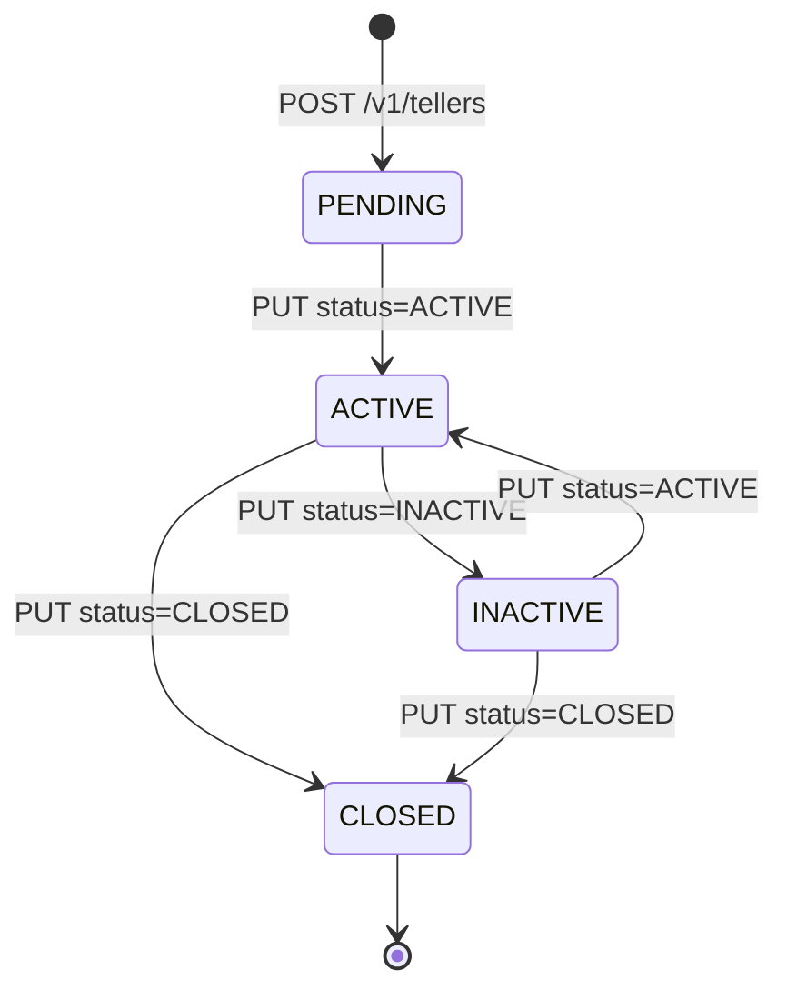

The Apache Fineract branch module models a small but rich domain: the **Teller** is a logical cash point owned by an `Office`, the **Cashier** is an assignment of a `Staff` member to a teller for a date window, and the **CashierTransaction** is every cash movement that happens against that cashier (allocation, settlement, in-flows, out-flows). This page walks the four core JPA classes — `Teller`, `Cashier`, `CashierTransaction`, and `TellerStatus` — column-by-column, with the database tables and lifecycle rules they enforce. Companion entities `TellerTransaction` and `TellerJournal` are covered at the end.

<Info>
All four entities extend `org.apache.fineract.infrastructure.core.domain.AbstractPersistableCustom<Long>`, so they share Fineract's standard `Long` primary key, audit columns (`created_by`, `created_on_utc`, `last_modified_by`, `last_modified_on_utc`), and optimistic-lock `version`. Every entity uses Lombok `@Getter @Setter @NoArgsConstructor @AllArgsConstructor @Accessors(chain = true)` so call sites read as fluent setters.
</Info>

## Teller

`Teller` (`m_tellers`) is a per-office cash position with an optional debit/credit GL pair.

```java
@Entity
@Table(name = "m_tellers", uniqueConstraints = {
        @UniqueConstraint(name = "ux_tellers_name", columnNames = { "name" }) })
public class Teller extends AbstractPersistableCustom<Long> {

    @ManyToOne(fetch = FetchType.LAZY)
    @JoinColumn(name = "office_id", nullable = false)
    private Office office;

    @ManyToOne(fetch = FetchType.EAGER)
    @JoinColumn(name = "debit_account_id", nullable = true)
    private GLAccount debitAccount;

    @ManyToOne(fetch = FetchType.EAGER)
    @JoinColumn(name = "credit_account_id", nullable = true)
    private GLAccount creditAccount;

    @Column(name = "name", nullable = false, length = 100)
    private String name;

    @Column(name = "description", nullable = true, length = 500)
    private String description;

    @Column(name = "valid_from", nullable = true)
    private LocalDate startDate;

    @Column(name = "valid_to", nullable = true)
    private LocalDate endDate;

    @Column(name = "state", nullable = false)
    private Integer status;            // TellerStatus.value

    @OneToMany(mappedBy = "teller", fetch = FetchType.LAZY)
    private Set<Cashier> cashiers;
}
```

### Columns

| Column | Java field | Type | Notes |
| --- | --- | --- | --- |
| `id` | `id` (inherited) | bigint | PK from `AbstractPersistableCustom`. |
| `office_id` | `office` | bigint FK → `m_office` | Owning branch. Required. |
| `debit_account_id` | `debitAccount` | bigint FK → `acc_gl_account` | Optional. Used when accounting books a teller debit. |
| `credit_account_id` | `creditAccount` | bigint FK → `acc_gl_account` | Optional. Symmetric credit leg. |
| `name` | `name` | varchar(100) | **Unique** across all offices (`ux_tellers_name`). |
| `description` | `description` | varchar(500) | Free text. |
| `valid_from` | `startDate` | date | When the teller becomes operable. |
| `valid_to` | `endDate` | date | When the teller is decommissioned. May be null. |
| `state` | `status` | int | Maps to `TellerStatus`. |

### `Teller.fromJson` and `update`

The static factory `Teller.fromJson(Office, JsonCommand)` is called from `TellerWritePlatformService` when handling `POST /v1/tellers`. It reads `name`, `description`, `startDate`, `endDate`, and `status` (integer) from the JSON command and builds a new `Teller`. The `Integer status` is round-tripped through `TellerStatus.fromInt`.

```java
public static Teller fromJson(final Office tellerOffice, final JsonCommand command) {
    final String name = command.stringValueOfParameterNamed("name");
    final String description = command.stringValueOfParameterNamed("description");
    final LocalDate startDate = command.localDateValueOfParameterNamed("startDate");
    final LocalDate endDate = command.localDateValueOfParameterNamed("endDate");
    final Integer tellerStatusInt = command.integerValueOfParameterNamed("status");
    final TellerStatus status = TellerStatus.fromInt(tellerStatusInt);

    return new Teller().setOffice(tellerOffice).setName(name).setDescription(description)
            .setStartDate(startDate).setEndDate(endDate).setStatus(status.getValue());
}
```

`Teller.update(Office, JsonCommand)` is the dirty-checking update used by `PUT /v1/tellers/{tellerId}`. It returns a `Map<String, Object>` of changed parameters that flows into `CommandProcessingResult.changesOnly`. Each `if (command.isChangeIn*Parameter…)` block only sets the field when the inbound value differs from the persisted one — this is the standard Fineract pattern. Date fields additionally seed `dateFormat` and `locale` into the response map so callers can echo them back.

### `initializeLazyCollections`

```java
public void initializeLazyCollections() {
    this.office.getId();
    this.cashiers.size();
}
```

Called from read-time services to force-fetch the lazy `Office` proxy and the `cashiers` set before the session closes. Without it, downstream serialization would hit `LazyInitializationException`.

## TellerStatus

```java
public enum TellerStatus {
    INVALID(0, "tellerStatusType.invalid"),
    PENDING(100, "tellerStatusType.pending"),
    ACTIVE(300, "tellerStatusType.active"),
    INACTIVE(400, "tellerStatusType.inactive"),
    CLOSED(600, "tellerStatusType.closed");
}
```

| Constant | Value | Meaning |
| --- | --- | --- |
| `INVALID` | 0 | Sentinel — `fromInt` returns this when the integer is unknown. Never persisted; rejected by the update path which checks `status != INVALID` before assigning. |
| `PENDING` | 100 | Teller created but not yet in service. |
| `ACTIVE` | 300 | In service — can accept allocations and post transactions. |
| `INACTIVE` | 400 | Temporarily suspended. |
| `CLOSED` | 600 | Permanently retired. Should have an `endDate`. |

Status helpers `isPending()`, `isActive()`, `isClosed()`, `isInactive()`, and `hasStateOf(TellerStatus)` make conditional logic readable. The integer gap (100 increments) is deliberate to leave room for future intermediate states.

## Cashier

`Cashier` (`m_cashiers`) is a many-to-one assignment of `Staff` to `Teller` over a `[start_date, end_date]` window.

```java
@Entity
@Table(name = "m_cashiers", uniqueConstraints = {
        @UniqueConstraint(name = "ux_cashiers_staff_teller",
                          columnNames = { "staff_id", "teller_id" }) })
public class Cashier extends AbstractPersistableCustom<Long> {

    @Transient
    private Office office;                       // populated post-load

    @ManyToOne(fetch = FetchType.LAZY)
    @JoinColumn(name = "staff_id",  nullable = false) private Staff staff;
    @ManyToOne(fetch = FetchType.LAZY)
    @JoinColumn(name = "teller_id", nullable = false) private Teller teller;

    @Column(name = "description", length = 500) private String description;
    @Column(name = "start_date",  nullable = false) private LocalDate startDate;
    @Column(name = "end_date",    nullable = false) private LocalDate endDate;

    @Column(name = "full_day")          private Boolean isFullDay;
    @Column(name = "start_time", length = 10) private String startTime;   // "HH:MM"
    @Column(name = "end_time",   length = 10) private String endTime;
}
```

### Window semantics

- `isFullDay = true` → the cashier covers the whole calendar day; `startTime` / `endTime` may be null.
- `isFullDay = false` → both `startTime` and `endTime` are required, in `HH:MM` format. The class persists them as plain strings; arithmetic helpers `getHourFromStartTime()` / `getMinFromStartTime()` / `getHourFromEndTime()` / `getMinFromEndTime()` parse them on demand using a `:` splitter.

### Uniqueness

`ux_cashiers_staff_teller` forbids two open assignments of the same `Staff` to the same `Teller`. To rotate a staff member, the existing `Cashier` row must be deleted (or its window closed and a new row created with a different teller). The validation that the cashier's date range stays within the teller's `valid_from` / `valid_to` window is enforced by `CashierTransactionDataValidator` and surfaces as `CashierDateRangeOutOfTellerDateRangeException`.

### Lifecycle hooks

- `Cashier.fromJson(Office, Teller, Staff, startTime, endTime, JsonCommand)` — constructor for `POST /v1/tellers/{tellerId}/cashiers`. `startTime` / `endTime` are pre-formatted "HH:MM" strings produced by the write service from the inbound `hourStartTime`, `minStartTime`, `hourEndTime`, `minEndTime` integers.
- `Cashier.update(JsonCommand)` — dirty-checking update. When `isFullDay` flips back to `false`, it reconstructs `startTime` / `endTime` from the four integer fields and prefixes single-digit `"0"` with another `"0"` so output always uses two digits.

### Exceptions

| Exception | When it is raised |
| --- | --- |
| `CashierNotFoundException` | `findOneWithNotFoundDetection(id)` on `CashierRepositoryWrapper` returns nothing. |
| `CashierAlreadyAllocated` | Attempting to allocate when this staff already has an overlapping open assignment. |
| `CashierExistForTellerException` | Trying to delete a teller that still has cashiers attached. |
| `CashierDateRangeOutOfTellerDateRangeException` | The cashier's `[start_date, end_date]` is not fully inside the teller's `[valid_from, valid_to]`. |
| `CashierInsufficientAmountException` | Settle attempt exceeds the cashier's net balance. |
| `InvalidDateInputException` | Date string fails parsing. |

## CashierTxnType

`CashierTxnType` is the discriminator for `CashierTransaction.txnType`. Unlike a Java `enum`, it is a final class with static singletons so that downstream serialization preserves `{ id, value }` shape.

```java
public static final CashierTxnType ALLOCATE         = new CashierTxnType(101, "Allocate Cash");
public static final CashierTxnType SETTLE           = new CashierTxnType(102, "Settle Cash");
public static final CashierTxnType INWARD_CASH_TXN  = new CashierTxnType(103, "Cash In");
public static final CashierTxnType OUTWARD_CASH_TXN = new CashierTxnType(104, "Cash Out");
```

| Id | Constant | Semantic | Sign on cashier float |
| --- | --- | --- | --- |
| 101 | `ALLOCATE` | Cash moved from the teller's drawer to the cashier at start of shift. | +amount |
| 102 | `SETTLE` | Cash returned from the cashier to the teller at end of shift. | −amount |
| 103 | `INWARD_CASH_TXN` | Cashier receives cash from a client (e.g. loan repayment, savings deposit). | +amount |
| 104 | `OUTWARD_CASH_TXN` | Cashier pays cash to a client (e.g. loan disbursement, savings withdrawal). | −amount |

`CashierTxnType.getCashierTxnType(Integer)` does the reverse lookup; unknown ids return `null`.

## CashierTransaction

```java
@Entity
@Table(name = "m_cashier_transactions")
public class CashierTransaction extends AbstractPersistableCustom<Long> {

    @Transient private Office office;          // populated post-load
    @Transient private Teller teller;          // populated post-load

    @ManyToOne(fetch = FetchType.LAZY)
    @JoinColumn(name = "cashier_id", nullable = false)
    private Cashier cashier;

    @Column(name = "txn_type",   nullable = false) private Integer txnType;
    @Column(name = "txn_date",   nullable = false) private LocalDate txnDate;
    @Column(name = "txn_amount", scale = 6, precision = 19, nullable = false)
    private BigDecimal txnAmount;
    @Column(name = "txn_note")     private String txnNote;
    @Column(name = "entity_type")  private String entityType;   // "client" / "loan" / "savings" / "groups"
    @Column(name = "entity_id")    private Long   entityId;
    @Column(name = "created_date", nullable = false)
    private LocalDateTime createdDate = DateUtils.getLocalDateTimeOfSystem();
    @Column(name = "currency_code") private String currencyCode;
}
```

### Field semantics

| Column | Purpose |
| --- | --- |
| `cashier_id` | The cashier whose float is being moved. |
| `txn_type` | One of `CashierTxnType` (101 / 102 / 103 / 104). |
| `txn_date` | Business date the cash physically moved. |
| `txn_amount` | Positive `BigDecimal`. Sign is implied by `txn_type`. Precision `19,6` aligns with the rest of Fineract money columns. |
| `txn_note` | Free text — the API surfaces this as `notes` / `comments`. |
| `entity_type` + `entity_id` | Optional back-link. When a savings deposit creates an inward cash transaction (103), `entity_type='savings'` and `entity_id` is the savings transaction id. |
| `created_date` | Server-side timestamp, defaulted on construction via `DateUtils.getLocalDateTimeOfSystem()` (returns the system clock at the configured Fineract timezone). |
| `currency_code` | ISO currency code. Allocation / settlement is tracked per currency. |

### `CashierTransaction.fromJson`

```java
public static CashierTransaction fromJson(final Cashier cashier, final JsonCommand command) {
    final Integer txnType    = command.integerValueOfParameterNamed("txnType");
    final BigDecimal amount  = command.bigDecimalValueOfParameterNamed("txnAmount");
    final LocalDate txnDate  = command.localDateValueOfParameterNamed("txnDate");
    final String entityType  = command.stringValueOfParameterNamed("entityType");
    final String txnNote     = command.stringValueOfParameterNamed("txnNote");
    final Long entityId      = command.longValueOfParameterNamed("entityId");
    final String currency    = command.stringValueOfParameterNamed("currencyCode");
    return new CashierTransaction().setCashier(cashier).setTxnType(txnType).setTxnAmount(amount)
            .setTxnDate(txnDate).setEntityType(entityType).setEntityId(entityId).setTxnNote(txnNote)
            .setCurrencyCode(currency);
}
```

The write services for `/v1/tellers/{tellerId}/cashiers/{cashierId}/allocate` and `…/settle` overwrite `txnType` with `CashierTxnType.ALLOCATE.id` (101) and `SETTLE.id` (102) respectively, so the caller's payload only needs `txnDate`, `txnAmount`, `txnNote`, and `currencyCode`. The full `fromJson` path is exercised by lower-level integrations that book 103 / 104 in-flows and out-flows triggered by loan / savings transactions.

### `update`

Identical dirty-checking pattern to `Teller.update`. It allows in-place edits to `txnType`, `txnDate`, `txnAmount`, `txnNote`, and `currencyCode`, but **not** to the `cashier` link itself — to move a transaction between cashiers the row must be deleted and re-inserted.

## TellerTransaction

```java
@Entity
@Table(name = "m_teller_transactions")
public class TellerTransaction extends AbstractPersistableCustom<Long> {

    @ManyToOne(fetch = FetchType.LAZY) @JoinColumn(name = "office_id",  nullable = false) private Office  office;
    @ManyToOne(fetch = FetchType.LAZY) @JoinColumn(name = "teller_id",  nullable = false) private Teller  teller;
    @ManyToOne(fetch = FetchType.LAZY) @JoinColumn(name = "cashier_id", nullable = false) private Cashier cashier;
    @ManyToOne(fetch = FetchType.LAZY) @JoinColumn(name = "client_id",  nullable = false) private Client  client;

    @Column(name = "type",        nullable = false) private Integer   type;
    @Column(name = "amount",      nullable = false) private Double    amount;
    @Column(name = "posting_date",nullable = false) private LocalDate postingDate;
}
```

`TellerTransaction` records a single posted client transaction attributed to a particular `(office, teller, cashier, client)` quadruple. It is **not** the same as a `CashierTransaction` — the latter is about cash movement on the cashier float, the former is about the customer-facing book. `type` is an integer that maps to a small enum in the read-side projection and `amount` is — for historical reasons — a `Double` rather than `BigDecimal`. New code should prefer the `CashierTransaction` linkage via `entity_type` + `entity_id`.

## TellerJournal

```java
public class TellerJournal {}
```

A deliberately empty marker class. The journal in Fineract is a **read-only roll-up** produced by `TellerManagementReadPlatformService.getJournals` and `fetchTellerJournals`, both of which return `Collection<TellerJournalData>` — see [Teller Journal API](/branch/teller-journal-api).

## Repositories

| Repository | Methods of note |
| --- | --- |
| `TellerRepository` | Standard Spring Data `JpaRepository<Teller, Long>` plus `findByOffice(Office)`. |
| `TellerRepositoryWrapper` | `findOneWithNotFoundDetection(Long)` — throws `TellerNotFoundException` on miss; the canonical loader used by write services. |
| `CashierRepository` | Plus `findByStaffAndTeller(Staff, Teller)`. |
| `CashierRepositoryWrapper` | `findOneWithNotFoundDetection(Long)` — throws `CashierNotFoundException`. |
| `CashierTransactionRepository` | Plus paginated query for the transactions screen. |
| `TellerTransactionRepository` | Plus `findByTellerAndPostingDateBetween`. |

The `*Wrapper` indirection is Fineract's standard pattern for hiding the `findById(...).orElseThrow(...)` boilerplate behind a typed exception.

## Lifecycle summary



A teller may move freely between `ACTIVE` and `INACTIVE` and terminates in `CLOSED`. Cashier allocations and cash allocations are only valid against an `ACTIVE` teller.

## Cross-references

- [Branch overview](/branch/overview) — module map.
- [Teller API](/branch/teller-api) — REST surface that consumes these entities.
- [Cashier API](/branch/cashier-api) — allocate / settle endpoints.
- [Organisation / Offices](/organisation/offices) — the `Office` entity that owns a teller.
- [API / Teller APIs](/api/tellers) — the published REST reference.
