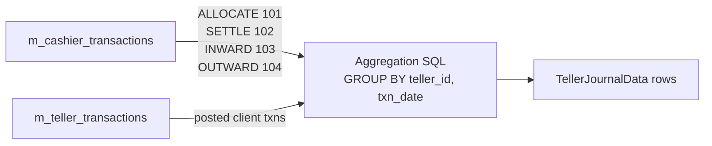

The Apache Fineract teller journal is a **read-only roll-up** of cashier and teller activity by day. There is no `m_teller_journal` table; instead, `TellerManagementReadPlatformService` computes the journal on demand from `m_cashier_transactions` and `m_teller_transactions` and projects it into `TellerJournalData`. Two endpoints surface that view: `/v1/cashiersjournal` (the flat, top-level form on `TellerJournalApiResource`) and `/v1/tellers/{tellerId}/journals` (the per-teller form hosted on `TellerApiResource`). This page documents both, the underlying data structures, and the date-range convention they share.

<Info>
The package contains a `TellerJournal` class — but it is an empty marker (`public class TellerJournal {}`). It exists for naming symmetry only. All journal data is read-only and is materialised at query time by the read platform service. There is no command framework footprint for journals.
</Info>

## Endpoint summary

| Method | Path | Purpose | Resource |
| --- | --- | --- | --- |
| `GET` | `/v1/cashiersjournal?officeId=&tellerId=&cashierId=&dateRange=` | Cross-office / cross-teller daily journal | `TellerJournalApiResource` |
| `GET` | `/v1/tellers/{tellerId}/journals?cashierId=&dateRange=` | Per-teller daily journal | `TellerApiResource` |

Both return `Collection<TellerJournalData>`. Filters compose with AND semantics; omitted filters mean "no restriction".

## TellerJournalApiResource

```java
@Path("/v1/cashiersjournal")
@Component
@Tag(name = "Cashier Journals")
@RequiredArgsConstructor
public class TellerJournalApiResource {

    private final TellerManagementReadPlatformService readPlatformService;

    @GET
    public Collection<TellerJournalData> getJournalData(
            @QueryParam("officeId")  final Long officeId,
            @QueryParam("tellerId")  final Long tellerId,
            @QueryParam("cashierId") final Long cashierId,
            @QueryParam("dateRange") final String dateRange) {
        final DateRange dateRangeHolder = DateRange.fromString(dateRange);
        return readPlatformService.getJournals(officeId, tellerId, cashierId,
                dateRangeHolder.getStartDate(), dateRangeHolder.getEndDate());
    }
}
```

| Query param | Type | Purpose |
| --- | --- | --- |
| `officeId` | Long | Restrict to a single branch (`m_office.id`). Optional. |
| `tellerId` | Long | Restrict to a single teller (`m_tellers.id`). Optional. |
| `cashierId` | Long | Restrict to a single cashier (`m_cashiers.id`). Optional. |
| `dateRange` | String | A `DateRange.fromString`-parseable string yielding `(startDate, endDate)`. Optional. |

Every parameter is optional. Without any filter the response is the entire cross-office journal for the configured default window. With all four, the response narrows to a single (office, teller, cashier) for the supplied date range.

## /v1/tellers/{tellerId}/journals — per-teller form

This endpoint is hosted on `TellerApiResource` for hierarchical URL convenience:

```java
@GET @Path("{tellerId}/journals")
public Collection<TellerJournalData> getJournalData(
        @PathParam("tellerId")  final Long tellerId,
        @QueryParam("cashierId") final Long cashierDate,   // misnamed variable
        @QueryParam("dateRange") final String dateRange) {
    final DateRange dateRangeHolder = DateRange.fromString(dateRange);
    return readPlatformService.fetchTellerJournals(
            tellerId, cashierDate,
            dateRangeHolder.getStartDate(), dateRangeHolder.getEndDate());
}
```

<Warning>
The Java parameter is named `cashierDate` for historical reasons but the query string key on the wire is `cashierId`. The value flows into `fetchTellerJournals(...)` as the cashier id filter. When writing client code, always send `?cashierId=…`.
</Warning>

The shape returned is identical to `/v1/cashiersjournal`. The per-teller form is preferred when the caller already has the teller id in hand — it avoids the extra `tellerId` query parameter and renders cleaner URLs.

## TellerJournalData

```java
@Data
@NoArgsConstructor
@AllArgsConstructor
@Accessors(chain = true)
public final class TellerJournalData implements Serializable {

    private Long      officeId;
    private Long      tellerId;
    private LocalDate day;
    private Double    openingBalance;
    private Double    settledBalance;
    private Double    closingBalance;
    private Double    sumReceipts;
    private Double    sumPayments;

    public static TellerJournalData instance(
            final Long officeId, final Long tellerId, final LocalDate day,
            final Double openingBalance, final Double settledBalance, final Double closingBalance,
            final Double sumReceipts, final Double sumPayments) { ... }
}
```

| Field | Source | Description |
| --- | --- | --- |
| `officeId` | `m_office.id` | The branch the row belongs to. |
| `tellerId` | `m_tellers.id` | The teller the row belongs to. |
| `day` | `m_cashier_transactions.txn_date` / `m_teller_transactions.posting_date` | The calendar day the row aggregates. One row per `(officeId, tellerId, day)` in the result set. |
| `openingBalance` | carry-over | Net cash float carried into `day` from the previous day. |
| `settledBalance` | sum of `txnType = 102` | Cash settled back to the teller drawer on `day`. |
| `closingBalance` | derived | `openingBalance + sumReceipts − sumPayments − settledBalance`. |
| `sumReceipts` | sum of `txnType = 103` | Cash received by cashiers on `day` (deposits, repayments). |
| `sumPayments` | sum of `txnType = 104` | Cash paid out by cashiers on `day` (withdrawals, disbursements). |

The field types are deliberately `Double`, not `BigDecimal` — this matches the historical `m_teller_transactions.amount` column.

## Permissions

The two journal endpoints are read-only and require a single permission code:

| Code | Endpoint |
| --- | --- |
| `READ_TELLER` | Both `GET /v1/cashiersjournal` and `GET /v1/tellers/{tellerId}/journals` |

The maker / checker workflow does not apply to reads, so no `_CHECKER` variant exists. Operators typically grant `READ_TELLER` to the same roles that hold `READ_CASHIER` since the two reports are usually consulted together.

## DateRange parsing

The `dateRange` query parameter is parsed by `org.apache.fineract.organisation.teller.util.DateRange`:

```java
public static DateRange fromString(final String dateRange) { ... }
public LocalDate getStartDate();
public LocalDate getEndDate();
```

It accepts string formats used by the legacy community-app date picker (typically a pair of ISO dates joined by a separator, or a relative keyword such as `today` / `thisWeek` / `thisMonth`). When the parameter is absent or unparseable, `DateRange.fromString` defaults to the current business day.

| `dateRange` value | Resolved window |
| --- | --- |
| `"today"` | `[businessDate, businessDate]` |
| `"yesterday"` | `[businessDate − 1, businessDate − 1]` |
| `"20240101_20240131"` | `[2024-01-01, 2024-01-31]` |
| `null` | `[businessDate, businessDate]` |

## Currency handling

Unlike `CashierTransactionData`, `TellerJournalData` does **not** carry a `currencyCode` field. The journal aggregates **across currencies** for a given day. This is a deliberate simplification — most deployments operate in a single currency, so cross-currency netting on a single row is meaningful. Multi-currency deployments should either:

1. Issue separate journal queries filtered by inspecting the `cashierTxnTypeTotals` of the per-cashier summary endpoint (`GET /v1/tellers/{id}/cashiers/{cid}/summaryandtransactions?currencyCode=XYZ`), or
2. Use the lower-level `m_cashier_transactions` table directly through a custom report.

There is no plan in the current code to add a per-currency journal projection.

## How the journal is computed



The aggregation query — implemented in `TellerManagementReadPlatformService.getJournals` and `fetchTellerJournals` — joins `m_cashier_transactions` to `m_cashiers` to `m_tellers` to `m_office`, applies the filter predicates from the query parameters, and groups by `(office_id, teller_id, txn_date)`.

For each group it computes:

```sql
SUM(CASE WHEN ct.txn_type = 103 THEN ct.txn_amount ELSE 0 END) AS sum_receipts,
SUM(CASE WHEN ct.txn_type = 104 THEN ct.txn_amount ELSE 0 END) AS sum_payments,
SUM(CASE WHEN ct.txn_type = 102 THEN ct.txn_amount ELSE 0 END) AS settled_balance
```

The `openingBalance` for day N is materialised by a running sum across previous days, and `closingBalance` is derived. There is no caching — every journal call re-aggregates from scratch.

## Field types — why `Double`?

`TellerJournalData` uses `java.lang.Double` rather than `java.math.BigDecimal` for every monetary field. This is a legacy choice: the underlying `m_teller_transactions.amount` column has historically been `double precision`, and the journal projection inherits that. For most reporting use cases the precision loss is invisible (single-currency, two decimal places), but downstream consumers should not perform financial arithmetic on these values in production — use the `BigDecimal`-backed `CashierTransactionData.txnAmount` if you need exact totals for accounting. The platform's general ledger journal entries (`acc_gl_journal_entry`) are always `BigDecimal`.

## Worked example

Suppose on `2024-01-15` for `tellerId=3`:

- Morning: `ALLOCATE 500 USD` to cashier 10. `openingBalance = 0`, allocations don't show in receipts/payments.
- Three deposits: 50 + 80 + 120 USD → `sumReceipts = 250`.
- Two withdrawals: 30 + 60 USD → `sumPayments = 90`.
- Evening: `SETTLE 660 USD` back to teller drawer → `settledBalance = 660`.

The resulting row:

```json
{
  "officeId": 1,
  "tellerId": 3,
  "day": "2024-01-15",
  "openingBalance": 0.0,
  "settledBalance": 660.0,
  "closingBalance": 0.0,
  "sumReceipts": 250.0,
  "sumPayments": 90.0
}
```

`openingBalance + allocations + sumReceipts − sumPayments − settledBalance = 0 + 500 + 250 − 90 − 660 = 0`. The cashier drawer is empty again; the teller drawer reabsorbed the float.

## Response semantics by filter combination

Different combinations of query parameters yield different row cardinalities. The pattern is "one row per group", where the group is defined by the implicit `GROUP BY (office_id, teller_id, day)` of the aggregation query:

| Filters | Row cardinality |
| --- | --- |
| None | One row per `(office, teller, day)` in the platform. |
| `officeId` | One row per `(teller, day)` in that office. |
| `officeId` + `tellerId` | One row per `day` for that teller. |
| `officeId` + `tellerId` + `cashierId` | One row per `day` for that cashier (cashier filter is applied to `m_cashier_transactions.cashier_id`). |
| `tellerId` only | One row per `(office, day)`, but in practice scoped to the teller's single office. |
| `cashierId` only | One row per `(office, teller, day)` for activity attributed to that cashier. |

The grouping does not collapse across cashiers when no `cashierId` is supplied — all cashiers sharing the same teller on the same day are aggregated into one row.

## Use case scenarios

### End-of-day branch reconciliation

A branch manager closing the books for `2024-01-15` calls:

```http
GET /v1/cashiersjournal?officeId=1&dateRange=20240115_20240115
```

The result is one `TellerJournalData` row per teller in office 1. Summing `closingBalance` across rows must equal the office's net cash position recorded in the general ledger via the teller debit / credit GL accounts (see [Domain model](teller-and-cashier-domain) for the `Teller.debitAccount` / `Teller.creditAccount` fields).

### Per-cashier shift report

A supervisor reconciling a single staff member's shift:

```http
GET /v1/cashiersjournal?cashierId=10&dateRange=20240115_20240115
```

Returns one row aggregating only the activity of cashier 10. Use this in combination with `GET /v1/tellers/{tellerId}/cashiers/{cashierId}/summaryandtransactions` (see [Cashier API](cashier-api)) when the shift summary is needed alongside the line-level transactions.

### Monthly audit trail

An auditor pulling a full month:

```http
GET /v1/cashiersjournal?officeId=1&dateRange=20240101_20240131
```

Returns up to one row per `(office, teller, day)` for the entire month. The query is moderately expensive — each call re-aggregates from `m_cashier_transactions`. For larger reporting windows, batch the query by week.

## Multi-cashier roll-up

When more than one cashier shares a teller on the same day, the journal row aggregates all of their activity. If a finer breakdown is required, callers should either:

1. Filter with `?cashierId=…` to limit the row to a single cashier (this still returns one row per day but only for that cashier), or
2. Loop over the cashier ids and call the cashier-level summary endpoint (`/v1/tellers/{tid}/cashiers/{cid}/summaryandtransactions`) for each.

## Performance considerations

Because there is no materialised `m_teller_journal` table, every journal call is a fresh aggregation. Operationally that means:

| Window | Typical cost |
| --- | --- |
| One day, one cashier | Cheap — covered by an index on `(cashier_id, txn_date)`. |
| One month, one office | Moderate — depends on transaction volume; typically tens of milliseconds. |
| One year, all offices | Expensive — avoid in interactive paths; batch the call by month. |

Two optimisations are available without code changes:

1. **Pre-restrict by `cashierId` whenever possible.** It narrows the join by the most selective key.
2. **Use the per-teller URL (`/v1/tellers/{id}/journals`) when the teller is known**, so the filter is applied as part of the SQL `WHERE` rather than the in-memory grouping.

For very large deployments, downstream reporting pipelines should consider replicating `m_cashier_transactions` to a separate analytics store (e.g. Fineract's ETL into a data warehouse) and computing the journal there.

## Comparing the two endpoints

| Aspect | `/v1/cashiersjournal` | `/v1/tellers/{tellerId}/journals` |
| --- | --- | --- |
| Resource class | `TellerJournalApiResource` | `TellerApiResource` |
| Teller id source | `?tellerId=` query param (optional) | `@PathParam` (required) |
| Read service method | `getJournals(officeId, tellerId, cashierId, from, to)` | `fetchTellerJournals(tellerId, cashierId, from, to)` |
| Office filter | `?officeId=` | Implicit (the teller's own office) |
| Cashier filter | `?cashierId=` | `?cashierId=` (variable mislabelled `cashierDate` in code) |
| Date filter | `?dateRange=` | `?dateRange=` |
| Typical caller | Reporting screens that span branches | Teller-specific drill-down screens |

They share the same `TellerJournalData` projection so consumers can use either interchangeably; pick the one whose URL hierarchy matches the navigation context.

## Cross-references

- [Branch overview](overview) — module-level layout.
- [Domain model](teller-and-cashier-domain) — `CashierTxnType` (101/102/103/104) constants.
- [Teller API](teller-api) — surrounding teller endpoints, including `/v1/tellers/{id}/journals`.
- [Cashier API](cashier-api) — the writes that populate `m_cashier_transactions`.
- [Organisation / Offices](/organisation/offices) — the office the journal rolls up by.
- [API / Teller APIs](/api/teller-apis) — published OpenAPI reference.
