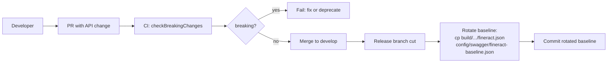

Apache Fineract treats its REST API as a published contract. Every commit regenerates `fineract.json` from the Swagger-core annotations (see [Swagger / OpenAPI](/build/swagger-and-openapi)), and the `com.docktape.swagger-brake` Gradle plugin diffs the new spec against a baseline that is checked into the repository. If the diff includes a **breaking change** — an endpoint removed without deprecation, a required request field added, a response field's type narrowed — the `checkBreakingChanges` task fails and the build is rejected before the change can land.

This page documents the `swaggerBrake { … }` block in `fineract-provider/build.gradle`, the `checkBreakingChanges.onlyIf` guard, the baseline lifecycle, and how to interpret the JSON output.

## Plugin configuration

In `fineract-provider/build.gradle`:

```groovy
apply plugin: 'com.docktape.swagger-brake'      // line 30

swaggerBrake {
    newApi = "${project.buildDir}/resources/main/static/fineract.json"
    oldApi = findProperty('apiBaseline') ?: "${projectDir}/config/swagger/fineract-baseline.json"
    outputFormats = ['JSON']
    outputFilePath = "${project.buildDir}/swagger-brake"
    deprecatedApiDeletionAllowed = true
    strictValidation = false
}

checkBreakingChanges.dependsOn resolve
checkBreakingChanges.onlyIf {
    def baseline = findProperty('apiBaseline') ?: "${projectDir}/config/swagger/fineract-baseline.json"
    def exists = file(baseline).exists()
    if (!exists) {
        logger.lifecycle("Skipping checkBreakingChanges: baseline file not found at ${baseline}")
    }
    exists
}
```

Each setting:

| Setting                          | Value                                                                  | Effect                                                                                                                                                                                                                |
|----------------------------------|-------------------------------------------------------------------------|-----------------------------------------------------------------------------------------------------------------------------------------------------------------------------------------------------------------------|
| `newApi`                         | `build/resources/main/static/fineract.json` (current build output)      | The "after" side of the diff. This is the same JSON the Swagger plugin's `resolve` task writes — see [Swagger / OpenAPI](/build/swagger-and-openapi).                                                                  |
| `oldApi`                         | `findProperty('apiBaseline')` ?: `config/swagger/fineract-baseline.json`| The "before" side. Defaults to the committed baseline; overridable on the command line with `-PapiBaseline=/path/to/other.json`.                                                                                       |
| `outputFormats`                  | `['JSON']`                                                              | Report format. JSON is machine-parsable for CI surfacing (e.g., a GitHub Actions job summary).                                                                                                                          |
| `outputFilePath`                 | `build/swagger-brake/`                                                  | Directory; the plugin emits `swagger-brake.json` and (for non-JSON formats) `swagger-brake.html`.                                                                                                                       |
| `deprecatedApiDeletionAllowed`   | `true`                                                                  | An endpoint that was marked `@Operation(deprecated = true)` in the **baseline** can be removed in the new spec without breaking the build. Lets the deprecation cycle complete cleanly.                                |
| `strictValidation`               | `false`                                                                 | Non-strict mode: only true breaking changes fail the build. Strict mode would also fail on additive changes that *could* break loosely-typed clients (e.g., enum value added).                                          |

The `checkBreakingChanges.dependsOn resolve` line wires the comparison after the spec is generated — running `./gradlew :fineract-provider:checkBreakingChanges` automatically runs `prepareInputYaml` → `resolve` → `checkBreakingChanges`.

The `onlyIf { … }` block is the **safety hatch**: if `apiBaseline` is missing (fresh clone, deleted file, custom branch with no baseline yet), the task is skipped with a `lifecycle` log line instead of failing. This makes the build robust to first-time setup and to feature branches that intentionally rotate the baseline.

## What counts as a breaking change

The plugin's default rule set (with `strictValidation = false`) treats the following as breaking:

| Category                | Example                                                                                                                | Why it breaks clients                                                                              |
|-------------------------|-------------------------------------------------------------------------------------------------------------------------|----------------------------------------------------------------------------------------------------|
| Endpoint removed        | `DELETE /v1/clients/{clientId}/charges/{chargeId}` was in the baseline, not in `newApi`, and was **not** deprecated     | Existing clients calling the URL receive 404                                                       |
| Operation removed       | `POST` removed from a path that still has `GET`                                                                          | Idem                                                                                                |
| Required request field added | `loanProductId` becomes required on `POST /v1/loans` where it was optional                                          | Clients omitting the field now get 400                                                              |
| Required response field removed | `interestRatePerPeriod` removed from `GET /v1/loans/{id}` response                                                 | Clients deserializing into a typed model see null where they expected a value                       |
| Response field type narrowed | `accountNo` becomes `integer` where it was `string`                                                                | JSON parsers throw                                                                                  |
| Path parameter type changed | `{clientId}` becomes a `string` (UUID) where it was an `integer`                                                     | Client URL templates break                                                                          |
| Enum value removed      | `status: "ACTIVE"` removed                                                                                              | Clients matching on enum value now fall through                                                     |
| Security scheme tightened | Operation now requires a new scope                                                                                    | Existing tokens fail authorization                                                                  |

The following are **non-breaking** (do not fail the build, even with `strictValidation = false`):

| Category                          | Example                                            |
|-----------------------------------|----------------------------------------------------|
| New endpoint                      | `POST /v1/loans/{id}/buy-down-fees`                |
| New optional request field        | `extraData?: string` on an existing request body   |
| New response field                | Additional read-only field on a response model     |
| Deprecation                       | Adding `@Operation(deprecated = true)`             |
| Removal of a **deprecated** endpoint  | Because `deprecatedApiDeletionAllowed = true`  |

## Running the check

```bash
# Full pipeline: regenerate spec, then diff
./gradlew :fineract-provider:checkBreakingChanges

# With a custom baseline (compare against another branch's spec)
./gradlew :fineract-provider:checkBreakingChanges \
    -PapiBaseline=/tmp/main-fineract.json
```

If the baseline does not exist:

```
> Task :fineract-provider:checkBreakingChanges SKIPPED
Skipping checkBreakingChanges: baseline file not found at /…/config/swagger/fineract-baseline.json
```

If the diff is clean:

```
> Task :fineract-provider:checkBreakingChanges
No breaking changes detected
```

If the diff is dirty:

```
> Task :fineract-provider:checkBreakingChanges FAILED
3 breaking changes detected. Report: build/swagger-brake/swagger-brake.json
```

## Interpreting the JSON report

`build/swagger-brake/swagger-brake.json` is an array of finding records. Each entry has at minimum:

```json
[
  {
    "type": "PATH_REMOVED",
    "path": "/v1/loans/{loanId}/disburse",
    "severity": "BREAKING",
    "description": "The path was removed and was not deprecated in the baseline."
  },
  {
    "type": "REQUEST_BODY_REQUIRED_PROPERTY_ADDED",
    "path": "/v1/clients",
    "method": "POST",
    "property": "officeId",
    "severity": "BREAKING",
    "description": "A required property was added to the request body."
  },
  {
    "type": "RESPONSE_PROPERTY_REMOVED",
    "path": "/v1/loans/{id}",
    "method": "GET",
    "property": "interestRatePerPeriod",
    "severity": "BREAKING",
    "description": "A property was removed from the response schema."
  }
]
```

Fix paths for each kind:

| Finding type                                | Resolution                                                                                                                                              |
|---------------------------------------------|----------------------------------------------------------------------------------------------------------------------------------------------------------|
| `PATH_REMOVED`                              | Either restore the path, or first deprecate it (`@Operation(deprecated = true)`) in a release that updates the baseline, then remove in a later release. |
| `OPERATION_REMOVED`                         | Same as above, scoped to one HTTP verb.                                                                                                                  |
| `REQUEST_BODY_REQUIRED_PROPERTY_ADDED`      | Make the field optional in the swagger schema, or default it server-side.                                                                                |
| `RESPONSE_PROPERTY_REMOVED`                 | Restore the field; if you must remove it, emit it with a sentinel value and deprecate.                                                                   |
| `PROPERTY_TYPE_CHANGED`                     | Introduce a new field with the new type; keep the old field; rotate later.                                                                               |
| `ENUM_VALUE_REMOVED`                        | Don't. Add new values, never remove.                                                                                                                     |

## Baseline lifecycle

The baseline path is `fineract-provider/config/swagger/fineract-baseline.json`. The file is **not** checked into the upstream Apache repository — only the `fineract-input.yaml.template` lives in `config/swagger/`. Distributions and release branches that want CI to enforce the contract drop the baseline alongside it (or pass `-PapiBaseline=<path>` to point at another location). When the baseline is absent, the `onlyIf { … }` block skips the task with a `lifecycle` log line instead of failing.

When a release line wants to freeze the contract, the rotation is a deliberate step:



Concretely, when cutting a release:

```bash
# 1. Make sure the spec is up to date
./gradlew :fineract-provider:resolve

# 2. Copy the freshly generated spec over the baseline
cp fineract-provider/build/resources/main/static/fineract.json \
   fineract-provider/config/swagger/fineract-baseline.json

# 3. Verify the diff is now clean
./gradlew :fineract-provider:checkBreakingChanges
# → "No breaking changes detected"

# 4. Commit the new baseline as part of the release-prep PR
git add fineract-provider/config/swagger/fineract-baseline.json
git commit -m "Rotate Swagger Brake baseline for <next-version>"
```

Rotating mid-release-line is **not** done — that would silently allow breaking changes to slip in. The point of the baseline is that it freezes between releases.

## Override patterns

### Compare against a specific branch's spec

```bash
git fetch origin
git show origin/main:fineract-provider/config/swagger/fineract-baseline.json > /tmp/main-baseline.json
./gradlew :fineract-provider:checkBreakingChanges -PapiBaseline=/tmp/main-baseline.json
```

This is how CI on a feature branch can detect "you broke `main`'s contract" without depending on the local baseline file having been rotated yet.

### Allow a deliberate breaking change (release-major-version bump)

For a major-version bump where breaking changes are expected, run with `-PapiBaseline=/dev/null`:

```bash
./gradlew :fineract-provider:checkBreakingChanges -PapiBaseline=/dev/null
```

The `onlyIf` block sees a non-existent baseline and skips the task. Use sparingly and **only on release branches**.

## CI integration

The Apache Jenkins build executes `./gradlew check` (which includes `cucumber` per the `check.dependsOn('cucumber')` line elsewhere in `fineract-provider/build.gradle`). `checkBreakingChanges` is **not** in the default `check` lifecycle — it must be invoked explicitly:

```bash
./gradlew :fineract-provider:resolve :fineract-provider:checkBreakingChanges
```

In Jenkins pipeline syntax:

```groovy
stage('OpenAPI compatibility') {
    steps {
        sh './gradlew :fineract-provider:checkBreakingChanges'
    }
    post {
        always {
            archiveArtifacts artifacts: 'fineract-provider/build/swagger-brake/swagger-brake.json',
                             allowEmptyArchive: true
        }
    }
}
```

For GitHub Actions, the equivalent step + report attachment:

```yaml
- name: Swagger Brake
  run: ./gradlew :fineract-provider:checkBreakingChanges
- name: Upload report
  if: always()
  uses: actions/upload-artifact@v4
  with:
    name: swagger-brake-report
    path: fineract-provider/build/swagger-brake/swagger-brake.json
```

## Inspecting drift quickly

Even when `checkBreakingChanges` passes, the spec is often growing. A non-breaking diff is still worth a code review for `@Schema` quality (descriptions, enums). One-liner:

```bash
diff <(jq -S '.paths | keys' \
       fineract-provider/config/swagger/fineract-baseline.json) \
     <(jq -S '.paths | keys' \
       fineract-provider/build/resources/main/static/fineract.json)
```

For a full structural diff:

```bash
docker run --rm -v "$PWD":/specs tufin/oasdiff diff \
  /specs/fineract-provider/config/swagger/fineract-baseline.json \
  /specs/fineract-provider/build/resources/main/static/fineract.json
```

(`oasdiff` is a more sophisticated tool with semantic understanding that complements the `swagger-brake` checker.)

## Common pitfalls

| Symptom                                                                          | Cause                                                                                                                              | Fix                                                                                                                                  |
|----------------------------------------------------------------------------------|------------------------------------------------------------------------------------------------------------------------------------|--------------------------------------------------------------------------------------------------------------------------------------|
| Task always SKIPPED                                                              | Baseline file missing                                                                                                              | `./gradlew :fineract-provider:resolve && cp fineract-provider/build/.../fineract.json fineract-provider/config/swagger/fineract-baseline.json` |
| Task fails for endpoints you didn't touch                                        | Generated spec is non-deterministic across machines                                                                                | Ensure `sortOutput = true` is set in `resolve { … }` (it is — see [Swagger / OpenAPI](/build/swagger-and-openapi)) and rerun        |
| Breaking change accepted in baseline rotation but rejected in next PR             | Baseline was rotated against a dirty working tree                                                                                  | Rotate from a clean tree: `git stash; ./gradlew resolve; cp …; git stash pop`                                                        |
| Plugin doesn't recognize new endpoint as "deprecated"                            | `@Operation(deprecated = true)` was added but the **baseline** baseline still shows it as non-deprecated                            | Baseline must be rotated **after** marking as deprecated for the next removal to be allowed                                          |
| CI shows finding but the JSON has 0 entries                                      | `outputFilePath` directory was wiped by a `clean` task after the report was generated                                              | Capture the artifact before any subsequent `clean`                                                                                   |

## Cross-references

- [Swagger / OpenAPI](/build/swagger-and-openapi) — how `fineract.json` is generated
- [fineract-client](/clients/fineract-client) — what breaks downstream when this gate is bypassed
- [Multi-Module Build](/build/gradle-multi-module) — where this plugin sits in the wider build
