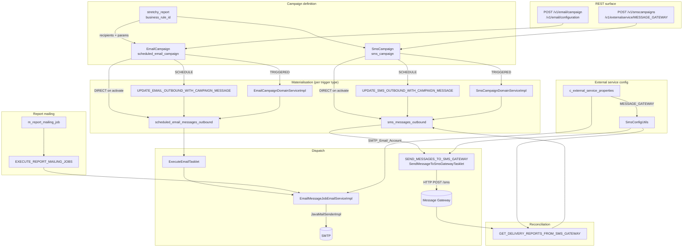

The Apache Fineract **campaigns** subsystem (`fineract-provider/src/main/java/org/apache/fineract/infrastructure/campaigns/`) is a tenant-scoped messaging pipeline that drives **email** and **SMS** delivery from stored campaign definitions. A campaign couples a **business-rule report** (a stretchy SQL report that returns recipients and template parameters) with a **template body**, a **trigger type** (direct / scheduled / triggered), and a **status machine** (`PENDING` → `ACTIVE` → `CLOSED`). Scheduled Spring Batch jobs materialise campaign messages into the `sms_messages_outbound` / `scheduled_email_messages_outbound` tables, ship them to the configured SMTP server or SMS gateway, and reconcile delivery status.

Use this page to navigate the campaigns tree. Jump-off points:

- Email campaigns and the `EmailCampaign` aggregate → [Email campaigns](/campaigns/email-campaigns).
- SMTP configuration via `ExternalServicesProperties` and the JavaMail sender → [Email configuration](/campaigns/email-configuration).
- SMS campaigns and the `SmsCampaign` aggregate → [SMS campaigns](/campaigns/sms-campaigns).
- The outbound SMS gateway loop (`SmsConfigUtils`, `MessageGatewayConfigurationData`) → [SMS gateway](/campaigns/sms-gateway).
- The five Spring Batch jobs that drive the pipeline → [Campaign jobs](/campaigns/campaign-jobs).
- For the underlying scheduler runtime see [Jobs overview](/jobs/overview).
- For the REST surface that drives campaigns see [Hooks and messaging APIs](/api/hooks).

## Module layout

```
fineract-provider/src/main/java/org/apache/fineract/infrastructure/campaigns/
├── constants/
│   └── CampaignType.java                  # INVALID(0), SMS(1), NOTIFICATION(2)
├── helper/
│   └── SmsConfigUtils.java                # builds gateway URI + HttpEntity from ExternalServicesProperties
├── email/
│   ├── api/                               # EmailCampaignApiResource, EmailConfigurationApiResource, EmailApiResource
│   ├── data/                              # EmailCampaignData, EmailCampaignValidator, EmailConfigurationData
│   ├── domain/                            # EmailCampaign, EmailConfiguration, EmailMessage, EmailCampaignStatus
│   ├── exception/
│   ├── handler/                           # CreateEmailCampaignCommandHandler, ActivateEmailCampaignCommandHandler ...
│   └── service/                           # EmailCampaignDomainServiceImpl, EmailMessageJobEmailServiceImpl
├── sms/
│   ├── api/                               # SmsCampaignApiResource
│   ├── constants/                         # SmsCampaignStatus, SmsCampaignTriggerType, SmsCampaignConstants
│   ├── data/                              # SmsCampaignData, MessageGatewayConfigurationData, SmsBusinessRulesData
│   ├── domain/                            # SmsCampaign, SmsCampaignRepository
│   ├── exception/
│   ├── handler/                           # *SmsCampaignCommandHandler
│   ├── mapper/                            # SmsCampaignMapper, BusinessRuleMapper
│   ├── serialization/                     # SmsCampaignValidator
│   └── service/                           # SmsCampaignDomainService, SmsCampaignWritePlatformServiceJpaImpl
└── jobs/
    ├── executeemail/                      # ExecuteEmailTasklet  (sends EmailMessage rows in PENDING status)
    ├── executereportmailingjobs/          # ExecuteReportMailingJobsTasklet (report-mailing-job driver)
    ├── getdeliveryreportsfromsmsgateway/  # GetDeliveryReportsFromSmsGatewayTasklet
    ├── sendmessagetosmsgateway/           # SendMessageToSmsGatewayTasklet
    ├── updateemailoutboundwithcampaignmessage/
    └── updatesmsoutboundwithcampaignmessage/
```

The companion **SMS message** module — `infrastructure/sms/` — owns the outbound `SmsMessage` entity, the read/write services that the gateway tasklets consume, and `SmsMessageScheduledJobService` (synchronous gateway sender used by triggered SMS dispatch).

## Two pipelines, one shape

Both email and SMS follow the same shape:

| Stage | SMS pipeline | Email pipeline |
|---|---|---|
| Campaign definition | `sms_campaign` (`SmsCampaign`) | `scheduled_email_campaign` (`EmailCampaign`) |
| Trigger types | `DIRECT(1)`, `SCHEDULE(2)`, `TRIGGERED(3)` | `DIRECT(1)`, `SCHEDULE(2)`, `TRIGGERED(3)` |
| Status states | `PENDING(100)`, `ACTIVE(300)`, `CLOSED(600)` | `PENDING(100)`, `ACTIVE(300)`, `CLOSED(600)` |
| Recipient source | Business-rule report (`stretchy_report`) | Business-rule report |
| Outbound table | `sms_messages_outbound` (`SmsMessage`) | `scheduled_email_messages_outbound` (`EmailMessage`) |
| Outbound status enum | `SmsMessageStatusType` (`PENDING`, `WAITING_FOR_DELIVERY_REPORT`, `SENT`, `DELIVERED`, `FAILED`) | `EmailMessageStatusType` (`PENDING`, `SENT`, `DELIVERED`, `FAILED`) |
| Materialisation job | `UPDATE_SMS_OUTBOUND_WITH_CAMPAIGN_MESSAGE` | `UPDATE_EMAIL_OUTBOUND_WITH_CAMPAIGN_MESSAGE` |
| Dispatch job | `SEND_MESSAGES_TO_SMS_GATEWAY` | `EXECUTE_EMAIL` (inside `EmailMessageJobEmailServiceImpl`) |
| Reconcile job | `GET_DELIVERY_REPORTS_FROM_SMS_GATEWAY` | n/a (JavaMail is fire-and-forget) |
| External config | `MESSAGE_GATEWAY` rows in `c_external_service_properties` | `SMTP_Email_Account` rows in `c_external_service_properties` |

The `Report` business-rule SQL must produce rows with the columns the campaign expects (mobile number, email address, parameter substitutions). The Velocity-style template string in the campaign body is interpolated per-row before the message is enqueued.

## Trigger semantics

```
                  ┌────────────┐
                  │  PENDING   │   (created via POST .../campaign)
                  └─────┬──────┘
                        │ activate
                        ▼
            ┌──────────────────────────┐
            │         ACTIVE            │
            │                          │
            │  • DIRECT     → expanded once into outbound table on activate │
            │  • SCHEDULE   → recurrence cron; expanded by UPDATE_* jobs    │
            │  • TRIGGERED  → reacts to BusinessEvents (e.g. loan disburse) │
            └─────┬──────────────────┬─┘
                  │ close            │ reactivate (CLOSED → ACTIVE)
                  ▼                  │
            ┌────────────┐           │
            │   CLOSED   │───────────┘
            └────────────┘
```

A `DIRECT` campaign is a one-shot blast: activating it runs the business-rule report immediately and inserts rows into the outbound table. A `SCHEDULE` campaign carries a recurrence string and `next_trigger_date`; the `UPDATE_..._OUTBOUND_WITH_CAMPAIGN_MESSAGE` jobs poll active scheduled campaigns and re-expand whenever the trigger date is in the past. A `TRIGGERED` campaign is wired to a business-event listener — `SmsCampaignDomainServiceImpl` and `EmailCampaignDomainServiceImpl` subscribe to portfolio events (loan approval, disbursal, etc.) and emit messages when matching events fire.

## End-to-end system map



## Where the data lives

Each campaign reads its target rows from a stretchy report executed at materialisation time. The `Report` entity (see [Reports](/dataqueries/reports)) is referenced from both `SmsCampaign.businessRuleId` and `EmailCampaign.businessRuleId`:

```java
// fineract-provider/.../campaigns/email/domain/EmailCampaign.java
@ManyToOne
@JoinColumn(name = "business_rule_id", nullable = false)
private Report businessRuleId;

@Column(name = "param_value")
private String paramValue;          // JSON of param → value pairs passed into the report
```

`paramValue` carries the runtime parameter map for the business-rule report (for instance `{"officeId":"1","status":"300"}`). At materialisation the parameters are substituted into the report SQL via `GenericDataServiceImpl.replace(...)` (see [Run reports](/dataqueries/run-reports) for the substitution rules), and each result row produces one outbound message after the template body has been interpolated.

## External service rows

Both pipelines read their endpoint configuration from `c_external_service_properties`. The constants are declared in `ExternalServicesConstants`:

```java
// fineract-provider/.../configuration/service/ExternalServicesConstants.java
public static final String SMTP_SERVICE_NAME    = "SMTP_Email_Account";
public static final String SMTP_HOST            = "host";
public static final String SMTP_PORT            = "port";
public static final String SMTP_USERNAME        = "username";
public static final String SMTP_PASSWORD        = "password";
public static final String SMTP_USE_TLS         = "useTLS";
public static final String SMTP_FROM_EMAIL      = "fromEmail";
public static final String SMTP_FROM_NAME       = "fromName";

public static final String SMS_SERVICE_NAME     = "MESSAGE_GATEWAY";
public static final String SMS_HOST             = "host_name";
public static final String SMS_PORT             = "port_number";
public static final String SMS_END_POINT        = "end_point";
public static final String SMS_TENANT_APP_KEY   = "tenant_app_key";
```

The values are exposed via `/v1/externalservice/{servicename}` (`ExternalServicesConfigurationApiResource`) and are read by `ExternalServicesPropertiesReadPlatformService` whenever a campaign or job needs to dispatch.

## Permissions

| Permission code | Guards |
|---|---|
| `READ_SMS_CAMPAIGN` | `GET /v1/smscampaigns` |
| `CREATE_SMS_CAMPAIGN` | `POST /v1/smscampaigns` |
| `UPDATE_SMS_CAMPAIGN` | `PUT /v1/smscampaigns/{id}` |
| `DELETE_SMS_CAMPAIGN` | `DELETE /v1/smscampaigns/{id}` |
| `ACTIVATE_SMS_CAMPAIGN`, `CLOSE_SMS_CAMPAIGN`, `REACTIVATE_SMS_CAMPAIGN` | `POST /v1/smscampaigns/{id}?command=` |
| `READ_EMAIL_CAMPAIGN`, `CREATE_EMAIL_CAMPAIGN`, `UPDATE_EMAIL_CAMPAIGN`, `DELETE_EMAIL_CAMPAIGN` | `/v1/email/campaign[/{id}]` |
| `READ_EMAIL_CONFIGURATION`, `UPDATE_EMAIL_CONFIGURATION` | `/v1/email/configuration` |
| `READ_EXTERNALSERVICES`, `UPDATE_EXTERNALSERVICES` | `/v1/externalservice/{servicename}` |

All operations land in `PortfolioCommandSourceWritePlatformService` and are dispatched to the matching `*CommandHandler` (see [Command handlers](/command/command-handler-registry) for the dispatcher).

## Related references

- The Spring Batch tasklets, configs and how they are registered: [Campaign jobs](/campaigns/campaign-jobs).
- The report mailing job — a separate scheduled-email feature that lives alongside email campaigns and shares `EmailMessageJobEmailServiceImpl`: see [Report mailing job](/report/report-mailing-job).
- The `Report` entity that backs every campaign's recipient query: [Reports](/dataqueries/reports).
- Why `RunreportsApiResource` rejects ad-hoc SQL and how `SqlValidator` is wired in: [SQL injection prevention](/security/sql-injection-prevention).
- All REST endpoints documented together: [Hooks and messaging APIs](/api/hooks).
