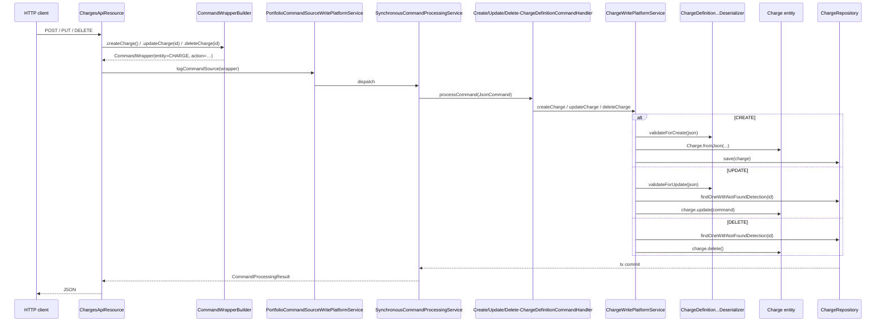

This page documents the JSON-side wiring of the Apache Fineract `/v1/charges` resource: the deserializer that validates inbound bodies, and the three `@CommandType` handlers that dispatch into `ChargeWritePlatformService`. The deserializer is `ChargeDefinitionCommandFromApiJsonDeserializer` (`fineract-charge/.../serialization/`); the handlers live in `fineract-charge/.../handler/`. There is no separate "data validator" class for charges — the deserializer plays both roles.

For the REST endpoint shapes see [Charges API](/charge/charges-api); for the underlying entity see [Charge domain](/charge/charge-domain).

## Deserializer skeleton

```java
@Component
public final class ChargeDefinitionCommandFromApiJsonDeserializer {

    public static final String NAME                       = "name";
    public static final String AMOUNT                     = "amount";
    public static final String LOCALE                     = "locale";
    public static final String CURRENCY_CODE              = "currencyCode";
    public static final String PENALTY                    = "penalty";
    public static final String CHARGE_CALCULATION_TYPE    = "chargeCalculationType";
    public static final String CHARGE_TIME_TYPE           = "chargeTimeType";
    public static final String CHARGE_APPLIES_TO          = "chargeAppliesTo";
    public static final String ACTIVE                     = "active";
    public static final String CHARGE_PAYMENT_MODE        = "chargePaymentMode";
    public static final String FEE_ON_MONTH_DAY           = "feeOnMonthDay";
    public static final String FEE_INTERVAL               = "feeInterval";
    public static final String MIN_CAP                    = "minCap";
    public static final String MAX_CAP                    = "maxCap";
    public static final String FEE_FREQUENCY              = "feeFrequency";
    public static final String ENABLE_FREE_WITHDRAWAL_CHARGE = "enableFreeWithdrawalCharge";
    public static final String FREE_WITHDRAWAL_FREQUENCY  = "freeWithdrawalFrequency";
    public static final String RESTART_COUNT_FREQUENCY    = "restartCountFrequency";
    public static final String COUNT_FREQUENCY_TYPE       = "countFrequencyType";
    public static final String ENABLE_PAYMENT_TYPE        = "enablePaymentType";
    public static final String PAYMENT_TYPE_ID            = "paymentTypeId";
    public static final String CHARGE                     = "charge";
    // ...
    private static final Set<String> SUPPORTED_PARAMETERS = new HashSet<>(Arrays.asList(
        NAME, AMOUNT, LOCALE, CURRENCY_CODE, CURRENCY_OPTIONS, CHARGE_APPLIES_TO,
        CHARGE_TIME_TYPE, CHARGE_CALCULATION_TYPE, CHARGE_CALCULATION_TYPE_OPTIONS, PENALTY,
        ACTIVE, CHARGE_PAYMENT_MODE, FEE_ON_MONTH_DAY, FEE_INTERVAL, MONTH_DAY_FORMAT,
        MIN_CAP, MAX_CAP, FEE_FREQUENCY,
        ENABLE_FREE_WITHDRAWAL_CHARGE, FREE_WITHDRAWAL_FREQUENCY, RESTART_COUNT_FREQUENCY, COUNT_FREQUENCY_TYPE,
        PAYMENT_TYPE_ID, ENABLE_PAYMENT_TYPE,
        ChargesApiConstants.glAccountIdParamName, ChargesApiConstants.taxGroupIdParamName));
    private final FromJsonHelper fromApiJsonHelper;
}
```

`fromApiJsonHelper.checkForUnsupportedParameters(...)` is called first in every validate method — any parameter not in `SUPPORTED_PARAMETERS` produces a 400. `DataValidatorBuilder` accumulates `ApiParameterError` records and a single `PlatformApiDataValidationException` is thrown at the end.

## `validateForCreate(String json)`

The create validator is the **structural gate** on `POST /v1/charges`. It runs three layers of checks:

### 1) Top-level required fields

```java
final Integer chargeAppliesTo = this.fromApiJsonHelper.extractIntegerSansLocaleNamed(CHARGE_APPLIES_TO, element);
baseDataValidator.reset().parameter(CHARGE_APPLIES_TO).value(chargeAppliesTo).notNull();
if (chargeAppliesTo != null) {
    baseDataValidator.reset().parameter(CHARGE_APPLIES_TO).value(chargeAppliesTo)
        .isOneOfTheseValues(ChargeAppliesTo.validValues());
}

final Integer chargeCalculationType = this.fromApiJsonHelper.extractIntegerSansLocaleNamed(CHARGE_CALCULATION_TYPE, element);
baseDataValidator.reset().parameter(CHARGE_CALCULATION_TYPE).value(chargeCalculationType).notNull();

final Integer feeInterval = this.fromApiJsonHelper.extractIntegerNamed(FEE_INTERVAL, element, Locale.getDefault());
baseDataValidator.reset().parameter(FEE_INTERVAL).value(feeInterval).integerGreaterThanZero();

final Integer feeFrequency = this.fromApiJsonHelper.extractIntegerNamed(FEE_FREQUENCY, element, Locale.getDefault());
baseDataValidator.reset().parameter(FEE_FREQUENCY).value(feeFrequency).inMinMaxRange(0, 3);
```

`ChargeAppliesTo.validValues()` returns `{LOAN(1), SAVINGS(2), CLIENT(3), SHARES(4)}`. `feeFrequency` is the `PeriodFrequencyType` code (`0=DAYS, 1=WEEKS, 2=MONTHS, 3=YEARS`) and is optional.

### 2) Free-withdrawal and payment-type sub-blocks

```java
if (this.fromApiJsonHelper.parameterExists(ENABLE_FREE_WITHDRAWAL_CHARGE, element)) {
    final Boolean enableFreeWithdrawalCharge = ...;
    baseDataValidator.reset().parameter(ENABLE_FREE_WITHDRAWAL_CHARGE).value(enableFreeWithdrawalCharge).notNull();
    if (enableFreeWithdrawalCharge) {
        final Integer freeWithdrawalFrequency = ...;
        baseDataValidator.reset().parameter(FREE_WITHDRAWAL_FREQUENCY).value(freeWithdrawalFrequency).integerGreaterThanZero();
        final Integer restartCountFrequency = ...;
        baseDataValidator.reset().parameter(RESTART_COUNT_FREQUENCY).value(restartCountFrequency).integerGreaterThanZero();
        final Integer countFrequencyType = ...;
        baseDataValidator.reset().parameter(COUNT_FREQUENCY_TYPE).value(countFrequencyType);
    }
}

if (this.fromApiJsonHelper.parameterExists(ENABLE_PAYMENT_TYPE, element)) {
    final boolean enablePaymentType = ...;
    if (enablePaymentType) {
        final Integer paymentTypeId = ...;
        baseDataValidator.reset().parameter(PAYMENT_TYPE_ID).value(paymentTypeId).integerGreaterThanZero();
    }
}

if (feeFrequency != null) {
    baseDataValidator.reset().parameter(FEE_INTERVAL).value(feeInterval).notNull();
}
```

So whenever `feeFrequency` is sent, `feeInterval` becomes mandatory.

### 3) Applies-to switch

The validator branches on `ChargeAppliesTo.fromInt(chargeAppliesTo)`. The branch for `LOAN`:

```java
if (appliesTo.isLoanCharge()) {
    final Integer chargeTimeType = this.fromApiJsonHelper.extractIntegerSansLocaleNamed(CHARGE_TIME_TYPE, element);
    baseDataValidator.reset().parameter(CHARGE_TIME_TYPE).value(chargeTimeType).notNull();
    if (chargeTimeType != null) {
        baseDataValidator.reset().parameter(CHARGE_TIME_TYPE).value(chargeTimeType)
            .isOneOfTheseValues(ChargeTimeType.validLoanValues());
    }

    final Integer chargePaymentMode = this.fromApiJsonHelper.extractIntegerSansLocaleNamed(CHARGE_PAYMENT_MODE, element);
    baseDataValidator.reset().parameter(CHARGE_PAYMENT_MODE).value(chargePaymentMode).notNull()
        .isOneOfTheseValues(ChargePaymentMode.validValues());
    if (chargePaymentMode != null) {
        baseDataValidator.reset().parameter(CHARGE_PAYMENT_MODE).value(chargePaymentMode)
            .isOneOfTheseValues(ChargePaymentMode.validValues());
    }
    if (chargeCalculationType != null) {
        baseDataValidator.reset().parameter(CHARGE_CALCULATION_TYPE).value(chargeCalculationType)
            .isOneOfTheseValues(ChargeCalculationType.validValuesForLoan());
    }
    if (chargeTimeType != null && chargeCalculationType != null) {
        performChargeTimeNCalculationTypeValidation(baseDataValidator, chargeTimeType, chargeCalculationType);
    }
}
```

`validLoanValues()` returns `{DISBURSEMENT(1), SPECIFIED_DUE_DATE(2), INSTALMENT_FEE(8), OVERDUE_INSTALLMENT(9), TRANCHE_DISBURSEMENT(12)}`.

The `SAVINGS` branch is the most subtle — it enforces weekly/monthly/annual sub-rules:

```java
} else if (appliesTo.isSavingsCharge()) {
    final Integer chargeTimeType = ...;
    baseDataValidator.reset().parameter(CHARGE_TIME_TYPE).value(chargeTimeType).notNull();
    if (chargeTimeType != null) {
        baseDataValidator.reset().parameter(CHARGE_TIME_TYPE).value(chargeTimeType)
            .isOneOfTheseValues(ChargeTimeType.validSavingsValues());
    }
    final ChargeTimeType ctt = ChargeTimeType.fromInt(chargeTimeType);
    if (ctt.isWeeklyFee()) {
        final String monthDay = this.fromApiJsonHelper.extractStringNamed(FEE_ON_MONTH_DAY, element);
        baseDataValidator.reset().parameter(FEE_ON_MONTH_DAY).value(monthDay)
            .mustBeBlankWhenParameterProvidedIs(CHARGE_TIME_TYPE, chargeTimeType);
    }
    if (ctt.isMonthlyFee()) {
        final MonthDay monthDay = this.fromApiJsonHelper.extractMonthDayNamed(FEE_ON_MONTH_DAY, element);
        baseDataValidator.reset().parameter(FEE_ON_MONTH_DAY).value(monthDay).notNull();
        baseDataValidator.reset().parameter(FEE_INTERVAL).value(feeInterval).notNull().inMinMaxRange(1, 12);
    }
    if (ctt.isAnnualFee()) {
        final MonthDay monthDay = this.fromApiJsonHelper.extractMonthDayNamed(FEE_ON_MONTH_DAY, element);
        baseDataValidator.reset().parameter(FEE_ON_MONTH_DAY).value(monthDay).notNull();
    }
    if (chargeCalculationType != null) {
        baseDataValidator.reset().parameter(CHARGE_CALCULATION_TYPE).value(chargeCalculationType)
            .isOneOfTheseValues(ChargeCalculationType.validValuesForSavings());
    }
}
```

Note that the `WEEKLY_FEE` branch demands that `feeOnMonthDay` is **blank** — weekly fees don't carry a month/day anchor. Monthly fees require both the month/day anchor and a `feeInterval` between 1 and 12.

The `CLIENT` branch additionally requires `incomeAccountId`:

```java
} else if (appliesTo.isClientCharge()) {
    final Integer chargeTimeType = ...;
    baseDataValidator.reset().parameter(CHARGE_TIME_TYPE).value(chargeTimeType).notNull();
    if (chargeTimeType != null) {
        baseDataValidator.reset().parameter(CHARGE_TIME_TYPE).value(chargeTimeType)
            .isOneOfTheseValues(ChargeTimeType.validClientValues());
    }
    if (chargeCalculationType != null) {
        baseDataValidator.reset().parameter(CHARGE_CALCULATION_TYPE).value(chargeCalculationType)
            .isOneOfTheseValues(ChargeCalculationType.validValuesForClients());
    }
    if (this.fromApiJsonHelper.parameterExists(ChargesApiConstants.glAccountIdParamName, element)) {
        final Long glAccountId = this.fromApiJsonHelper.extractLongNamed(ChargesApiConstants.glAccountIdParamName, element);
        baseDataValidator.reset().parameter(ChargesApiConstants.glAccountIdParamName).value(glAccountId).notNull()
            .longGreaterThanZero();
    }
}
```

Shares uses `validShareValues()` and `validValuesForShares()`, with an extra narrowing for activation (`validValuesForShareAccountActivation()` ⇒ flat only).

### 4) Cross-cutting numeric / string rules

```java
final String name = this.fromApiJsonHelper.extractStringNamed(NAME, element);
baseDataValidator.reset().parameter(NAME).value(name).notBlank().notExceedingLengthOf(100);

final String currencyCode = this.fromApiJsonHelper.extractStringNamed(CURRENCY_CODE, element);
baseDataValidator.reset().parameter(CURRENCY_CODE).value(currencyCode).notBlank().notExceedingLengthOf(3);

final BigDecimal amount = this.fromApiJsonHelper.extractBigDecimalWithLocaleNamed(AMOUNT, element.getAsJsonObject());
baseDataValidator.reset().parameter(AMOUNT).value(amount).notNull().positiveAmount();

if (this.fromApiJsonHelper.parameterExists(MIN_CAP, element)) {
    final BigDecimal minCap = ...;
    baseDataValidator.reset().parameter(MIN_CAP).value(minCap).notNull().positiveAmount();
}
if (this.fromApiJsonHelper.parameterExists(MAX_CAP, element)) {
    final BigDecimal maxCap = ...;
    baseDataValidator.reset().parameter(MAX_CAP).value(maxCap).notNull().positiveAmount();
}

if (this.fromApiJsonHelper.parameterExists(ChargesApiConstants.taxGroupIdParamName, element)) {
    final Long taxGroupId = this.fromApiJsonHelper.extractLongNamed(ChargesApiConstants.taxGroupIdParamName, element);
    baseDataValidator.reset().parameter(ChargesApiConstants.taxGroupIdParamName).value(taxGroupId).notNull()
        .longGreaterThanZero();
}

throwExceptionIfValidationWarningsExist(dataValidationErrors);
```

## `performChargeTimeNCalculationTypeValidation(...)`

A private helper that gates two corner cases:

```java
private void performChargeTimeNCalculationTypeValidation(DataValidatorBuilder baseDataValidator,
        final Integer chargeTimeType, final Integer chargeCalculationType) {

    if (chargeTimeType.equals(ChargeTimeType.SHAREACCOUNT_ACTIVATION.getValue())) {
        baseDataValidator.reset().parameter(CHARGE_CALCULATION_TYPE).value(chargeCalculationType)
            .isOneOfTheseValues(ChargeCalculationType.validValuesForShareAccountActivation());
    }
    if (chargeTimeType.equals(ChargeTimeType.TRANCHE_DISBURSEMENT.getValue())) {
        baseDataValidator.reset().parameter(CHARGE_CALCULATION_TYPE).value(chargeCalculationType)
            .isOneOfTheseValues(ChargeCalculationType.validValuesForTrancheDisbursement());
    } else {
        baseDataValidator.reset().parameter(CHARGE_CALCULATION_TYPE).value(chargeCalculationType)
            .isNotOneOfTheseValues(ChargeCalculationType.PERCENT_OF_DISBURSEMENT_AMOUNT.getValue());
    }
}
```

- Share-account activation charges can **only** be `FLAT`.
- Tranche-disbursement charges can be `FLAT` or `PERCENT_OF_DISBURSEMENT_AMOUNT`.
- **No other charge time may use `PERCENT_OF_DISBURSEMENT_AMOUNT`** — the else-branch explicitly black-lists code 5.

A standalone `validateChargeTimeNCalculationType(Integer, Integer)` entry point is also exposed for callers (loan write services) that need to recheck just this rule after attaching a charge to a product.

## `validateForUpdate(String json)`

The update validator is structurally similar but **all fields are optional**:

```java
if (this.fromApiJsonHelper.parameterExists(NAME, element)) {
    final String name = ...;
    baseDataValidator.reset().parameter(NAME).value(name).notBlank().notExceedingLengthOf(100);
}
if (this.fromApiJsonHelper.parameterExists(AMOUNT, element))         { ... .notNull().positiveAmount(); }
if (this.fromApiJsonHelper.parameterExists(MIN_CAP, element))        { ... .notNull().positiveAmount(); }
if (this.fromApiJsonHelper.parameterExists(MAX_CAP, element))        { ... .notNull().positiveAmount(); }
if (this.fromApiJsonHelper.parameterExists(CHARGE_APPLIES_TO, element)) {
    final Integer chargeAppliesTo = ...;
    baseDataValidator.reset().parameter(CHARGE_APPLIES_TO).value(chargeAppliesTo).notNull()
        .isOneOfTheseValues(ChargeAppliesTo.validValues());
}
```

The deserializer allows `chargeAppliesTo` to be present in the JSON (and validates its shape) — but the **entity** still refuses to actually change it at `Charge.update(...)` time, throwing `ChargeParameterUpdateNotSupportedException`. So clients should omit the field.

The update validator builds an "all valid values" set when checking `chargeTimeType` because the time can in principle move within whatever the applies-to allows:

```java
if (this.fromApiJsonHelper.parameterExists(CHARGE_TIME_TYPE, element)) {
    final Integer chargeTimeType = ...;
    final Collection<Object> validLoanValues    = Arrays.asList(ChargeTimeType.validLoanValues());
    final Collection<Object> validSavingsValues = Arrays.asList(ChargeTimeType.validSavingsValues());
    final Collection<Object> validClientValues  = Arrays.asList(ChargeTimeType.validClientValues());
    final Collection<Object> validShareValues   = Arrays.asList(ChargeTimeType.validShareValues());
    final Collection<Object> allValidValues = new ArrayList<>(validLoanValues);
    allValidValues.addAll(validSavingsValues);
    allValidValues.addAll(validClientValues);
    allValidValues.addAll(validShareValues);
    baseDataValidator.reset().parameter(CHARGE_TIME_TYPE).value(chargeTimeType).notNull()
        .isOneOfTheseValues(allValidValues.toArray(new Object[allValidValues.size()]));
}
```

`Charge.update(...)` then runs the **applies-to-specific** narrowing again at the entity level.

Other update-only checks:

- `chargeCalculationType` is range-validated `1..5` (the full `ChargeCalculationType` non-INVALID range).
- `chargePaymentMode` is range-validated `0..1`.
- `feeFrequency` is range-validated `0..3`.

## Command handlers

The three handler classes are intentionally trivial — they pin Spring beans to a `(entity, action)` pair via `@CommandType`, and delegate to the write service. Each implements `NewCommandSourceHandler` (`fineract-command`).

### `CreateChargeDefinitionCommandHandler`

```java
@RequiredArgsConstructor
@Service
@CommandType(entity = "CHARGE", action = "CREATE")
public class CreateChargeDefinitionCommandHandler implements NewCommandSourceHandler {
    private final ChargeWritePlatformService clientWritePlatformService;
    @Transactional
    @Override
    public CommandProcessingResult processCommand(final JsonCommand command) {
        return this.clientWritePlatformService.createCharge(command);
    }
}
```

`SynchronousCommandProcessingService` selects this handler when a `CommandWrapper` arrives with `entityName="CHARGE"` and `actionName="CREATE"` (built by `CommandWrapperBuilder.createCharge()`).

### `UpdateChargeDefinitionCommandHandler`

```java
@RequiredArgsConstructor
@Service
@CommandType(entity = "CHARGE", action = "UPDATE")
public class UpdateChargeDefinitionCommandHandler implements NewCommandSourceHandler {
    private final ChargeWritePlatformService clientWritePlatformService;
    @Transactional
    @Override
    public CommandProcessingResult processCommand(final JsonCommand command) {
        return this.clientWritePlatformService.updateCharge(command.entityId(), command);
    }
}
```

`command.entityId()` is the `{chargeId}` path parameter; `CommandWrapperBuilder.updateCharge(chargeId)` set it.

### `DeleteChargeDefinitionCommandHandler`

```java
@RequiredArgsConstructor
@Service
@CommandType(entity = "CHARGE", action = "DELETE")
public class DeleteChargeDefinitionCommandHandler implements NewCommandSourceHandler {
    private final ChargeWritePlatformService clientWritePlatformService;
    @Transactional
    @Override
    public CommandProcessingResult processCommand(final JsonCommand command) {
        return this.clientWritePlatformService.deleteCharge(command.entityId());
    }
}
```

Soft-delete only — `Charge.delete()` flips `is_deleted=true` and rewrites `name` to `<id>_<originalName>`.

> There is **no** `CHARGE/CHECKER` handler exposed from this module. When maker-checker is enabled at the platform layer (via `m_permission` `*_CHECKER` rows), `CommandSourceWritePlatformService` opens a pending `m_command_source` row and dispatches to the matching CREATE/UPDATE/DELETE handler only after a checker approves — the handler classes themselves are unchanged.

## End-to-end flow per action



## Errors raised from this layer

| Source | Exception | HTTP |
| --- | --- | --- |
| Deserializer (any branch) | `PlatformApiDataValidationException` (with `ApiParameterError` list) | 400 |
| Deserializer | `InvalidJsonException` when the body is blank | 400 |
| Entity `Charge.fromJson` / `Charge.update` | `ChargeDueAtDisbursementCannotBePenaltyException` | 400 |
| Entity `Charge.fromJson` / `Charge.update` | `ChargeMustBePenaltyException` | 400 |
| Entity `Charge.update` | `ChargeParameterUpdateNotSupportedException` | 400 |
| Write service / repository | `ChargeNotFoundException` | 404 |
| Write service | `ChargeCannotBeDeletedException` (cross-module FK still present) | 400 |
| Database | Unique constraint violation on `m_charge.name` | 409 |

## Where the deserializer is consumed outside this module

`ChargeDefinitionCommandFromApiJsonDeserializer` is **only** used from `ChargeWritePlatformService` inside `fineract-charge`. The `validateChargeTimeNCalculationType(Integer, Integer)` method, however, is also called from loan-product write services when an existing `Charge` is associated to a `LoanProduct` with a (possibly different) `chargeTimeType` — so the rule about `PERCENT_OF_DISBURSEMENT_AMOUNT` being restricted to tranche-disbursement remains enforced even when the charge is reused.

## Cross-references

- `JsonCommand`, `FromJsonHelper`, `DataValidatorBuilder`, `PlatformApiDataValidationException`, `CommandWrapper`, `CommandWrapperBuilder`, `PortfolioCommandSourceWritePlatformService` — all in `fineract-core` / `fineract-command`; see [Portfolio shared domain](/core/portfolio-shared-domain).
- The matching REST endpoints are in [Charges API](/charge/charges-api).
- The enum surface used by the validator (`ChargeAppliesTo`, `ChargeTimeType`, `ChargeCalculationType`, `ChargePaymentMode`) is in [Charge domain](/charge/charge-domain).
- For the broader picture of how the `m_command_source` log, makers/checkers and permissions integrate with the handler dispatch, see [Configuration and code APIs](/api/configuration-and-code-apis).
