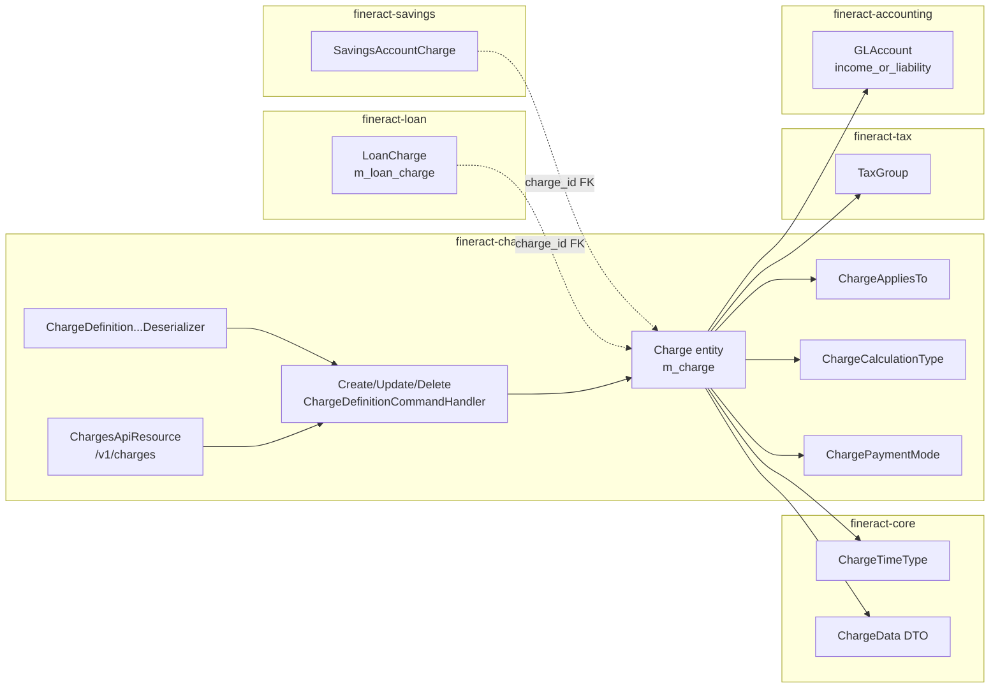
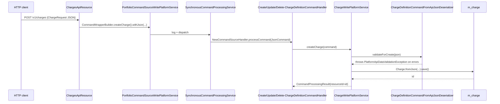

`fineract-charge` is the Apache Fineract Gradle module that owns the **platform-level catalog of fees and penalties**. A `Charge` row in `m_charge` is a reusable template: it declares "this is a 1% origination fee, charged on a loan, due at disbursement, calculated as a percentage of the approved principal". Loan accounts, savings accounts, client accounts and share accounts then copy the template into per-account rows (`LoanCharge`, `SavingsAccountCharge`, `ClientCharge`, `ShareAccountCharge`) — those per-account rows live in their respective portfolio modules, but every one of them carries a foreign key back to `m_charge`.

This page is the map of the module. Use it to find:

- Where the **JPA entity** and its enums live → [Charge domain](/charge/charge-domain).
- The **REST surface** for defining charges → [Charges API](/charge/charges-api).
- **JSON validation and command dispatch** wiring → [Charge serialization and handlers](/charge/charge-serialization-and-handlers).
- How a `Charge` is consumed by loans → [Loan charges](/loan/loan-charges) and by savings → [Savings charges](/savings/savings-charges).
- The shared base types (currency, GL account, tax group, payment type) → [Portfolio shared domain](/core/portfolio-shared-domain).

## Gradle module layout

```
fineract-charge/
└── src/main/java/org/apache/fineract/portfolio/charge/
    ├── api/                          ← Jersey resource + Swagger DTOs
    │   ├── ChargesApiConstants.java
    │   ├── ChargesApiResource.java   ← @Path("/v1/charges")
    │   └── ChargesApiResourceSwagger.java
    ├── domain/                       ← JPA entities + enums
    │   ├── Charge.java               ← @Entity @Table("m_charge")
    │   ├── ChargeAppliesTo.java      ← LOAN, SAVINGS, CLIENT, SHARES
    │   ├── ChargeCalculationType.java← FLAT, PERCENT_OF_AMOUNT, …
    │   ├── ChargePaymentMode.java    ← REGULAR, ACCOUNT_TRANSFER
    │   ├── ChargeRepository.java
    │   └── ChargeRepositoryWrapper.java
    ├── exception/                    ← runtime exceptions
    │   ├── ChargeNotFoundException.java
    │   ├── ChargeCannotBeDeletedException.java
    │   ├── ChargeIsNotActiveException.java
    │   ├── ChargeDueAtDisbursementCannotBePenaltyException.java
    │   ├── ChargeMustBePenaltyException.java
    │   └── LoanCharge*Exception, ShareAccountCharge*Exception (cross-module errors)
    ├── handler/                      ← @CommandType handlers
    │   ├── CreateChargeDefinitionCommandHandler.java
    │   ├── UpdateChargeDefinitionCommandHandler.java
    │   └── DeleteChargeDefinitionCommandHandler.java
    ├── request/
    │   └── ChargeRequest.java        ← POST/PUT JSON DTO
    ├── serialization/
    │   └── ChargeDefinitionCommandFromApiJsonDeserializer.java
    └── service/
        ├── ChargeReadPlatformService.java   ← JDBC read API
        ├── ChargeWritePlatformService.java
        ├── ChargeEnumerations.java          ← Integer → EnumOptionData
        ├── ChargeDropdownReadPlatformService.java
        └── ChargeDropdownReadPlatformServiceImpl.java
```

The companion enum `ChargeTimeType` and the `ChargeData` DTO are **not** here — they live in `fineract-core/src/main/java/org/apache/fineract/portfolio/charge/{domain,data}` because every portfolio module (loan, savings, share, client) depends on them. The cross-module split is intentional: `fineract-charge` defines the write path and the catalog table, while `fineract-core` exports the time enum and the DTO so other modules can read charges without depending on the charge module.

## Where a Charge lives in the model



A `Charge` is therefore the **catalog row**; each portfolio module is responsible for copying the relevant template fields onto its own per-account row at the moment the user (or product configuration) attaches the charge to an account.

## The `m_charge` table at a glance

The entity declares `@Table(name = "m_charge", uniqueConstraints = { @UniqueConstraint(columnNames = { "name" }, name = "name") })` and inherits from `AbstractPersistableCustom<Long>`. Key columns mapped by `Charge.java`:

| Column | Java field | Purpose |
| --- | --- | --- |
| `name` | `name` | Unique catalog name. On soft-delete it is rewritten to `<id>_<name>` so the unique constraint stays free. |
| `amount` (scale 6, precision 19) | `amount` | Default flat amount or percentage value. |
| `currency_code` (3) | `currencyCode` | ISO currency. Validated against `m_organisation_currency`. |
| `charge_applies_to_enum` | `chargeAppliesTo` | `ChargeAppliesTo` int — 1=LOAN, 2=SAVINGS, 3=CLIENT, 4=SHARES. |
| `charge_time_enum` | `chargeTimeType` | `ChargeTimeType` int — see [Charge domain](/charge/charge-domain). |
| `charge_calculation_enum` | `chargeCalculation` | `ChargeCalculationType` int — FLAT or one of the percentage variants. |
| `charge_payment_mode_enum` | `chargePaymentMode` | `ChargePaymentMode` int — REGULAR(0) or ACCOUNT_TRANSFER(1); loan-only. |
| `fee_on_day`, `fee_on_month` | `feeOnDay`, `feeOnMonth` | Used for monthly/annual recurring savings fees. |
| `fee_interval` | `feeInterval` | Recurrence interval (e.g. every N months for monthly fee). |
| `fee_frequency` | `feeFrequency` | `PeriodFrequencyType` int for recurring fees (0-3). |
| `is_penalty` | `penalty` | `true` ⇒ penalty (e.g. overdue installment), else fee. |
| `is_active` | `active` | Hidden from product selection when false. |
| `is_deleted` | `deleted` | Soft delete flag. |
| `min_cap`, `max_cap` | `minCap`, `maxCap` | Floor / ceiling on percentage-based charges. |
| `is_free_withdrawal` | `enableFreeWithdrawal` | Savings withdrawal-fee waiver toggle. |
| `free_withdrawal_charge_frequency`, `restart_frequency`, `restart_frequency_enum` | … | Free-withdrawal counters. |
| `is_payment_type` + `payment_type_id` | `enablePaymentType`, `paymentType` | When true the charge applies only to a specific `PaymentType`. |
| `income_or_liability_account_id` | `account` (`GLAccount`) | Income GL account (or liability for advance fees). |
| `tax_group_id` | `taxGroup` (`TaxGroup`) | Optional tax group — see [TaxGroup](/tax/tax-group). |

Soft delete is implemented by `Charge.delete()` (`this.deleted = true; this.name = getId() + "_" + this.name;`), so the same catalog name can be reused after a delete.

## Request → handler → entity pipeline

Every write through `/v1/charges` follows the standard Fineract command pattern:



The handler is a thin `@Service @CommandType(entity="CHARGE", action="CREATE")` shim — it just calls the write service. The validator does heavy lifting (≈480 lines) because the constraints depend on `chargeAppliesTo` × `chargeTimeType` × `chargeCalculationType`. See [Charge serialization and handlers](/charge/charge-serialization-and-handlers).

## Read services

`ChargeReadPlatformService` returns `ChargeData` projections via raw JDBC. It exposes **fan-out** queries needed by loan and savings UIs:

```java
List<ChargeData> retrieveAllCharges();
List<ChargeData> retrieveAllChargesForCurrency(String currencyCode);
ChargeData retrieveCharge(Long chargeId);
ChargeData retrieveNewChargeDetails(); // template (dropdowns)
List<ChargeData> retrieveAllChargesApplicableToClients();
List<ChargeData> retrieveLoanApplicableFees();
List<ChargeData> retrieveLoanAccountApplicableCharges(Long loanId, ChargeTimeType[] excludeChargeTimes);
List<ChargeData> retrieveLoanProductApplicableCharges(Long loanProductId, ChargeTimeType[] excludeChargeTimes);
List<ChargeData> retrieveLoanApplicablePenalties();
List<ChargeData> retrieveLoanProductCharges(Long loanProductId);
List<ChargeData> retrieveLoanProductCharges(Long loanProductId, ChargeTimeType chargeTime);
List<ChargeData> retrieveSavingsProductApplicableCharges(boolean feeChargesOnly);
List<ChargeData> retrieveSavingsApplicablePenalties();
List<ChargeData> retrieveSavingsProductCharges(Long savingsProductId);
List<ChargeData> retrieveSavingsAccountApplicableCharges(Long savingsId);
List<ChargeData> retrieveSharesApplicableCharges();
List<ChargeData> retrieveShareProductCharges(Long shareProductId);
```

`retrieveNewChargeDetails()` is the **template** call that powers `GET /v1/charges/template` — it returns currency options, allowed `chargeTimeType` / `chargeCalculationType` / `chargeAppliesTo` / `chargePaymentMode` dropdowns and the list of GL income accounts and tax groups. The dropdowns are assembled by `ChargeDropdownReadPlatformServiceImpl`, which translates the enums via `ChargeEnumerations`.

## Cross-module consumers

The catalog is referenced from many other modules. The most important consumers are:

- **fineract-loan** (`LoanProductCharge`, `LoanCharge`, `LoanInstallmentCharge`, `LoanTrancheCharge`) — see [Loan charges](/loan/loan-charges).
- **fineract-savings** (`SavingsProductCharge`, `SavingsAccountCharge`) — see [Savings charges](/savings/savings-charges).
- **fineract-provider/client** (`ClientCharge`).
- **fineract-provider/share** (`ShareProductCharge`, `ShareAccountCharge`).
- **fineract-accounting** — the `GLAccount` on `Charge.account` drives the accounting rules that post fee income.
- **fineract-tax** — `Charge.taxGroup` chains tax components onto the gross fee amount; see [Tax overview](/tax/overview).

`ChargeRepositoryWrapper` is the **mandatory entry point** for cross-module loads: it throws `ChargeNotFoundException` on miss and is preferred over `ChargeRepository.findById` so loan / savings code does not have to handle the `Optional`.

## Exceptions emitted from this module

`fineract-charge/exception` defines both **catalog-level** errors and **account-level** errors (the account-level ones live here for historical reasons even though they are thrown from loan/savings code):

| Exception | Trigger |
| --- | --- |
| `ChargeNotFoundException` | `ChargeRepositoryWrapper.findOneWithNotFoundDetection` for missing `m_charge.id`. |
| `ChargeIsNotActiveException` | Loan / savings code tries to use a `Charge` with `is_active=false`. |
| `ChargeCannotBeAppliedToException` | Attempt to attach a `Charge` to an account whose `chargeAppliesTo` does not match. |
| `ChargeCannotBeDeletedException` | `DELETE /v1/charges/{id}` when the charge is still referenced by a product/account. |
| `ChargeCannotBeUpdatedException` | Mutation of a non-updatable field (see `ChargeParameterUpdateNotSupportedException`). |
| `ChargeDueAtDisbursementCannotBePenaltyException` | Combined `penalty=true` + `chargeTimeType ∈ {DISBURSEMENT, TRANCHE_DISBURSEMENT}`. |
| `ChargeMustBePenaltyException` | `chargeTimeType=OVERDUE_INSTALLMENT` but `penalty=false`. |
| `LoanCharge*Exception`, `ShareAccountChargeWithoutMandatoryFieldException`, etc. | Thrown by loan / share write services when they touch charges. |

These are translated to HTTP 400 / 404 by the global `ExceptionMapper` in `fineract-core`.

## Permissions

Every endpoint guards on the literal `CHARGE` resource:

```java
private static final String RESOURCE_NAME_FOR_PERMISSIONS = "CHARGE";
// inside the GET methods
context.authenticatedUser().validateHasReadPermission(RESOURCE_NAME_FOR_PERMISSIONS);
```

Write permissions come from the `m_permission` rows seeded by Liquibase: `CREATE_CHARGE`, `UPDATE_CHARGE`, `DELETE_CHARGE`, plus the `*_CHECKER` variants when maker-checker is enabled. See the configuration / code overview at [Configuration and code APIs](/api/global-configuration).

## Quick reference — fields, FKs and tables

| Concern | Where it lives |
| --- | --- |
| Catalog table | `m_charge` (unique on `name`). |
| JPA entity | `Charge` (`AbstractPersistableCustom<Long>`). |
| Time enum | `ChargeTimeType` — in **`fineract-core`** (so other modules can read it without depending on `fineract-charge`). |
| Other enums | `ChargeAppliesTo`, `ChargeCalculationType`, `ChargePaymentMode` — in `fineract-charge/domain`. |
| Cross-module DTO | `ChargeData` — in `fineract-core/.../portfolio/charge/data`. |
| Read service | `ChargeReadPlatformService` (JDBC-backed). |
| Write service | `ChargeWritePlatformService`. |
| JSON validator | `ChargeDefinitionCommandFromApiJsonDeserializer`. |
| Repository wrapper | `ChargeRepositoryWrapper.findOneWithNotFoundDetection(...)`. |
| `@CommandType` handlers | `CreateChargeDefinitionCommandHandler`, `UpdateChargeDefinitionCommandHandler`, `DeleteChargeDefinitionCommandHandler`. |
| Cross-module FKs | `m_loan_charge.charge_id`, `m_savings_account_charge.charge_id`, `m_client_charge.charge_id`, `m_share_account_charge.charge_id`, `m_product_loan_charge.charge_id`, `m_savings_product_charge.charge_id`, `m_share_product_charge.charge_id`. |
| Permissions | `READ_CHARGE`, `CREATE_CHARGE`, `UPDATE_CHARGE`, `DELETE_CHARGE` (+ `*_CHECKER`). |
| Liquibase seed data | None — operators define charges per deployment. |

## Default template lookups

The maintenance UI renders dropdowns by combining several lookups. `ChargeDropdownReadPlatformServiceImpl` aggregates them into a `ChargeData` shell:

| Dropdown | Source |
| --- | --- |
| `chargeAppliesToOptions` | `ChargeAppliesTo.LOAN, SAVINGS, CLIENT, SHARES` enum → `EnumOptionData`. |
| `chargeTimeTypeOptions` | Union of `ChargeTimeType.valid*Values()` arrays (Loan ∪ Savings ∪ Client ∪ Share). |
| `chargeCalculationTypeOptions` | Union of `ChargeCalculationType.validValuesFor*` arrays. |
| `chargePaymentModeOptions` | `ChargePaymentMode.REGULAR, ACCOUNT_TRANSFER`. |
| `currencyOptions` | `m_organisation_currency` rows. |
| `feeFrequencyOptions` | `PeriodFrequencyType.DAYS, WEEKS, MONTHS, YEARS`. |
| `incomeOrLiabilityAccountOptions` | `GLAccount` rows (income and liability types). |
| `taxGroupOptions` | `m_tax_group` lookups (see [Tax overview](/tax/overview)). |
| `paymentTypeOptions` | `m_payment_type` rows. |

`ChargeData.withTemplate(charge, template)` merges these onto an already-loaded `ChargeData`, used by `GET /v1/charges/{id}?template=true`.

## What the module deliberately does not own

- **Per-account fee instantiation** — the catalog row is just a template. The actual `LoanCharge`, `SavingsAccountCharge`, `ClientCharge`, `ShareAccountCharge` rows are created in the matching portfolio modules.
- **Installment fan-out** — `INSTALMENT_FEE`-time loan charges fan out into `LoanInstallmentCharge` rows; that logic lives in `fineract-loan`. The "ChargeAddInstallmentMode" enum mentioned in some legacy documentation does **not** exist in the current codebase.
- **Overdue installment generation** — the job that materializes overdue-installment penalties on loans (`EXECUTE_OVERDUE_LOAN_CHARGE_JOB`) lives in `fineract-cob` / `fineract-loan`. The catalog row only marks the charge as `penalty=true, chargeTimeType=OVERDUE_INSTALLMENT`.
- **Recurring fee scheduling** — `fee_on_day`, `fee_on_month`, `fee_interval`, `fee_frequency` are stored here, but the COB jobs that actually post the recurring fees on savings accounts live in `fineract-savings` / `fineract-cob`.
- **Accounting routing** — `Charge.account` (the income GL account) is consumed by `fineract-accounting`. This module does not post journal entries.

## Reading order for new contributors

1. Start with **[Charge domain](/charge/charge-domain)** to understand the enum surface — `ChargeTimeType`, `ChargeCalculationType`, `ChargeAppliesTo`, `ChargePaymentMode` — and the fields actually persisted.
2. Then read **[Charges API](/charge/charges-api)** to see the REST contract and the `ChargeRequest` DTO.
3. Finish with **[Charge serialization and handlers](/charge/charge-serialization-and-handlers)** for the JSON-side rules and the handler wiring.
4. Once the catalog model is clear, follow the FK into a portfolio module: [Loan charges](/loan/loan-charges) or [Savings charges](/savings/savings-charges).
