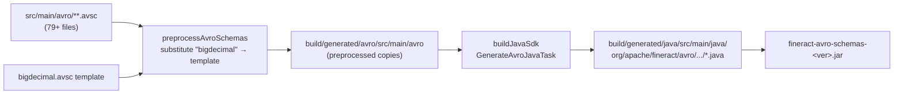

`fineract-avro-schemas` defines the **wire-format contract** for Apache Fineract's external event stream. Every payload that flows out of the platform via the JMS or Kafka producer is one of the `.avsc` schemas in `src/main/avro/`. There are 79+ schema files organized by domain (`loan/v1/`, `savings/v1/`, `client/v1/`, …) plus a top-level envelope. The Gradle plugin `com.github.davidmc24.gradle.plugin.avro` generates strongly-typed `SpecificRecord` Java classes from each `.avsc`. Downstream consumers shipped in Java pull the resulting JAR; non-JVM consumers vendor the schemas directly and use language-native Avro tooling. This page catalogues every schema and explains the build pipeline.

Source map:

- `fineract-avro-schemas/build.gradle`
- `fineract-avro-schemas/src/main/avro/**.avsc`
- `fineract-avro-schemas/src/main/resources/avro-generator-templates/` (custom Avro codegen templates)
- `fineract-avro-schemas/src/main/resources/avro-templates/bigdecimal.avsc` (BigDecimal preprocessor template)

## Build pipeline



From `fineract-avro-schemas/build.gradle`:

```groovy
apply plugin: 'com.github.davidmc24.gradle.plugin.avro-base'

abstract class PreprocessAvroSchemasTask extends DefaultTask {
    @InputDirectory  abstract DirectoryProperty getInputDir()
    @InputFile       abstract RegularFileProperty getBigDecimalTemplate()
    @OutputDirectory abstract DirectoryProperty getOutputDir()

    @TaskAction
    def preprocess() {
        def template = getBigDecimalTemplate().get().asFile.getText("UTF-8")
        def input  = getInputDir().get().asFile
        def output = getOutputDir().get().asFile

        input.eachFileRecurse { file ->
            if (file.isFile()) {
                def relativePath = input.toPath().relativize(file.toPath())
                def targetFile   = output.toPath().resolve(relativePath).toFile()
                targetFile.parentFile.mkdirs()
                targetFile.text  = file.text.replaceAll("\"bigdecimal\"", template)
            }
        }
    }
}

tasks.register('preprocessAvroSchemas', PreprocessAvroSchemasTask) {
    inputDir            = file("$projectDir/src/main/avro")
    bigDecimalTemplate  = file("$projectDir/src/main/resources/avro-templates/bigdecimal.avsc")
    outputDir           = file("$buildDir/generated/avro/src/main/avro")
}

task buildJavaSdk(type: com.github.davidmc24.gradle.plugin.avro.GenerateAvroJavaTask) {
    source("$buildDir/generated/avro/src/main/avro")
    outputDir         = file("$buildDir/generated/java/src/main/java")
    templateDirectory = "$projectDir/src/main/resources/avro-generator-templates/"
}

buildJavaSdk.dependsOn(preprocessAvroSchemas, spotlessJsonApply)
```

Two custom touches:

1. **`PreprocessAvroSchemasTask`** — Avro doesn't have a native `BigDecimal` primitive. The convention here is that whenever a schema needs a decimal, it writes `"bigdecimal"` as the type, and the preprocessor expands it into the canonical Avro logical-type record (`{"type":"bytes","logicalType":"decimal","precision":...,"scale":...}` etc.). The template lives at `src/main/resources/avro-templates/bigdecimal.avsc`. The result is that the source `.avsc` files stay readable and the generated Java uses `BigDecimal` throughout.
2. **Custom codegen templates** in `src/main/resources/avro-generator-templates/` — override the davidmc24 Avro plugin's Mustache templates so the generated classes carry the ASF license header and a consistent `equals`/`hashCode` style.

The fineract-provider build wires this in so the Avro classes are available when the provider compiles:

```groovy
// fineract-provider/build.gradle
compileJava {
    dependsOn ':fineract-avro-schemas:buildJavaSdk'
}
```

## Envelope schemas

The outer envelope is always `MessageV1`. For bulk events, the inner payload is `BulkMessagePayloadV1` which lists `BulkMessageItemV1` records each carrying its own `dataschema` pointer.

### `MessageV1.avsc`

```json
{
    "name": "MessageV1",
    "namespace": "org.apache.fineract.avro",
    "type": "record",
    "fields": [
        { "name": "id",            "type": "long",   "doc": "The ID of the message to be sent" },
        { "name": "source",        "type": "string", "doc": "A unique identifier of the source service" },
        { "name": "type",          "type": "string", "doc": "The type of event the payload refers to. For example LoanApprovedBusinessEvent" },
        { "name": "category",      "type": "string", "doc": "The category of event the payload refers to. For example LOAN" },
        { "name": "createdAt",     "type": "string", "doc": "The UTC time of when the event has been raised; in ISO_LOCAL_DATE_TIME format. For example 2011-12-03T10:15:30" },
        { "name": "businessDate",  "type": "string", "doc": "The business date when the event has been raised; in ISO_LOCAL_DATE format. For example 2011-12-03" },
        { "name": "tenantId",      "type": "string", "doc": "The tenantId that the event has been sent from. For example default" },
        { "name": "idempotencyKey","type": "string", "doc": "The idempotency key for this particular event for consumer de-duplication" },
        { "name": "dataschema",    "type": "string", "doc": "The fully qualified name of the schema of the event payload. For example org.apache.fineract.avro.loan.v1.LoanAccountDataV1" },
        { "name": "data",          "type": "bytes",  "doc": "The payload data serialized into Avro bytes" }
    ]
}
```

Every event consumer reads this **first**, then uses `dataschema` to pick the inner reader. Consumer pattern in pseudocode:

```java
DatumReader<MessageV1>  envelopeReader = new SpecificDatumReader<>(MessageV1.class);
MessageV1 env = envelopeReader.read(null, DecoderFactory.get().binaryDecoder(bytes, null));

switch (env.getDataschema().toString()) {
    case "org.apache.fineract.avro.loan.v1.LoanAccountDataV1":
        var loanReader = new SpecificDatumReader<>(LoanAccountDataV1.class);
        var loan = loanReader.read(null, DecoderFactory.get().binaryDecoder(env.getData().array(), null));
        handleLoan(loan, env);
        break;
    case "org.apache.fineract.avro.BulkMessagePayloadV1":
        var bulkReader = new SpecificDatumReader<>(BulkMessagePayloadV1.class);
        var bulk = bulkReader.read(...);
        for (var item : bulk.getDatas()) {
            dispatch(item);   // recursively pick inner reader
        }
        break;
    ...
}
```

### `BulkMessagePayloadV1.avsc`

```json
{
    "name": "BulkMessagePayloadV1",
    "namespace": "org.apache.fineract.avro",
    "type": "record",
    "fields": [{
        "name": "datas",
        "doc":  "The individual messages within this bulk message",
        "type": { "type": "array", "items": "org.apache.fineract.avro.BulkMessageItemV1" }
    }]
}
```

### `BulkMessageItemV1.avsc`

```json
{
    "name": "BulkMessageItemV1",
    "namespace": "org.apache.fineract.avro",
    "type": "record",
    "fields": [
        { "name": "id",         "type": "long",   "doc": "The ID of the message to be sent" },
        { "name": "type",       "type": "string", "doc": "The type of event the payload refers to. For example LoanApprovedBusinessEvent" },
        { "name": "category",   "type": "string", "doc": "The category of event the payload refers to. For example LOAN" },
        { "name": "dataschema", "type": "string", "doc": "The fully qualified name of the schema of the event payload." },
        { "name": "data",       "type": "bytes",  "doc": "The payload data serialized into Avro bytes" }
    ]
}
```

Notice `BulkMessageItemV1` omits `source`, `createdAt`, `businessDate`, `tenantId`, `idempotencyKey` — those carry over from the **outer** `MessageV1` because the bulk is sent in one shot.

## Catalogue by domain

### Top-level / envelope

| File                      | Java class                                            | Purpose                                        |
|---------------------------|-------------------------------------------------------|------------------------------------------------|
| `MessageV1.avsc`          | `org.apache.fineract.avro.MessageV1`                  | Outer envelope of every event message.         |
| `BulkMessagePayloadV1.avsc` | `org.apache.fineract.avro.BulkMessagePayloadV1`      | Inner payload of `BulkBusinessEvent`.          |
| `BulkMessageItemV1.avsc`  | `org.apache.fineract.avro.BulkMessageItemV1`          | A single inner item inside a bulk payload.     |

### Loan domain (`loan/v1/`)

Largest domain — 33 schemas covering everything from account snapshot to delinquency, charges, schedule, and the ownership-transfer payload.

| File                                             | Description                                                                                              |
|--------------------------------------------------|----------------------------------------------------------------------------------------------------------|
| `LoanAccountDataV1.avsc`                          | Full loan-account snapshot. Payload of `LoanAccountSnapshotBusinessEvent`.                              |
| `LoanAccountSummaryDataV1.avsc`                   | Aggregated outstanding totals.                                                                          |
| `LoanSummaryDataV1.avsc`                          | Inner summary used by `LoanAccountDataV1`.                                                              |
| `LoanScheduleDataV1.avsc`                          | Full repayment schedule.                                                                                 |
| `LoanSchedulePeriodDataV1.avsc`                   | One period of the schedule.                                                                              |
| `LoanApplicationTimelineDataV1.avsc`              | Submitted / approved / disbursed milestones.                                                            |
| `LoanProductDataV1.avsc`                          | Product configuration snapshot.                                                                          |
| `LoanProductBorrowerCycleVariationDataV1.avsc`   | Borrower-cycle variations on the product.                                                                |
| `LoanProductGuaranteeDataV1.avsc`                 | Guarantee configuration.                                                                                 |
| `LoanProductInterestRecalculationDataV1.avsc`    | Interest-recalc product attributes.                                                                      |
| `LoanInterestRecalculationDataV1.avsc`            | Interest-recalc snapshot on a specific loan.                                                            |
| `LoanTermVariationsDataV1.avsc`                   | Per-loan term variation (rate change, term extension).                                                  |
| `LoanTransactionDataV1.avsc`                      | Transaction record. Payload of `LoanRepaymentBusinessEvent`, `LoanWaiveInterestBusinessEvent`, etc.    |
| `LoanTransactionEnumDataV1.avsc`                  | Enum data for transaction types.                                                                        |
| `LoanTransactionFlagsDataV1.avsc`                 | Flag bag (reversed, manual, accrued, etc.).                                                             |
| `LoanTransactionRelationDataV1.avsc`              | Linked transactions (chargeback, replay).                                                               |
| `LoanTransactionAdjustmentDataV1.avsc`            | Adjustment metadata.                                                                                     |
| `LoanChargeDataV1.avsc`                           | Charge snapshot. Payload of `LoanAddChargeBusinessEvent`.                                              |
| `LoanChargeDataRangeViewV1.avsc`                  | Range view of charges (for paging / windowed queries).                                                  |
| `LoanChargeDeletedV1.avsc`                        | Payload of `LoanChargeDeletedBusinessEvent`.                                                            |
| `LoanChargePaidByDataV1.avsc`                     | Charge-paid-by entries.                                                                                  |
| `LoanInstallmentChargeDataV1.avsc`                | Installment-charge snapshot.                                                                             |
| `LoanInstallmentDelinquencyBucketDataV1.avsc`     | Per-installment delinquency bucket.                                                                      |
| `LoanAccountDelinquencyRangeDataV1.avsc`           | Delinquency range data attached to a loan account.                                                       |
| `DelinquencyRangeDataV1.avsc`                     | Delinquency-range definition.                                                                            |
| `DelinquencyBucketDataV1.avsc`                    | Delinquency bucket (ladder).                                                                             |
| `DelinquencyPausePeriodV1.avsc`                   | Pause-period entries.                                                                                    |
| `DisbursementDataV1.avsc`                         | Tranche disbursement entry.                                                                              |
| `LoanAmountDataV1.avsc`                           | Plain { amount, currency } pair.                                                                         |
| `LoanRepaymentDueDataV1.avsc`                     | Due-date payload.                                                                                        |
| `RepaymentDueDataV1.avsc`                         | Item inside `LoanRepaymentDueDataV1`.                                                                    |
| `RepaymentPastDueDataV1.avsc`                     | Past-due item.                                                                                           |
| `UnpaidChargeDataV1.avsc`                         | Unpaid-charge item.                                                                                      |
| `LoanStatusEnumDataV1.avsc`                       | Loan-status enum data.                                                                                   |
| `LoanAccountStayedLockedDataV1.avsc`              | Payload of `LoanAccountsStayedLockedBusinessEvent` for a single loan.                                  |
| `LoanAccountsStayedLockedDataV1.avsc`             | List wrapper of `LoanAccountStayedLockedDataV1` (for the bulk event).                                  |
| `LoanOwnershipTransferDataV1.avsc`                | Payload of `LoanOwnershipTransferBusinessEvent` (see [Asset Externalization Flow](/flows/asset-externalization-flow)). |
| `OriginatorDetailsV1.avsc`                        | Loan-origination metadata.                                                                              |
| `CollectionDataV1.avsc`                           | Collection summary.                                                                                      |

### Savings domain (`savings/v1/`)

| File                                              | Description                                                                                              |
|---------------------------------------------------|----------------------------------------------------------------------------------------------------------|
| `SavingsAccountDataV1.avsc`                        | Full savings-account snapshot.                                                                          |
| `SavingsAccountSummaryDataV1.avsc`                | Summary aggregates.                                                                                      |
| `SavingsAccountChargeDataV1.avsc`                  | Charge snapshot.                                                                                         |
| `SavingsAccountChargesPaidByDataV1.avsc`           | Charge-paid-by entries.                                                                                  |
| `SavingsAccountTransactionDataV1.avsc`             | Transaction record.                                                                                      |
| `SavingsAccountTransactionEnumDataV1.avsc`         | Enum data for transaction types.                                                                        |
| `SavingsAccountApplicationTimelineDataV1.avsc`     | Submitted / approved / activated milestones.                                                            |
| `SavingsAccountStatusEnumDataV1.avsc`             | Status enum data.                                                                                        |
| `SavingsAccountSubStatusEnumDataV1.avsc`           | Sub-status enum data.                                                                                    |
| `SavingsAccountStayedLockedDataV1.avsc`           | Per-account locked payload.                                                                              |
| `SavingsAccountsStayedLockedDataV1.avsc`           | List wrapper for the bulk event.                                                                        |
| `AccountTransferDataV1.avsc`                       | Account-to-account transfer payload.                                                                    |

### Fixed-deposit and recurring-deposit

| File                                          | Description                                              |
|-----------------------------------------------|----------------------------------------------------------|
| `fixeddeposit/v1/FixedDepositAccountDataV1.avsc` | Fixed-deposit account snapshot.                       |
| `recurringdeposit/v1/RecurringDepositAccountDataV1.avsc` | Recurring-deposit account snapshot.            |

### Share-account domain (`share/v1/`)

| File                                                 | Description                                |
|------------------------------------------------------|--------------------------------------------|
| `ShareAccountDataV1.avsc`                            | Share-account snapshot.                    |
| `ShareAccountSummaryDataV1.avsc`                     | Aggregates.                                |
| `ShareAccountTransactionDataV1.avsc`                 | Transaction record.                        |
| `ShareAccountApplicationTimelineDataV1.avsc`         | Timeline milestones.                       |
| `ShareAccountStatusEnumDataV1.avsc`                   | Status enum.                               |
| `ShareProductDataV1.avsc`                             | Product snapshot.                          |
| `ShareProductMarketPriceDataV1.avsc`                  | Market-price entry on the product.         |

### Client domain (`client/v1/`)

| File                                       | Description                                |
|--------------------------------------------|--------------------------------------------|
| `ClientDataV1.avsc`                         | Client snapshot.                          |
| `ClientTimelineDataV1.avsc`                 | Timeline milestones.                       |
| `ClientCollateralManagementV1.avsc`         | Collateral attached to a client.           |

### Group domain (`group/v1/`)

| File                       | Description                          |
|----------------------------|--------------------------------------|
| `GroupGeneralDataV1.avsc`   | Group snapshot.                      |
| `GroupRoleDataV1.avsc`      | Role data within a group.            |

### Office / portfolio / payment / general ledger

| File                                          | Description                                        |
|-----------------------------------------------|----------------------------------------------------|
| `office/v1/OfficeDataV1.avsc`                  | Office snapshot.                                  |
| `portfolio/v1/PortfolioAccountDataV1.avsc`     | Portfolio-account snapshot (used by AccountTransfer). |
| `portfolio/v1/ChargeDataV1.avsc`               | Charge entity snapshot.                            |
| `portfolio/v1/RateDataV1.avsc`                 | Rate snapshot.                                     |
| `payment/v1/PaymentDetailDataV1.avsc`          | Payment-detail record.                             |
| `payment/v1/PaymentTypeDataV1.avsc`            | Payment-type definition.                           |
| `gl/v1/GLAccountDataV1.avsc`                   | GL account snapshot.                               |
| `document/v1/DocumentDataV1.avsc`              | Attached-document metadata.                        |

### Generic data records (`generic/v1/`)

Reusable pieces referenced by many domain schemas.

| File                                       | Description                                          |
|--------------------------------------------|------------------------------------------------------|
| `CalendarDataV1.avsc`                       | Calendar/scheduling entry.                          |
| `CodeValueDataV1.avsc`                      | Code-value lookup data.                              |
| `CommandProcessingResultV1.avsc`            | Standard write-side response envelope.               |
| `CurrencyDataV1.avsc`                       | Currency triplet (`code`, `name`, `decimalPlaces`).  |
| `EnumOptionDataV1.avsc`                     | Numeric enum option `{id, code, value}`.             |
| `StringEnumOptionDataV1.avsc`              | String-based enum option.                            |

## A typical inner schema in full

`LoanOwnershipTransferDataV1.avsc` (excerpt, first fields):

```json
{
    "name": "LoanOwnershipTransferDataV1",
    "namespace": "org.apache.fineract.avro.loan.v1",
    "type": "record",
    "fields": [
        { "name": "loanId",                  "type": "long" },
        { "default": null, "name": "loanExternalId",          "type": ["null", "string"] },
        { "default": null, "name": "type",                    "type": ["null", "string"] },
        { "default": null, "name": "transferExternalId",      "type": ["null", "string"] },
        { "default": null, "name": "transferExternalGroupId", "type": ["null", "string"] },
        { "default": null, "name": "submittedDate",           "type": ["null", "string"] },
        …
    ]
}
```

Conventions you'll see throughout:

- **All optional fields use the `["null", T]` union with `"default": null`.** This is what guarantees forward-compatibility: an older reader missing a newer field still successfully reads (the field becomes null).
- **Dates are strings** in ISO_LOCAL_DATE / ISO_LOCAL_DATE_TIME format. Avro does have logical date types, but the project sticks to strings to maximize cross-language consumer simplicity.
- **Money** uses the `"bigdecimal"` token expanded by `PreprocessAvroSchemasTask` into a `bytes`-logical-decimal record (or, more often in this codebase, into a struct with `amount` and `currency` references).
- **Enums are records** (e.g. `LoanStatusEnumDataV1`) rather than Avro `enum`s, again for cross-language compatibility and to carry both the numeric id and the display label.

## Generated Java class shape

For `LoanOwnershipTransferDataV1.avsc`, the generated class is at:

```
fineract-avro-schemas/build/generated/java/src/main/java/org/apache/fineract/avro/loan/v1/LoanOwnershipTransferDataV1.java
```

It is a `SpecificRecordBase` with:

- Fluent setters / getters.
- Static `SCHEMA$` referencing the parsed schema.
- A `Builder` inner class.
- `customEncode` / `customDecode` for performance.

```java
public class LoanOwnershipTransferDataV1 extends SpecificRecordBase {
    public static final Schema SCHEMA$ = …;

    private long   loanId;
    private CharSequence loanExternalId;
    private CharSequence type;
    private CharSequence transferExternalId;
    // …

    public static Builder newBuilder() { … }

    public long          getLoanId() { return loanId; }
    public CharSequence  getType()   { return type; }
    // …
}
```

In `MessageV1.data` (`bytes`), the producer side encodes one of these records with `SpecificDatumWriter.write(record, BinaryEncoder)` → `byte[]`. The consumer mirrors with `SpecificDatumReader.read(null, BinaryDecoder.create(messageV1.getData().array()))`.

## Generating non-Java consumers

The schemas are pure JSON and can be consumed by any Avro implementation:

```bash
# Python
pip install fastavro
fastavro --schema fineract-avro-schemas/src/main/avro/loan/v1/LoanAccountDataV1.avsc < payload.avro

# Go
avro-cli --schema LoanAccountDataV1.avsc decode payload.bin

# Anywhere else: copy the .avsc files into your repo
```

Because of the `"bigdecimal"` token, **you must run the preprocessor before parsing** if you copy the raw `src/main/avro/*.avsc`. The preprocessed copies in `build/generated/avro/src/main/avro/` are the ones that are valid Avro JSON. Either depend on the JAR (Java only) or vendor the preprocessed copies (any language).

## Schema evolution rules

| Allowed change                                | Why it's safe                                                                                  |
|------------------------------------------------|-----------------------------------------------------------------------------------------------|
| Add a new optional field (`["null", T]` + `"default": null`) | Old readers ignore unknown fields; new readers see `null` from old producers.                |
| Rename a field with `aliases`                  | Avro alias lookup keeps both names valid for one release.                                     |
| Add a new top-level schema `*V1` or `*V2`     | New `dataschema` value; consumers route by string match.                                       |

| Not allowed                                    | Workaround                                                                                     |
|------------------------------------------------|-----------------------------------------------------------------------------------------------|
| Remove a field                                  | Make it null-only and stop populating it; deprecate over time. Eventually create `*V2`.       |
| Change a field's type incompatibly             | Add a new field with the new type; deprecate the old one; eventually create `*V2`.            |
| Add a required field                            | Default to `null` and treat absence as no-op; or create `*V2`.                                |

The strict rule: **never modify a `V1` schema in a non-backward-compatible way**. Create a `V2` and update producers and consumers separately.

## Common pitfalls

| Symptom                                                                          | Cause                                                                                                | Fix                                                                                                                       |
|----------------------------------------------------------------------------------|-------------------------------------------------------------------------------------------------------|---------------------------------------------------------------------------------------------------------------------------|
| `AvroTypeException: Found ..., expecting "bigdecimal"`                            | Tried to parse the raw `src/main/avro/...avsc` instead of the preprocessed copy                       | Use the JAR, or run `preprocessAvroSchemas` and use `build/generated/avro/src/main/avro/...`                              |
| Consumer can deserialize old payloads but new ones fail                          | Producer sent a record with a new required field; reader schema missing the field                     | Always use `["null", T]` + default null for new fields; bump consumers                                                    |
| Java class missing after `compileJava`                                           | `buildJavaSdk` task wasn't executed (no incoming dependency)                                          | `./gradlew :fineract-avro-schemas:buildJavaSdk` or `dependsOn` it from your module                                         |
| `Schema fingerprint mismatch` when using a registry                              | Producer and consumer agree on Avro JSON but consumer's parser canonicalized differently              | Use the same Avro library version on both sides; check `SchemaNormalization.toParsingForm(schema)`                         |
| Date-string parsing inconsistency                                               | Producer used `ISO_LOCAL_DATE_TIME` but consumer parsed with `ISO_INSTANT`                            | Honor the `doc` field on each schema entry; producer-side serialization always uses ISO_LOCAL_* per the schemas             |

## Cross-references

- [Events Overview](/events/overview) — producer side of the pipeline
- [Avro Schemas (producer view)](/events/avro-schemas) — same schemas from the platform's emission perspective
- [External Event Consumers](/clients/external-event-consumers) — how to subscribe and de-duplicate
- [Asset Externalization Flow](/flows/asset-externalization-flow) — example end-to-end use of `LoanOwnershipTransferDataV1`
- [Clients Overview](/clients/overview) — module map
