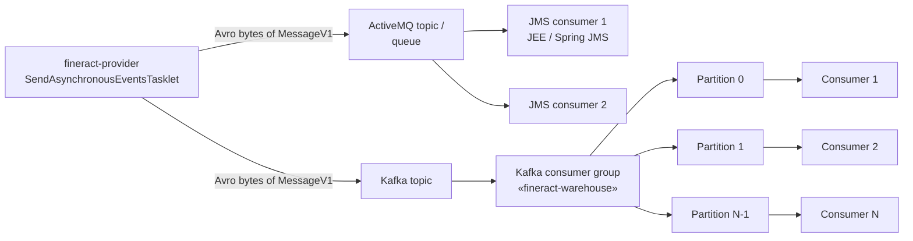

Once Apache Fineract is publishing external events through the JMS or Kafka producer (see [Events Overview](/events/overview), [JMS Producer](/events/event-producer-jms), [Kafka Producer](/events/event-producer-kafka)), the downstream side is left as an exercise for the integrator — Fineract does not ship a consumer module. This page covers the patterns we recommend for that consumer: how to subscribe, how to parse the Avro envelope, how to handle bulk payloads, how to de-duplicate on the platform's idempotency key, and how to size consumer groups. The page assumes JVM consumers and uses `fineract-avro-schemas` for the wire-format classes, but the patterns translate to Python/Go with native Avro libraries.

## Wire format recap

Every event Fineract emits is one Avro-encoded `MessageV1` record (the schema lives in [Avro Schemas](/clients/avro-schemas)):

```json
{
    "name": "MessageV1",
    "namespace": "org.apache.fineract.avro",
    "type": "record",
    "fields": [
        { "name": "id",            "type": "long" },
        { "name": "source",        "type": "string" },
        { "name": "type",          "type": "string" },
        { "name": "category",      "type": "string" },
        { "name": "createdAt",     "type": "string" },
        { "name": "businessDate",  "type": "string" },
        { "name": "tenantId",      "type": "string" },
        { "name": "idempotencyKey","type": "string" },
        { "name": "dataschema",    "type": "string" },
        { "name": "data",          "type": "bytes" }
    ]
}
```

For multi-event business events the inner payload is `BulkMessagePayloadV1` whose `datas[]` is a list of `BulkMessageItemV1` — each item carries its own `dataschema` and `data`.

## Consumer landscape



The producer side has been documented elsewhere; downstream patterns differ between JMS and Kafka:

| Transport          | Subscription model                                             | Ordering                                          | Group fan-out                            |
|--------------------|-----------------------------------------------------------------|---------------------------------------------------|------------------------------------------|
| JMS Topic          | Pub-sub: every subscriber gets every message                    | Per producer thread (parallel session sharding partitions within the producer; consumer sees an interleaved stream) | Each subscriber gets the full feed       |
| JMS Queue          | Point-to-point: each message goes to exactly one subscriber     | Same as topic                                     | Subscribers form an implicit group       |
| Kafka Topic        | Consumer groups: each partition consumed by one member          | Per-partition ordered                             | Group `n` members ≤ partition count       |

## Step 1 — Subscribe

### Kafka (Spring Kafka example)

```java
@Component
public class FineractEventListener {

    @KafkaListener(
        topics            = "${fineract.events.topic:fineract-events}",
        groupId           = "${fineract.events.consumer-group:fineract-warehouse}",
        containerFactory  = "fineractKafkaListenerContainerFactory")
    public void onMessage(ConsumerRecord<String, byte[]> record, Acknowledgment ack) {
        try {
            byte[] bytes = record.value();
            MessageV1 envelope = decodeEnvelope(bytes);
            dispatch(envelope);
            ack.acknowledge();          // manual commit
        } catch (Exception e) {
            // do NOT ack — message will be redelivered after consumer-side timeout
            log.error("Failed to process event {}", e.getMessage(), e);
            throw e;
        }
    }
}
```

The container factory needs the **byte deserializer** because Fineract publishes raw Avro bytes (no Confluent schema-registry framing):

```java
@Bean
public ConcurrentKafkaListenerContainerFactory<String, byte[]> fineractKafkaListenerContainerFactory() {
    Map<String, Object> cfg = new HashMap<>();
    cfg.put(ConsumerConfig.BOOTSTRAP_SERVERS_CONFIG,    bootstrap);
    cfg.put(ConsumerConfig.KEY_DESERIALIZER_CLASS_CONFIG,   StringDeserializer.class);
    cfg.put(ConsumerConfig.VALUE_DESERIALIZER_CLASS_CONFIG, ByteArrayDeserializer.class);
    cfg.put(ConsumerConfig.ENABLE_AUTO_COMMIT_CONFIG, false);
    cfg.put(ConsumerConfig.AUTO_OFFSET_RESET_CONFIG,  "earliest");
    cfg.put(ConsumerConfig.MAX_POLL_RECORDS_CONFIG,   100);

    var factory = new ConcurrentKafkaListenerContainerFactory<String, byte[]>();
    factory.setConsumerFactory(new DefaultKafkaConsumerFactory<>(cfg));
    factory.getContainerProperties().setAckMode(AckMode.MANUAL);
    factory.setConcurrency(3);    // ≤ partition count
    return factory;
}
```

### JMS (Spring JMS example)

```java
@Configuration
@EnableJms
public class FineractJmsConfig {

    @Bean
    public ActiveMQConnectionFactory cf(@Value("${activemq.broker-url}") String url) {
        ActiveMQConnectionFactory cf = new ActiveMQConnectionFactory();
        cf.setBrokerURL(url);
        cf.setTrustAllPackages(true);
        return cf;
    }

    @Bean(name = "topicListenerContainerFactory")
    public DefaultJmsListenerContainerFactory listenerContainerFactory(ActiveMQConnectionFactory cf) {
        var f = new DefaultJmsListenerContainerFactory();
        f.setConnectionFactory(new CachingConnectionFactory(cf));
        f.setPubSubDomain(true);             // topic
        f.setConcurrency("3-10");
        f.setSessionAcknowledgeMode(Session.CLIENT_ACKNOWLEDGE);
        return f;
    }
}

@Component
public class FineractTopicListener {

    @JmsListener(destination = "${fineract.events.topic-name}",
                 containerFactory = "topicListenerContainerFactory")
    public void onMessage(BytesMessage message) throws JMSException {
        byte[] bytes = new byte[(int) message.getBodyLength()];
        message.readBytes(bytes);
        MessageV1 envelope = decodeEnvelope(bytes);
        dispatch(envelope);
        message.acknowledge();
    }
}
```

For a topic, **each subscriber gets every message**. If you want one logical consumer with multiple instances for HA / throughput, use a queue instead — or switch to Kafka where consumer groups are first-class.

## Step 2 — Decode the envelope

```java
private static final DatumReader<MessageV1> ENV_READER =
        new SpecificDatumReader<>(MessageV1.class);

public MessageV1 decodeEnvelope(byte[] bytes) {
    try {
        BinaryDecoder decoder = DecoderFactory.get().binaryDecoder(bytes, null);
        return ENV_READER.read(null, decoder);
    } catch (IOException e) {
        throw new UncheckedIOException("Cannot decode MessageV1", e);
    }
}
```

Generated `MessageV1` lives at `org.apache.fineract.avro.MessageV1` in `fineract-avro-schemas`. Pull the JAR with:

```groovy
dependencies {
    implementation 'org.apache.fineract:fineract-avro-schemas:<version>'   // local build
    implementation 'org.apache.avro:avro:1.11.+'
}
```

(The Apache release does not currently publish this JAR to Maven Central; build it from source and `publishToMavenLocal` for now.)

## Step 3 — De-duplicate on `idempotencyKey`

Fineract's producer writes events with **at-least-once** semantics. Network blips, broker re-deliveries, or consumer crashes between processing and commit will give you the same `MessageV1` twice. The `idempotencyKey` field exists for this exact reason — it's a UUID generated by `DefaultExternalEventIdempotencyKeyGenerator` on the producer side, per outbox row.

```java
public void dispatch(MessageV1 envelope) {
    String key = envelope.getIdempotencyKey().toString();

    if (processedKeys.contains(key)) {
        log.debug("Skipping duplicate event with idempotency key {}", key);
        return;
    }

    try {
        switch (envelope.getDataschema().toString()) {
            case "org.apache.fineract.avro.loan.v1.LoanAccountDataV1":
                handleLoan(decode(envelope.getData(), LoanAccountDataV1.class), envelope);
                break;
            case "org.apache.fineract.avro.loan.v1.LoanTransactionDataV1":
                handleLoanTransaction(decode(envelope.getData(), LoanTransactionDataV1.class), envelope);
                break;
            case "org.apache.fineract.avro.BulkMessagePayloadV1":
                handleBulk(decode(envelope.getData(), BulkMessagePayloadV1.class), envelope);
                break;
            default:
                log.warn("Unknown dataschema {}", envelope.getDataschema());
        }
        processedKeys.add(key);
    } catch (Exception e) {
        // do not mark as processed — broker will redeliver
        throw e;
    }
}
```

`processedKeys` is a **persistent** store, typically a small table:

```sql
CREATE TABLE processed_events (
    idempotency_key VARCHAR(64) PRIMARY KEY,
    processed_at    TIMESTAMPTZ NOT NULL DEFAULT now(),
    event_type      VARCHAR(128) NOT NULL,
    tenant_id       VARCHAR(64)  NOT NULL,
    INDEX idx_processed_at (processed_at)
);
```

The `INSERT ... ON CONFLICT DO NOTHING` (PostgreSQL) or `INSERT IGNORE` (MySQL/MariaDB) pattern gives you atomic check-and-mark:

```java
public boolean recordProcessed(String key, String type, String tenantId) {
    int affected = jdbcTemplate.update(
        "INSERT INTO processed_events (idempotency_key, event_type, tenant_id) " +
        "VALUES (?, ?, ?) ON CONFLICT (idempotency_key) DO NOTHING",
        key, type, tenantId);
    return affected > 0;        // true = newly recorded, false = already processed
}
```

Wire it as:

```java
if (!recordProcessed(key, envelope.getType().toString(), envelope.getTenantId().toString())) {
    return;   // already processed
}
processInsideTransaction(envelope);
```

For the "exactly once + side effects" semantics, hold both the side-effect insert and the `processed_events` insert in the same transaction. Then ack the broker.

### Periodic cleanup

The `processed_events` table grows unboundedly. Run a daily job:

```sql
DELETE FROM processed_events
 WHERE processed_at < now() - INTERVAL '30 days';
```

Thirty days is comfortably above any expected broker redelivery window (ActiveMQ default DLQ time-to-live is 14 days; Kafka's `log.retention.ms` typically caps at 7 days).

## Step 4 — Decode the inner payload

```java
public <T extends SpecificRecord> T decode(ByteBuffer bytes, Class<T> klass) {
    try {
        DatumReader<T> reader = new SpecificDatumReader<>(klass);
        BinaryDecoder decoder = DecoderFactory.get().binaryDecoder(bytes.array(), null);
        return reader.read(null, decoder);
    } catch (IOException e) {
        throw new UncheckedIOException("Cannot decode " + klass.getSimpleName(), e);
    }
}
```

The `dataschema` field of `MessageV1` is the fully qualified Java/Avro class name — use it to route. A common pattern is a `Map<String, Class<? extends SpecificRecord>>` dispatch table populated at startup by scanning all `*V1` classes in `org.apache.fineract.avro.*`.

### Handling bulk events

```java
private void handleBulk(BulkMessagePayloadV1 bulk, MessageV1 envelope) {
    for (BulkMessageItemV1 item : bulk.getDatas()) {
        // Build a synthetic envelope so downstream handlers get full context
        MessageV1 inner = MessageV1.newBuilder()
                .setId(item.getId())
                .setType(item.getType())
                .setCategory(item.getCategory())
                .setDataschema(item.getDataschema())
                .setData(item.getData())
                // Carry the outer envelope's fields:
                .setSource(envelope.getSource())
                .setCreatedAt(envelope.getCreatedAt())
                .setBusinessDate(envelope.getBusinessDate())
                .setTenantId(envelope.getTenantId())
                .setIdempotencyKey(envelope.getIdempotencyKey() + ":" + item.getId())
                .build();
        dispatch(inner);
    }
}
```

The synthetic `idempotencyKey` is the outer key concatenated with the item id — gives each inner event its own de-dup record while staying traceable to the bulk envelope.

## Consumer-group sizing (Kafka)

Fineract's Kafka producer routes events by a stable hash on the **aggregate root** (loan id, savings id, client id, etc.) to the right partition. This guarantees:

- All events for the same loan land on the same partition.
- Within a partition, ordering is preserved.

To preserve that order on the consumer side, **never set consumer concurrency above the partition count**. Worked example:

| Topic config              | Sensible consumer group sizing                                                                    |
|---------------------------|-----------------------------------------------------------------------------------------------------|
| `partitions=4`            | 1–4 consumer instances. With 4 you get max parallelism; with 2 each consumer owns 2 partitions.    |
| `partitions=16`           | 1–16. Common: 4 instances × 4 concurrency = 16 (one thread per partition).                         |
| `partitions=N`            | Group can grow horizontally up to N; further instances sit idle.                                    |

For the topic size, the rule of thumb is `partitions = peak_events_per_second / per-consumer-throughput * safety_factor`. With Fineract's typical event rate of 50–500 ev/s, `partitions=8` to `partitions=16` is comfortable.

## Recovery and replay

Two layers of recovery:

1. **Broker retention** — events live in the broker for the configured retention window. For Kafka with `log.retention.ms=7d`, you can replay the last week by resetting the consumer group offset:

    ```bash
    kafka-consumer-groups.sh --bootstrap-server <bs> \
        --group fineract-warehouse \
        --topic fineract-events --reset-offsets --to-datetime 2024-09-01T00:00:00.000 \
        --execute
    ```

2. **Database outbox** — every event also lives in Fineract's `m_external_event` table for `purge-events-job`'s retention window. If you lose the broker entirely, see [Purge Events Job](/events/purge-events-job) for the cleanup policy and the manual replay procedure documented there.

## Monitoring

Consumer-side metrics worth surfacing:

| Metric                                | Source                                                    | Alarm threshold                                  |
|---------------------------------------|-----------------------------------------------------------|--------------------------------------------------|
| Consumer lag (Kafka)                  | `kafka.consumer:type=consumer-fetch-manager-metrics,name=records-lag-max` | > minutes-of-acceptable-staleness               |
| Processing rate                       | App metric: `events_processed_total{type=...}`           | sudden drop                                      |
| Duplicate rate                        | `events_duplicate_total / events_processed_total`         | > 1% — indicates broker redelivery storm         |
| Decode failures                       | `events_decode_errors_total`                              | > 0 over a 5-min window                          |
| `processed_events` table size         | `count(*) FROM processed_events`                           | > predicted; tune cleanup window                 |

## End-to-end consumer skeleton

```java
@Component
@RequiredArgsConstructor
@Slf4j
public class FineractEventConsumer {

    private final ProcessedEventStore  processedEvents;
    private final WarehouseSink         warehouseSink;
    private final MeterRegistry         metrics;

    private static final DatumReader<MessageV1> ENV_READER =
            new SpecificDatumReader<>(MessageV1.class);

    @KafkaListener(topics = "${fineract.events.topic}",
                   groupId = "${fineract.events.consumer-group}")
    @Transactional
    public void onMessage(ConsumerRecord<String, byte[]> record, Acknowledgment ack) {
        Timer.Sample sample = Timer.start(metrics);

        try {
            MessageV1 envelope = decodeEnvelope(record.value());
            String key = envelope.getIdempotencyKey().toString();

            if (!processedEvents.tryRecord(key, envelope.getType().toString(),
                                           envelope.getTenantId().toString())) {
                metrics.counter("events.duplicate", "type", envelope.getType().toString())
                       .increment();
                ack.acknowledge();
                return;
            }

            handle(envelope);
            metrics.counter("events.processed", "type", envelope.getType().toString())
                   .increment();
            ack.acknowledge();
        } catch (Exception e) {
            metrics.counter("events.decode_errors").increment();
            log.error("Failed to process event from partition {} offset {}",
                      record.partition(), record.offset(), e);
            // Do NOT ack — Kafka will redeliver after session timeout.
            throw e;
        } finally {
            sample.stop(metrics.timer("events.processing_time"));
        }
    }

    private MessageV1 decodeEnvelope(byte[] bytes) throws IOException {
        return ENV_READER.read(null, DecoderFactory.get().binaryDecoder(bytes, null));
    }

    private void handle(MessageV1 envelope) throws IOException {
        switch (envelope.getDataschema().toString()) {
            case "org.apache.fineract.avro.loan.v1.LoanAccountDataV1":
                warehouseSink.upsertLoan(decode(envelope.getData(), LoanAccountDataV1.class), envelope);
                break;
            case "org.apache.fineract.avro.loan.v1.LoanTransactionDataV1":
                warehouseSink.appendTxn(decode(envelope.getData(), LoanTransactionDataV1.class), envelope);
                break;
            case "org.apache.fineract.avro.savings.v1.SavingsAccountDataV1":
                warehouseSink.upsertSavings(decode(envelope.getData(), SavingsAccountDataV1.class), envelope);
                break;
            case "org.apache.fineract.avro.loan.v1.LoanOwnershipTransferDataV1":
                warehouseSink.recordTransfer(decode(envelope.getData(), LoanOwnershipTransferDataV1.class), envelope);
                break;
            case "org.apache.fineract.avro.BulkMessagePayloadV1":
                BulkMessagePayloadV1 bulk = decode(envelope.getData(), BulkMessagePayloadV1.class);
                for (BulkMessageItemV1 item : bulk.getDatas()) {
                    handleInner(item, envelope);
                }
                break;
            default:
                log.warn("Unknown dataschema {}", envelope.getDataschema());
        }
    }

    private <T extends SpecificRecord> T decode(ByteBuffer bytes, Class<T> klass) throws IOException {
        DatumReader<T> reader = new SpecificDatumReader<>(klass);
        return reader.read(null, DecoderFactory.get().binaryDecoder(bytes.array(), null));
    }

    private void handleInner(BulkMessageItemV1 item, MessageV1 envelope) {
        // synthesize per-item envelope with derived idempotency key, then recurse
    }
}
```

## Common pitfalls

| Symptom                                                                    | Cause                                                                                            | Fix                                                                                                  |
|----------------------------------------------------------------------------|--------------------------------------------------------------------------------------------------|-------------------------------------------------------------------------------------------------------|
| Same event processed twice in the warehouse                                 | `processed_events` table not consulted, or table is in a separate DB from the sink              | Keep processed-events table in the same DB transaction as the sink                                    |
| Random skipped events                                                       | Container auto-acks before `dispatch` completes                                                  | Set `AckMode.MANUAL` (Kafka) / `CLIENT_ACKNOWLEDGE` (JMS) and call `acknowledge()` only on success    |
| Consumer lag grows without bound on Kafka                                   | Concurrency > partition count, or single-partition topic + slow handler                          | Increase partition count; scale consumer concurrency to match                                         |
| `AvroTypeException: Found ..., expecting ["null","string"]` on a known field | Server is emitting a newer schema; consumer SDK is older                                         | Bump `fineract-avro-schemas` JAR                                                                      |
| Bulk events double-processed when re-delivered                              | Bulk de-dup uses the outer key only; inner items already-processed get re-applied                 | Derive a per-item idempotency key (outer-key + `:` + item-id) as shown above                          |
| Out-of-order processing for the same loan                                   | Multiple Kafka partitions, but hashing isn't on the aggregate                                    | Confirm producer is configured to hash by loan id; otherwise reduce partition count to 1              |

## Cross-references

- [Events Overview](/events/overview) — producer architecture
- [Event Producer (JMS)](/events/event-producer-jms) — wire details for ActiveMQ
- [Event Producer (Kafka)](/events/event-producer-kafka) — wire details for Kafka
- [Event Idempotency](/events/event-idempotency) — producer-side generation of `MessageV1.idempotencyKey`
- [Avro Schemas](/clients/avro-schemas) — full schema catalogue
- [Purge Events Job](/events/purge-events-job) — outbox retention and replay
- [Clients Overview](/clients/overview) — module map
