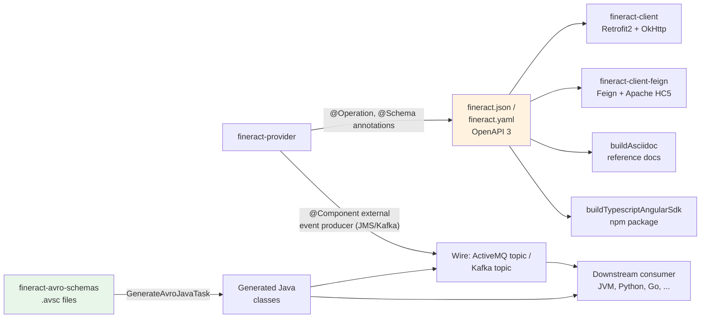
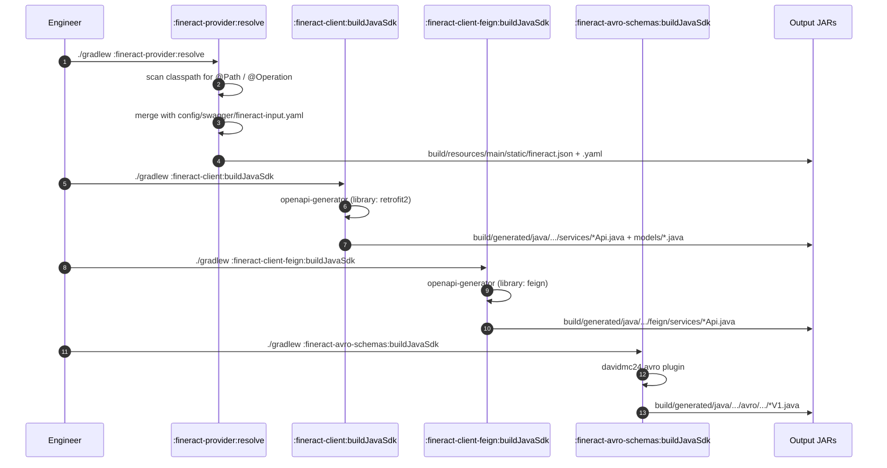
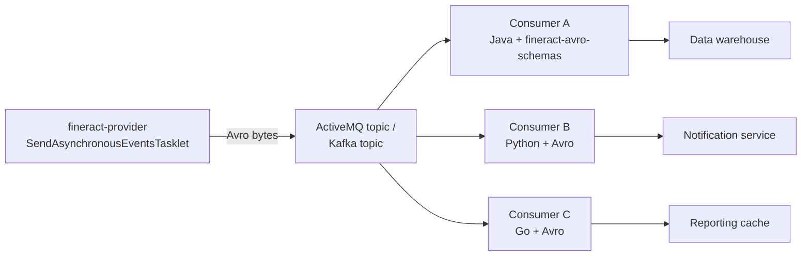
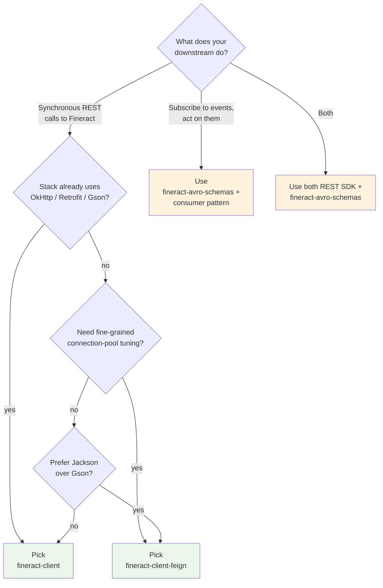

Apache Fineract ships three first-party Java consumer modules that allow other systems to interact with the platform: `fineract-client` (Retrofit-based REST SDK), `fineract-client-feign` (Feign-based REST SDK), and `fineract-avro-schemas` (the wire-format definitions for external events). All three are built from the same upstream source of truth — the JAX-RS resources in `fineract-provider` for the REST SDKs, and the `.avsc` files in `fineract-avro-schemas` for the event consumers. This page is the orientation map; the four following pages dive into each module and into the consumer-side patterns for the event stream.

## Module landscape



The three artifacts are independent — pick what you need:

| You want to…                                                | Use module              | Page                                                                                  |
|-------------------------------------------------------------|--------------------------|---------------------------------------------------------------------------------------|
| Call the REST API from a JVM service using Retrofit/OkHttp  | `fineract-client`        | [Fineract Client (Retrofit)](/clients/fineract-client)                                |
| Call the REST API from a JVM service using Feign/Spring     | `fineract-client-feign`  | [Fineract Client (Feign)](/clients/fineract-client-feign)                             |
| Subscribe to external events and decode the Avro payload    | `fineract-avro-schemas`  | [Avro Schemas](/clients/avro-schemas)                                                 |
| Build a downstream service consuming the event stream       | (combine the two below)  | [External Event Consumers](/clients/external-event-consumers)                         |

## Generation pipeline



A single command runs the whole chain (with appropriate task dependencies wired in):

```bash
./gradlew \
   :fineract-provider:resolve \
   :fineract-client:buildJavaSdk \
   :fineract-client-feign:buildJavaSdk \
   :fineract-avro-schemas:buildJavaSdk
```

## What each module ships and doesn't ship

| Module                    | Ships                                                                                                               | Does **not** ship                                                                |
|---------------------------|----------------------------------------------------------------------------------------------------------------------|-----------------------------------------------------------------------------------|
| `fineract-client`         | Retrofit interfaces, model POJOs, `FineractClient` builder, `Calls` helper, custom Gson adapters                    | OAuth2 client (you bring an interceptor), retry logic, circuit breaker            |
| `fineract-client-feign`   | Feign interfaces, model POJOs, `FineractFeignClient` builder, Apache HC5 pool, Jackson factory, error decoder       | OAuth2 client, retry logic (`Retryer.NEVER_RETRY`), Spring Cloud auto-config       |
| `fineract-avro-schemas`   | `.avsc` files, generated `SpecificRecord` Java classes (`*V1`), envelope `MessageV1` + `BulkMessagePayloadV1`         | Kafka/JMS consumer code, idempotency store, deserialization helpers              |

## REST SDK side-by-side comparison

| Concern              | fineract-client (Retrofit2)                                                | fineract-client-feign (Feign)                                                |
|----------------------|-----------------------------------------------------------------------------|------------------------------------------------------------------------------|
| Transport            | OkHttp                                                                      | Apache HttpClient 5 (configurable)                                            |
| Serialization        | Gson (with `JSON.getGson()` adapters incl. `ExternalIdAdapter`)            | Jackson (`ObjectMapperFactory.create()`)                                      |
| API style            | `client.clients().retrieveAll().execute()` → `Response<T>`                 | `client.clients().retrieveAll()` → returns `T` directly                       |
| Tenant injection     | `ApiKeyAuth` interceptor for header `fineract-platform-tenantid`             | `TenantIdRequestInterceptor`                                                  |
| Basic auth           | `HttpBasicAuth` interceptor                                                 | `BasicAuthRequestInterceptor`                                                 |
| OAuth2               | `oauth2Implementation: 'none'` (use your own interceptor)                   | `oauth2Implementation: 'none'`                                                |
| Builder              | `FineractClient.builder().baseURL(...).tenant(...).basicAuth(u, p).build()` | `FineractFeignClient.builder().baseUrl(...).tenantId(...).credentials(u, p).build()` |
| TLS skip for local   | `.insecure(true)`                                                           | `.disableSslVerification(true)`                                               |
| Generated source dir | `fineract-client/build/generated/java/src/main/java`                       | `fineract-client-feign/build/generated/java/src/main/java`                   |
| Test/error type      | `CallFailedRuntimeException`                                                | `CallFailedRuntimeException` + Feign's `FineractErrorDecoder`                |
| Jakarta EE namespace | n/a (no JAX-RS imports)                                                     | yes (`useJakartaEe: 'true'`)                                                  |

Both modules consume the same `fineract.json`. A change in `fineract-provider`'s JAX-RS surface flows into both SDKs on the next build.

## Avro / event consumer side

`fineract-avro-schemas` ships **only schema definitions** plus the Avro Java codegen. There is no transport code — that is intentional. Consumers wire the schemas into whatever JMS or Kafka client they prefer. The page [External Event Consumers](/clients/external-event-consumers) documents the consumer pattern, including:

- Outer envelope `MessageV1` (constant across all events).
- Inner payload keyed by `MessageV1.dataschema` (e.g. `org.apache.fineract.avro.loan.v1.LoanAccountDataV1`).
- Idempotency via `MessageV1.idempotencyKey` (consumer de-dup).
- `BulkMessagePayloadV1` for the multi-event `BulkBusinessEvent`.



## Build outputs

After a full build the three module artifacts land at:

```
fineract-client/build/libs/fineract-client-<version>.jar
fineract-client-feign/build/libs/fineract-client-feign-<version>.jar
fineract-avro-schemas/build/libs/fineract-avro-schemas-<version>.jar
```

None of the three are currently published to Maven Central by the Apache release (see the `// TODO: @vidakovic we should publish this lib to Maven Central` comment in `fineract-client/build.gradle` and `fineract-avro-schemas/build.gradle`). To use them downstream today, either build locally and `mavenLocal` install, or vendor the generated sources.

## Worked decision matrix

Use this if you're choosing a client for a new downstream service:



## Versioning and compatibility

The OpenAPI spec is gated by [Swagger Brake](/build/swagger-brake) — breaking REST changes cannot land without a baseline rotation. For the Avro side, the convention is **never change a V1 schema in a breaking way**; create a `V2` instead. The pattern is followed throughout the existing schemas:

```
loan/v1/LoanAccountDataV1.avsc       ← current
loan/v2/LoanAccountDataV2.avsc       ← when a breaking change is needed
```

Consumers register a reader-schema for `V1`; old producers writing `V1` continue to be readable. The `MessageV1.dataschema` field tells the consumer which inner reader to use, so consumers can support both `V1` and `V2` simultaneously during a migration.

## OpenAPI spec & idempotency contract

Both REST SDKs honor two server-side contracts you should know about regardless of which one you pick:

| Contract                              | What you do                                                                                                                                                                              |
|---------------------------------------|------------------------------------------------------------------------------------------------------------------------------------------------------------------------------------------|
| Tenant header                         | Always send `Fineract-Platform-TenantId: <id>`. Both SDKs do this through a builder method (`tenant(...)` / `tenantId(...)`).                                                              |
| Idempotency key header (where supported) | For write operations that the server gates with an idempotency check, set `X-Idempotency-Key: <UUID>` per logical request. Retry-safe.                                                |
| `Authorization`                       | HTTP Basic via builder (`basicAuth(...)` / `credentials(...)`); for OAuth2 add your own `Interceptor` (Retrofit) or `RequestInterceptor` (Feign) — both leave that slot intentionally open. |
| Two-factor                            | When the server runs in `twofactor` mode, add a header `Fineract-Platform-TFA-Token`. See [Two-Factor Auth Flow](/flows/two-factor-login-flow).                                            |

For event consumers, the relevant contract is `MessageV1.idempotencyKey` — every event carries a UUID per outbox row. Consumers deduplicate against it. See [External Event Consumers](/clients/external-event-consumers) for the persistence pattern.

## Choose your path

| If you're…                                                          | Start at                                                                  |
|---------------------------------------------------------------------|---------------------------------------------------------------------------|
| A JVM team that already uses Spring Cloud                            | [Fineract Client (Feign)](/clients/fineract-client-feign)                  |
| A JVM team that wants the most direct, low-magic SDK                 | [Fineract Client (Retrofit)](/clients/fineract-client)                     |
| Building an event-driven downstream consumer                         | [External Event Consumers](/clients/external-event-consumers)              |
| Working on the schemas themselves                                    | [Avro Schemas](/clients/avro-schemas)                                      |
| Looking for the generation gradle plumbing                           | [Swagger / OpenAPI](/build/swagger-and-openapi)                            |

## Module file layout cheat-sheet

```
fineract-client/
├── build.gradle                                      # openapi-generator (library: retrofit2)
├── src/main/java/org/apache/fineract/client/util/
│   ├── FineractClient.java                            # builder + per-API fields
│   ├── Calls.java                                     # Response<T> unwrapping
│   ├── CallFailedRuntimeException.java
│   ├── JSON.java                                      # Gson factory
│   └── adapter/ExternalIdAdapter.java                 # JSON adapter for ExternalId
└── src/main/resources/templates/java/api.mustache    # Mustache override

fineract-client-feign/
├── build.gradle                                      # openapi-generator (library: feign)
├── src/main/java/org/apache/fineract/client/feign/
│   ├── FineractFeignClient.java                       # builder + per-API methods
│   ├── FineractFeignClientConfig.java                 # connection pool + Feign builder
│   ├── BasicAuthRequestInterceptor.java
│   ├── TenantIdRequestInterceptor.java
│   ├── FineractErrorDecoder.java
│   ├── FineractMultipartEncoder.java
│   └── ObjectMapperFactory.java                       # Jackson factory
└── src/main/resources/templates/java/api.mustache    # Mustache override

fineract-avro-schemas/
├── build.gradle                                      # davidmc24 Avro plugin
├── src/main/avro/MessageV1.avsc                       # envelope
├── src/main/avro/{loan,savings,client,...}/v1/*.avsc # 79+ domain schemas
├── src/main/resources/avro-templates/bigdecimal.avsc  # preprocessor template
└── src/main/resources/avro-generator-templates/      # codegen overrides
```

## Maven coordinates

None of the three modules are currently published to Maven Central (see TODO comments in the respective `build.gradle` files). The fastest way to use them downstream:

```bash
./gradlew :fineract-client:publishToMavenLocal \
          :fineract-client-feign:publishToMavenLocal \
          :fineract-avro-schemas:publishToMavenLocal
```

Coordinates become:

```
org.apache.fineract:fineract-client:<version>
org.apache.fineract:fineract-client-feign:<version>
org.apache.fineract:fineract-avro-schemas:<version>
```

## Common use cases mapped to modules

| Scenario                                                                                          | Modules                                              | Notes                                                                                                                          |
|---------------------------------------------------------------------------------------------------|------------------------------------------------------|--------------------------------------------------------------------------------------------------------------------------------|
| Build an admin console that calls every Fineract endpoint                                          | `fineract-client` or `fineract-client-feign`         | Choose by stack preference; both expose the full API surface.                                                                  |
| Ingest loan/savings snapshots into a data warehouse in near real time                              | `fineract-avro-schemas` + Kafka consumer             | Subscribe to the Kafka topic; deserialize `LoanAccountDataV1`, `SavingsAccountDataV1`; upsert into the warehouse.              |
| Notify clients of loan-approval / repayment events                                                 | `fineract-avro-schemas` + JMS or Kafka consumer       | Listen for `LoanApprovedBusinessEvent` / `LoanRepaymentBusinessEvent`; resolve `phoneNumber`/`email` via the REST SDK; send.   |
| Build a credit-bureau integration that exports daily delinquency reports                          | REST SDK for `/runreports`, plus `fineract-avro-schemas` for `LoanAccountDelinquencyRangeDataV1` | Use the run-reports API for full extracts and the event stream for incremental updates.                                       |
| Implement a downstream investor-mapping service for asset externalization                          | `fineract-avro-schemas` + REST SDK                   | Subscribe to `LoanOwnershipTransferBusinessEvent` ([Asset Externalization Flow](/flows/asset-externalization-flow)); call REST to confirm. |
| Run integration tests against a local Fineract                                                     | `fineract-client` (Retrofit testing is well-trodden) | Use `.insecure(true)` for self-signed cert; assertions on `ResponseBody`.                                                       |
| Build a TypeScript / Angular admin SPA                                                             | The TypeScript-Angular SDK output of `:fineract-client:buildTypescriptAngularSdk` | Same generation pipeline, npm-publishable.                                                                                    |

## Lifecycle and refresh cadence

Every commit to `fineract-provider` that touches a JAX-RS resource or a Swagger annotation potentially shifts the spec. Consequence for each artifact:

| Artifact                       | Refresh cadence                                                                                                |
|--------------------------------|---------------------------------------------------------------------------------------------------------------|
| `fineract-client`              | Regenerate whenever the spec changes; SDK-consuming code typically pins to a server version.                  |
| `fineract-client-feign`        | Same as above.                                                                                                 |
| `fineract-avro-schemas`        | Refresh only when a `.avsc` is added or changed in a backward-compatible way (new optional field or new `*V2`). Consumers should be backward-compatible for at least one server release. |

The [Swagger Brake](/build/swagger-brake) CI gate prevents incompatible REST changes from landing. The Avro side relies on convention (never change a `V1` schema in a breaking way).

## Build commands cheat-sheet

```bash
# Regenerate the OpenAPI spec inside fineract-provider
./gradlew :fineract-provider:resolve

# Regenerate the Retrofit SDK from the spec
./gradlew :fineract-client:buildJavaSdk

# Regenerate the Feign SDK from the spec
./gradlew :fineract-client-feign:buildJavaSdk

# Regenerate the TypeScript-Angular SDK from the spec
./gradlew :fineract-client:buildTypescriptAngularSdk

# Generate the AsciiDoc reference docs from the spec
./gradlew :fineract-client:buildAsciidoc

# Preprocess and codegen the Avro classes
./gradlew :fineract-avro-schemas:buildJavaSdk

# Run breaking-change detection against the baseline
./gradlew :fineract-provider:checkBreakingChanges

# Publish all three modules to the local Maven repo for downstream consumption
./gradlew :fineract-client:publishToMavenLocal \
          :fineract-client-feign:publishToMavenLocal \
          :fineract-avro-schemas:publishToMavenLocal
```

## Cross-references

- [Swagger / OpenAPI Generation](/build/swagger-and-openapi) — how `fineract.json` is produced
- [Swagger Brake](/build/swagger-brake) — breaking-change gate
- [Events Overview](/events/overview) — the producer side of the event pipeline
- [Avro Schemas (events view)](/events/avro-schemas) — schemas seen from the producer perspective
- [Avro Schemas (consumer view)](/clients/avro-schemas) — schemas seen from the consumer perspective
- [Multi-Module Build](/build/gradle-multi-module) — where the three modules sit in the wider Gradle graph
- [Custom Modules](/build/custom-modules) — building proprietary modules that the SDKs don't yet know about
