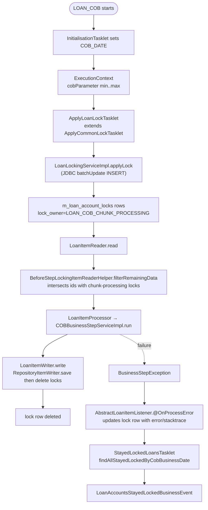
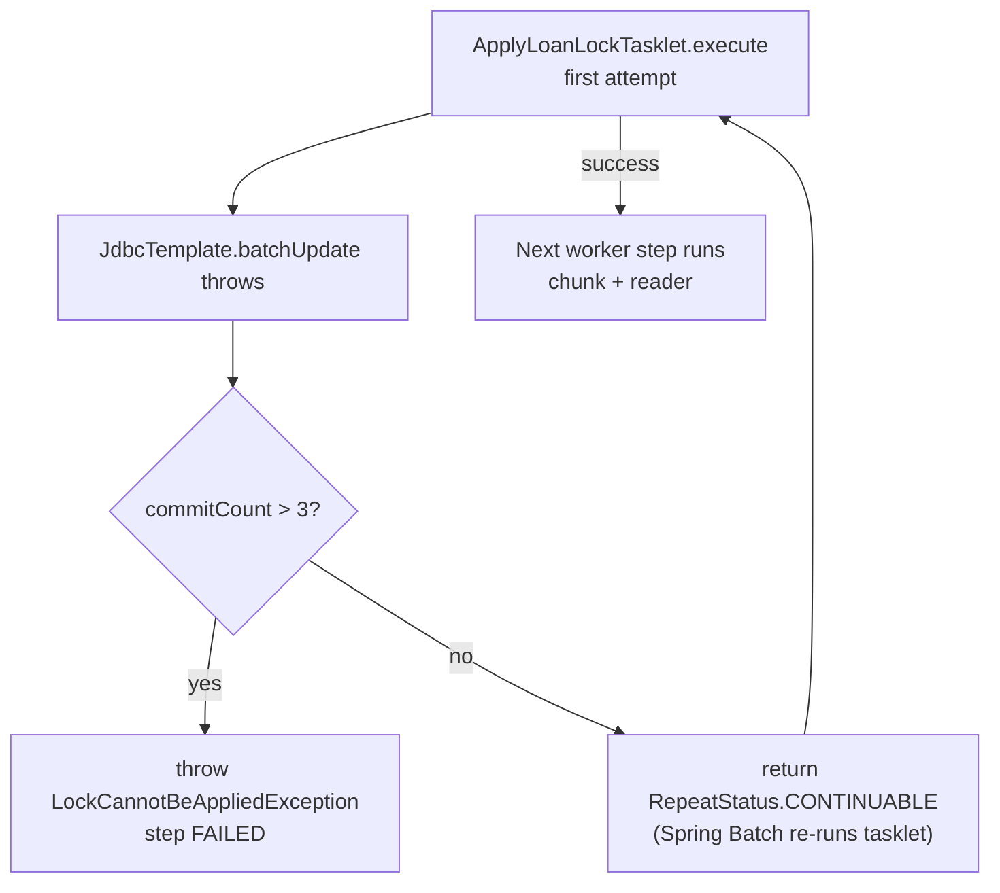

While COB is running over a loan or savings account, the rest of the platform must not write to it. That synchronisation point is a row in `m_loan_account_locks` (or `m_savings_account_locks` / `m_wc_loan_account_locks`) keyed by `(loan_id, lock_owner)`. The lock row is inserted by `ApplyCommonLockTasklet` before the chunk runs, deleted by the writer after the chunk persists, and queried by the request-side filter (`LoanCOBFilterHelper`) to decide whether to fail or trigger inline COB. This page documents the entity hierarchy, the `LockingService` API, every tasklet that touches lock rows, the `LockOwner` enum semantics and the corresponding savings types in `fineract-savings`.

## Lifecycle at a glance



Three writes can happen to the same row:

- `INSERT` — by `ApplyLoanLockTasklet` (or the inline executor).
- `UPDATE` — by `AbstractLoanItemListener` setting `error`/`stacktrace`, or by `LockingService.upgradeLock` migrating the row from `LOAN_INLINE_COB_PROCESSING` to `LOAN_COB_CHUNK_PROCESSING` (or vice versa).
- `DELETE` — by `AbstractLoanItemWriter.write` once the chunk persists.

## The entity hierarchy

`AccountLock` is the `@MappedSuperclass` that the per-aggregate lock tables share:

```java
// fineract-cob/src/main/java/org/apache/fineract/cob/domain/AccountLock.java
@Getter @Setter @MappedSuperclass @NoArgsConstructor
public abstract class AccountLock implements Persistable<Long>, Serializable {

    @Id @Column(name = "loan_id", nullable = false)
    private Long loanId;

    @Version @Column(name = "version")
    private Long version;

    @Enumerated(EnumType.STRING) @Column(name = "lock_owner", nullable = false)
    private LockOwner lockOwner;

    @Column(name = "lock_placed_on", nullable = false)
    private OffsetDateTime lockPlacedOn;

    @Column(name = "error")        private String error;
    @Column(name = "stacktrace")   private String stacktrace;

    @Column(name = "lock_placed_on_cob_business_date")
    private LocalDate lockPlacedOnCobBusinessDate;

    @Transient @Setter(value = AccessLevel.NONE)
    private boolean isNew = true;

    @PrePersist @PostLoad
    void markNotNew() { this.isNew = false; }

    @Override public Long getId() { return loanId; }

    public AccountLock(Long loanId, LockOwner lockOwner, LocalDate lockPlacedOnCobBusinessDate) {
        this.loanId = loanId;
        this.lockOwner = lockOwner;
        this.lockPlacedOn = DateUtils.getAuditOffsetDateTime();
        this.lockPlacedOnCobBusinessDate = lockPlacedOnCobBusinessDate;
    }

    public void setError(String errorMessage, String stacktrace) {
        this.error = errorMessage;
        this.stacktrace = stacktrace;
    }

    public void setNewLockOwner(LockOwner newLockOwner) {
        this.lockOwner = newLockOwner;
        this.lockPlacedOn = DateUtils.getAuditOffsetDateTime();
    }
}
```

Important details:

- **Primary key = `loan_id`.** A loan can have **at most one** lock row at any time. The `lock_owner` column is informational (and indexed) but does not participate in the PK. Lock ownership is mutually exclusive.
- **`@Version`** powers optimistic locking against concurrent updates from `LoanItemWriter`, the chunk listener, and the inline executor.
- **`lock_placed_on_cob_business_date`** is what `StayedLockedLoansTasklet` filters on (`= cobBusinessDate`).
- **`Persistable.isNew` flip** ensures that the explicit-id PK does not trigger a duplicate-key path on first persist.

The concrete subclasses are thin:

```java
// fineract-provider/.../cob/domain/LoanAccountLock.java
@Entity @Table(name = "m_loan_account_locks") @NoArgsConstructor
public class LoanAccountLock extends AccountLock {
    public LoanAccountLock(Long loanId, LockOwner owner, LocalDate cobDate) {
        super(loanId, owner, cobDate);
    }
}

// fineract-working-capital-loan/.../cob/domain/WorkingCapitalLoanAccountLock.java
@Entity @Table(name = "m_wc_loan_account_locks") @NoArgsConstructor
public class WorkingCapitalLoanAccountLock extends AccountLock { /* ctor */ }

// fineract-savings/.../cob/savings/SavingsAccountLock.java
// (NOTE: NOT extending AccountLock — has its own primary key savings_id)
@Entity @Table(name = "m_savings_account_locks") @NoArgsConstructor @Getter
public class SavingsAccountLock {
    @Id @Column(name = "savings_id", nullable = false) private Long savingsId;
    @Version @Column(name = "version")                 private Long version;
    @Enumerated(EnumType.STRING) @Column(name = "lock_owner", nullable = false)
    private SavingsLockOwner lockOwner;
    @Column(name = "lock_placed_on", nullable = false) private OffsetDateTime lockPlacedOn;
    @Column(name = "error")                            private String error;
    @Column(name = "stacktrace")                       private String stacktrace;
    @Column(name = "lock_placed_on_cob_business_date") private LocalDate lockPlacedOnCobBusinessDate;
    /* …same setError, setNewLockOwner pattern… */
}
```

<Note>
`SavingsAccountLock` is intentionally **not** a subclass of `AccountLock` — savings locks key on `savings_id` rather than `loan_id`, and the savings lock owner enum (`SavingsLockOwner`) is separate. The trade-off is duplication for type safety: a `LockingService<LoanAccountLock>` cannot accidentally accept a savings id.
</Note>

## LockOwner

```java
// fineract-cob/src/main/java/org/apache/fineract/cob/domain/LockOwner.java
public enum LockOwner {
    LOAN_COB_CHUNK_PROCESSING,
    LOAN_INLINE_COB_PROCESSING;
}

// fineract-savings/.../cob/savings/SavingsLockOwner.java
public enum SavingsLockOwner {
    SAVINGS_COB_CHUNK_PROCESSING,
    SAVINGS_INLINE_COB_PROCESSING;
}
```

| Owner | Held by | Held during |
| ----- | ------- | ----------- |
| `LOAN_COB_CHUNK_PROCESSING` | `ApplyLoanLockTasklet` then `loanBusinessStep` chunk | Daily COB run, from `applyLockStep` to `LoanItemWriter` commit. |
| `LOAN_INLINE_COB_PROCESSING` | `InlineLoanCOBExecutorServiceImpl.createAccountLock` | Inline COB run (via `POST /v1/jobs/LOAN_COB/inline` or HTTP filter). |
| `SAVINGS_COB_CHUNK_PROCESSING` | savings daily COB chunk | Savings daily run. |
| `SAVINGS_INLINE_COB_PROCESSING` | savings inline COB | Savings inline catch-up. |

The lock owner that "wins" when both nightly and inline want the same loan is determined by who inserts first. `LockingService.upgradeLock` is used by the inline path to migrate an existing chunk-processing lock to inline ownership when a stayed-locked loan needs to be retried.

## LockingService API

```java
// fineract-cob/src/main/java/org/apache/fineract/cob/domain/LockingService.java
public interface LockingService<T extends AccountLock> {
    void upgradeLock(List<Long> accountsToLock, LockOwner lockOwner);
    void deleteByLoanIdInAndLockOwner(List<Long> loanIds, LockOwner lockOwner);
    List<T> findAllByLoanIdIn(List<Long> loanIds);
    T findByLoanIdAndLockOwner(Long loanId, LockOwner lockOwner);
    List<T> findAllByLoanIdInAndLockOwner(List<Long> loanIds, LockOwner lockOwner);
    void applyLock(List<Long> loanIds, LockOwner lockOwner);
}
```

| Method | Caller | Behaviour |
| ------ | ------ | --------- |
| `applyLock(ids, owner)` | `ApplyCommonLockTasklet` | Batch-`INSERT` one row per id with `version=1`, `lock_placed_on=now`, `lock_placed_on_cob_business_date=COB_DATE`. |
| `upgradeLock(ids, owner)` | inline executor (when migrating an existing chunk lock to inline) | Batch-`UPDATE` `version=version+1, lock_owner=?, lock_placed_on=now`. |
| `deleteByLoanIdInAndLockOwner(ids, owner)` | `AbstractLoanItemWriter.write` after `super.write(items)` | Removes the row for every successfully written loan. |
| `findByLoanIdAndLockOwner(id, owner)` | `AbstractLoanItemListener.updateAccountLockWithError` | Used to attach error info. |
| `findAllByLoanIdIn(ids)` | `ApplyCommonLockTasklet.execute` (to skip already-locked ids) | Returns every lock row regardless of owner. |
| `findAllByLoanIdInAndLockOwner(ids, owner)` | `BeforeStepLockingItemReaderHelper.getLoanIdsLockedWithChunkProcessingLock` | Filter the reader queue to only locked ids. |

### AbstractLockingService

```java
// fineract-cob/src/main/java/org/apache/fineract/cob/domain/AbstractLockingService.java
@RequiredArgsConstructor @Slf4j
public abstract class AbstractLockingService<T extends AccountLock> implements LockingService<T> {

    private final JdbcTemplate jdbcTemplate;
    private final FineractProperties fineractProperties;
    private final AccountLockRepository<T> loanAccountLockRepository;

    protected abstract String getBatchLoanLockUpgrade();
    protected abstract String getBatchLoanLockInsert();

    @Override
    public void applyLock(List<Long> loanIds, LockOwner lockOwner) {
        LocalDate cobBusinessDate = ThreadLocalContextUtil.getBusinessDateByType(BusinessDateType.COB_DATE);
        jdbcTemplate.batchUpdate(getBatchLoanLockInsert(), loanIds, loanIds.size(),
            (ps, loanId) -> {
                ps.setLong(1, loanId);
                ps.setLong(2, 1);                                            // version
                ps.setString(3, lockOwner.name());
                ps.setObject(4, DateUtils.getAuditOffsetDateTime());
                ps.setObject(5, cobBusinessDate);
            });
    }

    @Override
    public void upgradeLock(List<Long> accountsToLock, LockOwner lockOwner) {
        jdbcTemplate.batchUpdate(getBatchLoanLockUpgrade(), accountsToLock, getInClauseParameterSizeLimit(),
            (ps, id) -> {
                ps.setString(1, lockOwner.name());
                ps.setObject(2, DateUtils.getAuditOffsetDateTime());
                ps.setLong(3, id);
            });
    }
    /* delegate other methods to loanAccountLockRepository */
}
```

Concrete subclass `LoanLockingServiceImpl`:

```java
// fineract-provider/.../cob/loan/LoanLockingServiceImpl.java
public class LoanLockingServiceImpl extends AbstractLockingService<LoanAccountLock> {

    private static final String BATCH_LOAN_LOCK_INSERT = """
        INSERT INTO m_loan_account_locks
            (loan_id, version, lock_owner, lock_placed_on, lock_placed_on_cob_business_date)
        VALUES (?,?,?,?,?)
        """;

    private static final String BATCH_LOAN_LOCK_UPGRADE = """
        UPDATE m_loan_account_locks
        SET version = version + 1, lock_owner = ?, lock_placed_on = ?
        WHERE loan_id = ?
        """;

    @Override protected String getBatchLoanLockUpgrade() { return BATCH_LOAN_LOCK_UPGRADE; }
    @Override protected String getBatchLoanLockInsert() { return BATCH_LOAN_LOCK_INSERT; }
}
```

Registered via:

```java
@Configuration
public class LoanLockingConfiguration {
    @Bean @ConditionalOnMissingBean
    public LockingService<LoanAccountLock> retrieveLoanLockingService() {
        return new LoanLockingServiceImpl(jdbcTemplate, fineractProperties, loanAccountLockRepository);
    }
}
```

`@ConditionalOnMissingBean` allows downstream installations to supply their own locking strategy (e.g. Redis-backed) without touching framework code.

The working-capital module ships `WorkingCapitalLoanLockingServiceImpl` analogously, targeting `m_wc_loan_account_locks`.

## ApplyCommonLockTasklet — the core acquirer

```java
// fineract-cob/src/main/java/org/apache/fineract/cob/tasklet/ApplyCommonLockTasklet.java
@Slf4j @RequiredArgsConstructor
public abstract class ApplyCommonLockTasklet<T extends AccountLock> implements Tasklet {

    private static final long NUMBER_OF_RETRIES = 3;
    private final FineractProperties fineractProperties;
    private final LockingService<T> loanLockingService;
    private final RetrieveIdService retrieveIdService;
    private final TransactionTemplate transactionTemplate;

    public abstract String getCOBParameter();
    public abstract LockOwner getLockOwner();

    @Override
    public RepeatStatus execute(@NonNull StepContribution contribution, @NonNull ChunkContext chunkContext)
            throws LockCannotBeAppliedException {

        ExecutionContext ctx = contribution.getStepExecution().getExecutionContext();
        long numberOfExecutions = contribution.getStepExecution().getCommitCount();
        COBParameter loanCOBParameter = COBParameterConverter.convert(ctx.get(getCOBParameter()));
        boolean isCatchUp = CatchUpFlagResolver.resolve(contribution.getStepExecution());

        List<Long> loanIds;
        if (loanCOBParameter == null
            || (loanCOBParameter.getMinAccountId() == null && loanCOBParameter.getMaxAccountId() == null)
            || (loanCOBParameter.getMinAccountId().equals(0L) && loanCOBParameter.getMaxAccountId().equals(0L))) {
            loanIds = Collections.emptyList();
        } else {
            loanIds = new ArrayList<>(
                retrieveIdService.retrieveAllNonClosedLoansByLastClosedBusinessDateAndMinAndMaxLoanId(
                    loanCOBParameter, isCatchUp));
        }

        // Remove ids that already have a lock from prior attempts.
        List<List<Long>> loanIdPartitions = Lists.partition(loanIds, getInClauseParameterSizeLimit());
        List<T> accountLocks = new ArrayList<>();
        loanIdPartitions.forEach(part -> accountLocks.addAll(loanLockingService.findAllByLoanIdIn(part)));
        List<Long> toBeProcessed = new ArrayList<>(loanIds);
        toBeProcessed.removeAll(accountLocks.stream().map(AccountLock::getId).toList());

        try {
            applyLocks(toBeProcessed);
        } catch (Exception e) {
            if (numberOfExecutions > NUMBER_OF_RETRIES) {
                throw new LockCannotBeAppliedException("There was an error applying lock to loan accounts.", e);
            } else {
                return RepeatStatus.CONTINUABLE;
            }
        }
        return RepeatStatus.FINISHED;
    }

    private void applyLocks(List<Long> ids) {
        transactionTemplate.setPropagationBehavior(PROPAGATION_REQUIRES_NEW);
        transactionTemplate.execute(new TransactionCallbackWithoutResult() {
            @Override
            protected void doInTransactionWithoutResult(@NonNull TransactionStatus status) {
                loanLockingService.applyLock(ids, getLockOwner());
            }
        });
    }

    private int getInClauseParameterSizeLimit() {
        return fineractProperties.getQuery().getInClauseParameterSizeLimit();
    }
}
```

Important details:

- **Empty range = no-op.** If the partition is the dummy `(0, 0, 1, 0)`, no lock rows are produced.
- **Already-locked ids are skipped** — a partition that was partially locked in a previous (failed) run does not error out, it just acquires the remaining ids.
- **Retries up to 3 times** — Spring Batch lets `RepeatStatus.CONTINUABLE` re-invoke the tasklet on failure. After 3 commits it gives up with `LockCannotBeAppliedException`.
- **Locks acquired in a `REQUIRES_NEW` transaction** so the chunk that follows can see them, even if the outer step gets rolled back.

Two subclasses pin the COB parameter key and lock owner:

```java
// fineract-provider/.../cob/loan/ApplyLoanLockTasklet.java
public class ApplyLoanLockTasklet extends ApplyCommonLockTasklet<LoanAccountLock> {
    @Override public String   getCOBParameter() { return COBConstant.COB_PARAMETER; }
    @Override public LockOwner getLockOwner()    { return LockOwner.LOAN_COB_CHUNK_PROCESSING; }
}

// fineract-working-capital-loan/.../cob/workingcapitalloan/ApplyWorkingCapitalLoanLockTasklet.java
public class ApplyWorkingCapitalLoanLockTasklet extends ApplyCommonLockTasklet<WorkingCapitalLoanAccountLock> {
    @Override public String   getCOBParameter() { return WorkingCapitalLoanCOBConstant.COB_PARAMETER; }
    @Override public LockOwner getLockOwner()    { return LockOwner.LOAN_COB_CHUNK_PROCESSING; }
}
```

## Repositories

```java
// fineract-cob/src/main/java/org/apache/fineract/cob/domain/AccountLockRepository.java
@NoRepositoryBean
public interface AccountLockRepository<T extends AccountLock> {
    Optional<T> findByLoanIdAndLockOwner(Long loanId, LockOwner lockOwner);
    void        deleteByLoanIdInAndLockOwner(List<Long> loanIds, LockOwner lockOwner);
    List<T>     findAllByLoanIdIn(List<Long> loanIds);
    boolean     existsByLoanIdAndLockOwner(Long loanId, LockOwner lockOwner);
    boolean     existsByLoanIdAndLockOwnerAndErrorIsNotNull(Long loanId, LockOwner lockOwner);
    List<T>     findAllByLoanIdInAndLockOwner(List<Long> loanIds, LockOwner lockOwner);
    void        removeByLockOwnerInAndErrorIsNotNullAndLockPlacedOnCobBusinessDateIsNotNull(List<LockOwner> lockOwners);
    Page<T>     findAll(Pageable loanAccountLockPage);
    T           saveAndFlush(T entity);
    Optional<T> findById(Long id);
}

// fineract-provider/.../cob/domain/LoanAccountLockRepository.java
public interface LoanAccountLockRepository extends JpaRepository<LoanAccountLock, Long>,
                                                    AccountLockRepository<LoanAccountLock>,
                                                    CustomLoanAccountLockRepository<LoanAccountLock> { }
```

The `Custom…` extension contains methods that need a JPQL/native query handwritten — used by `LoanAccountLockService` (the read-side API for `/v1/loans/locked`).

```java
// fineract-savings/.../cob/savings/SavingsAccountLockRepository.java
public interface SavingsAccountLockRepository extends JpaRepository<SavingsAccountLock, Long> {
    /* same shape, savings_id instead of loan_id */
}
```

## SavingsLockingService

```java
// fineract-savings/.../cob/savings/SavingsLockingService.java
public interface SavingsLockingService {
    void upgradeLock(List<Long> accountsToLock, SavingsLockOwner lockOwner);
    void deleteBySavingsIdInAndLockOwner(List<Long> savingsIds, SavingsLockOwner lockOwner);
    List<SavingsAccountLock> findAllBySavingsIdIn(List<Long> savingsIds);
    SavingsAccountLock       findBySavingsIdAndLockOwner(Long savingsId, SavingsLockOwner lockOwner);
    List<SavingsAccountLock> findAllBySavingsIdInAndLockOwner(List<Long> savingsIds, SavingsLockOwner lockOwner);
    void applyLock(List<Long> savingsIds, SavingsLockOwner lockOwner);
}
```

Same method set as the loan `LockingService` but typed in savings vocabulary. The `RetrieveSavingsIdService.findAllStayedLockedByCobBusinessDate(...)` query feeds the equivalent of `StayedLockedLoansTasklet` for savings (emits `SavingsAccountsStayedLockedBusinessEvent`).

## AccountLockService — the read-side API

```java
// fineract-cob/src/main/java/org/apache/fineract/cob/service/AccountLockService.java
public interface AccountLockService<T extends AccountLock> {
    List<T> getLockedLoanAccountByPage(int page, int limit);
    boolean isLoanHardLocked(Long loanId);
    boolean isLockOverrulable(Long loanId);
    void    updateCobAndRemoveLocks();
}

// fineract-cob/.../service/AbstractAccountLockService.java
public abstract class AbstractAccountLockService<T extends AccountLock> implements AccountLockService<T> {

    private final AccountLockRepository<T> loanAccountLockRepository;
    private final CustomLoanAccountLockRepository<T> customLoanAccountLockRepository;

    @Override
    public List<T> getLockedLoanAccountByPage(int page, int limit) {
        return loanAccountLockRepository.findAll(PageRequest.of(page, limit)).getContent();
    }

    @Override
    public boolean isLoanHardLocked(Long loanId) {
        return loanAccountLockRepository.existsByLoanIdAndLockOwner(loanId, LockOwner.LOAN_COB_CHUNK_PROCESSING)
            || loanAccountLockRepository.existsByLoanIdAndLockOwner(loanId, LockOwner.LOAN_INLINE_COB_PROCESSING);
    }
    /* …isLockOverrulable, updateCobAndRemoveLocks… */
}
```

`isLoanHardLocked(loanId)` is the truth function the HTTP filter consults — if it returns `true` and the request would write to the loan, the filter either errors out or triggers inline COB (depending on configuration). See [Inline COB](/cob/inline-cob).

The provider-side concrete class is `LoanAccountLockService extends AbstractAccountLockService<LoanAccountLock>`.

## Releasing a lock

There are three legitimate release paths:

| Path | Code | When |
| ---- | ---- | ---- |
| Writer-side delete | `AbstractLoanItemWriter.write` → `loanLockingService.deleteByLoanIdInAndLockOwner(chunkIds, owner)` | Chunk persisted successfully. |
| Internal cleanup | `removeByLockOwnerInAndErrorIsNotNullAndLockPlacedOnCobBusinessDateIsNotNull(...)` | Operator manually clears errored locks (e.g. via internal endpoint). |
| Manual fix | `DELETE FROM m_loan_account_locks WHERE loan_id=?` | Last-resort manual recovery; safe only if no COB job is currently running. |

`updateCobAndRemoveLocks()` is the hook used by some tests to force-end a stuck COB.

## Apply-lock failure semantics



`LockCannotBeAppliedException` exits the worker step with `FAILED`. The manager then marks the partition's worker step as `FAILED`, the partitioned step as `FAILED`, and the job ends `BatchStatus.FAILED`. The next nightly run will re-pick the same loans because their `last_closed_business_date` was never advanced.

## Internal lock-management endpoints

For test profiles only:

- `POST /v1/internal/loans/{loanId}/place-lock/{lockOwner}` — manually insert a lock row (test fixture support).
- `POST /v1/loans/{loanId}/place-lock/{lockOwner}` — the same operation on the regular surface (admin-only).

See [API resources](/cob/cob-api-resources).

## Cross-references

- The chunk listener that writes errors to lock rows → [Listeners](/cob/cob-listeners)
- The inline executor that places `LOAN_INLINE_COB_PROCESSING` locks → [Inline COB](/cob/inline-cob)
- The stayed-locked emission and event payload → [Spring Batch wiring](/cob/cob-batch-jobs)
- HTTP filter that consults `isLoanHardLocked` → [Loan COB flow](/flows/loan-cob-flow)
- Locked-accounts REST endpoint → [API resources](/cob/cob-api-resources)
- The `Loan` aggregate whose writes are blocked → [Loan module overview](/loan/overview)
- The `SavingsAccount` aggregate equivalent → [Savings module overview](/savings/overview)
