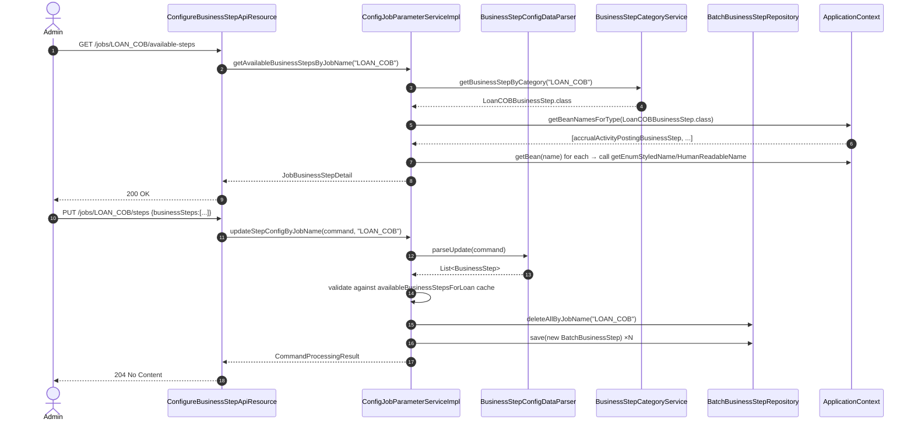

The execution order of COB steps is data, not code. The framework stores the (job, step, order) triples in `m_batch_business_steps`, exposes a REST surface for reading and updating them, and uses a small enum — `BusinessStepCategory` — to tell which sub-interface a given job's beans implement. This page covers the configuration plumbing: the category enum, the catalog service that maps category → bean class, the parser that turns `PUT /jobs/{jobName}/steps` into `BusinessStep` records, and the MapStruct converter between the entity and the API DTO.

## BusinessStepCategory

```java
// fineract-cob/src/main/java/org/apache/fineract/cob/service/BusinessStepCategory.java
public enum BusinessStepCategory {

    LOAN("LOAN");

    private final String name;

    BusinessStepCategory(String name) { this.name = name; }

    public static BusinessStepCategory getCategoryName(String categoryName) {
        Optional<BusinessStepCategory> opt = Arrays.stream(values())
            .filter(jn -> categoryName.equals(jn.name)).findAny();
        return opt.orElseThrow(() ->
            new IllegalArgumentException("Category not found by name: " + categoryName));
    }

    @Override public String toString() { return this.name; }
}
```

At the time of writing the upstream tree ships a single category, `LOAN`. The enum exists as the extension point: additional COB pipelines (savings, working-capital-loan) currently piggyback on the same configuration table by registering their own job names (`SAVINGS_CLOSE_OF_BUSINESS`, `WORKING_CAPITAL_LOAN_CLOSE_OF_BUSINESS`) but they do not currently appear in this enum. The category exists so that `ConfigJobParameterService.getAvailableBusinessStepsByJobName(...)` can know which `Class<? extends COBBusinessStep>` to ask Spring for.

### Mapping category → bean type

```java
// fineract-cob/src/main/java/org/apache/fineract/cob/service/BusinessStepCategoryService.java
public interface BusinessStepCategoryService {
    Class<? extends COBBusinessStep> getBusinessStepByCategory(String category);
}
```

The provider-module implementation `LoanBusinessStepCategoryServiceImpl` returns `LoanCOBBusinessStep.class` for the `LOAN` category. Additional modules register their own implementations (e.g. `WorkingCapitalLoanCOBBusinessStep.class`) by providing a bean of type `BusinessStepCategoryService`.

```mermaid
flowchart LR
    Cat["BusinessStepCategory.LOAN"]
    Svc["LoanBusinessStepCategoryServiceImpl<br/>.getBusinessStepByCategory('LOAN')"]
    Cls["LoanCOBBusinessStep.class"]
    Beans["applicationContext.getBeanNamesForType(LoanCOBBusinessStep.class)<br/>→ accrualActivityPostingBusinessStep, ..."]
    Cfg["ConfigJobParameterServiceImpl.afterPropertiesSet<br/>caches available steps for LOAN"]

    Cat --> Svc --> Cls --> Beans --> Cfg
```



## ConfigJobParameterService

The high-level service that the API resource calls:

```java
// fineract-cob/src/main/java/org/apache/fineract/cob/service/ConfigJobParameterService.java
public interface ConfigJobParameterService {
    JobBusinessStepConfigData getBusinessStepConfigByJobName(String jobName);
    CommandProcessingResult updateStepConfigByJobName(JsonCommand command, String jobName);
    JobBusinessStepDetail getAvailableBusinessStepsByJobName(String jobName);
    List<String> getAllConfiguredJobNames();
}
```

| Method | Purpose | Backing query / mutation |
| ------ | ------- | ------------------------ |
| `getBusinessStepConfigByJobName(jobName)` | "What ordered steps run for this job?" | `BatchBusinessStepRepository.findAllByJobName(jobName)` → `BusinessStepMapper.map(...)` |
| `updateStepConfigByJobName(command, jobName)` | "Replace the configured steps for this job." | `dataParser.parseUpdate(command)` → `deleteAllByJobName` + `saveAll(...)` |
| `getAvailableBusinessStepsByJobName(jobName)` | "What steps could this job run if I configured them?" | `applicationContext.getBeanNamesForType(BusinessStepCategoryService.getBusinessStepByCategory(jobName))` |
| `getAllConfiguredJobNames()` | "Which jobs have any configuration at all?" | `BatchBusinessStepRepository.findConfiguredJobNames()` (`SELECT DISTINCT job_name`) |

The implementation is straightforward but worth following for the validation it performs on updates:

```java
@Service
@RequiredArgsConstructor
public class ConfigJobParameterServiceImpl implements ConfigJobParameterService, InitializingBean {

    private final BatchBusinessStepRepository batchBusinessStepRepository;
    private final BusinessStepConfigDataParser dataParser;
    private final BusinessStepCategoryService businessStepCategoryService;
    private final ApplicationContext applicationContext;
    private final BusinessStepMapper mapper;
    private JobBusinessStepDetail availableBusinessStepsForLoan;

    @Override
    public void afterPropertiesSet() throws Exception {
        availableBusinessStepsForLoan =
            getAvailableBusinessStepsByJobName(BusinessStepCategory.LOAN.name());
    }

    @Override
    public CommandProcessingResult updateStepConfigByJobName(JsonCommand command, String jobName) {
        List<BusinessStep> businessSteps = dataParser.parseUpdate(command);
        if (businessSteps.isEmpty()) {
            throw new BusinessStepException("A job needs to have 1 business step at least.");
        }
        List<String> availableBusinessStepNames =
            availableBusinessStepsForLoan.getAvailableBusinessSteps().stream()
                .map(BusinessStepDetail::getStepName).toList();
        List<String> notValid = businessSteps.stream().map(BusinessStep::getStepName)
            .filter(name -> !availableBusinessStepNames.contains(name)).toList();
        if (notValid.isEmpty()) {
            batchBusinessStepRepository.deleteAllByJobName(jobName);
            businessSteps.forEach(s -> {
                BatchBusinessStep e = new BatchBusinessStep();
                e.setJobName(jobName);
                e.setStepName(s.getStepName());
                e.setStepOrder(s.getOrder());
                batchBusinessStepRepository.save(e);
            });
        } else {
            throw new BusinessStepException(notValid + " Business steps are not configurable for this job.");
        }
        return new CommandProcessingResultBuilder().withCommandId(command.commandId()).build();
    }
}
```

Two invariants enforced here:

- **Non-empty.** A job with zero steps is rejected at update time; the partitioner separately defends the same invariant at run time by stopping the job execution if `getCOBBusinessSteps` returns empty.
- **Whitelist.** Every supplied `stepName` must appear in the cached `availableBusinessStepsForLoan` list. This cache is built **once at startup** via `afterPropertiesSet`. New `@Component`-annotated steps appear only after a JVM restart.

<Warning>
The `availableBusinessStepsForLoan` cache uses the `LOAN` category for every job because that's the only category in the enum. For sibling jobs (savings, working capital) the validation is currently against the LOAN catalog. Adding a savings step under the savings job name will fail validation until the catalog mechanism is extended.
</Warning>

## BusinessStepConfigDataParser

```java
// fineract-cob/src/main/java/org/apache/fineract/cob/service/BusinessStepConfigDataParser.java
@Component
@RequiredArgsConstructor
public class BusinessStepConfigDataParser {

    private final FromJsonHelper jsonHelper;

    public List<BusinessStep> parseUpdate(JsonCommand command) {
        JsonObject element = extractJsonObject(command);
        List<BusinessStep> businessSteps = new ArrayList<>();
        JsonArray jsonArray = jsonHelper.extractJsonArrayNamed("businessSteps", element);
        for (final JsonElement businessStepConfig : jsonArray) {
            final String stepName = jsonHelper.extractStringNamed("stepName", businessStepConfig);
            final Long   order    = jsonHelper.extractLongNamed("order", businessStepConfig);
            BusinessStep businessStep = new BusinessStep();
            businessStep.setStepName(stepName);
            businessStep.setOrder(order);
            businessSteps.add(businessStep);
        }
        return businessSteps;
    }
}
```

Wire format consumed by `PUT /v1/jobs/{jobName}/steps`:

```json
{
  "businessSteps": [
    { "stepName": "APPLY_CHARGE_TO_OVERDUE_LOANS",         "order": 1 },
    { "stepName": "LOAN_DELINQUENCY_CLASSIFICATION",       "order": 2 },
    { "stepName": "CHECK_LOAN_REPAYMENT_DUE",              "order": 3 },
    { "stepName": "CHECK_LOAN_REPAYMENT_OVERDUE",          "order": 4 },
    { "stepName": "UPDATE_LOAN_ARREARS_AGING",             "order": 5 },
    { "stepName": "ADD_PERIODIC_ACCRUAL_ENTRIES",          "order": 6 }
  ]
}
```

The parser produces `List<BusinessStep>` where `BusinessStep` is the pojo from `cob/data/BusinessStep.java`:

```java
@Data
public class BusinessStep {
    private String stepName;
    private Long   order;
}
```

The order field is an arbitrary `Long`; the runtime sorts by it via `TreeMap<Long, String>`. There is no requirement that orders be contiguous (e.g. `1, 2, 7, 9` is valid), only unique within a job — duplicate orders would collide in `BusinessStepNameAndOrder.getBusinessStepMap` since `Collectors.toMap` rejects merges by default.

## BusinessStepMapper

```java
// fineract-cob/src/main/java/org/apache/fineract/cob/service/BusinessStepMapper.java
@Mapper(config = MapstructMapperConfig.class)
public interface BusinessStepMapper {
    @Mapping(target = "order", source = "source.stepOrder")
    BusinessStep map(BatchBusinessStep source);
    List<BusinessStep> map(List<BatchBusinessStep> source);
}
```

MapStruct-generated adaptor between the persistence entity and the API DTO. The single non-default mapping renames `stepOrder` → `order`. Used by `getBusinessStepConfigByJobName` to produce the `JobBusinessStepConfigData` response.

## The persistence entity

```java
// fineract-cob/src/main/java/org/apache/fineract/cob/domain/BatchBusinessStep.java
@Entity
@Table(name = "m_batch_business_steps")
@NoArgsConstructor @Getter @Setter
public class BatchBusinessStep extends AbstractPersistableCustom<Long> {

    @Column(name = "job_name",   nullable = false) private String jobName;
    @Column(name = "step_name",  nullable = false) private String stepName;
    @Column(name = "step_order", nullable = false) private Long   stepOrder;
}
```

```java
// fineract-cob/src/main/java/org/apache/fineract/cob/domain/BatchBusinessStepRepository.java
public interface BatchBusinessStepRepository
        extends JpaRepository<BatchBusinessStep, Long>, JpaSpecificationExecutor<BatchBusinessStep> {

    List<BatchBusinessStep> findAllByJobName(String jobName);

    @Query("SELECT DISTINCT bbs.jobName FROM BatchBusinessStep bbs")
    List<String> findConfiguredJobNames();

    void deleteAllByJobName(String jobName);
}
```

DDL — `fineract-provider/src/main/resources/db/changelog/tenant/parts/0022_add_batch_business_step_configuration_table.xml`:

```xml
<createTable tableName="m_batch_business_steps">
    <column autoIncrement="true" name="id"       type="BIGINT"><constraints nullable="false" primaryKey="true"/></column>
    <column name="job_name"  type="VARCHAR(100)"><constraints nullable="false"/></column>
    <column name="step_name" type="VARCHAR(100)"><constraints nullable="false"/></column>
    <column name="step_order" type="SMALLINT"><constraints nullable="false"/></column>
</createTable>
```

The same changeset seeds the first row:

```xml
<insert tableName="m_batch_business_steps">
    <column name="job_name"   value="LOAN_CLOSE_OF_BUSINESS"/>
    <column name="step_name"  value="APPLY_CHARGE_TO_OVERDUE_LOANS"/>
    <column name="step_order" value="1"/>
</insert>
```

Subsequent changelogs add the rest of the default loan order (see the table in [Loan COB business steps](/cob/loan-cob-business-steps)).

## Data DTOs returned over the wire

```java
// JobBusinessStepConfigData
@Data
public class JobBusinessStepConfigData {
    private String jobName;
    private List<BusinessStep> businessSteps;   // mapped from BatchBusinessStep
}

// JobBusinessStepDetail
@Data
public class JobBusinessStepDetail {
    private String jobName;
    private List<BusinessStepDetail> availableBusinessSteps;
}

// BusinessStepDetail — for the available-steps catalog
@Data
public class BusinessStepDetail {
    private String stepName;       // from COBBusinessStep.getEnumStyledName()
    private String stepDescription;// from COBBusinessStep.getHumanReadableName()
}

// ConfiguredJobNamesDTO
@Data @AllArgsConstructor
public class ConfiguredJobNamesDTO {
    private List<String> businessJobs;
}
```

## How the REST surface uses these pieces



The endpoint URLs are documented in [API resources](/cob/cob-api-resources).

## Adding a new category

To support a brand-new aggregate type (say `Investment`):

1. Define `InvestmentCOBBusinessStep extends COBBusinessStep<Investment>` in your module.
2. Add an `INVESTMENT("INVESTMENT")` constant to `BusinessStepCategory` (in `fineract-cob`).
3. Register a `BusinessStepCategoryService` implementation that returns `InvestmentCOBBusinessStep.class` for `"INVESTMENT"`.
4. Provide a job (Spring Batch `Job` bean) whose `JobName` is the category name and whose partitioner uses the same `CommonPartitioner` base with an appropriate `RetrieveIdService` for investments.
5. Add a seed Liquibase changelog row to register at least one step under that job name.

`ConfigJobParameterServiceImpl.afterPropertiesSet` will need to be widened (or sub-classed) to cache more than just the `LOAN` catalog, but the validation pattern remains the same.

## Default loan COB step order

The seeded order (Liquibase) is:

| Order | Step name | Source changelog |
| ----- | --------- | ---------------- |
| 1 | `APPLY_CHARGE_TO_OVERDUE_LOANS` | `0022_add_batch_business_step_configuration_table.xml` |
| 2 | `LOAN_DELINQUENCY_CLASSIFICATION` | `0047_add_loan_delinquency_tags_business_step.xml` |
| 3 | `CHECK_LOAN_REPAYMENT_DUE` | `0067_add_configurations_for_repayment_due_business_steps.xml` |
| 4 | `CHECK_LOAN_REPAYMENT_OVERDUE` | `0067_add_configurations_for_repayment_due_business_steps.xml` |
| 5 | `UPDATE_LOAN_ARREARS_AGING` | `0089_add_update_loan_arrears_aging_business_step.xml` |
| 6 | `ADD_PERIODIC_ACCRUAL_ENTRIES` | `0092_add_periodic_accrual_entries_business_step.xml` |

`ACCRUAL_ACTIVITY_POSTING`, `LOAN_INTEREST_RECALCULATION`, `CAPITALIZED_INCOME_AMORTIZATION`, `BUY_DOWN_FEE_AMORTIZATION`, `CHECK_DUE_INSTALLMENTS` and `EXTERNAL_ASSET_OWNER_TRANSFER` are available as beans but are not pre-configured; deployments opt in by inserting rows or calling the PUT endpoint. See [Loan COB business steps](/cob/loan-cob-business-steps).

For the working-capital-loan job, the seed is in `fineract-working-capital-loan/src/main/resources/db/changelog/tenant/module/workingcapitalloan/parts/0003_working_capital_loan_cob.xml`:

```xml
<insert tableName="m_batch_business_steps">
    <column name="job_name"   value="WORKING_CAPITAL_LOAN_CLOSE_OF_BUSINESS"/>
    <column name="step_name"  value="DUMMY_BUSINESS_STEP"/>
    <column name="step_order" value="1"/>
</insert>
```

— a placeholder that downstream consumers replace via the PUT endpoint. See [Working-capital COB](/cob/working-capital-loan-cob).

## Cross-references

- The interface every step implements → [Business step framework](/cob/business-step-framework)
- REST endpoint signatures and command-handler wiring → [API resources](/cob/cob-api-resources)
- Per-step semantics → [Loan COB business steps](/cob/loan-cob-business-steps)
- How `LoanCOBPartitioner` consumes the configured set → [Spring Batch wiring](/cob/cob-batch-jobs)
