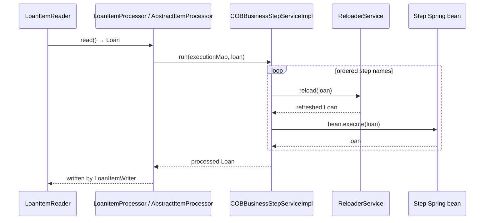
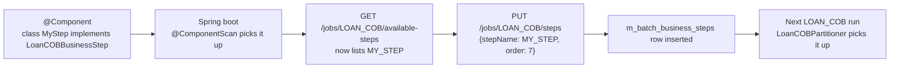

The framework that lets a hundred different overnight side-effects be expressed as ordered, swappable units is small and concentrated in `fineract-cob/src/main/java/org/apache/fineract/cob/`. Three types matter: the `COBBusinessStep<T>` SPI every step implements, the `COBBusinessStepService` that discovers and runs configured steps, and the `ReloaderService` that re-attaches the JPA entity between steps so a step never operates on a stale snapshot.

## The interface

```java
// fineract-cob/src/main/java/org/apache/fineract/cob/COBBusinessStep.java
package org.apache.fineract.cob;

import org.apache.fineract.infrastructure.core.domain.AbstractPersistableCustom;

public interface COBBusinessStep<T extends AbstractPersistableCustom<Long>> {

    T execute(T input);

    String getEnumStyledName();

    String getHumanReadableName();
}
```

Three contracts:

1. **`execute(T)`** — receive the aggregate root, mutate it (or its children), return the same instance (or a reloaded one) for chaining. The next step in the order gets your return value.
2. **`getEnumStyledName()`** — uppercase, underscore-delimited identifier stored in `m_batch_business_steps.step_name`. This is the value the configuration UI/API uses to refer to the step. Examples: `APPLY_CHARGE_TO_OVERDUE_LOANS`, `LOAN_DELINQUENCY_CLASSIFICATION`, `EXTERNAL_ASSET_OWNER_TRANSFER`.
3. **`getHumanReadableName()`** — display string for the catalog endpoint (`GET /jobs/{jobName}/available-steps`).

### Concrete sub-types

`COBBusinessStep` is generic; each business-domain module defines a sub-interface that pins `T` so its steps cannot accidentally be wired into the wrong COB job.

| Sub-interface | Module | Aggregate `T` |
| ------------- | ------ | ------------- |
| `org.apache.fineract.cob.loan.LoanCOBBusinessStep` | `fineract-loan` | `Loan` |
| `org.apache.fineract.cob.savings.SavingsCOBBusinessStep` | `fineract-savings` | `SavingsAccount` |
| `org.apache.fineract.cob.workingcapitalloan.businessstep.WorkingCapitalLoanCOBBusinessStep` (abstract class) | `fineract-working-capital-loan` | `WorkingCapitalLoan` |

```java
// fineract-loan/src/main/java/org/apache/fineract/cob/loan/LoanCOBBusinessStep.java
public interface LoanCOBBusinessStep extends COBBusinessStep<Loan> {}

// fineract-savings/src/main/java/org/apache/fineract/cob/savings/SavingsCOBBusinessStep.java
public interface SavingsCOBBusinessStep extends COBBusinessStep<SavingsAccount> {}

// fineract-working-capital-loan/.../businessstep/WorkingCapitalLoanCOBBusinessStep.java
public abstract class WorkingCapitalLoanCOBBusinessStep implements COBBusinessStep<WorkingCapitalLoan> {}
```

A class that wants to participate in `LOAN_CLOSE_OF_BUSINESS` implements `LoanCOBBusinessStep` and gets `@Component`-scanned like any other Spring bean. No additional registration is required: the framework picks beans up by type at startup and at run time.

## The orchestrator: COBBusinessStepService

```java
// fineract-cob/src/main/java/org/apache/fineract/cob/COBBusinessStepService.java
public interface COBBusinessStepService {

    <T extends COBBusinessStep<S>, S extends AbstractPersistableCustom<Long>>
        S run(TreeMap<Long, String> executionMap, S item);

    @NonNull
    <T extends COBBusinessStep<S>, S extends AbstractPersistableCustom<Long>>
        Set<BusinessStepNameAndOrder> getCOBBusinessSteps(Class<T> businessStepClass, String cobJobName);
}
```

Two methods, two phases:

- **`getCOBBusinessSteps(class, jobName)`** is called once per partition by `LoanCOBPartitioner.partition()` to load the ordered set of (beanName, order) tuples for that COB job — built from `m_batch_business_steps` filtered by `job_name` and joined against the Spring beans implementing the given sub-interface.
- **`run(executionMap, item)`** is called once per item by `AbstractItemProcessor.process(...)`. It iterates the `TreeMap` in ascending order, looks up each Spring bean by name, calls `bean.execute(item)`, and threads the result forward.



### Implementation detail: COBBusinessStepServiceImpl

```java
@Service
@RequiredArgsConstructor
public class COBBusinessStepServiceImpl implements COBBusinessStepService {

    private final BatchBusinessStepRepository batchBusinessStepRepository;
    private final ApplicationContext applicationContext;
    private final ListableBeanFactory beanFactory;
    private final BusinessEventNotifierService businessEventNotifierService;
    private final ConfigurationDomainService configurationDomainService;
    private final ReloaderService reloaderService;

    @Override
    public <T extends COBBusinessStep<S>, S extends AbstractPersistableCustom<Long>>
        S run(TreeMap<Long, String> executionMap, S item) {

        if (executionMap == null || executionMap.isEmpty()) {
            throw new BusinessStepException("Execution map is empty! COB Business step execution skipped!");
        }
        boolean bulkEventEnabled = configurationDomainService.isCOBBulkEventEnabled();
        try {
            if (bulkEventEnabled) {
                businessEventNotifierService.startExternalEventRecording();
            }
            for (String businessStep : executionMap.values()) {
                try {
                    ThreadLocalContextUtil.setActionContext(ActionContext.COB);
                    COBBusinessStep<S> bean = (COBBusinessStep<S>) applicationContext.getBean(businessStep);
                    item = reloaderService.reload(item);
                    item = bean.execute(item);
                } catch (Exception e) {
                    throw new BusinessStepException("Error happened during business step execution", e);
                } finally {
                    ThreadLocalContextUtil.setActionContext(ActionContext.COB);
                }
            }
            if (bulkEventEnabled) {
                businessEventNotifierService.stopExternalEventRecording();
            }
        } catch (Exception e) {
            if (bulkEventEnabled) {
                businessEventNotifierService.resetEventRecording();
            }
            throw e;
        }
        return item;
    }
```

Notable behaviour:

- **Empty execution map → hard failure.** If no steps are configured for a job, `run` throws `BusinessStepException` rather than silently no-op. The partitioner pre-empts this by calling `jobOperator.stop` when `getCOBBusinessSteps` returns empty (see `CommonPartitioner.stopJobExecution`).
- **`ActionContext.COB` is forced before every step** and re-forced in `finally`. Individual steps are permitted to flip to `ActionContext.DEFAULT` for "today vs. business date" comparisons, but they must not leak that state.
- **Bulk external-event recording** is opt-in via `configurationDomainService.isCOBBulkEventEnabled()`. When enabled, all `BusinessEventNotifierService.notifyPostBusinessEvent` calls made inside the chunk are buffered until the chunk completes, then flushed in a single external-events message.
- **One exception aborts the chain.** Any step throwing causes the remaining steps for that loan to be skipped; the `LoanCOBChunkProcessingListener` then writes the stack trace to the loan's lock row.

### Step lookup

```java
@NonNull
@Override
public <T extends COBBusinessStep<S>, S extends AbstractPersistableCustom<Long>>
    Set<BusinessStepNameAndOrder> getCOBBusinessSteps(Class<T> businessStepClass, String cobJobName) {

    List<BatchBusinessStep> cobStepConfigs = batchBusinessStepRepository.findAllByJobName(cobJobName);
    List<String> businessSteps = Arrays.stream(beanFactory.getBeanNamesForType(businessStepClass)).toList();
    Set<BusinessStepNameAndOrder> executionMap = new HashSet<>();
    for (String businessStep : businessSteps) {
        COBBusinessStep<S> bean = (COBBusinessStep<S>) applicationContext.getBean(businessStep);
        Optional<BatchBusinessStep> cfg = cobStepConfigs.stream()
            .filter(sc -> bean.getEnumStyledName().equals(sc.getStepName()))
            .findFirst();
        cfg.ifPresent(c -> executionMap.add(
            new BusinessStepNameAndOrder(businessStep, c.getStepOrder())));
    }
    return executionMap;
}
```

The result is a `Set<BusinessStepNameAndOrder>` where:

- `stepName` is the Spring **bean name** (e.g. `applyChargeToOverdueLoansBusinessStep`), not the enum-styled DB name.
- `stepOrder` comes from `m_batch_business_steps.step_order`.

`AbstractItemProcessor.process` later converts that set into the ordered execution map:

```java
// fineract-cob/src/main/java/org/apache/fineract/cob/data/BusinessStepNameAndOrder.java
public static TreeMap<Long, String> getBusinessStepMap(Set<BusinessStepNameAndOrder> businessSteps) {
    Map<Long, String> businessStepMap = businessSteps.stream()
        .collect(Collectors.toMap(BusinessStepNameAndOrder::getStepOrder,
                                  BusinessStepNameAndOrder::getStepName));
    return new TreeMap<>(businessStepMap);
}
```

<Warning>
Bean names are derived from the class name by Spring's default `AnnotationBeanNameGenerator` (`applyChargeToOverdueLoansBusinessStep`, not `APPLY_CHARGE_TO_OVERDUE_LOANS`). If you register a step with `@Component("myCustomName")`, the entry in the execution map will be `myCustomName`. The DB still keys on `getEnumStyledName()` so that customisation does not leak into configuration.
</Warning>

## Reload semantics

Between every step `COBBusinessStepServiceImpl.run` calls `reloaderService.reload(item)`. This exists because a step may invoke a write platform service that detaches the entity (e.g. via a `flush+clear`); the next step in the chain must see a managed JPA entity, not a detached one. `ReloaderService` is a simple `findById`-style helper that you can wire your own implementation for if you need to widen the graph that gets eagerly loaded.

```java
// fineract-cob/src/main/java/org/apache/fineract/cob/service/ReloaderService.java
public interface ReloaderService {
    <T extends AbstractPersistableCustom<Long>> T reload(T item);
}
```

The default implementation simply re-fetches by id via `ReloadService`; module-specific implementations can be supplied by registering a `@ConditionalOnMissingBean` `@Bean` of type `ReloaderService`.

## The processor that drives it

The shared `AbstractItemProcessor` glues a `COBBusinessStepService` into Spring Batch's `ItemProcessor` SPI:

```java
// fineract-cob/src/main/java/org/apache/fineract/cob/processor/AbstractItemProcessor.java
@RequiredArgsConstructor
public abstract class AbstractItemProcessor<I extends AbstractPersistableCustom<Long>>
    implements ItemProcessor<I, I> {

    private final COBBusinessStepService cobBusinessStepService;
    @Setter private ExecutionContext executionContext;
    @Getter private LocalDate businessDate;

    @Override
    public I process(@NonNull I item) throws Exception {
        Set<BusinessStepNameAndOrder> businessSteps =
            (Set<BusinessStepNameAndOrder>) executionContext.get("businessSteps");
        if (businessSteps == null) {
            throw new IllegalStateException("No business steps found in the execution context");
        }
        TreeMap<Long, String> businessStepMap = getBusinessStepMap(businessSteps);
        I processed = cobBusinessStepService.run(businessStepMap, item);
        setLastRun(processed);
        return processed;
    }

    protected void setBusinessDate(StepExecution stepExecution) {
        businessDate = BusinessDateResolver.resolve(stepExecution);
    }

    public abstract void setLastRun(I processedLoan);
}
```

Subclasses do three things:

1. Pass the right `COBBusinessStepService` upstream.
2. Implement `setLastRun(item)` — the loan processor pushes `loan.setLastClosedBusinessDate(businessDate)`; savings does the equivalent.
3. Provide a `@BeforeStep` hook that calls `setExecutionContext(...)` and `setBusinessDate(...)`.

```java
// fineract-provider/.../cob/loan/LoanItemProcessor.java
public class LoanItemProcessor extends AbstractLoanItemProcessor {
    public LoanItemProcessor(COBBusinessStepService svc,
                             ProgressiveLoanModelProcessingService prog) {
        super(svc, prog);
    }
    @BeforeStep
    public void beforeStep(StepExecution stepExecution) {
        setExecutionContext(stepExecution.getExecutionContext());
        setBusinessDate(stepExecution);
    }
}

// fineract-provider/.../cob/loan/AbstractLoanItemProcessor.java
@Override
public Loan process(@NonNull Loan loan) throws Exception {
    if (needToRebuildModel(loan)) {
        progressiveLoanModelProcessingService.recalculateModelAndSave(loan.getId());
    }
    return super.process(loan);
}
@Override
public void setLastRun(Loan processed) {
    processed.setLastClosedBusinessDate(getBusinessDate());
}
```

`AbstractLoanItemProcessor.process` adds one tweak before delegating: progressive-loan schedules whose persisted model version does not match `ProgressiveLoanInterestScheduleModel.getModelVersion()` get re-built first. This guarantees that subsequent business steps never see an out-of-date schedule.

## How a new step gets registered



Concretely:

1. Add a class in any module that depends on `fineract-loan` (the loan SPI) implementing `LoanCOBBusinessStep`.
2. Mark it `@Component`. Optionally guard with `@Conditional` if it is feature-flagged.
3. Restart the JVM. Spring's bean factory now exposes it for `getBeanNamesForType(LoanCOBBusinessStep.class)`.
4. `ConfigJobParameterServiceImpl.afterPropertiesSet` rebuilds the in-memory catalog of "available" steps for `BusinessStepCategory.LOAN`. See [Categories & configuration](/cob/business-step-categories).
5. Configure ordering via `PUT /v1/jobs/LOAN_COB/steps`. See [API resources](/cob/cob-api-resources).
6. The next COB run includes the new step.

A reference example is the investor module's `LoanAccountOwnerTransferBusinessStep` (`fineract-investor/.../investor/cob/loan/`), which guards itself with `@Conditional(InvestorModuleIsEnabledCondition.class)`. See [Investor COB steps](/cob/investor-cob-steps).

## Error handling

The framework distinguishes three failure modes:

| Where it throws | Symptom | Recovery |
| --------------- | ------- | -------- |
| Inside `bean.execute(item)` | Wrapped in `BusinessStepException` | Chunk listener stores stacktrace on the loan's lock row; chunk is skipped per Spring Batch fault tolerance. |
| `executionMap` empty in `run` | `BusinessStepException("Execution map is empty…")` | Pre-empted by partitioner; if reached it terminates the job. |
| `executionContext.get("businessSteps") == null` in `process` | `IllegalStateException` | Indicates the partitioner did not seed the context; treated as a fatal misconfiguration. |

See also [Listeners](/cob/cob-listeners) for the `AbstractLoanItemListener` write-back path and [Loan COB business steps](/cob/loan-cob-business-steps) for individual step semantics.

## Cross-references

- Bean discovery → [Categories & configuration](/cob/business-step-categories)
- Execution-context plumbing → [Spring Batch wiring](/cob/cob-batch-jobs)
- The chunk listener that catches `BusinessStepException` → [Listeners](/cob/cob-listeners)
- The `BusinessDateResolver` referenced from `AbstractItemProcessor.setBusinessDate` → [Conditions & resolvers](/cob/cob-conditions-and-resolvers)
- Concrete steps → [Loan COB business steps](/cob/loan-cob-business-steps), [Savings COB business steps](/cob/savings-cob-business-steps)
