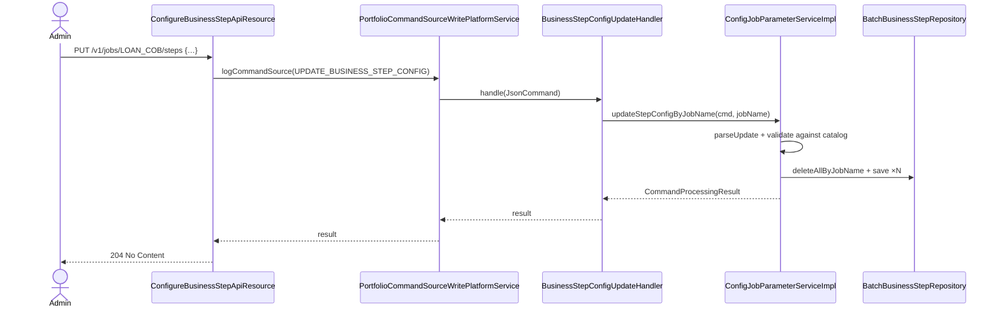
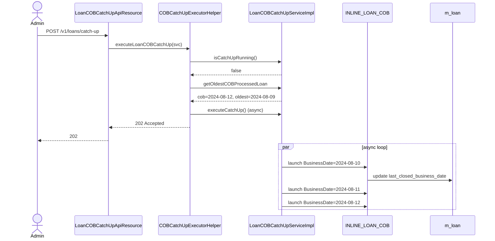

The COB engine ships seven JAX-RS resource classes in `fineract-provider/src/main/java/org/apache/fineract/cob/api/`. Six are externally exposed; one (`COBCatchUpExecutorHelper`) is a static helper used by the catch-up resources. This page is the per-endpoint reference: the path, the method, what command (if any) is logged through the command pipeline, and which service does the work. The inline-job endpoint (`POST /v1/jobs/{jobName}/inline`) lives in `infrastructure/jobs/api/InlineJobApiResource.java` and is documented in [Inline COB](/cob/inline-cob); it is referenced here for completeness.

## Surface map

| Path | Method | Class | Purpose |
| ---- | ------ | ----- | ------- |
| `/v1/jobs/names` | GET | `ConfigureBusinessStepApiResource` | List job names with any step configuration. |
| `/v1/jobs/{jobName}/steps` | GET | `ConfigureBusinessStepApiResource` | Read configured steps + order. |
| `/v1/jobs/{jobName}/steps` | PUT | `ConfigureBusinessStepApiResource` | Replace configured steps + order. |
| `/v1/jobs/{jobName}/available-steps` | GET | `ConfigureBusinessStepApiResource` | List steps registered as Spring beans for this job. |
| `/v1/jobs/{jobName}/inline` | POST | `InlineJobApiResource` (jobs module) | Run inline COB for the supplied loan ids. |
| `/v1/loans/locked` | GET | `LoanAccountLockApiResource` | List currently-locked loan accounts. |
| `/v1/loans/oldest-cob-closed` | GET | `LoanCOBCatchUpApiResource` | Read the oldest `last_closed_business_date` across loans. |
| `/v1/loans/catch-up` | POST | `LoanCOBCatchUpApiResource` | Loop inline COB day-by-day until all loans are current. |
| `/v1/loans/is-catch-up-running` | GET | `LoanCOBCatchUpApiResource` | Report whether the catch-up loop is currently running. |
| `/v1/working-capital-loans/oldest-cob-closed` | GET | `WorkingCapitalLoanCOBCatchUpApiResource` | Same as loan, for WC loans. |
| `/v1/working-capital-loans/catch-up` | POST | `WorkingCapitalLoanCOBCatchUpApiResource` | Same as loan, for WC loans. |
| `/v1/working-capital-loans/is-catch-up-running` | GET | `WorkingCapitalLoanCOBCatchUpApiResource` | Same as loan, for WC loans. |
| `/v1/internal/cob/partitions/{partitionSize}` | GET | `InternalCOBApiResource` *(profile: test)* | Dry-run partition computation. |
| `/v1/internal/cob/fast-forward-cob-date-of-loan/{loanId}` | POST | `InternalCOBApiResource` *(profile: test)* | Force a loan's `last_closed_business_date`. |
| `/v1/internal/cob/loan-reprocess/{loanId}` | POST | `InternalCOBApiResource` *(profile: test)* | Regenerate the loan schedule with transactions. |
| `/v1/internal/loans/{loanId}/place-lock/{lockOwner}` | POST | `InternalLoanAccountLockApiResource` *(profile: test)* | Manually insert a lock row. |

## ConfigureBusinessStepApiResource

```java
@Path("/v1/jobs")
@Component
@Tag(name = "Business Step Configuration")
@RequiredArgsConstructor
public class ConfigureBusinessStepApiResource {

    private final DefaultToApiJsonSerializer<String> toApiJsonSerializer;
    private final ConfigJobParameterService configJobParameterService;
    private final PortfolioCommandSourceWritePlatformService commandWritePlatformService;
```

### GET /v1/jobs/names

```java
@GET @Path("/names")
@Produces(MediaType.APPLICATION_JSON)
public ConfiguredJobNamesDTO retrieveAllConfiguredBusinessJobs() {
    List<String> businessJobNames = configJobParameterService.getAllConfiguredJobNames();
    return new ConfiguredJobNamesDTO(businessJobNames);
}
```

Returns:

```json
{ "businessJobs": ["LOAN_CLOSE_OF_BUSINESS", "WORKING_CAPITAL_LOAN_CLOSE_OF_BUSINESS"] }
```

`getAllConfiguredJobNames()` runs `SELECT DISTINCT job_name FROM m_batch_business_steps`.

### GET /v1/jobs/{jobName}/steps

```java
@GET @Path("{jobName}/steps")
@Consumes(MediaType.APPLICATION_JSON) @Produces(MediaType.APPLICATION_JSON)
public JobBusinessStepConfigData retrieveAllConfiguredBusinessStep(
        @PathParam("jobName") final String jobName) {
    return configJobParameterService.getBusinessStepConfigByJobName(jobName);
}
```

Returns the ordered list of `BusinessStep` (stepName, order) records for that job.

```json
{
  "jobName": "LOAN_CLOSE_OF_BUSINESS",
  "businessSteps": [
    { "stepName": "APPLY_CHARGE_TO_OVERDUE_LOANS", "order": 1 },
    { "stepName": "LOAN_DELINQUENCY_CLASSIFICATION", "order": 2 }
  ]
}
```

### PUT /v1/jobs/{jobName}/steps

```java
@PUT @Path("{jobName}/steps")
@Consumes(MediaType.APPLICATION_JSON) @Produces(MediaType.APPLICATION_JSON)
@RequestBody(content = @Content(schema = @Schema(implementation = BusinessStepRequest.class)))
@ApiResponse(responseCode = "204", description = "NO_CONTENT")
public Response updateJobBusinessStepConfig(
        @PathParam("jobName") final String jobName,
        BusinessStepRequest businessStepRequest) {

    final CommandWrapper commandRequest = new CommandWrapperBuilder()
        .updateBusinessStepConfig(jobName)
        .withJson(toApiJsonSerializer.serialize(businessStepRequest))
        .build();
    commandWritePlatformService.logCommandSource(commandRequest);
    return Response.status(Response.Status.NO_CONTENT).build();
}
```

The request body:

```json
{
  "businessSteps": [
    { "stepName": "APPLY_CHARGE_TO_OVERDUE_LOANS", "order": 1 },
    { "stepName": "LOAN_DELINQUENCY_CLASSIFICATION", "order": 2 }
  ]
}
```

The endpoint **does not** write the change directly. It wraps the JSON into a `CommandWrapper` of type `UPDATE_BUSINESS_STEP_CONFIG` (see `CommandWrapperBuilder.updateBusinessStepConfig`) and pushes it through the command-pipeline write-platform service. The handler bound to that command is `BusinessStepConfigUpdateHandler` (in `fineract-cob/.../service/`) which delegates to `ConfigJobParameterService.updateStepConfigByJobName`. See [Step categories](/cob/business-step-categories) for the validation semantics.

Returns `204 No Content`.

### GET /v1/jobs/{jobName}/available-steps

```java
@GET @Path("{jobName}/available-steps")
@Consumes(MediaType.APPLICATION_JSON) @Produces(MediaType.APPLICATION_JSON)
public JobBusinessStepDetail retrieveAllAvailableBusinessStep(
        @PathParam("jobName") final String jobName) {
    return configJobParameterService.getAvailableBusinessStepsByJobName(jobName);
}
```

Returns the catalog computed at startup by `ConfigJobParameterServiceImpl.afterPropertiesSet`:

```json
{
  "jobName": "LOAN_CLOSE_OF_BUSINESS",
  "availableBusinessSteps": [
    { "stepName": "APPLY_CHARGE_TO_OVERDUE_LOANS",     "stepDescription": "Apply charge to overdue loans" },
    { "stepName": "ACCRUAL_ACTIVITY_POSTING",          "stepDescription": "Accrual Activity Posting on Installment Due Date" },
    { "stepName": "ADD_PERIODIC_ACCRUAL_ENTRIES",      "stepDescription": "Add periodic accrual entries" },
    { "stepName": "BUY_DOWN_FEE_AMORTIZATION",         "stepDescription": "Buy Down Fee amortization" },
    { "stepName": "CAPITALIZED_INCOME_AMORTIZATION",   "stepDescription": "Capitalized income amortization" },
    { "stepName": "CHECK_DUE_INSTALLMENTS",            "stepDescription": "Check Due Installments" },
    { "stepName": "CHECK_LOAN_REPAYMENT_DUE",          "stepDescription": "Check loan repayment due" },
    { "stepName": "CHECK_LOAN_REPAYMENT_OVERDUE",      "stepDescription": "Check loan repayment overdue" },
    { "stepName": "LOAN_DELINQUENCY_CLASSIFICATION",   "stepDescription": "Loan Delinquency Classification" },
    { "stepName": "LOAN_INTEREST_RECALCULATION",       "stepDescription": "Loan Interest Recalculation" },
    { "stepName": "UPDATE_LOAN_ARREARS_AGING",         "stepDescription": "Update loan arrears aging" },
    { "stepName": "EXTERNAL_ASSET_OWNER_TRANSFER",     "stepDescription": "Execute external asset owner transfer" }
  ]
}
```

The exact list depends on which feature modules are on the classpath (investor module adds `EXTERNAL_ASSET_OWNER_TRANSFER`; deleting it removes the entry).

## LoanAccountLockApiResource

```java
@Path("/v1/loans")
@Tag(name = "Loan Account Lock")
@RequiredArgsConstructor
public class LoanAccountLockApiResource {

    private final LoanAccountLockService loanAccountLockService;

    @GET @Path("locked")
    @Consumes(MediaType.APPLICATION_JSON) @Produces(MediaType.APPLICATION_JSON)
    public LoanAccountLockResponseDTO retrieveLockedAccounts(
            @QueryParam("page")  Integer pageParam,
            @QueryParam("limit") Integer limitParam) {
        int page  = Objects.requireNonNullElse(pageParam, 0);
        int limit = Objects.requireNonNullElse(limitParam, 50);
        return new LoanAccountLockResponseDTO(page, limit,
            loanAccountLockService.getLockedLoanAccountByPage(page, limit));
    }
}
```

Pages over `m_loan_account_locks`:

```json
{
  "page": 0,
  "limit": 50,
  "lockedAccounts": [
    {
      "loanId": 42,
      "lockOwner": "LOAN_COB_CHUNK_PROCESSING",
      "lockPlacedOn": "2024-08-12T01:23:45Z",
      "error": null,
      "stacktrace": null,
      "lockPlacedOnCobBusinessDate": "2024-08-11"
    }
  ]
}
```

Operators use this to see which loans are stuck after a failed COB.

## LoanCOBCatchUpApiResource

```java
@Path("/v1/loans")
@Tag(name = "Loan COB Catch Up")
@RequiredArgsConstructor
public class LoanCOBCatchUpApiResource {

    private final Optional<LoanCOBCatchUpServiceImpl> loanCOBCatchUpServiceOp;
```

Constructor-injected as `Optional<…>` so the bean still loads when `fineract.job.loan-cob-enabled=false`. Every method falls back to `JobIsNotFoundOrNotEnabledException` if the catch-up service did not autowire.

### GET /v1/loans/oldest-cob-closed

```java
@GET @Path("oldest-cob-closed")
public OldestCOBProcessedLoanDTO getOldestCOBProcessedLoan() {
    return loanCOBCatchUpServiceOp.map(COBCatchUpService::getOldestCOBProcessedLoan)
        .orElseThrow(() -> new JobIsNotFoundOrNotEnabledException(JobName.LOAN_COB.name()));
}
```

Returns:

```json
{
  "cobBusinessDate":              "2024-08-12",
  "oldestCobProcessedLoanCobDate": "2024-08-09"
}
```

The gap (`cobBusinessDate - oldestCobProcessedLoanCobDate`) is how many days the catch-up loop would have to advance for the laggard to be current.

### POST /v1/loans/catch-up

```java
@POST @Path("catch-up")
@ApiResponse(responseCode = "200", description = "All loans are up to date")
@ApiResponse(responseCode = "202", description = "Catch Up has been started")
@ApiResponse(responseCode = "400", description = "Catch Up is already running")
public Response executeLoanCOBCatchUp() {
    return loanCOBCatchUpServiceOp.map(COBCatchUpExecutorHelper::executeLoanCOBCatchUp)
        .orElseThrow(() -> new JobIsNotFoundOrNotEnabledException(JobName.LOAN_COB.name()));
}
```

`COBCatchUpExecutorHelper.executeLoanCOBCatchUp(svc)` is a static helper that:

1. Calls `svc.isCatchUpRunning()`; if `true`, returns `400 Bad Request`.
2. Otherwise calls `svc.executeCatchUp()` asynchronously and returns `202 Accepted`.
3. If `svc.getOldestCOBProcessedLoan` reports parity with the current COB date, returns `200 OK` without launching anything.

`LoanCOBCatchUpServiceImpl` (in `fineract-provider/.../cob/service/`) is the actual loop driver — it repeatedly launches `INLINE_LOAN_COB` once per missing day until all loans are current. See [Inline COB](/cob/inline-cob).

### GET /v1/loans/is-catch-up-running

```java
@GET @Path("is-catch-up-running")
public IsCatchUpRunningDTO isCatchUpRunning() {
    return loanCOBCatchUpServiceOp.map(COBCatchUpService::isCatchUpRunning)
        .orElseGet(() -> new IsCatchUpRunningDTO(false, null));
}
```

```json
{ "isCatchUpRunning": true, "currentExecutionDate": "2024-08-10" }
```

When `fineract.job.loan-cob-enabled=false`, this endpoint returns `{ "isCatchUpRunning": false, "currentExecutionDate": null }` rather than 404 — so dashboards do not break.

## WorkingCapitalLoanCOBCatchUpApiResource

Structurally identical to `LoanCOBCatchUpApiResource`, mounted at `/v1/working-capital-loans`:

```java
@Path("/v1/working-capital-loans")
@Tag(name = "Working Capital Loan COB Catch Up")
@RequiredArgsConstructor
public class WorkingCapitalLoanCOBCatchUpApiResource {

    private final Optional<WorkingCapitalLoanCOBCatchUpServiceImpl> loanCOBCatchUpServiceOp;

    @GET @Path("oldest-cob-closed")     public OldestCOBProcessedLoanDTO getOldestCOBProcessedLoan() { /* … */ }
    @POST @Path("catch-up")             public Response executeLoanCOBCatchUp()                     { /* … */ }
    @GET @Path("is-catch-up-running")   public IsCatchUpRunningDTO isCatchUpRunning()               { /* … */ }
}
```

Drives `INLINE_WORKING_CAPITAL_LOAN_COB` instead of `INLINE_LOAN_COB`. See [Working-capital COB](/cob/working-capital-loan-cob).

## COBCatchUpExecutorHelper

A static helper class used by both catch-up resources to avoid duplication:

```java
public final class COBCatchUpExecutorHelper {
    private COBCatchUpExecutorHelper() {}

    public static Response executeLoanCOBCatchUp(COBCatchUpService svc) {
        if (svc.isCatchUpRunning().getIsCatchUpRunning()) {
            return Response.status(Response.Status.BAD_REQUEST).build();
        }
        OldestCOBProcessedLoanDTO oldest = svc.getOldestCOBProcessedLoan();
        if (oldest.getCobBusinessDate().equals(oldest.getOldestCobProcessedLoanCobDate())) {
            return Response.status(Response.Status.OK).build();
        }
        svc.executeCatchUp();
        return Response.status(Response.Status.ACCEPTED).build();
    }
}
```

(Exact contents reflect the class's behaviour — see source for finer details.)

## InternalCOBApiResource (test profile only)

```java
@Profile(FineractProfiles.TEST)
@Path("/v1/internal/cob")
@RequiredArgsConstructor
public class InternalCOBApiResource implements InitializingBean {

    @Override public void afterPropertiesSet() {
        log.warn("DO NOT USE THIS IN PRODUCTION!");
        log.warn("Internal client services mode is enabled");
    }
```

The whole resource is `@Profile(FineractProfiles.TEST)` — it is loaded only when Spring runs with the `test` profile active. Use it in CI / local fixtures to manipulate COB state without going through Quartz.

### GET /v1/internal/cob/partitions/{partitionSize}

```java
@GET @Path("partitions/{partitionSize}")
public String getCobPartitions(@Context UriInfo uriInfo, @PathParam("partitionSize") int partitionSize) {
    LocalDate businessDate = ThreadLocalContextUtil.getBusinessDateByType(BusinessDateType.BUSINESS_DATE);
    List<COBPartition> partitions = retrieveIdService.retrieveLoanCOBPartitions(
        LoanCOBConstant.NUMBER_OF_DAYS_BEHIND, businessDate, false, partitionSize);
    return toApiJsonSerializerForList.serialize(settings, partitions);
}
```

Returns the partition computation the manager would do **without launching the job**. Useful for tests that assert "exactly N partitions exist for this fixture state".

### POST /v1/internal/cob/fast-forward-cob-date-of-loan/{loanId}

```java
@POST @Path("fast-forward-cob-date-of-loan/{loanId}")
public void updateLoanCobLastDate(@Context UriInfo uriInfo, @PathParam("loanId") long loanId, String jsonBody) {
    JsonElement root = JsonParser.parseString(jsonBody);
    String lastClosedBusinessDate = root.getAsJsonObject().get("lastClosedBusinessDate").getAsString();
    Loan loan = loanRepositoryWrapper.findOneWithNotFoundDetection(loanId);
    LocalDate localDate = LocalDate.parse(lastClosedBusinessDate, dateTimeFormatter);  // pattern "dd MMMM yyyy"
    loan.setLastClosedBusinessDate(localDate);
    loanRepositoryWrapper.save(loan);
}
```

Body: `{"lastClosedBusinessDate":"12 August 2024"}`. Lets a test rewind or fast-forward a loan's COB state without running COB.

### POST /v1/internal/cob/loan-reprocess/{loanId}

```java
@POST @Path("loan-reprocess/{loanId}")
@Transactional
public void loanReprocess(@Context UriInfo uriInfo, @PathParam("loanId") long loanId) {
    loanScheduleService.regenerateScheduleWithReprocessingTransactions(
        loanRepositoryWrapper.findOneWithNotFoundDetection(loanId));
}
```

Force a full schedule recomputation. Used by tests that mutate transactions outside the normal flow and need the schedule to match.

## InternalLoanAccountLockApiResource (test profile only)

```java
@Profile(FineractProfiles.TEST)
@Path("/v1/internal/loans")
@RequiredArgsConstructor
public class InternalLoanAccountLockApiResource implements InitializingBean {

    private final LoanAccountLockRepository loanAccountLockRepository;

    @POST @Path("{loanId}/place-lock/{lockOwner}")
    @Consumes(MediaType.APPLICATION_JSON) @Produces(MediaType.APPLICATION_JSON)
    public Response placeLockOnLoanAccount(@Context UriInfo uriInfo,
                                           @PathParam("loanId")   Long   loanId,
                                           @PathParam("lockOwner") String lockOwner,
                                           @RequestBody(required = false) LockRequest request) {

        LoanAccountLock loanAccountLock = new LoanAccountLock(loanId, LockOwner.valueOf(lockOwner),
            ThreadLocalContextUtil.getBusinessDateByType(BusinessDateType.COB_DATE));
        if (StringUtils.isNotBlank(request.getError())) {
            loanAccountLock.setError(request.getError(), request.getError());
        }
        loanAccountLockRepository.save(loanAccountLock);
        return Response.status(Response.Status.ACCEPTED).build();
    }
}
```

Inserts a lock row programmatically. Body:

```json
{ "error": "optional error message to also set" }
```

Useful for testing the stayed-locked path or the lock-blocking HTTP filter without running the full COB.

## Quick reference — sequence diagrams

### Configure steps



### Catch up loans



## Permissions

The custom command `UPDATE_BUSINESS_STEP_CONFIG` requires the `UPDATE_BUSINESSSTEPCONFIG` permission (seed Liquibase: `0041_add_update_business_step_permission.xml`). All GET endpoints in this set are gated by the standard `READ_LOAN` / `READ_BUSINESSSTEPCONFIG` family — see [Permissions overview](/security/permissions) for how seeded permissions tie to roles.

The internal endpoints (`/v1/internal/...`) require the `test` Spring profile to even load. They have **no** additional authorisation check inside the resource code — operators must rely on profile separation to keep them out of production.

## Cross-references

- The pipeline that handles `UPDATE_BUSINESS_STEP_CONFIG` → [Command pipeline](/command/overview)
- The inline endpoint mounted in `infrastructure/jobs/api/` → [Inline COB](/cob/inline-cob)
- The lock entity that backs `/v1/loans/locked` → [Account locking](/cob/account-locking)
- Available-steps catalog computation → [Step categories](/cob/business-step-categories)
- Daily run, step ordering and partitioning → [Spring Batch wiring](/cob/cob-batch-jobs)
