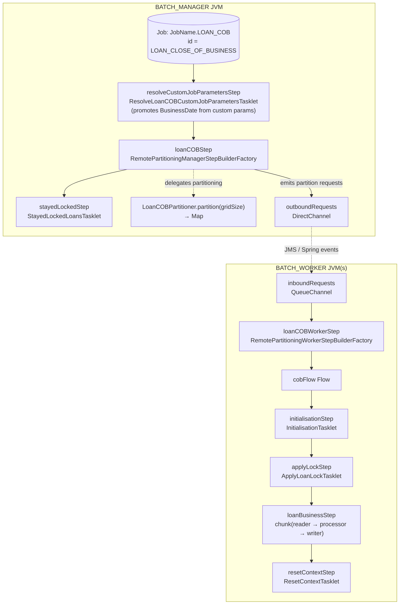
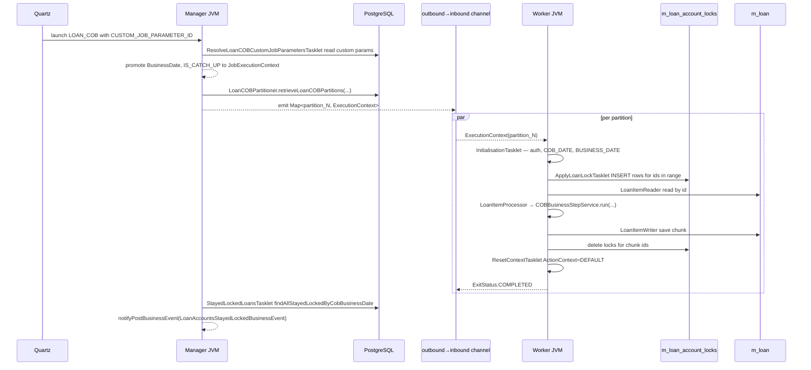

`LOAN_COB` is a Spring Batch remote-partitioning job: a single manager JVM (mode = `BATCH_MANAGER`) produces partitions and a fleet of worker JVMs (mode = `BATCH_WORKER`) drain a Spring Integration channel and run chunks. Same JVM in monolith mode plays both roles. This page is the implementation-level reference for the bean wiring in `LoanCOBManagerConfiguration` and `LoanCOBWorkerConfiguration`, the partitioner, the reader/processor/writer triplet, the `fineract.partitioned-job.partitioned-job-properties[0]` keys that tune chunk and partition sizes, and the retry / skip behaviour Spring Batch applies on top.

For the framework abstractions over Spring Batch (channels, polling, modes) see [Spring Batch manager/worker](/jobs/spring-batch-manager-worker).

## Job structure



Manager and worker are split by the `BatchManagerCondition` / `BatchWorkerCondition` `@Conditional` classes; see [Conditions & resolvers](/cob/cob-conditions-and-resolvers).

## Manager-side wiring (LoanCOBManagerConfiguration)

```java
@Configuration
@EnableBatchIntegration
@Conditional(BatchManagerCondition.class)
public class LoanCOBManagerConfiguration {

    @Bean
    @StepScope
    public LoanCOBPartitioner partitioner(@Value("#{stepExecution}") StepExecution stepExecution) {
        return new LoanCOBPartitioner(propertyService, cobBusinessStepService,
                retrieveIdService, jobOperator, stepExecution,
                LoanCOBConstant.NUMBER_OF_DAYS_BEHIND);
    }

    @Bean("loanCOBStep")
    public Step loanCOBStep(LoanCOBPartitioner partitioner) {
        return stepBuilderFactory.get(LoanCOBConstant.LOAN_COB_PARTITIONER_STEP)
            .partitioner(LoanCOBConstant.LOAN_COB_WORKER_STEP, partitioner)
            .pollInterval(propertyService.getPollInterval(JOB_NAME))
            .outputChannel(outboundRequests).build();
    }

    @Bean
    public Step resolveCustomJobParametersStep() {
        return new StepBuilder("Resolve custom job parameters - Step", jobRepository)
            .tasklet(resolveCustomJobParametersTasklet(), transactionManager)
            .listener(customJobParametersPromotionListener())
            .build();
    }

    @Bean
    public Step stayedLockedStep() {
        return new StepBuilder("Stayed locked loan accounts - Step", jobRepository)
            .tasklet(stayedLockedTasklet(), transactionManager).build();
    }

    @Bean(name = "loanCOBJob")
    public Job loanCOBJob(LoanCOBPartitioner partitioner) {
        return new JobBuilder(JobName.LOAN_COB.name(), jobRepository)
            .listener(new COBExecutionListenerRunner(applicationContext, JobName.LOAN_COB.name()))
            .start(resolveCustomJobParametersStep())
            .next(loanCOBStep(partitioner))
            .next(stayedLockedStep())
            .incrementer(new RunIdIncrementer())
            .build();
    }

    @Bean
    public ExecutionContextPromotionListener customJobParametersPromotionListener() {
        ExecutionContextPromotionListener listener = new ExecutionContextPromotionListener();
        listener.setKeys(new String[] {
            LoanCOBConstant.BUSINESS_DATE_PARAMETER_NAME,
            LoanCOBConstant.IS_CATCH_UP_PARAMETER_NAME });
        return listener;
    }
}
```

Three steps execute sequentially on the manager:

1. **`resolveCustomJobParametersStep`** — a single tasklet (`ResolveLoanCOBCustomJobParametersTasklet`) that reads `CUSTOM_JOB_PARAMETER_ID` out of the `JobParameters`, looks up the `CustomJobParameter` row, and pushes `BusinessDate` (and implicitly `IS_CATCH_UP`) into the step execution context. The `ExecutionContextPromotionListener` then promotes those keys to the job execution context so subsequent steps (and partitioner) can read them.

   ```java
   @Override
   public RepeatStatus execute(StepContribution contribution, ChunkContext chunkContext) {
       customJobParameterResolver.resolve(contribution, chunkContext,
           LoanCOBConstant.BUSINESS_DATE_PARAMETER_NAME,
           LoanCOBConstant.BUSINESS_DATE_PARAMETER_NAME);
       return RepeatStatus.FINISHED;
   }
   ```

2. **`loanCOBStep`** — the partitioning step. Polls workers every `propertyService.getPollInterval(JOB_NAME)` ms (`fineract.partitioned-job.partitioned-job-properties[0].poll-interval`, default 500 ms) until all worker partitions report COMPLETED. Sends partition execution contexts over `outboundRequests` (configured globally for remote partitioning).

3. **`stayedLockedStep`** — a tasklet that runs *after* the partitioned step. It uses `RetrieveIdService.findAllStayedLockedByCobBusinessDate(cobBusinessDate)` to find loans whose lock could not be released (because their business step threw) and emits a single `LoanAccountsStayedLockedBusinessEvent` containing the list.

   ```java
   public class StayedLockedLoansTasklet implements Tasklet {
       @Override
       public RepeatStatus execute(StepContribution contribution, ChunkContext chunkContext) {
           LoanAccountsStayedLockedData lockedLoanAccounts = buildLoanAccountData();
           if (!lockedLoanAccounts.getLoanAccounts().isEmpty()) {
               businessEventNotifierService.notifyPostBusinessEvent(
                   new LoanAccountsStayedLockedBusinessEvent(lockedLoanAccounts));
           }
           return RepeatStatus.FINISHED;
       }
   }
   ```

The job listener `COBExecutionListenerRunner` (see [Listeners](/cob/cob-listeners)) collects any `@Component` implementing `FineractCOBBeforeJobListener` / `FineractCOBAfterJobListener` whose `getJobName()` equals `LOAN_COB`.

### The partitioner

```java
public class LoanCOBPartitioner extends CommonPartitioner implements Partitioner {

    private final PropertyService propertyService;
    private final COBBusinessStepService cobBusinessStepService;

    @Override
    public Map<String, ExecutionContext> partition(int gridSize) {
        int partitionSize = propertyService.getPartitionSize(LoanCOBConstant.JOB_NAME);
        Set<BusinessStepNameAndOrder> cobBusinessSteps = cobBusinessStepService
            .getCOBBusinessSteps(LoanCOBBusinessStep.class, LoanCOBConstant.LOAN_COB_JOB_NAME);
        return getPartitions(partitionSize, cobBusinessSteps);
    }
}
```

The base `CommonPartitioner.getPartitions(...)` is where the real work happens:

```java
public Map<String, ExecutionContext> getPartitions(int partitionSize,
                                                   Set<BusinessStepNameAndOrder> cobBusinessSteps) {
    if (cobBusinessSteps.isEmpty()) {
        stopJobExecution();
        return Map.of();
    }
    LocalDate businessDate = BusinessDateResolver.resolve(stepExecution);
    boolean isCatchUp = CatchUpFlagResolver.resolve(stepExecution);
    List<COBPartition> partitions = new ArrayList<>(
        retrieveIdService.retrieveLoanCOBPartitions(numberOfDays, businessDate, isCatchUp, partitionSize));
    if (partitions.isEmpty()) {
        partitions.add(new COBPartition(0L, 0L, 1L, 0L));
    }
    return partitions.stream().collect(Collectors.toMap(
        l -> COBConstant.PARTITION_PREFIX + l.getPageNo(),
        l -> createExecutionContextForPartition(cobBusinessSteps, l, businessDate, isCatchUp)));
}

private ExecutionContext createExecutionContextForPartition(...) {
    ExecutionContext ctx = new ExecutionContext();
    ctx.put(COBConstant.BUSINESS_STEPS, cobBusinessSteps);
    ctx.put(COBConstant.COB_PARAMETER,
        new COBParameter(loanCOBPartition.getMinId(), loanCOBPartition.getMaxId()));
    ctx.put(COBConstant.PARTITION_KEY, COBConstant.PARTITION_PREFIX + loanCOBPartition.getPageNo());
    ctx.put(COBConstant.BUSINESS_DATE_PARAMETER_NAME, businessDate.toString());
    ctx.put(COBConstant.IS_CATCH_UP_PARAMETER_NAME, Boolean.toString(isCatchUp));
    return ctx;
}
```

Key behaviours:

- **No configured steps → immediate job stop.** `stopJobExecution` calls `jobOperator.stop(jobExecutionId)`. Without this, `COBBusinessStepServiceImpl.run` would throw `BusinessStepException` for every loan.
- **No loans in scope → one empty partition.** `new COBPartition(0L, 0L, 1L, 0L)` keeps Spring Batch happy (it requires at least one partition) without producing any work; the `ApplyLoanLockTasklet` and `LoanItemReader` both short-circuit on `(min=0, max=0)`.
- **Numbers, not ids.** `partitionSize` is the number of **loans per partition page**, not the count of partitions. So a tenant with 100 000 loans + `partition-size=100` produces 1 000 partitions of 100 loans each.

The SQL behind `retrieveLoanCOBPartitions` (in `RetrieveAllNonClosedIdServiceImpl`):

```sql
select min(id) as min, max(id) as max, page, count(id) as count from
  (select floor(((row_number() over(order by id))-1) / :pageSize) as page, t.* from
    (select id from m_loan where loan_status_id in (:statusIds) and
       (last_closed_business_date = :businessDate or last_closed_business_date is null)
       /* in catch-up mode: last_closed_business_date = :businessDate */
     order by id) t) t2
group by page
order by page
```

`:businessDate` is **`COB business date − NUMBER_OF_DAYS_BEHIND`** (1 day). So the manager asks "give me partitions of loans whose `last_closed_business_date` is yesterday (or unset)". Statuses 100–304 correspond to `SUBMITTED_AND_PENDING_APPROVAL`, `APPROVED`, `ACTIVE`, `TRANSFER_IN_PROGRESS`, `TRANSFER_ON_HOLD`.

## Worker-side wiring (LoanCOBWorkerConfiguration)

```java
@Configuration
@Conditional(BatchWorkerCondition.class)
public class LoanCOBWorkerConfiguration {

    @Bean(name = LoanCOBConstant.LOAN_COB_WORKER_STEP)
    public Step loanCOBWorkerStep(Flow cobFlow) {
        return stepBuilderFactory.get("Loan COB worker - Step")
            .inputChannel(inboundRequests).flow(cobFlow).build();
    }

    @Bean("cobFlow")
    public Flow flow(Step initialisationStep, Step applyLockStep,
                     Step loanBusinessStep, Step resetContextStep) {
        return new FlowBuilder<Flow>("cobFlow")
            .start(initialisationStep)
            .next(applyLockStep)
            .next(loanBusinessStep)
            .next(resetContextStep)
            .build();
    }
}
```

Each worker step receives an `ExecutionContext` over `inboundRequests`, runs the four-step flow against it, then reports completion back to the manager.

### Step 1: initialisationStep

```java
@Bean("initialisationStep")
@StepScope
public Step initialisationStep(@Value("#{stepExecutionContext['partition']}") String partitionName) {
    return new StepBuilder("Initialisation - Step:" + partitionName, jobRepository)
        .tasklet(initialiseContext(), transactionManager).build();
}

@Bean public InitialisationTasklet initialiseContext() {
    return new InitialisationTasklet(userRepository);
}
```

`InitialisationTasklet` populates the thread-local context for this worker thread:

```java
@Override
public RepeatStatus execute(...) throws Exception {
    HashMap<BusinessDateType, LocalDate> businessDates = ThreadLocalContextUtil.getBusinessDates();
    AppUser user = userRepository.fetchSystemUser();
    UsernamePasswordAuthenticationToken auth =
        new UsernamePasswordAuthenticationToken(user, user.getPassword(), user.getAuthorities());
    SecurityContextHolder.getContext().setAuthentication(auth);
    ThreadLocalContextUtil.setActionContext(ActionContext.COB);

    String businessDateString = Objects.requireNonNull((String) chunkContext.getStepContext()
        .getStepExecution().getJobExecution().getExecutionContext()
        .get(LoanCOBConstant.BUSINESS_DATE_PARAMETER_NAME));
    LocalDate businessDate = LocalDate.parse(businessDateString, DateTimeFormatter.ISO_DATE);

    businessDates.put(BusinessDateType.COB_DATE, businessDate);
    businessDates.put(BusinessDateType.BUSINESS_DATE, businessDate.plusDays(1));
    ThreadLocalContextUtil.setBusinessDates(businessDates);
    return RepeatStatus.FINISHED;
}
```

Two important invariants:

- The `system` user becomes the authenticated principal — every JPA audit field is stamped to that user during COB.
- `BUSINESS_DATE = COB_DATE + 1 day`. Inside `ActionContext.COB`, "today" reads as the day after COB so steps comparing due dates against "now" do not see themselves.

### Step 2: applyLockStep → ApplyLoanLockTasklet

```java
@Bean("applyLockStep")
@StepScope
public Step applyLockStep(@Value("#{stepExecutionContext['partition']}") String partitionName) {
    return new StepBuilder("Apply lock - Step:" + partitionName, jobRepository)
        .tasklet(applyLock(), transactionManager).build();
}

@Bean public ApplyLoanLockTasklet applyLock() {
    return new ApplyLoanLockTasklet(fineractProperties, loanLockingService,
                                    retrieveIdService, transactionTemplate);
}
```

`ApplyLoanLockTasklet` is a thin loan-typed adaptor over the generic `ApplyCommonLockTasklet`; it inserts one `m_loan_account_locks` row per loan id in this partition's range, owner `LOAN_COB_CHUNK_PROCESSING`. Detailed in [Account locking](/cob/account-locking).

### Step 3: loanBusinessStep — the chunk

```java
@Bean("loanBusinessStep")
@StepScope
public Step loanBusinessStep(@Value("#{stepExecutionContext['partition']}") String partitionName,
                             TaskExecutor cobTaskExecutor) {
    SimpleStepBuilder<Loan, Loan> stepBuilder = new StepBuilder("Loan Business - Step:" + partitionName, jobRepository)
        .<Loan, Loan>chunk(propertyService.getChunkSize(JobName.LOAN_COB.name()), transactionManager)
        .reader(cobWorkerItemReader())
        .processor(cobWorkerItemProcessor())
        .writer(cobWorkerItemWriter())
        .faultTolerant()
        .retry(Exception.class)
        .retryLimit(propertyService.getRetryLimit(LoanCOBConstant.JOB_NAME))
        .skip(Exception.class)
        .skipLimit(propertyService.getChunkSize(LoanCOBConstant.JOB_NAME) + 1)
        .listener(loanItemListener())
        .transactionManager(transactionManager);

    if (propertyService.getThreadPoolMaxPoolSize(LoanCOBConstant.JOB_NAME) > 1) {
        stepBuilder.taskExecutor(cobTaskExecutor);
    }
    return stepBuilder.build();
}
```

Three things to call out:

- **Chunk size = `fineract.partitioned-job.partitioned-job-properties[0].chunk-size`** (default 100). Each chunk runs in one DB transaction. With partition-size also 100, you typically get one chunk per partition.
- **Fault tolerance:** every chunk-level `Exception` is retried up to `retry-limit` (default 5) and skipped up to `chunk-size + 1` — i.e. effectively the whole chunk may be skipped. Skipped items hit the listener which records the failure on the loan's lock row.
- **Multi-threaded chunk:** if `thread-pool-max-pool-size > 1`, the chunk is executed concurrently via a `ThreadPoolTaskExecutor` decorated with `ContextAwareTaskDecorator` (from `fineract-loan`) which copies the `FineractContext` (tenant, business dates, action context) to each worker thread:

```java
public class ContextAwareTaskDecorator implements TaskDecorator {
    @Override
    public Runnable decorate(@NonNull final Runnable runnable) {
        final FineractContext context = ThreadLocalContextUtil.getContext();
        return () -> {
            try {
                ThreadLocalContextUtil.init(context);
                runnable.run();
            } finally {
                ThreadLocalContextUtil.reset();
            }
        };
    }
}
```

#### Reader

```java
public class LoanItemReader extends AbstractLoanItemReader<Loan> {
    private final BeforeStepLockingItemReaderHelper<LoanAccountLock> helper;

    @BeforeStep
    public void beforeStep(@NonNull StepExecution stepExecution) {
        setRemainingData(helper.filterRemainingData(stepExecution));
    }
}

public abstract class AbstractLoanItemReader<T> implements ItemReader<T> {
    @Override
    public T read() throws Exception {
        final Long loanId = remainingData.poll();
        if (loanId != null) {
            try { return loanRepository.findById(loanId).orElseThrow(() -> new LoanNotFoundException(loanId)); }
            catch (Exception e) { throw new LockedReadException(loanId, e); }
        }
        return null;
    }
}
```

`BeforeStepLockingItemReaderHelper.filterRemainingData(...)` takes the `(minAccountId, maxAccountId)` from the partition's execution context, asks the DB which ids in that range are non-closed and behind, then intersects with ids whose lock row exists with owner `LOAN_COB_CHUNK_PROCESSING`. Result: a `LinkedBlockingQueue<Long>` that `read()` polls one id at a time.

A read failure becomes `LockedReadException(loanId)` so the listener can write the error to the loan-specific lock row instead of failing the chunk silently.

#### Processor

See [Business step framework](/cob/business-step-framework). The processor wires the `COBBusinessStepService` into the chunk:

```java
public class LoanItemProcessor extends AbstractLoanItemProcessor {
    @BeforeStep
    public void beforeStep(StepExecution stepExecution) {
        setExecutionContext(stepExecution.getExecutionContext());
        setBusinessDate(stepExecution);
    }
}

public abstract class AbstractLoanItemProcessor extends AbstractItemProcessor<Loan> {
    @Override
    public Loan process(@NonNull Loan loan) throws Exception {
        if (needToRebuildModel(loan)) {
            progressiveLoanModelProcessingService.recalculateModelAndSave(loan.getId());
        }
        return super.process(loan);
    }
    @Override
    public void setLastRun(Loan processedLoan) {
        processedLoan.setLastClosedBusinessDate(getBusinessDate());
    }
}
```

`setLastRun` is the single mutation outside the chained `execute` calls: it sets `loan.last_closed_business_date = COB_DATE`, which is exactly the condition the partitioner queries on for the next day's run.

#### Writer

```java
public class LoanItemWriter extends AbstractLoanItemWriter {
    public LoanItemWriter(LockingService<LoanAccountLock> loanLockingService) { super(loanLockingService); }
    @Override
    protected LockOwner getLockOwner() { return LockOwner.LOAN_COB_CHUNK_PROCESSING; }
}

public abstract class AbstractLoanItemWriter extends RepositoryItemWriter<Loan> {
    @Override
    public void write(@NonNull Chunk<? extends Loan> items) throws Exception {
        if (!items.isEmpty()) {
            super.write(items);   // RepositoryItemWriter.save
            List<Long> loanIds = items.getItems().stream().map(AbstractPersistableCustom::getId).toList();
            loanLockingService.deleteByLoanIdInAndLockOwner(loanIds, getLockOwner());
        }
    }
}
```

The writer is `RepositoryItemWriter<Loan>` pointed at `LoanRepository`, so `super.write(items)` issues `save(...)` on each. Then it releases the lock for the entire chunk in one batch delete. If `super.write` throws, the lock is **not** released — `StayedLockedLoansTasklet` will pick those loans up at the end of the job.

### Step 4: resetContextStep

```java
@Bean("resetContextStep")
@StepScope
public Step resetContextStep(@Value("#{stepExecutionContext['partition']}") String partitionName) {
    return new StepBuilder("Reset context - Step:" + partitionName, jobRepository)
        .tasklet(resetContext(), transactionManager).build();
}

@Bean public ResetContextTasklet resetContext() { return new ResetContextTasklet(); }
```

```java
public class ResetContextTasklet implements Tasklet {
    @Override
    public RepeatStatus execute(...) {
        ThreadLocalContextUtil.setActionContext(ActionContext.DEFAULT);
        return RepeatStatus.FINISHED;
    }
}
```

Flips the worker thread back out of `ActionContext.COB` so the pooled thread is safe to be reused for non-COB work.

## RetrieveAllNonClosedIdServiceImpl + RetrieveLoanIdConfiguration

```java
@Configuration
public class RetrieveLoanIdConfiguration {
    @Bean
    @ConditionalOnMissingBean
    public RetrieveLoanIdService retrieveLoanIdService() {
        return new RetrieveAllNonClosedIdServiceImpl(loanRepository, namedParameterJdbcTemplate);
    }
}
```

`RetrieveAllNonClosedIdServiceImpl implements RetrieveLoanIdService`:

```java
private static final Collection<LoanStatus> NON_CLOSED_LOAN_STATUSES = Arrays.asList(
    LoanStatus.SUBMITTED_AND_PENDING_APPROVAL, LoanStatus.APPROVED, LoanStatus.ACTIVE,
    LoanStatus.TRANSFER_IN_PROGRESS, LoanStatus.TRANSFER_ON_HOLD);
```

Methods called from the various tasklets:

| Method | Used by |
| ------ | ------- |
| `retrieveLoanCOBPartitions(numberOfDays, businessDate, isCatchUp, partitionSize)` | `LoanCOBPartitioner` (via `CommonPartitioner.getPartitions`) |
| `retrieveAllNonClosedLoansByLastClosedBusinessDateAndMinAndMaxLoanId(cobParameter, isCatchUp)` | `BeforeStepLockingItemReaderHelper`, `ApplyCommonLockTasklet` |
| `retrieveLoanIdsBehindDate(businessDate, loanIds)` | Catch-up & inline COB to filter ids that still need processing |
| `retrieveLoanIdsOldestCobProcessed(businessDate)` | `LoanCOBCatchUpServiceImpl.getOldestCOBProcessedLoan` |
| `retrieveLoanBehindOnDisbursementDate(businessDate, loanIds)` | Inline COB to also pull "behind-by-disbursement" loans |
| `findAllStayedLockedByCobBusinessDate(cobBusinessDate)` | `StayedLockedLoansTasklet` |

The `@ConditionalOnMissingBean` lets downstream installations replace the implementation (e.g. with a sharded variant) without touching the manager-configuration code.

## application.properties keys

```properties
fineract.partitioned-job.partitioned-job-properties[0].job-name=LOAN_COB
fineract.partitioned-job.partitioned-job-properties[0].chunk-size=${LOAN_COB_CHUNK_SIZE:100}
fineract.partitioned-job.partitioned-job-properties[0].partition-size=${LOAN_COB_PARTITION_SIZE:100}
fineract.partitioned-job.partitioned-job-properties[0].thread-pool-core-pool-size=${LOAN_COB_THREAD_POOL_CORE_POOL_SIZE:5}
fineract.partitioned-job.partitioned-job-properties[0].thread-pool-max-pool-size=${LOAN_COB_THREAD_POOL_MAX_POOL_SIZE:5}
fineract.partitioned-job.partitioned-job-properties[0].thread-pool-queue-capacity=${LOAN_COB_THREAD_POOL_QUEUE_CAPACITY:20}
fineract.partitioned-job.partitioned-job-properties[0].retry-limit=${LOAN_COB_RETRY_LIMIT:5}
fineract.partitioned-job.partitioned-job-properties[0].poll-interval=${LOAN_COB_POLL_INTERVAL:500}
```

| Key | Read by | Meaning |
| --- | ------- | ------- |
| `chunk-size` | `loanBusinessStep` chunk(), `skip-limit` derived from this | Items per chunk (= one DB tx). |
| `partition-size` | `LoanCOBPartitioner.partition(int)` | Items per partition; effectively grid width. |
| `thread-pool-core-pool-size` / `max-pool-size` | `cobTaskExecutor` | Concurrency *within* a worker step's chunk. If max=1, a `SyncTaskExecutor` is used. |
| `thread-pool-queue-capacity` | `cobTaskExecutor` | Bounded queue depth for the thread pool. |
| `retry-limit` | `faultTolerant().retryLimit(...)` | Number of times a chunk can be retried after an exception. |
| `poll-interval` | `loanCOBStep.pollInterval(...)` | Manager polling frequency for partition completion (ms). |

The same `PropertyService` resolves analogous keys for the `WORKING_CAPITAL_LOAN_COB` job using its own index in `partitioned-job-properties`.

## End-to-end timing



## Inline & catch-up variants

The same reader/processor/writer abstractions are reused for the inline-COB job (`INLINE_LOAN_COB`) and for the catch-up service (`LoanCOBCatchUpServiceImpl`). See [Inline COB](/cob/inline-cob) for the inline pipeline and [API resources](/cob/cob-api-resources) for `POST /loans/catch-up`.

## Cross-references

- The mode flags switching manager vs. worker → [Conditions & resolvers](/cob/cob-conditions-and-resolvers)
- The job's listeners & per-chunk listener → [Listeners](/cob/cob-listeners)
- The lock rows applied/released → [Account locking](/cob/account-locking)
- The catalog the partitioner consults → [Categories & configuration](/cob/business-step-categories)
- The per-step semantics → [Loan COB business steps](/cob/loan-cob-business-steps)
- Spring Batch infra primitives → [Spring Batch manager/worker](/jobs/spring-batch-manager-worker)
- Job scheduling → [Jobs overview](/jobs/overview)
- End-to-end picture → [Loan COB flow](/flows/loan-cob-flow)
