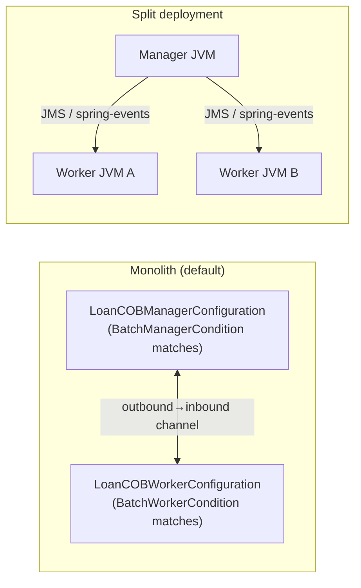
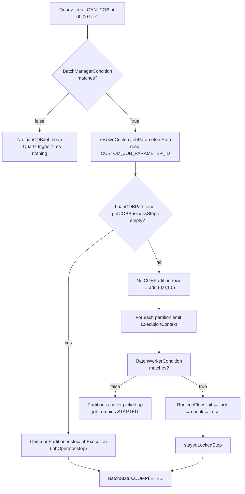
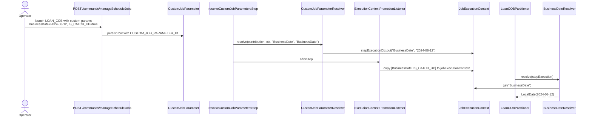

The COB engine fans out across two JVM modes (`BATCH_MANAGER` and `BATCH_WORKER`) and is feature-flagged at the job level via `fineract.job.loan-cob-enabled`. The gating uses Spring `@Conditional` evaluators in `fineract-cob/src/main/java/org/apache/fineract/cob/conditions/` plus a provider-level guard in `fineract-provider/.../cob/conditions/LoanCOBEnabledCondition.java`. Once a job is running, the partitioner and inline tasklets read `BusinessDate` and `IS_CATCH_UP` from the execution context via two small resolvers in `cob/resolver/`. This page documents both layers and explains when each condition decides COB runs vs. skips.

## The conditions layer

### BatchManagerCondition

```java
// fineract-cob/src/main/java/org/apache/fineract/cob/conditions/BatchManagerCondition.java
public class BatchManagerCondition extends PropertiesCondition {
    @Override
    protected boolean matches(FineractProperties properties) {
        return properties.getMode().isBatchManagerEnabled();
    }
}
```

`PropertiesCondition` is the base class from `fineract-core` that binds `FineractProperties` from `application.properties` and exposes a `matches(props)` for sub-classes to evaluate. `BatchManagerCondition.matches` returns `true` when `fineract.mode.batch-manager-enabled=true`.

Annotated on `LoanCOBManagerConfiguration` and on the working-capital-loan equivalent — these classes only contribute beans in JVMs that have explicitly opted into the manager role.

### BatchWorkerCondition

```java
// fineract-cob/src/main/java/org/apache/fineract/cob/conditions/BatchWorkerCondition.java
public class BatchWorkerCondition extends PropertiesCondition {
    @Override
    protected boolean matches(FineractProperties properties) {
        return properties.getMode().isBatchWorkerEnabled();
    }
}
```

Mirror image: `LoanCOBWorkerConfiguration` and `WorkingCapitalLoanCOBWorkerConfiguration` only load when `fineract.mode.batch-worker-enabled=true`.

### Combinations of modes

Three deployment topologies are possible:

| Mode flags | Result |
| ---------- | ------ |
| `batch-manager-enabled=true`, `batch-worker-enabled=true` (default) | Single-JVM monolith. Both configurations load; the manager step and the worker steps run in the same process. |
| `batch-manager-enabled=true`, `batch-worker-enabled=false` | JVM acts as manager only. Sends partition contexts over `outboundRequests`; does not consume from `inboundRequests`. |
| `batch-manager-enabled=false`, `batch-worker-enabled=true` | JVM is a worker only. Drains `inboundRequests`, runs `cobFlow`. |
| both false | Neither config loads. No COB job exists. Useful for read-replica/API-only deployments. |



The choice of inter-JVM transport (Spring Events vs. JMS) is set by `fineract.remote-job-message-handler.*`; see [Spring Batch manager/worker](/jobs/spring-batch-manager-worker).

### LoanCOBEnabledCondition

A second, finer gate sits in front of the inline-COB and catch-up beans:

```java
// fineract-provider/src/main/java/org/apache/fineract/cob/conditions/LoanCOBEnabledCondition.java
public class LoanCOBEnabledCondition extends PropertiesCondition {
    @Override
    protected boolean matches(FineractProperties properties) {
        return properties.getJob().isLoanCobEnabled();
    }
}
```

Backed by `fineract.job.loan-cob-enabled` (`FINERACT_JOB_LOAN_COB_ENABLED`, default `true`). Annotated on:

- `LoanInlineCOBConfig`
- `WorkingCapitalLoanInlineCOBConfig`
- `InlineLoanCOBExecutorServiceImpl`
- `LoanCOBCatchUpServiceImpl` / `WorkingCapitalLoanCOBCatchUpServiceImpl`

When `loan-cob-enabled=false`:

- The inline jobs (`INLINE_LOAN_COB`, `INLINE_WORKING_CAPITAL_LOAN_COB`) are not created, so `POST /v1/jobs/LOAN_COB/inline` returns `JobIsNotFoundOrNotEnabledException`.
- The catch-up endpoints return `JobIsNotFoundOrNotEnabledException` via the `Optional<LoanCOBCatchUpServiceImpl>` empty branch (`orElseThrow(...)`).
- The daily `LOAN_COB` job is **still** active if the batch-manager mode is on — the flag governs only the inline/catch-up companion features.

<Note>
The naming is asymmetric: `BatchManagerCondition` / `BatchWorkerCondition` gate the runtime configurations, `LoanCOBEnabledCondition` gates the *inline* job and catch-up service. The base `LOAN_COB` Spring Batch job's existence is gated by `BatchManagerCondition` (manager-side) and `BatchWorkerCondition` (worker-side), not by `LoanCOBEnabledCondition`.
</Note>

## When does COB run vs. skip?



Three distinct skip paths:

1. **No manager configured** — Quartz trigger fires but `loanCOBJob` bean does not exist, so the launcher logs that the job is unknown. Either misconfiguration or intentional (e.g. a read-replica box).
2. **No steps configured** — partitioner calls `jobOperator.stop(jobExecutionId)`. The job ends with `BatchStatus.STOPPED`. Operators see an empty step config and know to PUT some.
3. **No work to do** — every loan was either closed or already processed today. The partitioner emits a single `(0, 0, 1, 0)` partition; the reader's queue is empty so `read()` returns `null` immediately; chunk runs zero times; writer is never invoked; job ends `COMPLETED` with `commitCount=0`.

## The resolvers layer

The framework stores `BusinessDate` and `IS_CATCH_UP` as **strings** in the Spring Batch execution context (so they survive serialization to the `BATCH_JOB_EXECUTION_CONTEXT` table). Two small final classes do the type-safe read.

### BusinessDateResolver

```java
// fineract-cob/src/main/java/org/apache/fineract/cob/resolver/BusinessDateResolver.java
public final class BusinessDateResolver {

    private BusinessDateResolver() {}

    public static LocalDate resolve(StepExecution stepExecution) {
        Object bd = stepExecution.getJobExecution().getExecutionContext()
            .get(COBConstant.BUSINESS_DATE_PARAMETER_NAME);
        return switch (bd) {
            case null -> throw new IllegalStateException(
                "Missing BusinessDate in JobExecutionContext for jobExecutionId="
                + stepExecution.getJobExecution().getId());
            case String bdStr           -> LocalDate.parse(bdStr);
            case LocalDate bdLocalDate  -> bdLocalDate;
            default                     -> throw new IllegalStateException("BusinessDate value is unrecognizable: " + bd);
        };
    }
}
```

Reads from the **job** execution context (not the step's) because the value is promoted there by `ExecutionContextPromotionListener` after `ResolveLoanCOBCustomJobParametersTasklet` writes it to the step context.

Three accepted shapes:

- `String` in `ISO_DATE` form (`"2024-08-12"`) — the canonical persisted form.
- `LocalDate` instance — used when the value has been written directly by a tasklet within the same JVM run.
- `null` — fatal. The error message includes the job execution id so operators can find the orphaned execution in `BATCH_JOB_EXECUTION`.

Used by:

- `CommonPartitioner.getPartitions` (`LoanCOBPartitioner`, `WorkingCapitalLoanCOBPartitioner`).
- `AbstractItemProcessor.setBusinessDate`.

### CatchUpFlagResolver

```java
// fineract-cob/src/main/java/org/apache/fineract/cob/resolver/CatchUpFlagResolver.java
public final class CatchUpFlagResolver {

    private CatchUpFlagResolver() {}

    public static boolean resolve(StepExecution stepExecution) {
        Object isCatchUp = stepExecution.getJobExecution().getExecutionContext()
            .get(COBConstant.IS_CATCH_UP_PARAMETER_NAME);
        return switch (isCatchUp) {
            case null              -> false;          // default: not catch-up
            case String s          -> Boolean.parseBoolean(s);
            case Boolean b         -> b;
            default                -> throw new IllegalStateException("isCatchUp value is unrecognizable: " + isCatchUp);
        };
    }
}
```

Same dual-format tolerance, but `null` resolves to `false`. The flag is set to `true` only by the catch-up driver:

```java
// fineract-provider/src/main/java/org/apache/fineract/cob/service/LoanCOBCatchUpServiceImpl.java
// (not shown in full) wraps each day-by-day run with IS_CATCH_UP=true so the
// partitioner queries last_closed_business_date = :businessDate (not also IS NULL)
```

What `IS_CATCH_UP=true` changes in `RetrieveAllNonClosedIdServiceImpl`:

```java
sql.append("(select id from m_loan where loan_status_id in (:statusIds) and ");
if (isCatchUp) {
    sql.append("last_closed_business_date = :businessDate ");
} else {
    sql.append("(last_closed_business_date = :businessDate or last_closed_business_date is null) ");
}
```

Catch-up runs **only** loans known to be exactly one day behind. The normal nightly run additionally picks up newly-created loans with `last_closed_business_date IS NULL`.

## How the values get into the context



`CustomJobParameterResolver.resolve(...)` looks up the `CUSTOM_JOB_PARAMETER_ID` Spring Batch job parameter, fetches the `CustomJobParameter` row's JSON, finds the entry with the requested key, and writes it into the step execution context. The promotion listener then moves it to the job context so the worker side can read it.

For Quartz-triggered runs without explicit parameters, `BusinessDate` defaults to the tenant's current COB date (resolved via `ThreadLocalContextUtil.getBusinessDateByType(BusinessDateType.COB_DATE)` inside the trigger handler).

## A consumer's view

Every step that needs the "as-of" date uses `BusinessDateResolver`:

```java
// AbstractItemProcessor
protected void setBusinessDate(StepExecution stepExecution) {
    businessDate = BusinessDateResolver.resolve(stepExecution);
}
```

Every step that needs to know "is this a catch-up run" uses `CatchUpFlagResolver`:

```java
// CommonPartitioner.getPartitions
boolean isCatchUp = CatchUpFlagResolver.resolve(stepExecution);
List<COBPartition> partitions = ...retrieveIdService.retrieveLoanCOBPartitions(
    numberOfDays, businessDate, isCatchUp, partitionSize);
```

```java
// ApplyCommonLockTasklet.execute
boolean isCatchUp = CatchUpFlagResolver.resolve(contribution.getStepExecution());
List<Long> loanIds = retrieveIdService
    .retrieveAllNonClosedLoansByLastClosedBusinessDateAndMinAndMaxLoanId(loanCOBParameter, isCatchUp);
```

```java
// BeforeStepLockingItemReaderHelper.filterRemainingData
boolean isCatchUp = CatchUpFlagResolver.resolve(stepExecution);
loanIds = retrieveIdService
    .retrieveAllNonClosedLoansByLastClosedBusinessDateAndMinAndMaxLoanId(loanCOBParameter, isCatchUp);
```

Consistency across these three call sites is what guarantees that a catch-up partition will lock and load exactly the same loan ids that were enumerated by the partitioner.

## Edge cases

### Mode flags toggled mid-run

The mode flags are read at Spring context start. Toggling `fineract.mode.batch-worker-enabled=false` at runtime has no effect until the JVM restarts. A graceful shutdown is the safe transition.

### BusinessDate missing

`IllegalStateException("Missing BusinessDate in JobExecutionContext for jobExecutionId=…")`. Causes:

- The `resolveCustomJobParametersStep` failed silently (check `BATCH_STEP_EXECUTION` for ExitStatus FAILED).
- A direct-launch path (e.g. a unit-test job) forgot to seed the execution context. The `InitialisationTasklet` would have triggered the same failure earlier via `Objects.requireNonNull(...)`.

### IS_CATCH_UP unset

Resolves to `false`. This is intentional: normal nightly runs do not set the flag explicitly.

### IS_CATCH_UP=true but no behind loans

The partitioner produces the dummy `(0,0,1,0)` partition; `LoanCOBCatchUpServiceImpl` notes that the run completed with zero items and stops the daily loop.

## Cross-references

- The configurations gated by these conditions → [Spring Batch wiring](/cob/cob-batch-jobs)
- The inline configuration gated by `LoanCOBEnabledCondition` → [Inline COB](/cob/inline-cob)
- The execution-context keys read by the resolvers → [Business step framework](/cob/business-step-framework)
- The `CustomJobParameterResolver` populating those keys → [Spring Batch manager/worker](/jobs/spring-batch-manager-worker)
- The catch-up REST endpoints driven by `IS_CATCH_UP` → [API resources](/cob/cob-api-resources)
