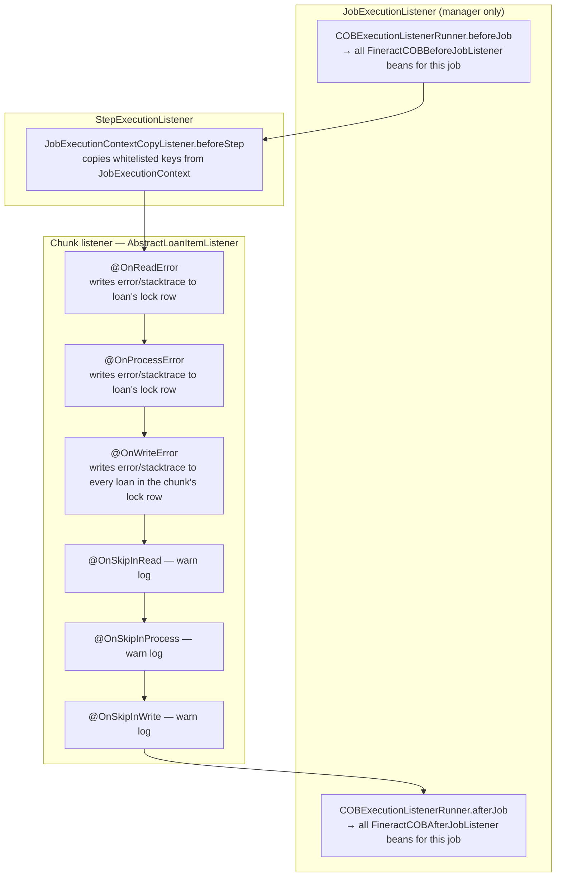
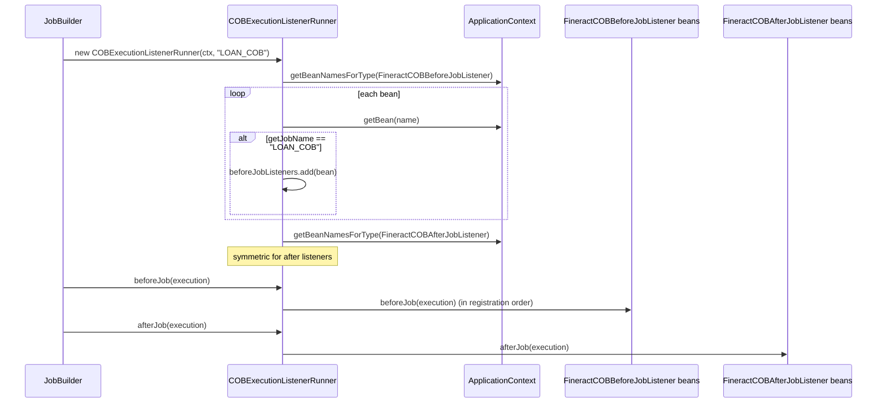
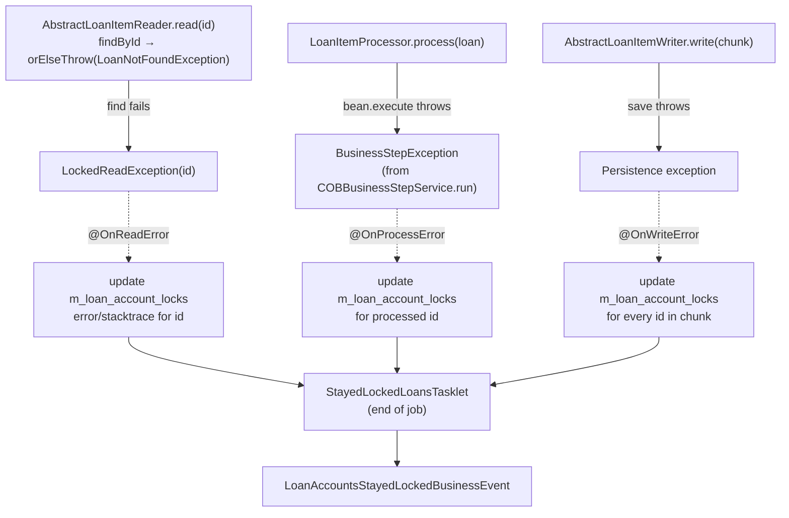
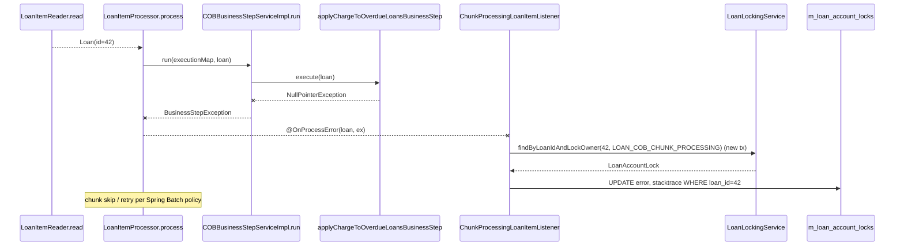

Spring Batch exposes lifecycle hooks at three levels — job, step, and chunk. The COB engine uses all three: a `JobExecutionListener` (`COBExecutionListenerRunner`) wires up arbitrary per-job extensions, a `StepExecutionListener` (`JobExecutionContextCopyListener`) copies promoted values into worker contexts, and a chunk listener (`AbstractLoanItemListener` and its `ChunkProcessingLoanItemListener` / `InlineCOBLoanItemListener` subclasses) writes failures back to the loan's lock row so they survive the chunk being skipped.

This page is the lifecycle reference; for the partitioner / reader / processor / writer wiring see [Spring Batch wiring](/cob/cob-batch-jobs).

## Hook map



## JobExecutionListener: COBExecutionListenerRunner

```java
// fineract-cob/src/main/java/org/apache/fineract/cob/listener/COBExecutionListenerRunner.java
public class COBExecutionListenerRunner implements JobExecutionListener {

    private final List<FineractCOBBeforeJobListener> beforeJobListeners = new ArrayList<>();
    private final List<FineractCOBAfterJobListener>  afterJobListeners  = new ArrayList<>();

    public COBExecutionListenerRunner(ApplicationContext applicationContext, String jobName) {
        addBeforeListeners(applicationContext, jobName);
        addAfterListeners(applicationContext, jobName);
    }

    @Override
    public void beforeJob(JobExecution jobExecution) {
        beforeJobListeners.forEach(l -> l.beforeJob(jobExecution));
    }

    @Override
    public void afterJob(JobExecution jobExecution) {
        afterJobListeners.forEach(l -> l.afterJob(jobExecution));
    }

    private void addBeforeListeners(ApplicationContext ctx, String jobName) {
        for (String beanName : ctx.getBeanNamesForType(FineractCOBBeforeJobListener.class)) {
            FineractCOBBeforeJobListener bean = (FineractCOBBeforeJobListener) ctx.getBean(beanName);
            if (jobName.equals(bean.getJobName())) {
                beforeJobListeners.add(bean);
            }
        }
    }
    /* …symmetric addAfterListeners… */
}
```

This is the only `JobExecutionListener` attached to the COB job (`new JobBuilder(…).listener(new COBExecutionListenerRunner(applicationContext, JobName.LOAN_COB.name()))` in `LoanCOBManagerConfiguration`). At construction it walks the bean factory and collects all `FineractCOB(Before|After)JobListener` beans whose `getJobName()` matches the job this listener is attached to. It is the registration mechanism for arbitrary "do something at the start/end of LOAN_COB" extensions.

### The SPIs

```java
// fineract-cob/src/main/java/org/apache/fineract/cob/listener/FineractCOBBeforeJobListener.java
public interface FineractCOBBeforeJobListener {
    void beforeJob(JobExecution jobExecution);
    String getJobName();
}

// fineract-cob/src/main/java/org/apache/fineract/cob/listener/FineractCOBAfterJobListener.java
public interface FineractCOBAfterJobListener {
    void afterJob(JobExecution jobExecution);
    String getJobName();
}
```

Two trivial interfaces. A subclass registered as `@Component` participates without code changes elsewhere; the `getJobName()` discriminator is how a single bean opts into one specific COB job (`LOAN_COB`, `WORKING_CAPITAL_LOAN_COB_JOB`, …).



Use cases (observed in tests and downstream modules):

- Persisting a "COB started/finished" audit row.
- Recording end-to-end run timings.
- Posting an `INCREASE_COB_DATE_BY_1_DAY` trigger from `afterJob` when the job completes with `BatchStatus.COMPLETED`.

Because the runner pre-binds beans at construction, **a listener added after the job is initialised will not be picked up until the job bean is re-created** (i.e. JVM restart). This is by design: the listener list is immutable for the lifetime of a given `Job` bean.

### Listener ordering

Listeners are added in the order Spring returns bean names (`getBeanNamesForType`), which is the discovery order in the bean factory. There is no `@Order` honouring inside the runner. If you need deterministic ordering, fold all logic into one listener bean.

## StepExecutionListener: JobExecutionContextCopyListener

```java
// fineract-cob/src/main/java/org/apache/fineract/cob/listener/JobExecutionContextCopyListener.java
public class JobExecutionContextCopyListener implements StepExecutionListener {

    private final List<String> stepExecutionKeys;

    public JobExecutionContextCopyListener(List<String> stepExecutionKeys) {
        this.stepExecutionKeys = stepExecutionKeys;
    }

    @Override
    public void beforeStep(final StepExecution stepExecution) {
        final ExecutionContext stepCtx = stepExecution.getExecutionContext();
        final ExecutionContext jobCtx  = stepExecution.getJobExecution().getExecutionContext();

        jobCtx.entrySet().forEach(entry -> {
            if (stepExecutionKeys.contains(entry.getKey())
                && BooleanUtils.isFalse(stepCtx.containsKey(entry.getKey()))) {
                stepCtx.put(entry.getKey(), entry.getValue());
            }
        });
    }
}
```

The companion to `ExecutionContextPromotionListener`. After the manager's `resolveCustomJobParametersStep` promotes `BusinessDate` and `IS_CATCH_UP` to the job execution context, the worker side's listeners can use this helper to pull the same keys into the step execution context (so the partitioner doesn't have to crawl up to the job execution context on every read). The class is part of the framework; child jobs (notably the inline ones) instantiate it with the whitelist of keys they expect to see.

The current loan COB manager step uses Spring's built-in `ExecutionContextPromotionListener` directly:

```java
@Bean
public ExecutionContextPromotionListener customJobParametersPromotionListener() {
    ExecutionContextPromotionListener listener = new ExecutionContextPromotionListener();
    listener.setKeys(new String[] {
        LoanCOBConstant.BUSINESS_DATE_PARAMETER_NAME,
        LoanCOBConstant.IS_CATCH_UP_PARAMETER_NAME });
    return listener;
}
```

`JobExecutionContextCopyListener` exists for downstream/custom flows that need to promote in the other direction (job → step) for keys other than these two.

## Chunk listener: AbstractLoanItemListener

```java
// fineract-cob/src/main/java/org/apache/fineract/cob/listener/AbstractLoanItemListener.java
public abstract class AbstractLoanItemListener<T extends AccountLock,
                                                S extends AbstractPersistableCustom<Long>> {

    private final LockingService<T> loanLockingService;
    private final TransactionTemplate transactionTemplate;

    @OnReadError
    public void onReadError(Exception e) {
        if (e instanceof LockedReadException ee) {
            log.warn("Error … reading of Loan (id={}) due to: {}", ee.getId(), ThrowableSerialization.serialize(e));
            updateAccountLockWithError(List.of(ee.getId()), "Loan (id: %d) reading is failed", e);
        } else {
            log.error("Could not handle read error", e);
        }
    }

    @OnProcessError
    public void onProcessError(@NonNull S item, Exception e) {
        log.warn("Error … processing of Loan (id={}) due to: {}", item.getId(), ThrowableSerialization.serialize(e));
        updateAccountLockWithError(List.of(item.getId()), "Loan (id: %d) processing is failed", e);
    }

    @OnWriteError
    public void onWriteError(Exception e, @NonNull Chunk<? extends S> items) {
        List<Long> loanIds = items.getItems().stream().map(AbstractPersistableCustom::getId).toList();
        log.warn("Error … writing of Loans (ids={}) due to: {}", loanIds, ThrowableSerialization.serialize(e));
        updateAccountLockWithError(loanIds, "Loan (id: %d) writing is failed", e);
    }

    @OnSkipInRead    public void onSkipInRead(@NonNull Throwable e)            { log.warn("Skipping was triggered during read!"); }
    @OnSkipInProcess public void onSkipInProcess(@NonNull S item, Throwable e) { log.warn("Skipping was triggered during processing of Loan (id={})", item.getId()); }
    @OnSkipInWrite   public void onSkipInWrite(@NonNull S item, Throwable e)   { log.warn("Skipping was triggered during writing of Loan (id={})", item.getId()); }

    protected abstract LockOwner getLockOwner();

    private void updateAccountLockWithError(List<Long> loanIds, String msg, Throwable e) {
        transactionTemplate.setPropagationBehavior(PROPAGATION_REQUIRES_NEW);
        transactionTemplate.execute(new TransactionCallbackWithoutResult() {
            @Override
            protected void doInTransactionWithoutResult(@NonNull TransactionStatus status) {
                for (Long loanId : loanIds) {
                    T loanAccountLock = loanLockingService.findByLoanIdAndLockOwner(loanId, getLockOwner());
                    if (loanAccountLock != null) {
                        loanAccountLock.setError(String.format(msg, loanId), ThrowableSerialization.serialize(e));
                    }
                }
            }
        });
    }
}
```

Important semantic details:

- **`PROPAGATION_REQUIRES_NEW`** — the error write happens in its own transaction so the rollback caused by the chunk failure does not also discard the failure record. The lock row survives with `error` + `stacktrace` columns set.
- **`ThrowableSerialization.serialize(e)`** stores a compact textual stacktrace in `m_loan_account_locks.stacktrace`. The lock row will be picked up by `StayedLockedLoansTasklet` and surfaced via `LoanAccountsStayedLockedBusinessEvent`.
- **Read errors are recognised only for `LockedReadException`.** That is the exception thrown by `AbstractLoanItemReader.read()` when `loanRepository.findById(loanId).orElseThrow(...)` itself throws — typically a `LoanNotFoundException` (e.g. the loan was deleted between the partitioner deciding to include it and the reader trying to load it).
- **Write errors fan out to every item in the chunk.** If one save fails, every loan in that chunk gets the same error message written to its lock row, because Spring Batch will retry the chunk one item at a time.

Two concrete subclasses pin `T` (the lock entity) and the `LockOwner`:

```java
// fineract-provider/src/main/java/org/apache/fineract/cob/listener/ChunkProcessingLoanItemListener.java
public class ChunkProcessingLoanItemListener extends AbstractLoanItemListener<LoanAccountLock, Loan> {
    public ChunkProcessingLoanItemListener(LockingService<LoanAccountLock> svc, TransactionTemplate tt) {
        super(svc, tt);
    }
    @Override protected LockOwner getLockOwner() { return LockOwner.LOAN_COB_CHUNK_PROCESSING; }
}

// fineract-provider/src/main/java/org/apache/fineract/cob/listener/InlineCOBLoanItemListener.java
public class InlineCOBLoanItemListener extends AbstractLoanItemListener<LoanAccountLock, Loan> {
    public InlineCOBLoanItemListener(LockingService<LoanAccountLock> svc, TransactionTemplate tt) {
        super(svc, tt);
    }
    @Override protected LockOwner getLockOwner() { return LockOwner.LOAN_INLINE_COB_PROCESSING; }
}
```

The chunked daily run uses `ChunkProcessingLoanItemListener` (wired into `loanBusinessStep` via `.listener(loanItemListener())`); the inline catch-up uses `InlineCOBLoanItemListener` (see [Inline COB](/cob/inline-cob)).

A third subclass `WorkingCapitalChunkProcessingLoanItemListener` reuses the same pattern for the working-capital-loan COB chunk; see [Working-capital COB](/cob/working-capital-loan-cob).

## Failure modes



The chunk listener's job is **not** to recover the run — Spring Batch's `retry(Exception.class)` + `skip(Exception.class)` configuration drives the retry/skip cycle. Its job is to make sure each failure is *durably attributed* to a specific loan so that:

1. The stayed-locked tasklet can emit the right ids in `LoanAccountsStayedLockedBusinessEvent`.
2. The `/v1/loans/locked` endpoint can show operators which accounts still need attention. See [API resources](/cob/cob-api-resources).
3. The next day's COB can pick the same loans up because their `last_closed_business_date` was never advanced, and operators can clear the lock once the underlying issue is fixed.

## Where the listener gets wired

```java
// LoanCOBWorkerConfiguration
@Bean
public ChunkProcessingLoanItemListener loanItemListener() {
    return new ChunkProcessingLoanItemListener(loanLockingService, transactionTemplate);
}

@Bean("loanBusinessStep")
@StepScope
public Step loanBusinessStep(...) {
    SimpleStepBuilder<Loan, Loan> stepBuilder = new StepBuilder("Loan Business - Step:" + partitionName, jobRepository)
        // ...
        .listener(loanItemListener())
        // ...
    return stepBuilder.build();
}
```

`.listener(...)` accepts any object with Spring Batch's `@OnXxx` annotations — the chunk listener uses annotations, not interface inheritance.

## Stayed-locked emission

```java
// fineract-provider/src/main/java/org/apache/fineract/cob/loan/StayedLockedLoansTasklet.java
@Override
public RepeatStatus execute(StepContribution contribution, ChunkContext chunkContext) throws Exception {
    LoanAccountsStayedLockedData lockedLoanAccounts = buildLoanAccountData();
    if (!lockedLoanAccounts.getLoanAccounts().isEmpty()) {
        businessEventNotifierService.notifyPostBusinessEvent(
            new LoanAccountsStayedLockedBusinessEvent(lockedLoanAccounts));
    }
    return RepeatStatus.FINISHED;
}

private LoanAccountsStayedLockedData buildLoanAccountData() {
    LocalDate cobBusinessDate = ThreadLocalContextUtil.getBusinessDateByType(BusinessDateType.COB_DATE);
    List<COBIdAndExternalIdAndAccountNo> stayedLockedLoanAccounts =
        retrieveIdService.findAllStayedLockedByCobBusinessDate(cobBusinessDate);
    return new LoanAccountsStayedLockedData(
        stayedLockedLoanAccounts.stream()
            .map(a -> new LoanAccountStayedLockedData(a.getId(), a.getExternalId(), a.getAccountNo()))
            .toList());
}
```

Tasklet wiring:

```java
// LoanCOBManagerConfiguration
@Bean
public Step stayedLockedStep() {
    return new StepBuilder("Stayed locked loan accounts - Step", jobRepository)
        .tasklet(stayedLockedTasklet(), transactionManager).build();
}
@Bean
public StayedLockedLoansTasklet stayedLockedTasklet() {
    return new StayedLockedLoansTasklet(businessEventNotifierService, retrieveIdService);
}
```

The query backing `findAllStayedLockedByCobBusinessDate` returns rows with `error IS NOT NULL` on `lock_placed_on_cob_business_date = cobBusinessDate`, i.e. exactly the rows whose lock row was updated by the chunk listener and never released by the writer.

## A worked example

A loan with id 42 is in the partition. The reader successfully loads it; the processor runs `applyChargeToOverdueLoansBusinessStep` which throws because the charge product has been deleted.



The loan stays locked; the writer never releases it; `StayedLockedLoansTasklet` notifies. Operators receive the event, fix the underlying data issue, manually clear the lock (via `DELETE` or the internal endpoint), and the next day's COB re-picks the loan because `last_closed_business_date` was never advanced.

## Cross-references

- The exception types caught above → [Business step framework](/cob/business-step-framework)
- The lock entity that carries the error → [Account locking](/cob/account-locking)
- The promote/copy execution-context dance → [Spring Batch wiring](/cob/cob-batch-jobs)
- The `LoanAccountsStayedLockedBusinessEvent` consumers → [Events overview](/events/overview)
- The endpoint that surfaces locked loans → [API resources](/cob/cob-api-resources)
