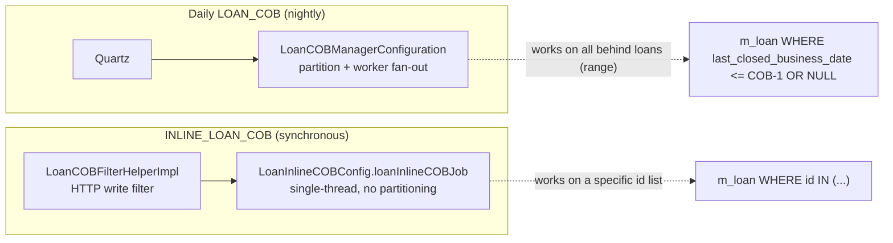
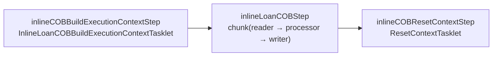
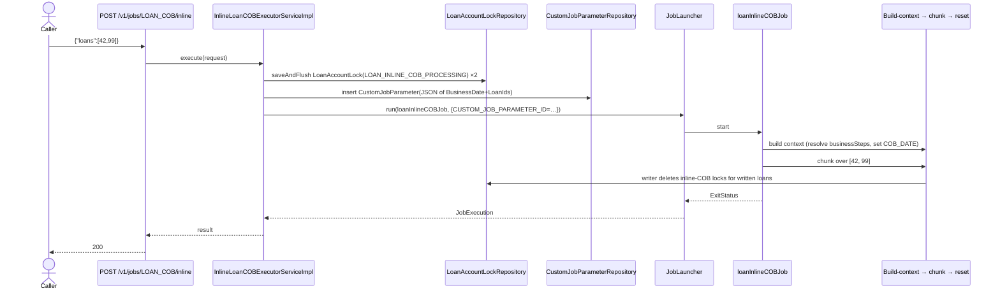
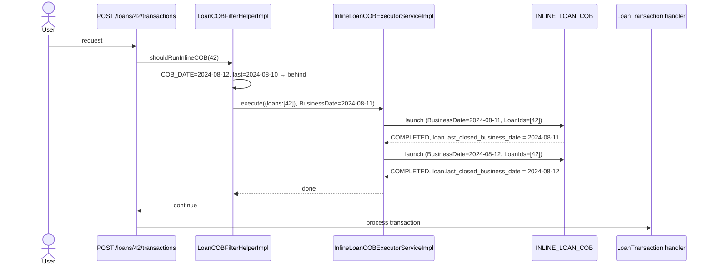

Inline COB exists for one job: bring a small list of specific loan ids up to the tenant's current COB date *now*, synchronously, while a user is waiting on a request. The most common trigger is the `LoanCOBFilterHelper` deciding that an HTTP write would touch a loan whose `last_closed_business_date` is behind the tenant's COB date — instead of rejecting the request, the filter launches `INLINE_LOAN_COB` against that loan and lets the write proceed once the loan is current.

This page covers the inline pipeline (`LoanInlineCOBConfig`, `InlineLoanCOBBuildExecutionContextTasklet`, `InlineCOBLoanItemReader/Processor/Writer`, `InlineCOBLoanItemListener`), the working-capital equivalent (`WorkingCapitalLoanInlineCOBConfig`, `WorkingCapitalInlineCOBLoanItemReader`), the executor that wraps it (`InlineLoanCOBExecutorServiceImpl`), and the `POST /v1/jobs/{jobName}/inline` REST surface. Catch-up over a date range — driven by `LoanCOBCatchUpServiceImpl` — is documented in [API resources](/cob/cob-api-resources).

## Inline vs. daily COB



Differences at a glance:

| Aspect | `LOAN_COB` | `INLINE_LOAN_COB` |
| ------ | ---------- | ----------------- |
| Trigger | Quartz `Job.LOAN_COB` | `POST /v1/jobs/LOAN_COB/inline` or `LoanCOBFilterHelperImpl` |
| Selection | All non-closed loans behind by `NUMBER_OF_DAYS_BEHIND` | Caller-supplied `List<Long>` of loan ids |
| Partitioning | `LoanCOBPartitioner` → partitions of `partition-size` ids | None — single step, single chunk over the id list |
| Lock owner | `LockOwner.LOAN_COB_CHUNK_PROCESSING` | `LockOwner.LOAN_INLINE_COB_PROCESSING` |
| Concurrency | Multi-threaded chunks via `cobTaskExecutor` | Single-threaded |
| Job context build | `ResolveLoanCOBCustomJobParametersTasklet` + partitioner | `InlineLoanCOBBuildExecutionContextTasklet` (one tasklet does it all) |
| Configuration | `BatchManagerCondition` + `BatchWorkerCondition` | `LoanCOBEnabledCondition` |

## LoanInlineCOBConfig

```java
@Configuration
@EnableBatchIntegration
@Conditional(LoanCOBEnabledCondition.class)
public class LoanInlineCOBConfig {

    @Bean
    public InlineLoanCOBBuildExecutionContextTasklet<Loan, LoanCOBBusinessStep> inlineLoanCOBBuildExecutionContextTasklet() {
        return new InlineLoanCOBBuildExecutionContextTasklet<>(cobBusinessStepService, customJobParameterRepository,
                customJobParameterResolver, LoanCOBBusinessStep.class, LoanCOBConstant.LOAN_COB_JOB_NAME);
    }

    @Bean
    protected Step inlineCOBBuildExecutionContextStep() {
        return new StepBuilder("Inline COB build execution context step", jobRepository)
            .tasklet(inlineLoanCOBBuildExecutionContextTasklet(), transactionManager)
            .listener(inlineCobPromotionListener())
            .build();
    }

    @Bean
    public Step inlineLoanCOBStep() {
        return new StepBuilder("Inline Loan COB Step", jobRepository)
            .<Loan, Loan>chunk(propertyService.getChunkSize(JobName.LOAN_COB.name()), transactionManager)
            .reader(inlineCobWorkerItemReader())
            .processor(inlineCobWorkerItemProcessor())
            .writer(inlineCobWorkerItemWriter())
            .listener(inlineCobLoanItemListener())
            .build();
    }

    @Bean(name = "loanInlineCOBJob")
    public Job loanInlineCOBJob() {
        return new JobBuilder(LoanCOBConstant.INLINE_LOAN_COB_JOB_NAME, jobRepository)
            .start(inlineCOBBuildExecutionContextStep())
            .next(inlineLoanCOBStep())
            .next(inlineCOBResetContextStep())
            .incrementer(new RunIdIncrementer())
            .build();
    }

    @Bean
    public ExecutionContextPromotionListener inlineCobPromotionListener() {
        ExecutionContextPromotionListener listener = new ExecutionContextPromotionListener();
        listener.setKeys(new String[] {
            LoanCOBConstant.COB_PARAMETER,
            LoanCOBConstant.BUSINESS_STEPS,
            LoanCOBConstant.BUSINESS_DATE_PARAMETER_NAME });
        return listener;
    }
}
```

Three steps, executed sequentially, all in the same JVM:



Notice what is **not** here, compared to the daily job:

- No `applyLockStep`. Locks are placed by the `InlineLoanCOBExecutorServiceImpl` **before** the job is launched, with owner `LOAN_INLINE_COB_PROCESSING`. The job assumes the locks are already there.
- No `stayedLockedStep`. If a step fails inline, the failure is surfaced synchronously to the HTTP caller and the loan remains locked under `LOAN_INLINE_COB_PROCESSING` until the caller clears it.
- No partitioner. The id list is small (typically 1 loan) and walked sequentially.

## InlineLoanCOBBuildExecutionContextTasklet

```java
public class InlineLoanCOBBuildExecutionContextTasklet<T extends AbstractPersistableCustom<Long>,
                                                       B extends COBBusinessStep<T>> implements Tasklet {

    private final COBBusinessStepService cobBusinessStepService;
    private final CustomJobParameterRepository customJobParameterRepository;
    private final CustomJobParameterResolver customJobParameterResolver;
    private final Class<B> businessStepClass;
    private final String cobJobName;

    public Set<BusinessStepNameAndOrder> resolveBusinessSteps() {
        return cobBusinessStepService.getCOBBusinessSteps(businessStepClass, cobJobName);
    }

    @Override
    public RepeatStatus execute(StepContribution contribution, ChunkContext chunkContext) throws Exception {
        HashMap<BusinessDateType, LocalDate> businessDates = ThreadLocalContextUtil.getBusinessDates();
        ThreadLocalContextUtil.setActionContext(ActionContext.COB);
        Set<BusinessStepNameAndOrder> cobBusinessSteps = resolveBusinessSteps();
        contribution.getStepExecution().getExecutionContext().put(COBConstant.COB_PARAMETER, getLoanIdsFromJobParameters(chunkContext));
        contribution.getStepExecution().getExecutionContext().put(COBConstant.BUSINESS_STEPS, cobBusinessSteps);
        String businessDateString = getBusinessDateFromJobParameters(chunkContext);
        contribution.getStepExecution().getExecutionContext().put(COBConstant.BUSINESS_DATE_PARAMETER_NAME, businessDateString);
        LocalDate businessDate = LocalDate.parse(businessDateString, DateTimeFormatter.ISO_DATE);
        businessDates.put(BusinessDateType.COB_DATE, businessDate);
        businessDates.put(BusinessDateType.BUSINESS_DATE, businessDate.plusDays(1));
        ThreadLocalContextUtil.setBusinessDates(businessDates);
        return RepeatStatus.FINISHED;
    }
}
```

Five jobs in one tasklet:

1. **Action context.** `ThreadLocalContextUtil.setActionContext(ActionContext.COB)`.
2. **Business steps.** Resolve the same `Set<BusinessStepNameAndOrder>` as the daily partitioner (`LoanCOBBusinessStep.class`, `LOAN_CLOSE_OF_BUSINESS`) and stash it under `businessSteps`.
3. **Loan id list.** Pull the inline-supplied loan ids out of the custom job parameter (key `LoanIds`, value a JSON array) and stash under `loanCobParameter`.
4. **Business date.** Pull the `BusinessDate` parameter and stash under `BusinessDate`.
5. **Thread-local dates.** Set `COB_DATE` and `BUSINESS_DATE = COB_DATE + 1` so the steps see the same dates the daily run would.

The `ExecutionContextPromotionListener` then promotes all three keys to the job execution context for the next steps to read.

```java
private List<Long> getLoanIdsFromJobParameters(ChunkContext chunkContext) {
    Set<JobParameterDTO> jobParameters = customJobParameterResolver
        .getCustomJobParameterSet(chunkContext.getStepContext().getStepExecution())
        .orElseThrow(() -> new LoanNotFoundException(SpringBatchJobConstants.CUSTOM_JOB_PARAMETER_ID_KEY));
    JobParameterDTO loanIdsParameter = jobParameters.stream()
        .filter(dto -> dto.getParameterName().equals(COBConstant.INLINE_IDS_PARAMETER_NAME)) // "LoanIds"
        .findFirst()
        .orElseThrow(() -> new CustomJobParameterNotFoundException(COBConstant.INLINE_IDS_PARAMETER_NAME));
    return gson.fromJson(loanIdsParameter.getParameterValue(), new TypeToken<ArrayList<Long>>() {}.getType());
}
```

`INLINE_IDS_PARAMETER_NAME` is the literal string `"LoanIds"` defined in `COBConstant`. The list is serialised as a JSON string inside the `JobParameterDTO.parameterValue`.

## Reader / processor / writer

```java
public class InlineCOBLoanItemReader extends AbstractLoanItemReader<Loan> {

    public InlineCOBLoanItemReader(LoanRepository loanRepository) { super(loanRepository); }

    @BeforeStep
    @SuppressWarnings({ "unchecked" })
    public void beforeStep(@NonNull StepExecution stepExecution) {
        ExecutionContext executionContext = stepExecution.getJobExecution().getExecutionContext();
        List<Long> loanIds = (List<Long>) executionContext.get(LoanCOBConstant.COB_PARAMETER);
        setRemainingData(new LinkedBlockingQueue<>(loanIds));
    }
}
```

Unlike the daily `LoanItemReader`, the inline reader does **not** filter via `BeforeStepLockingItemReaderHelper`. The caller pre-supplied an explicit id list and pre-applied locks, so the reader simply enqueues the list.

```java
public class InlineCOBLoanItemProcessor extends AbstractLoanItemProcessor {

    public InlineCOBLoanItemProcessor(COBBusinessStepService svc, ProgressiveLoanModelProcessingService prog) {
        super(svc, prog);
    }

    @BeforeStep
    public void beforeStep(StepExecution stepExecution) {
        setExecutionContext(stepExecution.getJobExecution().getExecutionContext());
        setBusinessDate(stepExecution);
    }
}
```

The processor reads from the **job** execution context (because the build-context tasklet promoted the keys upward), but otherwise behaves identically to the daily processor.

```java
public class InlineCOBLoanItemWriter extends AbstractLoanItemWriter {

    public InlineCOBLoanItemWriter(LockingService<LoanAccountLock> loanLockingService) {
        super(loanLockingService);
    }

    @Override
    protected LockOwner getLockOwner() { return LockOwner.LOAN_INLINE_COB_PROCESSING; }
}
```

Only difference from `LoanItemWriter`: the lock owner. The writer saves the chunk via `RepositoryItemWriter<Loan>.write` then calls `loanLockingService.deleteByLoanIdInAndLockOwner(chunkIds, LOAN_INLINE_COB_PROCESSING)`.

## InlineCOBLoanItemListener

The chunk listener is a thin shim over `AbstractLoanItemListener` (see [Listeners](/cob/cob-listeners)) that pins the owner:

```java
public class InlineCOBLoanItemListener extends AbstractLoanItemListener<LoanAccountLock, Loan> {
    public InlineCOBLoanItemListener(LockingService<LoanAccountLock> svc, TransactionTemplate tt) {
        super(svc, tt);
    }
    @Override protected LockOwner getLockOwner() { return LockOwner.LOAN_INLINE_COB_PROCESSING; }
}
```

A failure in any step writes to the loan's inline-COB lock row; because the inline job has no `stayedLockedStep`, the loan remains locked until the caller takes action.

## The executor service

```java
@Service @Slf4j @Conditional(LoanCOBEnabledCondition.class)
public class InlineLoanCOBExecutorServiceImpl extends InlineCommonLockableCOBExecutorService<LoanAccountLock> {

    public InlineLoanCOBExecutorServiceImpl(LoanAccountLockRepository loanAccountLockRepository,
                                            InlineLoanCOBExecutionDataParser dataParser, JobLauncher jobLauncher,
                                            JobLocator jobLocator, JobExplorer jobExplorer,
                                            TransactionTemplate transactionTemplate,
                                            CustomJobParameterRepository customJobParameterRepository,
                                            PlatformSecurityContext context, RetrieveLoanIdService retrieveIdService,
                                            FineractProperties fineractProperties) {
        super(...);
    }

    @Override
    public LoanAccountLock createAccountLock(Long loanId, LockOwner owner, LocalDate businessDate) {
        return new LoanAccountLock(loanId, LockOwner.LOAN_INLINE_COB_PROCESSING, businessDate);
    }
}
```

The base class `InlineCommonLockableCOBExecutorService` is what `POST /v1/jobs/{jobName}/inline` (`InlineJobApiResource`) eventually invokes. It does:

1. Parse the request JSON to extract the id list (via `InlineLoanCOBExecutionDataParser`).
2. Validate id count against `fineract.api.body-item-size-limit.inline-loan-cob`.
3. For each id in the request, optionally check `last_closed_business_date < COB_DATE` (only behind loans need to be inlined).
4. Use `loanAccountLockRepository.saveAndFlush(createAccountLock(...))` to claim a lock with owner `LOAN_INLINE_COB_PROCESSING`. If a lock already exists with the **chunk** owner, raise `LockCannotBeAppliedException` (because the loan is currently in the nightly run). If a lock exists with the inline owner and `error IS NOT NULL`, raise `AccountLockCannotBeOverruledException`.
5. Persist a `CustomJobParameter` row whose JSON encodes:

   ```json
   [
     { "parameterName": "BusinessDate", "parameterValue": "2024-08-12" },
     { "parameterName": "LoanIds",      "parameterValue": "[42, 99, 101]" }
   ]
   ```

6. Launch `loanInlineCOBJob` with a `JobParameters` containing `CUSTOM_JOB_PARAMETER_ID=<row id>`.



`LoanCOBFilterHelperImpl` (in `fineract-provider/.../jobs/filter/`) uses this same executor when an HTTP request would otherwise write to a stale loan.

## The InlineJobApiResource endpoint

```java
@Path("/v1/jobs")
public class InlineJobApiResource {
    @POST @Path("{jobName}/inline")
    @Operation(summary = "Starts an inline Job")
    public String executeInlineJob(@PathParam("jobName") final String jobName, /* body */) {
        final CommandWrapper cmd = new CommandWrapperBuilder().executeInlineJob(jobName).withJson(jsonRequestBody).build();
        // ...
    }
}
```

The `jobName` path parameter is mapped to an `InlineJobType`:

```java
public enum InlineJobType {
    LOAN_COB("LOAN_COB", "INLINE_LOAN_COB", InlineLoanCOBExecutorServiceImpl.class),
    WC_LOAN_COB("WC_LOAN_COB", "INLINE_WORKING_CAPITAL_LOAN_COB", InlineWorkingCapitalLoanCOBExecutorServiceImpl.class);

    private final String jobName;        // public path param
    private final String inlineJobName;  // Spring Batch job name
    private final Class<? extends InlineExecutorService> executorServiceClass;
}
```

So `POST /v1/jobs/LOAN_COB/inline` launches `INLINE_LOAN_COB`, and `POST /v1/jobs/WC_LOAN_COB/inline` launches `INLINE_WORKING_CAPITAL_LOAN_COB`.

### Request body limits

```properties
fineract.api.body-item-size-limit.inline-loan-cob=${FINERACT_API_REQUEST_BODY_SIZE_LIMIT_INLINE_COB:1000}
```

`InlineLoanCOBExecutionDataParser` rejects requests with more than 1000 ids (default) to protect against unbounded inline runs that would defeat the purpose of inline-vs-daily separation. Larger reconciliations should use the catch-up endpoint (`POST /v1/loans/catch-up`).

### Permissions

The command is named `EXECUTE_INLINE_JOB` (see `CommandWrapperBuilder.executeInlineJob`). The standard command-pipeline permission check applies; see [Command pipeline](/command/overview).

## Working-capital variant

`WorkingCapitalLoanInlineCOBConfig` is structurally identical, parameterised on `WorkingCapitalLoan`:

```java
@Configuration
@EnableBatchIntegration
@Conditional(LoanCOBEnabledCondition.class)
@RequiredArgsConstructor
public class WorkingCapitalLoanInlineCOBConfig {

    @Bean
    public InlineLoanCOBBuildExecutionContextTasklet<WorkingCapitalLoan, WorkingCapitalLoanCOBBusinessStep>
        inlineWorkingCapitalLoanCOBBuildExecutionContextTasklet() {
        return new InlineLoanCOBBuildExecutionContextTasklet<>(cobBusinessStepService, customJobParameterRepository,
                customJobParameterResolver, WorkingCapitalLoanCOBBusinessStep.class,
                WorkingCapitalLoanCOBConstant.WORKING_CAPITAL_LOAN_COB_JOB_NAME);
    }
    /* …same shape, but with InlineWorkingCapitalLoanCOBWorkerItemWriter and the wc-loan listener… */
}
```

And the reader:

```java
public class WorkingCapitalInlineCOBLoanItemReader extends AbstractLoanItemReader<WorkingCapitalLoan> {

    public WorkingCapitalInlineCOBLoanItemReader(WorkingCapitalLoanRepository loanRepository) {
        super(loanRepository);
    }

    @BeforeStep
    @SuppressWarnings({ "unchecked" })
    public void beforeStep(@NonNull StepExecution stepExecution) {
        ExecutionContext ctx = stepExecution.getJobExecution().getExecutionContext();
        List<Long> loanIds = (List<Long>) ctx.get(COBConstant.COB_PARAMETER);
        setRemainingData(new LinkedBlockingQueue<>(loanIds));
    }
}
```

The job is named `INLINE_WORKING_CAPITAL_LOAN_COB` (`WorkingCapitalLoanCOBConstant.INLINE_WORKING_CAPITAL_LOAN_COB_JOB_NAME`) and the executor is `InlineWorkingCapitalLoanCOBExecutorServiceImpl`. See [Working-capital COB](/cob/working-capital-loan-cob).

## A worked example: the HTTP filter

A POST to `/v1/loans/42/transactions` arrives. The `LoanCOBFilterHelperImpl` looks up loan 42 and sees `last_closed_business_date = 2024-08-10` but the tenant's COB date is `2024-08-12`:



Each inline run advances the loan by one day. The catch-up service (`LoanCOBCatchUpServiceImpl`) is the multi-day loop driver — it launches `INLINE_LOAN_COB` repeatedly until the loan is current. See [API resources](/cob/cob-api-resources).

## Where it all lives

| File | Role |
| ---- | ---- |
| `fineract-provider/.../cob/loan/LoanInlineCOBConfig.java` | Spring Batch job `loanInlineCOBJob` (job name `INLINE_LOAN_COB`). |
| `fineract-provider/.../cob/loan/InlineLoanCOBBuildExecutionContextTasklet.java` | Build the execution context from custom job parameters. |
| `fineract-provider/.../cob/loan/InlineCOBLoanItemReader.java` | Queue the caller-supplied id list. |
| `fineract-provider/.../cob/loan/InlineCOBLoanItemProcessor.java` | Run the standard business-step chain. |
| `fineract-provider/.../cob/loan/InlineCOBLoanItemWriter.java` | Save loans and release the inline-COB lock. |
| `fineract-provider/.../cob/listener/InlineCOBLoanItemListener.java` | Write failures to the inline-COB lock row. |
| `fineract-provider/.../cob/service/InlineLoanCOBExecutorServiceImpl.java` | Lock + launch driver. |
| `fineract-provider/.../cob/service/InlineLoanCOBExecutionDataParser.java` | Parse `{"loans":[…]}` request body. |
| `fineract-provider/.../cob/service/InlineCommonLockableCOBExecutorService.java` | Shared base for loan & wc-loan inline executors. |
| `fineract-provider/.../infrastructure/jobs/api/InlineJobApiResource.java` | `POST /v1/jobs/{jobName}/inline`. |
| `fineract-provider/.../infrastructure/jobs/service/InlineJobType.java` | Maps public path param → Spring Batch job + executor. |
| `fineract-provider/.../infrastructure/jobs/filter/LoanCOBFilterHelperImpl.java` | HTTP filter that auto-triggers inline COB on writes. |
| `fineract-working-capital-loan/.../cob/loan/WorkingCapitalInlineCOBLoanItemReader.java` | WC reader. |
| `fineract-provider/.../cob/loan/WorkingCapitalLoanInlineCOBConfig.java` | WC inline job config. |

## Cross-references

- The lock entity + `LockOwner.LOAN_INLINE_COB_PROCESSING` → [Account locking](/cob/account-locking)
- The chunk listener that fans errors to lock rows → [Listeners](/cob/cob-listeners)
- The execution-context keys (`COB_PARAMETER`, `BUSINESS_STEPS`, `BUSINESS_DATE_PARAMETER_NAME`, `INLINE_IDS_PARAMETER_NAME`) → [Business step framework](/cob/business-step-framework)
- Catch-up endpoints → [API resources](/cob/cob-api-resources)
- The HTTP filter that auto-launches inline COB → [Loan COB flow](/flows/loan-cob-flow)
- The Spring Batch infra → [Spring Batch manager/worker](/jobs/spring-batch-manager-worker)
