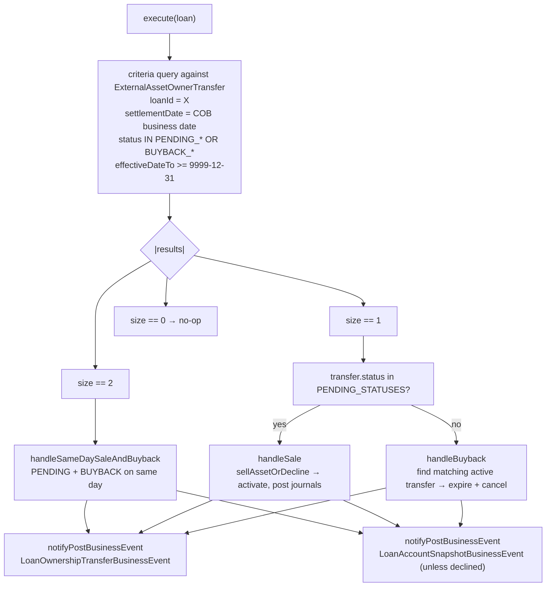
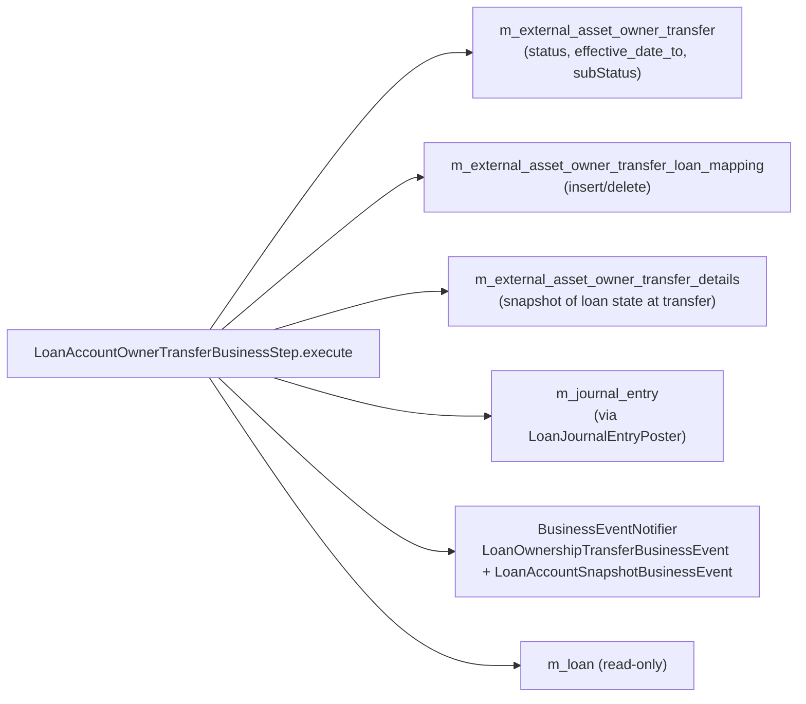
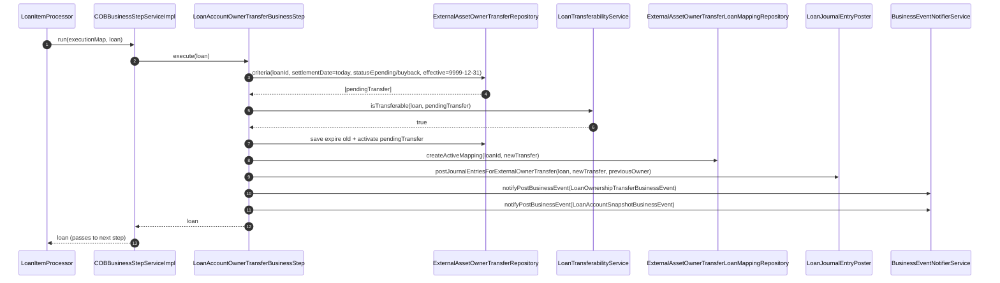
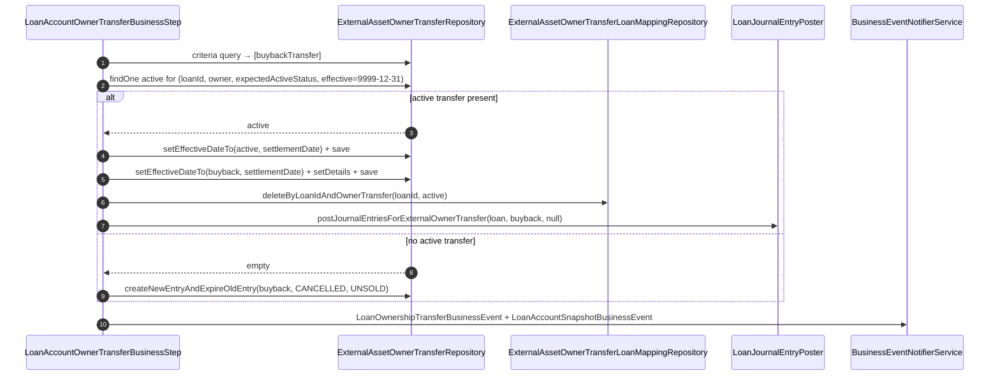

The `fineract-investor` module adds a single COB business step: `LoanAccountOwnerTransferBusinessStep`, registered under the enum-styled name `EXTERNAL_ASSET_OWNER_TRANSFER`. It is the engine that moves the secondary-market lifecycle forward — pending sales become active sales, buybacks return ownership to the originator, and intermediate (delayed-settlement) transfers chain through their two-step journey. This page covers the step's `execute(Loan)` body, the four shapes of transfer it handles, the events it emits, and how it plugs into the `LOAN_COB` pipeline.

For the investor module's overall data model — `ExternalAssetOwner`, `ExternalAssetOwnerTransfer`, the mapping table — see [Investor module overview](/investor/overview).

## Quick facts

| Field | Value |
| ----- | ----- |
| Enum-styled name | `EXTERNAL_ASSET_OWNER_TRANSFER` |
| Human-readable name | `Execute external asset owner transfer` |
| File | `fineract-investor/src/main/java/org/apache/fineract/investor/cob/loan/LoanAccountOwnerTransferBusinessStep.java` |
| Implements | `LoanCOBBusinessStep` (which extends `COBBusinessStep<Loan>`) |
| Default seeded? | ❌ — available only; deployments add it via `PUT /v1/jobs/LOAN_COB/steps`. |
| Conditional | `@Conditional(InvestorModuleIsEnabledCondition.class)` |

## Wiring

```java
@Component
@RequiredArgsConstructor
@Slf4j
@Conditional(InvestorModuleIsEnabledCondition.class)
public class LoanAccountOwnerTransferBusinessStep implements LoanCOBBusinessStep {

    public static final LocalDate FUTURE_DATE_9999_12_31 = LocalDate.of(9999, 12, 31);
    public static final List<ExternalTransferStatus> PENDING_STATUSES  = List.of(
        ExternalTransferStatus.PENDING_INTERMEDIATE, ExternalTransferStatus.PENDING);
    public static final List<ExternalTransferStatus> BUYBACK_STATUSES  = List.of(
        ExternalTransferStatus.BUYBACK_INTERMEDIATE, ExternalTransferStatus.BUYBACK);

    private final ExternalAssetOwnerTransferRepository externalAssetOwnerTransferRepository;
    private final ExternalAssetOwnerTransferLoanMappingRepository externalAssetOwnerTransferLoanMappingRepository;
    private final LoanJournalEntryPoster loanJournalEntryPoster;
    private final BusinessEventNotifierService businessEventNotifierService;
    private final LoanTransferabilityService loanTransferabilityService;
    private final DelayedSettlementAttributeService delayedSettlementAttributeService;
    private final ExternalAssetOwnerTransferOutstandingInterestCalculation
        externalAssetOwnerTransferOutstandingInterestCalculation;
```

The conditional ensures the bean only loads when `fineract.module.investor.enabled=true`. With investor disabled, `EXTERNAL_ASSET_OWNER_TRANSFER` does not appear in `GET /v1/jobs/LOAN_COB/available-steps` and trying to PUT it into the configuration fails validation.

## execute(Loan) shape



### The criteria query

```java
List<ExternalAssetOwnerTransfer> transferDataList = externalAssetOwnerTransferRepository.findAll(
    (root, query, cb) -> cb.and(
        cb.equal(root.get("loanId"), loanId),
        cb.equal(root.get("settlementDate"), settlementDate),
        root.get("status").in(Stream.concat(PENDING_STATUSES.stream(), BUYBACK_STATUSES.stream()).toList()),
        cb.greaterThanOrEqualTo(root.get("effectiveDateTo"), FUTURE_DATE_9999_12_31)),
    Sort.by(Sort.Direction.ASC, "id"));
```

The query asks: "Are there any pending/buyback transfer rows for this loan whose `settlement_date` is today's COB date and whose `effective_date_to` is still the sentinel future date (i.e. not yet expired)?" Result sizes are constrained by the upstream model:

- **0** — most common; nothing to do.
- **1** — a single sale (PENDING/PENDING_INTERMEDIATE) or single buyback (BUYBACK/BUYBACK_INTERMEDIATE) settles today.
- **2** — a same-day sale-and-buyback pair (PENDING then BUYBACK, by id ascending). Not allowed when delayed settlement is enabled — raises `IllegalStateException`.

Anything other than these three shapes is a data invariant violation.

### Sale path (handleSale)

```java
private void handleSale(final Loan loan, final LocalDate settlementDate,
                        final ExternalAssetOwnerTransfer externalAssetOwnerTransfer) {
    ExternalAssetOwnerTransfer newTransfer = sellAssetOrDecline(loan, settlementDate, externalAssetOwnerTransfer);
    businessEventNotifierService.notifyPostBusinessEvent(
        new LoanOwnershipTransferBusinessEvent(newTransfer, loan));
    if (!ExternalTransferStatus.DECLINED.equals(newTransfer.getStatus())) {
        businessEventNotifierService.notifyPostBusinessEvent(new LoanAccountSnapshotBusinessEvent(loan));
    }
}
```

`sellAssetOrDecline` decides whether the transfer can complete:

```java
private ExternalAssetOwnerTransfer sellAssetOrDecline(final Loan loan, final LocalDate settlementDate,
                                                       final ExternalAssetOwnerTransfer transfer) {
    if (!loanTransferabilityService.isTransferable(loan, transfer)) {
        ExternalTransferSubStatus declinedSubStatus = loanTransferabilityService.getDeclinedSubStatus(loan);
        return declinePendingEntry(loan, settlementDate, transfer, declinedSubStatus);
    }
    ExternalAssetOwnerTransfer newTransfer = sellAsset(loan, settlementDate, transfer);
    createActiveMapping(loan.getId(), newTransfer);
    newTransfer.setExternalAssetOwnerTransferDetails(createAssetOwnerTransferDetails(loan, newTransfer));
    return newTransfer;
}
```

If `LoanTransferabilityService.isTransferable(loan, transfer)` says no (e.g. loan is overdue beyond the product's threshold, in a non-transferable status, etc.), the transfer is **declined**: a new row replaces the PENDING entry with `status=DECLINED, subStatus=...`. Only the ownership-transfer event fires — the loan-account-snapshot event is *suppressed* on declines because no actual ownership change occurred.

If the loan is transferable, `sellAsset` activates the entry: marks the PENDING/PENDING_INTERMEDIATE transfer as ACTIVE/ACTIVE_INTERMEDIATE, creates an `ExternalAssetOwnerTransferLoanMapping` linking the loan to the new transfer, and posts the journal entries via `LoanJournalEntryPoster.postJournalEntriesForExternalOwnerTransfer`.

### Buyback path (handleBuyback)

```java
private void handleBuyback(final Loan loan, final LocalDate settlementDate,
                            final ExternalAssetOwnerTransfer buybackTransfer) {
    final ExternalTransferStatus expectedActiveStatus = determineExpectedActiveStatus(buybackTransfer);
    Optional<ExternalAssetOwnerTransfer> optActive = externalAssetOwnerTransferRepository
        .findOne((root, query, cb) -> cb.and(
            cb.equal(root.get("loanId"), loan.getId()),
            cb.equal(root.get("owner"), buybackTransfer.getOwner()),
            cb.equal(root.get("status"), expectedActiveStatus),
            cb.equal(root.get("effectiveDateTo"), FUTURE_DATE_9999_12_31)));

    ExternalAssetOwnerTransfer newTransfer;
    if (optActive.isEmpty()) {
        newTransfer = createNewEntryAndExpireOldEntry(
            settlementDate, buybackTransfer,
            ExternalTransferStatus.CANCELLED, ExternalTransferSubStatus.UNSOLD,
            settlementDate, settlementDate);
    } else {
        newTransfer = buybackAsset(loan, settlementDate, buybackTransfer, optActive.get());
    }
    businessEventNotifierService.notifyPostBusinessEvent(new LoanOwnershipTransferBusinessEvent(newTransfer, loan));
    businessEventNotifierService.notifyPostBusinessEvent(new LoanAccountSnapshotBusinessEvent(loan));
}
```

Two sub-cases:

| Sub-case | What happens |
| -------- | ------------ |
| No active transfer found for the buyback target owner | The pending buyback is replaced with `CANCELLED / UNSOLD`. No journal entries, but the events still fire so subscribers know. |
| Matching active transfer exists | `buybackAsset` expires the active transfer (`effective_date_to = settlementDate`), expires the buyback as the new active record, deletes the loan-mapping row, and posts journal entries reversing the ownership. |

In both cases both events fire.

### Same-day sale + buyback (handleSameDaySaleAndBuyback)

When size = 2, the step asserts the only legal pairing is `PENDING` then `BUYBACK`, throws if delayed settlement is enabled (since that would require intermediate states the same-day path doesn't model), and processes the pair as one atomic ownership cycle: sell to the buyer, immediately buy back. This collapses the journal entries and avoids interim mapping churn.

## Events emitted

| Event | When | Payload |
| ----- | ---- | ------- |
| `LoanOwnershipTransferBusinessEvent` | Every sale, buyback, or declined sale | `(newTransfer, loan)` |
| `LoanAccountSnapshotBusinessEvent` | Every sale/buyback *except* declined sales | `loan` (current snapshot at COB date) |

Both events flow through `BusinessEventNotifierService` and are subject to the bulk-event-recording window if `isCOBBulkEventEnabled()` is true (see `COBBusinessStepServiceImpl`).

## Where this step writes



Notably the step **does not** mutate the `Loan` aggregate itself — the loan is read for its product/state, but writes go to investor-side tables and the journal-entry side. The next step in the COB chain sees the loan with its `lastClosedBusinessDate` not yet updated (`AbstractLoanItemProcessor.setLastRun` runs after the whole step chain finishes).

## How to enable it

1. Ensure `fineract.module.investor.enabled=true` so the bean loads.
2. Check `GET /v1/jobs/LOAN_COB/available-steps` shows `EXTERNAL_ASSET_OWNER_TRANSFER`.
3. PUT the configuration including the step. A common placement is at the end of the chain so that all the loan-internal updates (delinquency, accrual, etc.) are computed first:

   ```json
   {
     "businessSteps": [
       { "stepName": "APPLY_CHARGE_TO_OVERDUE_LOANS",        "order": 1 },
       { "stepName": "LOAN_DELINQUENCY_CLASSIFICATION",      "order": 2 },
       { "stepName": "CHECK_LOAN_REPAYMENT_DUE",             "order": 3 },
       { "stepName": "CHECK_LOAN_REPAYMENT_OVERDUE",         "order": 4 },
       { "stepName": "UPDATE_LOAN_ARREARS_AGING",            "order": 5 },
       { "stepName": "ADD_PERIODIC_ACCRUAL_ENTRIES",         "order": 6 },
       { "stepName": "EXTERNAL_ASSET_OWNER_TRANSFER",        "order": 7 }
     ]
   }
   ```

4. Trigger COB and verify by inspecting `m_external_asset_owner_transfer` rows whose `settlement_date = COB business date`.

## Error semantics

| Cause | Consequence |
| ----- | ----------- |
| Two transfers, but not exactly PENDING+BUYBACK | `IllegalStateException` → wrapped by framework as `BusinessStepException` → chunk listener writes error to loan's lock row. |
| Two transfers when delayed settlement is enabled | Same `IllegalStateException` path. |
| `loanTransferabilityService` raises | Same. |
| Journal-entry posting fails | Same. The transfer row update is part of the same chunk transaction and rolls back; the next run will retry. |

If the step fails for a given loan, all *subsequent* configured steps for that loan are skipped (per `COBBusinessStepServiceImpl.run` semantics), the loan remains locked under `LOAN_COB_CHUNK_PROCESSING`, and `StayedLockedLoansTasklet` surfaces it at job end.

## Source map

| File | Role |
| ---- | ---- |
| `fineract-investor/src/main/java/org/apache/fineract/investor/cob/loan/LoanAccountOwnerTransferBusinessStep.java` | The COB business step itself. |
| `fineract-investor/.../InvestorModuleIsEnabledCondition.java` | Condition gating the bean on `fineract.module.investor.enabled`. |
| `fineract-investor/.../domain/ExternalAssetOwnerTransferRepository.java` | JPA repository queried by the step. |
| `fineract-investor/.../domain/ExternalAssetOwnerTransferLoanMappingRepository.java` | The mapping table the step reads/deletes/inserts. |
| `fineract-investor/.../service/LoanTransferabilityService.java` | Decides if a transfer can complete; supplies the decline sub-status. |
| `fineract-investor/.../service/DelayedSettlementAttributeService.java` | Product-level flag check for delayed settlement. |
| `fineract-investor/.../service/ExternalAssetOwnerTransferOutstandingInterestCalculation.java` | Calculation helper used during sale/buyback. |
| `fineract-investor/.../domain/LoanOwnershipTransferBusinessEvent.java` | Business event emitted on every sale/buyback. |

## Lifecycle sequence (sale path)



## Lifecycle sequence (buyback path)



## Interactions with other COB steps

Place `EXTERNAL_ASSET_OWNER_TRANSFER` carefully. A common pitfall is running it **before** `ADD_PERIODIC_ACCRUAL_ENTRIES`: the accrual step would then compute interest for a loan that is about to change owner, mis-attributing the day's accrual. The recommended ordering is:

| When | Why |
| ---- | --- |
| Late in the chain (e.g. order 7+) | Loan state (delinquency, accrual, arrears) is settled first; the transfer reads a consistent snapshot. |
| Before any step that would emit external customer-facing events | So that the snapshot event reflects the new owner. |
| After `LOAN_INTEREST_RECALCULATION` (when enabled) | So the schedule sold to the new owner is the recalculated one. |

The investor module's `ExternalAssetOwnerTransferOutstandingInterestCalculation` reads the loan's current schedule when activating a transfer; if the step runs before recalculation, the new owner inherits the stale schedule.

## A note on additional investor steps

Only one step lives under `fineract-investor/src/main/java/org/apache/fineract/investor/cob/loan/` at the time of writing. Other investor concerns — funder-level reporting, snapshot exports — operate via business-event subscribers (`LoanAccountSnapshotBusinessEvent` listeners) rather than as additional COB business steps. The architecture admits further investor steps to be added under the same package using the same `@Conditional(InvestorModuleIsEnabledCondition.class)` pattern.

## Cross-references

- The framework that calls `execute(loan)` → [Business step framework](/cob/business-step-framework)
- Where this fits in the configured ordering → [Loan COB business steps](/cob/loan-cob-business-steps)
- The chunk listener that records failures → [Listeners](/cob/cob-listeners)
- The events produced → [Events overview](/events/overview)
- Investor module data model → [Investor module overview](/investor/overview)
- The `Loan` aggregate read by the step → [Loan module overview](/loan/overview)
