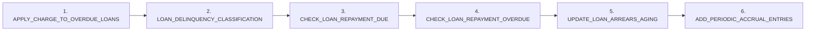

This page is the reference for every concrete `LoanCOBBusinessStep` shipped in `fineract-provider/src/main/java/org/apache/fineract/cob/loan/`. Each entry covers the enum-styled name (the value stored in `m_batch_business_steps.step_name`), the human-readable name (shown in `GET /v1/jobs/{jobName}/available-steps`), the default seeded execution order (where one exists), the file path, and a summary of what `execute(Loan)` does. An additional step ships in `fineract-investor` — see [Investor COB steps](/cob/investor-cob-steps).

The framework primer is at [Business step framework](/cob/business-step-framework); the configuration mechanics at [Step categories](/cob/business-step-categories).

## Step inventory

| # | Default order | Enum name | Class | Default seeded? |
| - | ------------- | --------- | ----- | --------------- |
| 1 | 1 | `APPLY_CHARGE_TO_OVERDUE_LOANS` | `ApplyChargeToOverdueLoansBusinessStep` | ✅ `0022_…` |
| 2 | 2 | `LOAN_DELINQUENCY_CLASSIFICATION` | `SetLoanDelinquencyTagsBusinessStep` | ✅ `0047_…` |
| 3 | 3 | `CHECK_LOAN_REPAYMENT_DUE` | `CheckLoanRepaymentDueBusinessStep` | ✅ `0067_…` |
| 4 | 4 | `CHECK_LOAN_REPAYMENT_OVERDUE` | `CheckLoanRepaymentOverdueBusinessStep` | ✅ `0067_…` |
| 5 | 5 | `UPDATE_LOAN_ARREARS_AGING` | `UpdateLoanArrearsAgingBusinessStep` | ✅ `0089_…` |
| 6 | 6 | `ADD_PERIODIC_ACCRUAL_ENTRIES` | `AddPeriodicAccrualEntriesBusinessStep` | ✅ `0092_…` |
| – | — | `ACCRUAL_ACTIVITY_POSTING` | `AccrualActivityPostingBusinessStep` | ❌ available only |
| – | — | `LOAN_INTEREST_RECALCULATION` | `LoanInterestRecalculationCOBBusinessStep` | ❌ available only |
| – | — | `CAPITALIZED_INCOME_AMORTIZATION` | `CapitalizedIncomeAmortizationBusinessStep` | ❌ available only |
| – | — | `BUY_DOWN_FEE_AMORTIZATION` | `BuyDownFeeAmortizationBusinessStep` | ❌ available only |
| – | — | `CHECK_DUE_INSTALLMENTS` | `CheckDueInstallmentsBusinessStep` | ❌ available only |
| – | — | `EXTERNAL_ASSET_OWNER_TRANSFER` (investor) | `LoanAccountOwnerTransferBusinessStep` | ❌ available only |

"Default seeded" means a Liquibase changelog inserts a row at startup; "available only" means the bean exists and can be added via `PUT /v1/jobs/LOAN_COB/steps`.

## Default execution order



`setLastRun(loan)` then writes `loan.last_closed_business_date = COB_DATE` (see `AbstractLoanItemProcessor`).

## 1. APPLY_CHARGE_TO_OVERDUE_LOANS

`fineract-provider/.../cob/loan/ApplyChargeToOverdueLoansBusinessStep.java`

```java
@Component @RequiredArgsConstructor
public class ApplyChargeToOverdueLoansBusinessStep implements LoanCOBBusinessStep {

    private final LoanReadPlatformService loanReadPlatformService;
    private final LoanChargeWritePlatformService loanChargeWritePlatformService;

    @Override
    public Loan execute(Loan loan) {
        final Collection<OverdueLoanScheduleData> overdueLoanScheduleDataList =
            loanReadPlatformService.retrieveAllOverdueInstallmentsForLoan(loan);
        if (!overdueLoanScheduleDataList.isEmpty()) {
            loanChargeWritePlatformService.applyOverdueChargesForLoan(loan.getId(), overdueLoanScheduleDataList);
        }
        return loan;
    }

    @Override public String getEnumStyledName()   { return "APPLY_CHARGE_TO_OVERDUE_LOANS"; }
    @Override public String getHumanReadableName(){ return "Apply charge to overdue loans"; }
}
```

**Side effects:** for every overdue installment, applies the loan product's configured "overdue charges" — typically a penalty fee — by writing rows to `m_loan_charge` (via `LoanChargeWritePlatformService.applyOverdueChargesForLoan`). Updates the loan's outstanding balance.

**Idempotency:** depends on the charge product's "apply once per overdue?" configuration. The `retrieveAllOverdueInstallmentsForLoan` query filters out installments that already have the charge applied.

## 2. LOAN_DELINQUENCY_CLASSIFICATION

`fineract-provider/.../cob/loan/SetLoanDelinquencyTagsBusinessStep.java`

```java
@Slf4j @Component @RequiredArgsConstructor
public class SetLoanDelinquencyTagsBusinessStep implements LoanCOBBusinessStep {

    private final LoanAccountDomainService loanAccountDomainService;
    private final DelinquencyEffectivePauseHelper delinquencyEffectivePauseHelper;
    private final DelinquencyReadPlatformService delinquencyReadPlatformService;
    private final BusinessEventNotifierService businessEventNotifierService;

    @Override
    public Loan execute(Loan loan) {
        if (loan == null) return null;
        // …
        measure(new Runnable() {
            @Override public void run() {
                try {
                    // Switch to DEFAULT action context so dates compare against "today"
                    ThreadLocalContextUtil.setActionContext(ActionContext.DEFAULT);
                    List<LoanDelinquencyAction> saved =
                        delinquencyReadPlatformService.retrieveLoanDelinquencyActions(loan.getId());
                    List<LoanDelinquencyActionData> effectiveDelinquencyList =
                        delinquencyEffectivePauseHelper.calculateEffectiveDelinquencyList(saved);
                    if (!isDelinquencyOnPause(loan, effectiveDelinquencyList)) {
                        loanAccountDomainService.setLoanDelinquencyTag(loan,
                            DateUtils.getBusinessLocalDate(), effectiveDelinquencyList);
                    }
                } catch (RuntimeException re) { /* log */ }
            }
        });
        return loan;
    }

    @Override public String getEnumStyledName()    { return "LOAN_DELINQUENCY_CLASSIFICATION"; }
    @Override public String getHumanReadableName() { return "Loan Delinquency Classification"; }
}
```

**Side effects:** computes the loan's current delinquency bucket via `LoanAccountDomainService.setLoanDelinquencyTag(...)`. May emit `LoanDelinquencyRangeChangeBusinessEvent` when the tag changes.

**Action context flip:** temporarily switches to `ActionContext.DEFAULT` so `getBusinessLocalDate()` returns the actual calendar day rather than `COB_DATE`. Required because delinquency is "did this installment pass today's date" — using COB date would lag by one day.

**Pause handling:** delinquency-pause actions (`LoanDelinquencyAction`) are honoured; if the effective range puts the loan on pause, no tag is applied.

## 3. CHECK_LOAN_REPAYMENT_DUE

`fineract-provider/.../cob/loan/CheckLoanRepaymentDueBusinessStep.java`

```java
@Slf4j @Component @RequiredArgsConstructor
public class CheckLoanRepaymentDueBusinessStep implements LoanCOBBusinessStep {

    private final ConfigurationDomainService configurationDomainService;
    private final BusinessEventNotifierService businessEventNotifierService;

    @Override
    public Loan execute(Loan loan) {
        Long daysBefore = configurationDomainService.retrieveRepaymentDueDays();
        if (loan.getLoanProduct().getDueDaysForRepaymentEvent() != null
            && loan.getLoanProduct().getDueDaysForRepaymentEvent() > 0) {
            daysBefore = loan.getLoanProduct().getDueDaysForRepaymentEvent().longValue();
        }
        LocalDate currentDate = DateUtils.getBusinessLocalDate();
        for (LoanRepaymentScheduleInstallment inst : loan.getRepaymentScheduleInstallments()) {
            LocalDate due = inst.getDueDate();
            if (isDueEventNeededToBeSent(loan, daysBefore, currentDate, inst, due, nonDisbursedStatuses)) {
                businessEventNotifierService.notifyPostBusinessEvent(
                    new LoanRepaymentDueBusinessEvent(inst));
                break;          // one event per loan per run
            }
        }
        return loan;
    }

    @Override public String getEnumStyledName()    { return "CHECK_LOAN_REPAYMENT_DUE"; }
    @Override public String getHumanReadableName() { return "Check loan repayment due"; }
}
```

**Side effects:** emits at most one `LoanRepaymentDueBusinessEvent` per loan per run, naming the next-upcoming installment whose due date is within `daysBefore` days of "today".

**Configuration:** the global config `days-before-repayment-is-due` (seeded with `0067_…`) is the default; a per-product `LoanProduct.dueDaysForRepaymentEvent` overrides if > 0.

**Loop early-exits:** the `break` ensures only the **next** due installment fires, not all of them.

## 4. CHECK_LOAN_REPAYMENT_OVERDUE

`fineract-provider/.../cob/loan/CheckLoanRepaymentOverdueBusinessStep.java`

```java
@Slf4j @Component @RequiredArgsConstructor
public class CheckLoanRepaymentOverdueBusinessStep implements LoanCOBBusinessStep {

    @Override
    public Loan execute(Loan loan) {
        if (!nonDisbursedStatuses.contains(loan.getStatus())
            && loan.getSummary().getTotalOutstanding().compareTo(BigDecimal.ZERO) > 0) {
            Long daysAfter = configurationDomainService.retrieveRepaymentOverdueDays();
            if (loan.getLoanProduct().getOverDueDaysForRepaymentEvent() != null
                && loan.getLoanProduct().getOverDueDaysForRepaymentEvent() > 0) {
                daysAfter = loan.getLoanProduct().getOverDueDaysForRepaymentEvent().longValue();
            }
            LocalDate currentDate = DateUtils.getBusinessLocalDate();
            for (LoanRepaymentScheduleInstallment inst : loan.getRepaymentScheduleInstallments()) {
                if (!inst.isObligationsMet()) {
                    LocalDate due = inst.getDueDate();
                    if (isOverDueEventNeededToBeSent(loan, daysAfter, currentDate, inst, due)) {
                        businessEventNotifierService.notifyPostBusinessEvent(
                            new LoanRepaymentOverdueBusinessEvent(inst));
                        break;
                    }
                }
            }
        }
        return loan;
    }

    @Override public String getEnumStyledName()    { return "CHECK_LOAN_REPAYMENT_OVERDUE"; }
    @Override public String getHumanReadableName() { return "Check loan repayment overdue"; }
}
```

**Side effects:** mirror image of #3 — emits at most one `LoanRepaymentOverdueBusinessEvent` per loan per run, naming the earliest unpaid installment whose due date is `daysAfter` days *before* today.

**Skip conditions:** loans in `INVALID` / `SUBMITTED_AND_PENDING_APPROVAL` / `APPROVED` status are skipped (never disbursed). Loans with zero outstanding balance are skipped (paid off).

## 5. UPDATE_LOAN_ARREARS_AGING

`fineract-provider/.../cob/loan/UpdateLoanArrearsAgingBusinessStep.java`

```java
@Component @RequiredArgsConstructor
public class UpdateLoanArrearsAgingBusinessStep implements LoanCOBBusinessStep {

    private final LoanArrearsAgeingUpdateHandler loanArrearsAgeingUpdateHandler;

    @Override
    public Loan execute(Loan loan) {
        Long loanId = loan.getId();
        loanArrearsAgeingUpdateHandler.updateLoanArrearsAgeingDetails(Arrays.asList(loanId));
        return loan;
    }

    @Override public String getEnumStyledName()    { return "UPDATE_LOAN_ARREARS_AGING"; }
    @Override public String getHumanReadableName() { return "Update loan arrears aging"; }
}
```

**Side effects:** delegates to `LoanArrearsAgeingUpdateHandler` (originally a stand-alone Quartz job, now also a COB step) which inserts/updates `m_loan_arrears_aging` rows with the latest principal/interest/fee/penalty outstanding bucketed by aging band.

**Idempotency:** the handler upserts; running multiple times in the same day is safe.

## 6. ADD_PERIODIC_ACCRUAL_ENTRIES

`fineract-provider/.../cob/loan/AddPeriodicAccrualEntriesBusinessStep.java`

```java
@Component @RequiredArgsConstructor @Slf4j
public class AddPeriodicAccrualEntriesBusinessStep implements LoanCOBBusinessStep {

    private final LoanAccrualsProcessingService loanAccrualsProcessingService;

    @Override
    public Loan execute(Loan loan) {
        try {
            loanAccrualsProcessingService.addPeriodicAccruals(DateUtils.getBusinessLocalDate(), loan);
        } catch (MultiException e) {
            throw new BusinessStepException(
                String.format("Fail to process period accrual for loan id [%s]", loan.getId()), e);
        }
        return loan;
    }

    @Override public String getEnumStyledName()    { return "ADD_PERIODIC_ACCRUAL_ENTRIES"; }
    @Override public String getHumanReadableName() { return "Add periodic accrual entries"; }
}
```

**Side effects:** computes accrued interest/fees/penalties from the last accrual date up to `COB_DATE` and inserts `m_loan_transaction` rows of type `ACCRUAL`. Updates the loan summary balances.

**Failure mode:** `MultiException` (collected per-installment errors) gets wrapped as `BusinessStepException` — this is one of the few steps that explicitly produces a `BusinessStepException` rather than letting the framework wrap a generic exception.

## ACCRUAL_ACTIVITY_POSTING (available)

`fineract-provider/.../cob/loan/AccrualActivityPostingBusinessStep.java`

```java
@Slf4j @Component @RequiredArgsConstructor
public class AccrualActivityPostingBusinessStep implements LoanCOBBusinessStep {

    private final LoanAccrualActivityProcessingService loanAccrualActivityProcessingService;

    @Override
    public Loan execute(Loan loan) {
        final LocalDate currentDate = DateUtils.getBusinessLocalDate();
        loanAccrualActivityProcessingService.makeAccrualActivityTransaction(loan, currentDate);
        return loan;
    }

    @Override public String getEnumStyledName()    { return "ACCRUAL_ACTIVITY_POSTING"; }
    @Override public String getHumanReadableName() { return "Accrual Activity Posting on Installment Due Date"; }
}
```

**Side effects:** on the day an installment falls due, posts an `ACCRUAL_ACTIVITY` transaction summing the period's accruals into a single bucket. Unlike `ADD_PERIODIC_ACCRUAL_ENTRIES`, this fires only on installment due dates and produces one transaction per due date instead of one per day.

**Typical usage:** alternative to `ADD_PERIODIC_ACCRUAL_ENTRIES` — most installations use one or the other, not both.

## LOAN_INTEREST_RECALCULATION (available)

`fineract-provider/.../cob/loan/LoanInterestRecalculationCOBBusinessStep.java`

```java
@Slf4j @Component @RequiredArgsConstructor
public class LoanInterestRecalculationCOBBusinessStep implements LoanCOBBusinessStep {

    private final LoanWritePlatformService loanWritePlatformService;

    @Override
    public Loan execute(Loan loan) {
        try {
            ThreadLocalContextUtil.setActionContext(ActionContext.DEFAULT);
            if (!loan.getStatus().isActive() || loan.isNpa() || loan.isChargedOff()
                || !loan.isInterestBearingAndInterestRecalculationEnabled()
                || loan.getLoanInterestRecalculationDetails().disallowInterestCalculationOnPastDue()
                || !hasOverdueInstallment(loan)) {
                return loan;
            }
            loan = loanWritePlatformService.recalculateInterest(loan);
            return loan;
        } finally {
            ThreadLocalContextUtil.setActionContext(ActionContext.COB);
        }
    }

    @Override public String getEnumStyledName()    { return "LOAN_INTEREST_RECALCULATION"; }
    @Override public String getHumanReadableName() { return "Loan Interest Recalculation"; }
}
```

**Side effects:** on loans configured for *interest recalculation on past due*, recomputes the schedule and rewrites the future installments using `LoanWritePlatformService.recalculateInterest`. May insert `INTEREST_REFUND`, write to `m_loan_repayment_schedule`, and emit recalculation events.

**Skip predicates:** the long `if` excludes non-active loans, NPA, charged-off loans, products that don't allow interest recalculation, products that explicitly disallow recalculation on past due, and loans with no overdue installment.

**Action context flip:** see #2 — switches to DEFAULT to compare against the real calendar day. Carefully restores in `finally`.

## CAPITALIZED_INCOME_AMORTIZATION (available)

`fineract-provider/.../cob/loan/CapitalizedIncomeAmortizationBusinessStep.java`

```java
@Component @RequiredArgsConstructor @Slf4j
public class CapitalizedIncomeAmortizationBusinessStep implements LoanCOBBusinessStep {

    private final LoanCapitalizedIncomeAmortizationProcessingService svc;

    @Transactional
    @Override
    public Loan execute(Loan loan) {
        LocalDate businessDate = DateUtils.getBusinessLocalDate();
        svc.processCapitalizedIncomeAmortizationTillDate(loan, businessDate, true);
        return loan;
    }

    @Override public String getEnumStyledName()    { return "CAPITALIZED_INCOME_AMORTIZATION"; }
    @Override public String getHumanReadableName() { return "Capitalized income amortization"; }
}
```

**Side effects:** for loans with capitalized-income transactions, posts the daily amortization slice. Writes `CAPITALIZED_INCOME_AMORTIZATION` transactions; updates the `m_loan_capitalized_income_balance` row.

**`@Transactional`:** declares its own propagation so the writes can commit/rollback independently of the chunk transaction (relevant when the step interacts with non-Loan tables).

## BUY_DOWN_FEE_AMORTIZATION (available)

`fineract-provider/.../cob/loan/BuyDownFeeAmortizationBusinessStep.java`

```java
@Component @RequiredArgsConstructor @Slf4j
public class BuyDownFeeAmortizationBusinessStep implements LoanCOBBusinessStep {

    private final LoanBuyDownFeeAmortizationProcessingService svc;

    @Transactional
    @Override
    public Loan execute(Loan loan) {
        if (!loan.getLoanProductRelatedDetail().isEnableBuyDownFee()) {
            return loan;
        }
        LocalDate businessDate = DateUtils.getBusinessLocalDate();
        svc.processBuyDownFeeAmortizationTillDate(loan, businessDate, true);
        return loan;
    }

    @Override public String getEnumStyledName()    { return "BUY_DOWN_FEE_AMORTIZATION"; }
    @Override public String getHumanReadableName() { return "Buy Down Fee amortization"; }
}
```

**Side effects:** for loans whose product enables buy-down-fee, posts the daily buy-down-fee amortization slice. Writes `BUY_DOWN_FEE_AMORTIZATION` transactions; updates `m_loan_buy_down_fee_balance`.

**Short-circuit:** the `if (!isEnableBuyDownFee()) return loan;` keeps this cheap for non-buy-down loans.

## CHECK_DUE_INSTALLMENTS (available)

`fineract-provider/.../cob/loan/CheckDueInstallmentsBusinessStep.java`

```java
@Slf4j @Component @RequiredArgsConstructor
public class CheckDueInstallmentsBusinessStep implements LoanCOBBusinessStep {

    private final BusinessEventNotifierService businessEventNotifierService;

    @Override
    public Loan execute(Loan loan) {
        if (loan == null) return null;
        measure(new Runnable() {
            @Override public void run() {
                if (loan.getRepaymentScheduleInstallments() != null
                    && loan.getRepaymentScheduleInstallments().size() > 0) {
                    LocalDate currentDate = DateUtils.getBusinessLocalDate();
                    boolean shouldPost = loan.getRepaymentScheduleInstallments().stream()
                        .anyMatch(i -> i.getDueDate().equals(currentDate) && i.isNotFullyPaidOff());
                    if (shouldPost) {
                        ThreadLocalContextUtil.setActionContext(ActionContext.DEFAULT);
                        businessEventNotifierService.notifyPostBusinessEvent(
                            new LoanAccountCustomSnapshotBusinessEvent(loan));
                    }
                }
            }
        });
        return loan;
    }

    @Override public String getEnumStyledName()    { return "CHECK_DUE_INSTALLMENTS"; }
    @Override public String getHumanReadableName() { return "Check Due Installments"; }
}
```

**Side effects:** when **today** is the due date of an unpaid installment, emits `LoanAccountCustomSnapshotBusinessEvent`. Subscribers can use the event to drive customer notifications or external reporting.

**Difference from #3:** `CHECK_LOAN_REPAYMENT_DUE` fires N days *before* the due date to give the customer warning; this step fires *on* the due date with a snapshot of the loan account.

## EXTERNAL_ASSET_OWNER_TRANSFER (investor)

Defined in `fineract-investor/.../investor/cob/loan/LoanAccountOwnerTransferBusinessStep.java`. See [Investor COB steps](/cob/investor-cob-steps).

## Step interactions and ordering caveats

Order matters because steps mutate shared state. Some examples:

- **#1 → #2** — applying overdue charges *before* delinquency classification means a loan whose only overdue is a freshly-applied charge is classified by including that charge.
- **#5 → #6** — arrears aging is computed *before* accrual, so the accrual transaction reflects the previous-day aging band.
- **`LOAN_INTEREST_RECALCULATION` should run before `ADD_PERIODIC_ACCRUAL_ENTRIES`** when enabled, since recalculation rewrites future installments that the accrual then needs to read.
- **`ACCRUAL_ACTIVITY_POSTING` vs. `ADD_PERIODIC_ACCRUAL_ENTRIES`** — pick one; running both posts duplicate accruals.

## How a step short-circuits

Every step is responsible for cheap-no-op when the loan does not apply. Three patterns appear above:

| Pattern | Example |
| ------- | ------- |
| Inline product flag check | `if (!loan.getLoanProductRelatedDetail().isEnableBuyDownFee()) return loan;` |
| Status guard | `if (!loan.getStatus().isActive() || loan.isNpa() || ...) return loan;` |
| Empty-collection guard | `if (overdueLoanScheduleDataList.isEmpty()) return loan;` |

When adding a new step, follow the same convention: do the cheapest possible "is this loan relevant?" check up front. The framework calls `execute(loan)` for every loan in scope; an expensive step that does nothing for 99 % of loans must explicitly self-skip.

## Where each step writes

```mermaid
flowchart TB
    Loan["m_loan / m_loan_transaction / m_loan_repayment_schedule<br/>m_loan_summary"]
    Charges["m_loan_charge"]
    Aging["m_loan_arrears_aging"]
    DTags["m_loan_delinquency_tags"]
    CapBal["m_loan_capitalized_income_balance"]
    BuyDown["m_loan_buy_down_fee_balance"]
    EAOT["m_external_asset_owner_transfer"]
    Events[("BusinessEvent stream<br/>(internal + external)")]

    S1["APPLY_CHARGE_TO_OVERDUE_LOANS"] --> Charges
    S2["LOAN_DELINQUENCY_CLASSIFICATION"] --> DTags
    S2 --> Events
    S3["CHECK_LOAN_REPAYMENT_DUE"] --> Events
    S4["CHECK_LOAN_REPAYMENT_OVERDUE"] --> Events
    S5["UPDATE_LOAN_ARREARS_AGING"] --> Aging
    S6["ADD_PERIODIC_ACCRUAL_ENTRIES"] --> Loan
    S7["ACCRUAL_ACTIVITY_POSTING"] --> Loan
    S8["LOAN_INTEREST_RECALCULATION"] --> Loan
    S9["CAPITALIZED_INCOME_AMORTIZATION"] --> Loan & CapBal
    S10["BUY_DOWN_FEE_AMORTIZATION"] --> Loan & BuyDown
    S11["CHECK_DUE_INSTALLMENTS"] --> Events
    S12["EXTERNAL_ASSET_OWNER_TRANSFER"] --> EAOT & Events
```



## Adding a step

See the recipe in [Business step framework](/cob/business-step-framework#how-a-new-step-gets-registered). In short: implement `LoanCOBBusinessStep`, mark `@Component`, restart, then PUT the new order.

## Cross-references

- The base interface and orchestrator → [Business step framework](/cob/business-step-framework)
- The Spring Batch chunk that calls these → [Spring Batch wiring](/cob/cob-batch-jobs)
- The investor step `EXTERNAL_ASSET_OWNER_TRANSFER` → [Investor COB steps](/cob/investor-cob-steps)
- Per-step business events → [Events overview](/events/overview)
- The default configurations seeded by Liquibase → [Step categories](/cob/business-step-categories)
- The `Loan` aggregate model → [Loan module overview](/loan/overview)
