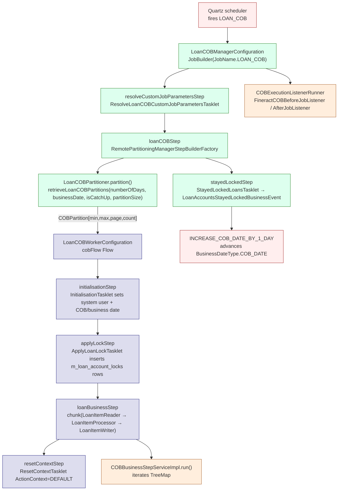

Close of Business (COB) is the per-tenant nightly engine that walks every non-closed loan (and savings) account, runs an ordered sequence of `COBBusinessStep<T>` beans against each, then advances the tenant's COB date by one day. The whole pipeline runs on Spring Batch's manager/worker partition model so a single tenant can fan out across hundreds of thousands of loans without holding a single transaction open. It is the binary that owns "what happens overnight" — accruals, delinquency tags, repayment-due events, arrears aging, asset-owner transfers — and it is the gatekeeper that holds the `m_loan_account_locks` row that blocks online writes while a loan is being processed.

The framework's interfaces live in `fineract-cob/src/main/java/org/apache/fineract/cob/`, the loan-specific orchestration lives in `fineract-provider/src/main/java/org/apache/fineract/cob/loan/`, the loan-step contract lives in `fineract-loan/src/main/java/org/apache/fineract/cob/loan/LoanCOBBusinessStep.java`, and the savings, working-capital-loan and investor modules each ship their own step types.

## What COB actually does

<CardGroup cols={2}>
  <Card title="Job name" icon="bolt">
    `JobName.LOAN_COB` from `fineract-core/.../jobs/service/JobName.java`. Logical Spring Batch job: `LOAN_CLOSE_OF_BUSINESS` (`LoanCOBConstant.LOAN_COB_JOB_NAME`).
  </Card>
  <Card title="Driver job" icon="clock">
    `INCREASE_COB_DATE_BY_1_DAY` is the scheduled task that bumps `BusinessDateType.COB_DATE` after the loan COB completes successfully.
  </Card>
  <Card title="Per-account contract" icon="code">
    Every step implements `COBBusinessStep<T extends AbstractPersistableCustom<Long>>` with `execute(T)`, `getEnumStyledName()`, `getHumanReadableName()`.
  </Card>
  <Card title="Locking" icon="lock">
    Each loan/savings account gets a row in `m_loan_account_locks` / `m_savings_account_locks` keyed by `LockOwner` for the duration of the chunk that touches it.
  </Card>
</CardGroup>

## End-to-end flow



Each partition gets its own `ExecutionContext` carrying:

- `businessSteps` — `Set<BusinessStepNameAndOrder>` resolved from `m_batch_business_steps` filtered by `LOAN_CLOSE_OF_BUSINESS`.
- `loanCobParameter` — `COBParameter(minAccountId, maxAccountId)` covering this partition's id range.
- `partition` — string key `partition_<pageNo>`.
- `BusinessDate` — ISO date string promoted from job context.
- `IS_CATCH_UP` — boolean string ("true"/"false") indicating catch-up mode.

The `loanCOBStep` is a `RemotePartitioningManagerStepBuilderFactory` step — workers receive partitions over the `outboundRequests` direct channel and the manager polls every `propertyService.getPollInterval(JOB_NAME)` ms.

## fineract-cob root inventory

Files at the root of `fineract-cob/src/main/java/org/apache/fineract/cob/`:

| File | Role |
| ---- | ---- |
| `COBBusinessStep.java` | Generic interface every step implements (`execute`, `getEnumStyledName`, `getHumanReadableName`). |
| `COBBusinessStepService.java` | Discovers configured steps and runs them in order against a single item. |
| `COBBusinessStepServiceImpl.java` | Reload-aware orchestrator: wraps `applicationContext.getBean` lookup, optionally starts a bulk external-event recording. |
| `COBConstant.java` | Execution-context keys: `BUSINESS_STEPS`, `BUSINESS_DATE_PARAMETER_NAME`, `IS_CATCH_UP_PARAMETER_NAME`, `COB_PARAMETER`, `INLINE_IDS_PARAMETER_NAME`, `PARTITION_KEY`, `PARTITION_PREFIX`, `NUMBER_OF_DAYS_BEHIND=1`. |

Subpackages and what they contain:

| Package | Inhabitants |
| ------- | ----------- |
| `common/` | `CommonPartitioner` (base partitioner using `RetrieveIdService`), `CustomJobParameterResolver`, `ResetContextTasklet`. |
| `conditions/` | `BatchManagerCondition`, `BatchWorkerCondition` — split COB across batch-manager / batch-worker JVMs. |
| `converter/` | `COBParameterConverter` — translates legacy `LoanCOBParameter` → `COBParameter`. |
| `data/` | DTOs in the execution context (`BusinessStepNameAndOrder`, `COBParameter`, `COBPartition`, `JobBusinessStepConfigData`, `JobBusinessStepDetail`, …). |
| `domain/` | JPA superclasses (`AccountLock`), `LockOwner` enum, `LockingService`, `AbstractLockingService`, `BatchBusinessStep` entity + repository. |
| `exceptions/` | `BusinessStepException`, `LockCannotBeAppliedException`, `LockedReadException`, `BusinessStepNotBelongsToJobException`, `AccountLockCannotBeOverruledException`, `CustomJobParameterNotFoundException`. |
| `listener/` | `AbstractLoanItemListener`, `COBExecutionListenerRunner`, `FineractCOBBeforeJobListener` / `…AfterJobListener` SPIs, `JobExecutionContextCopyListener`. |
| `processor/` | `AbstractItemProcessor` — generic Spring Batch `ItemProcessor` that invokes `COBBusinessStepService.run`. |
| `resolver/` | `BusinessDateResolver`, `CatchUpFlagResolver` — type-safe readers for execution-context keys. |
| `service/` | `RetrieveIdService` SPI, `BeforeStepLockingItemReaderHelper`, `BusinessStepCategory`, `BusinessStepCategoryService`, `BusinessStepConfigDataParser`, `BusinessStepMapper`, `ConfigJobParameterService`(`Impl`), `AccountLockService`, `AbstractAccountLockService`, `ReloaderService`, `ReloadService`. |
| `tasklet/` | `ApplyCommonLockTasklet` — generic `Tasklet` that inserts `AccountLock` rows for each partition's id range. |

## Sub-page map

<CardGroup cols={2}>
  <Card title="Business step framework" href="/cob/business-step-framework">
    `COBBusinessStep<T>`, `COBBusinessStepService`, how Spring discovers steps.
  </Card>
  <Card title="Categories & configuration" href="/cob/business-step-categories">
    `BusinessStepCategory.LOAN`, `ConfigJobParameterService`, parsing `PUT /jobs/{jobName}/steps`.
  </Card>
  <Card title="Spring Batch wiring" href="/cob/cob-batch-jobs">
    `LoanCOBManagerConfiguration`, `LoanCOBWorkerConfiguration`, partitioner, reader/processor/writer, retry/skip.
  </Card>
  <Card title="Listeners" href="/cob/cob-listeners">
    `COBExecutionListenerRunner`, before/after job hooks, `AbstractLoanItemListener`, `JobExecutionContextCopyListener`.
  </Card>
  <Card title="Conditions & resolvers" href="/cob/cob-conditions-and-resolvers">
    `BatchManagerCondition`, `BatchWorkerCondition`, `LoanCOBEnabledCondition`, `BusinessDateResolver`, `CatchUpFlagResolver`.
  </Card>
  <Card title="Inline COB" href="/cob/inline-cob">
    `INLINE_LOAN_COB` job, `InlineLoanCOBBuildExecutionContextTasklet`, `POST /jobs/LOAN_COB/inline`.
  </Card>
  <Card title="Account locking" href="/cob/account-locking">
    `LockOwner`, `LoanLockingServiceImpl`, `ApplyLoanLockTasklet`, `StayedLockedLoansTasklet`.
  </Card>
  <Card title="REST surface" href="/cob/cob-api-resources">
    `/jobs/{jobName}/steps`, `/loans/catch-up`, `/loans/locked`, `/internal/cob`, `/internal/loans`.
  </Card>
  <Card title="Loan COB steps" href="/cob/loan-cob-business-steps">
    Walk-through of every `*BusinessStep` in `fineract-provider/.../cob/loan/`.
  </Card>
  <Card title="Savings COB steps" href="/cob/savings-cob-business-steps">
    `SavingsCOBBusinessStep`, savings locking & partition retrieval.
  </Card>
  <Card title="Working-capital COB" href="/cob/working-capital-loan-cob">
    `WORKING_CAPITAL_LOAN_COB_JOB`, `WorkingCapitalLoanCOBBusinessStep`, `DummyBusinessStep`.
  </Card>
  <Card title="Investor steps" href="/cob/investor-cob-steps">
    `LoanAccountOwnerTransferBusinessStep` (`EXTERNAL_ASSET_OWNER_TRANSFER`).
  </Card>
</CardGroup>

## Vocabulary

A handful of terms recur throughout the rest of this section. Definitions kept short here for cross-reference.

| Term | Definition |
| ---- | ---------- |
| **COB date** | `BusinessDateType.COB_DATE` — the "as-of" date that COB processes. The tenant lives one day behind during COB. |
| **Business date** | `BusinessDateType.BUSINESS_DATE` — the calendar day after COB. Inside `ActionContext.COB`, "today" reads as this. |
| **Last closed business date** | Per-aggregate column `last_closed_business_date` on `m_loan` / `m_savings_account` / `m_wc_loan`. Indicates which COB date that account was last advanced to. |
| **Behind loan** | A loan whose `last_closed_business_date < COB_DATE`. Either nightly COB processes it next, or inline COB catches it up synchronously. |
| **Catch-up** | Driving inline COB one day at a time until the laggard account is current. Driven by `LoanCOBCatchUpServiceImpl`. |
| **Partition** | `COBPartition(minId, maxId, pageNo, count)` — a contiguous id range of "behind" loans that will run as one batch worker step. |
| **Stayed locked** | A loan whose lock could not be released because a step failed mid-chain. Surfaced via `LoanAccountsStayedLockedBusinessEvent`. |
| **Bulk event recording** | An optional mode (`isCOBBulkEventEnabled`) that buffers all per-loan external events in one window and flushes them on chunk commit, dramatically reducing event-stream volume. |

## What COB is not

- **Not interactive.** Triggers are Quartz or the `POST /jobs/LOAN_COB/inline` catch-up endpoint. There is no synchronous COB API.
- **Not per-loan-product.** Step configuration is global per job name; products opt in by carrying state (`isInterestBearingAndInterestRecalculationEnabled()`, `isEnableBuyDownFee()`, etc.) that individual steps respect.
- **Not transactional across steps.** Each step runs in the same Spring-Batch chunk transaction. A failure inside `COBBusinessStepServiceImpl.run` raises `BusinessStepException`, which the chunk listener turns into a row-level `error`/`stacktrace` on the loan's lock and a chunk skip.

<Note>
The COB pipeline runs under `ActionContext.COB` (`ThreadLocalContextUtil.setActionContext(ActionContext.COB)`). Inside that mode `BusinessDateType.BUSINESS_DATE` reads as `COB_DATE + 1 day` so steps that compute "is today before/after this installment?" do not race themselves. The few steps that need to compare to the real calendar day flip to `ActionContext.DEFAULT` themselves (`SetLoanDelinquencyTagsBusinessStep`, `LoanInterestRecalculationCOBBusinessStep`).
</Note>

## Where COB plugs into the platform

<CardGroup cols={2}>
  <Card title="Spring Batch infra" href="/jobs/spring-batch-manager-worker">
    The manager/worker pattern, channels, the `PropertyService` driving chunk and partition size.
  </Card>
  <Card title="Job scheduling" href="/jobs/overview">
    Quartz triggers, `JobName.LOAN_COB`, `INCREASE_COB_DATE_BY_1_DAY` ordering.
  </Card>
  <Card title="End-to-end Loan COB flow" href="/flows/loan-cob-flow">
    Per-transaction story including write filtering and lock release.
  </Card>
  <Card title="Loan module" href="/loan/overview">
    The `Loan` aggregate every step receives as input.
  </Card>
  <Card title="Savings module" href="/savings/overview">
    The `SavingsAccount` aggregate consumed by `SavingsCOBBusinessStep`s.
  </Card>
</CardGroup>

## Execution context keys at a glance

Each partition's `ExecutionContext` carries a small fixed set of keys (`fineract-cob/src/main/java/org/apache/fineract/cob/COBConstant.java`):

| Constant | Key | Producer | Consumer |
| -------- | --- | -------- | -------- |
| `BUSINESS_STEPS` | `businessSteps` | `CommonPartitioner.createExecutionContextForPartition` | `AbstractItemProcessor.process` |
| `COB_PARAMETER` | `loanCobParameter` | Same | `ApplyCommonLockTasklet.execute`, `BeforeStepLockingItemReaderHelper.filterRemainingData` |
| `PARTITION_KEY` | `partition` | Same | `@Value("#{stepExecutionContext['partition']}")` in step beans |
| `BUSINESS_DATE_PARAMETER_NAME` | `BusinessDate` | `ResolveLoanCOBCustomJobParametersTasklet` → promoted | `BusinessDateResolver.resolve` |
| `IS_CATCH_UP_PARAMETER_NAME` | `IS_CATCH_UP` | Same | `CatchUpFlagResolver.resolve` |
| `INLINE_IDS_PARAMETER_NAME` | `LoanIds` | `InlineLoanCOBBuildExecutionContextTasklet` | `InlineCOBLoanItemReader.beforeStep` |
| `COB_CUSTOM_JOB_PARAMETER_KEY` | `CUSTOM_JOB_PARAMETER_ID` | Spring Batch `JobParameters` | `CustomJobParameterResolver` |
| `NUMBER_OF_DAYS_BEHIND` | constant `1` | — | `CommonPartitioner.partition`, used to derive `:businessDate` filter |
| `PARTITION_PREFIX` | string `partition_` | `CommonPartitioner` | partition-name lookup |

Refer back to this table when reading the per-page deep dives — every COB component manipulates one of these keys.

## Operating modes

Three operational regimes exist in production deployments:

<CardGroup cols={3}>
  <Card title="Monolith" icon="server">
    Both `BatchManagerCondition` and `BatchWorkerCondition` true. Manager and worker beans co-exist in one JVM; partitions are passed via in-VM Spring channel.
  </Card>
  <Card title="Manager-only" icon="cpu">
    `batch-manager-enabled=true`, `batch-worker-enabled=false`. Dispatches partitions over JMS or Spring events; chunk steps don't load.
  </Card>
  <Card title="Worker-only" icon="hard-drive">
    `batch-manager-enabled=false`, `batch-worker-enabled=true`. Subscribes to the inbound channel; runs partitions assigned by an external manager.
  </Card>
</CardGroup>

See [Conditions & resolvers](/cob/cob-conditions-and-resolvers) for the gating logic.

## A 30-second tour of the code path

The control flow that produces "loan X had its delinquency tag updated" reads like this:

```java
// LoanCOBManagerConfiguration
@Bean(name = "loanCOBJob")
public Job loanCOBJob(LoanCOBPartitioner partitioner) {
    return new JobBuilder(JobName.LOAN_COB.name(), jobRepository)
        .listener(new COBExecutionListenerRunner(applicationContext, JobName.LOAN_COB.name()))
        .start(resolveCustomJobParametersStep())   // promote BusinessDate + IS_CATCH_UP
        .next(loanCOBStep(partitioner))            // partition + worker fan-out
        .next(stayedLockedStep())                  // emit LoanAccountsStayedLockedBusinessEvent
        .incrementer(new RunIdIncrementer())
        .build();
}
```

```java
// LoanCOBWorkerConfiguration
@Bean("cobFlow")
public Flow flow(Step initialisationStep, Step applyLockStep,
                 Step loanBusinessStep, Step resetContextStep) {
    return new FlowBuilder<Flow>("cobFlow")
        .start(initialisationStep)        // InitialisationTasklet
        .next(applyLockStep)              // ApplyLoanLockTasklet
        .next(loanBusinessStep)           // chunk(reader → processor → writer)
        .next(resetContextStep)           // ResetContextTasklet
        .build();
}
```

```java
// COBBusinessStepServiceImpl.run — iterates the ordered TreeMap of beans
for (String businessStep : executionMap.values()) {
    COBBusinessStep<S> bean = (COBBusinessStep<S>) applicationContext.getBean(businessStep);
    item = reloaderService.reload(item);
    item = bean.execute(item);
}
```

Each chained `execute(loan)` is one of the steps documented on [Loan COB business steps](/cob/loan-cob-business-steps). The remaining pages in this section unpack the framework piece by piece.

## Three jobs, one framework

The same machinery runs three nightly jobs in upstream Fineract:

| Job | Aggregate | Module | Bean / config class | Lock table |
| --- | --------- | ------ | ------------------- | ---------- |
| `LOAN_COB` | `Loan` | `fineract-provider/cob/loan/` | `LoanCOBManagerConfiguration` + `LoanCOBWorkerConfiguration` | `m_loan_account_locks` |
| `WORKING_CAPITAL_LOAN_COB_JOB` | `WorkingCapitalLoan` | `fineract-working-capital-loan/cob/workingcapitalloan/` | `WorkingCapitalLoanCOBManagerConfiguration` + `WorkingCapitalLoanCOBWorkerConfiguration` | `m_wc_loan_account_locks` |
| `SAVINGS_COB` (SPI only) | `SavingsAccount` | `fineract-savings/cob/savings/` | _not shipped_ | `m_savings_account_locks` |

All three share `COBBusinessStep<T>`, `COBBusinessStepServiceImpl`, `CommonPartitioner`, `ApplyCommonLockTasklet`, `AbstractItemProcessor`, `AbstractLoanItemListener`, `BusinessDateResolver` and `CatchUpFlagResolver`. The split between modules is exactly what makes the framework reusable: the only loan-specific things in the framework are `LockOwner` (which currently has both loan and savings counterparts in `fineract-savings/.../SavingsLockOwner`) and the column name `loan_id` baked into `AccountLock` — neither of which is fatal.

For the inline catch-up variants the structure is the same with one tasklet doing the partition-style job (`InlineLoanCOBBuildExecutionContextTasklet`) and the same reader/processor/writer triplet from above. See [Inline COB](/cob/inline-cob).

## Reading order

If you are coming to COB cold:

1. Read [Business step framework](/cob/business-step-framework) for the `COBBusinessStep<T>` SPI.
2. Read [Spring Batch wiring](/cob/cob-batch-jobs) for the manager/worker/partitioner.
3. Read [Account locking](/cob/account-locking) to understand the row-level coordination with online writes.
4. Glance at [Loan COB business steps](/cob/loan-cob-business-steps) to know what's in the default chain.
5. Skim the rest as needed.

If you are extending COB with a custom step:

1. Implement `LoanCOBBusinessStep` (or sibling sub-interface) — see [Business step framework](/cob/business-step-framework).
2. PUT the new ordering via the configuration endpoint — see [API resources](/cob/cob-api-resources).
3. Restart the JVM so `ConfigJobParameterServiceImpl.afterPropertiesSet` rebuilds the catalog — see [Step categories](/cob/business-step-categories).

If you are debugging a stuck COB run:

1. `GET /v1/loans/locked` (see [API resources](/cob/cob-api-resources)) to see which accounts are stuck.
2. [Listeners](/cob/cob-listeners) explains the error/stacktrace columns on each lock row.
3. [Conditions & resolvers](/cob/cob-conditions-and-resolvers) explains the skip paths if zero loans were processed.
4. The [Loan COB flow](/flows/loan-cob-flow) gives you the end-to-end picture.
