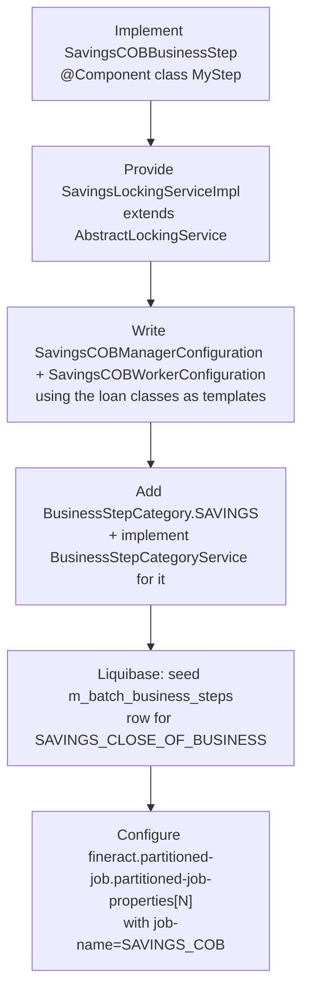
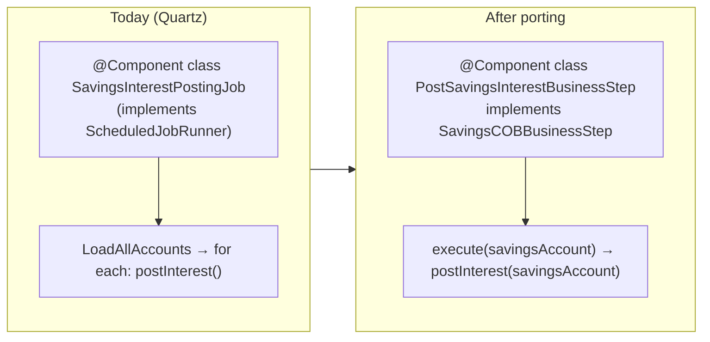

The savings COB engine is a sibling of the loan one: it follows the same `COBBusinessStep<T>` framework, the same partition/lock/chunk pattern, and the same `m_batch_business_steps` configuration table, but it operates on `SavingsAccount` aggregates and uses its own locking + ID-retrieval primitives. Unlike the loan side, **the upstream fineract-savings module does not ship any concrete `SavingsCOBBusinessStep` implementations** — the framework is in place but the catalog is empty until downstream installations register their own steps. This page documents the SPI and infrastructure types in `fineract-savings/src/main/java/org/apache/fineract/cob/savings/` so a developer can register steps with confidence.

## The interface

```java
// fineract-savings/src/main/java/org/apache/fineract/cob/savings/SavingsCOBBusinessStep.java
package org.apache.fineract.cob.savings;

import org.apache.fineract.cob.COBBusinessStep;
import org.apache.fineract.portfolio.savings.domain.SavingsAccount;

public interface SavingsCOBBusinessStep extends COBBusinessStep<SavingsAccount> {}
```

Same three-method contract as the loan SPI — see [Business step framework](/cob/business-step-framework). The generic parameter is pinned to `SavingsAccount` so steps can be type-safely registered and invoked.

## Constants

```java
// fineract-savings/src/main/java/org/apache/fineract/cob/savings/SavingsCOBConstant.java
public final class SavingsCOBConstant extends COBConstant {

    public static final String JOB_NAME                       = "SAVINGS_COB";
    public static final String JOB_HUMAN_READABLE_NAME        = "Savings COB";
    public static final String SAVINGS_COB_JOB_NAME           = "SAVINGS_CLOSE_OF_BUSINESS";
    public static final String SAVINGS_COB_PARAMETER          = "savingsCobParameter";
    public static final String SAVINGS_COB_WORKER_STEP        = "savingsCOBWorkerStep";

    public static final String INLINE_SAVINGS_COB_JOB_NAME    = "INLINE_SAVINGS_COB";
    public static final String SAVINGS_IDS_PARAMETER_NAME     = "SavingsIds";

    public static final String SAVINGS_COB_PARTITIONER_STEP   = "Savings COB partition - Step";
    public static final String PARTITION_KEY                  = "partition";
}
```

| Key | Used as | Loan equivalent |
| --- | ------- | --------------- |
| `JOB_NAME` (`SAVINGS_COB`) | Spring `JobName` identity, `PropertyService` lookup key | `LOAN_COB` |
| `SAVINGS_COB_JOB_NAME` (`SAVINGS_CLOSE_OF_BUSINESS`) | `m_batch_business_steps.job_name` | `LOAN_CLOSE_OF_BUSINESS` |
| `SAVINGS_COB_PARAMETER` (`savingsCobParameter`) | ExecutionContext key | `COB_PARAMETER` = `loanCobParameter` |
| `INLINE_SAVINGS_COB_JOB_NAME` | Inline job identity | `INLINE_LOAN_COB` |
| `SAVINGS_IDS_PARAMETER_NAME` (`SavingsIds`) | Custom job parameter for inline | `INLINE_IDS_PARAMETER_NAME` = `LoanIds` |

Inherits `BUSINESS_STEPS`, `BUSINESS_DATE_PARAMETER_NAME`, `IS_CATCH_UP_PARAMETER_NAME`, `NUMBER_OF_DAYS_BEHIND` from `COBConstant`.

## RetrieveSavingsIdService

```java
// fineract-savings/src/main/java/org/apache/fineract/cob/savings/RetrieveSavingsIdService.java
public interface RetrieveSavingsIdService {

    List<COBPartition> retrieveSavingsCOBPartitions(Long numberOfDays, LocalDate businessDate,
                                                     boolean isCatchUp, int partitionSize);

    List<COBIdAndLastClosedBusinessDate> retrieveSavingsIdsBehindDate(LocalDate businessDate, List<Long> savingsIds);

    List<COBIdAndLastClosedBusinessDate> retrieveSavingsIdsBehindDateOrNull(LocalDate businessDate,
                                                                            List<Long> savingsIds);

    List<COBIdAndLastClosedBusinessDate> retrieveSavingsIdsOldestCobProcessed(LocalDate businessDate);

    List<Long> retrieveAllNonClosedSavingsByLastClosedBusinessDateAndMinAndMaxSavingsId(
                                                                            COBParameter savingsCOBParameter, boolean isCatchUp);

    List<COBIdAndExternalIdAndAccountNo> findAllStayedLockedByCobBusinessDate(@Param("cobBusinessDate") LocalDate cobBusinessDate);
}
```

The exact mirror of `RetrieveIdService` (used by loan COB) but operating on `m_savings_account` instead of `m_loan`. The concrete implementation lives in fineract-provider:

```java
// fineract-provider/src/main/java/org/apache/fineract/cob/savings/RetrieveSavingsIdServiceImpl.java
@Service @RequiredArgsConstructor
public class RetrieveSavingsIdServiceImpl implements RetrieveSavingsIdService {

    private static final Collection<Integer> NON_CLOSED_SAVINGS_STATUSES = Arrays.asList(
        SavingsAccountStatusType.SUBMITTED_AND_PENDING_APPROVAL.getValue(),
        SavingsAccountStatusType.APPROVED.getValue(),
        SavingsAccountStatusType.ACTIVE.getValue(),
        SavingsAccountStatusType.TRANSFER_IN_PROGRESS.getValue(),
        SavingsAccountStatusType.TRANSFER_ON_HOLD.getValue());

    private final SavingsAccountRepository savingsAccountRepository;
    private final NamedParameterJdbcTemplate namedParameterJdbcTemplate;

    @Override
    public List<COBPartition> retrieveSavingsCOBPartitions(Long numberOfDays, LocalDate businessDate,
                                                            boolean isCatchUp, int partitionSize) {
        String sql = """
            select min(id) as min, max(id) as max, page, count(id) as count from
            (select floor(((row_number() over(order by id))-1) / :pageSize) as page, t.* from
            (select id from m_savings_account where status_enum in (:statusIds) and
            """;
        if (isCatchUp) {
            sql += "last_closed_business_date = :businessDate ";
        } else {
            sql += "(last_closed_business_date = :businessDate or last_closed_business_date is null) ";
        }
        sql += "order by id) t) t2 group by page order by page";

        MapSqlParameterSource parameters = new MapSqlParameterSource()
            .addValue("pageSize", partitionSize)
            .addValue("statusIds", List.copyOf(NON_CLOSED_SAVINGS_STATUSES))
            .addValue("businessDate", businessDate.minusDays(numberOfDays));
        return namedParameterJdbcTemplate.query(sql, parameters, RetrieveIdService::mapRow);
    }
}
```

Identical query shape to the loan side, swapping the table name and the status column.

## SavingsLockingService

```java
// fineract-savings/src/main/java/org/apache/fineract/cob/savings/SavingsLockingService.java
public interface SavingsLockingService {
    void upgradeLock(List<Long> accountsToLock, SavingsLockOwner lockOwner);
    void deleteBySavingsIdInAndLockOwner(List<Long> savingsIds, SavingsLockOwner lockOwner);
    List<SavingsAccountLock> findAllBySavingsIdIn(List<Long> savingsIds);
    SavingsAccountLock        findBySavingsIdAndLockOwner(Long savingsId, SavingsLockOwner lockOwner);
    List<SavingsAccountLock> findAllBySavingsIdInAndLockOwner(List<Long> savingsIds, SavingsLockOwner lockOwner);
    void applyLock(List<Long> savingsIds, SavingsLockOwner lockOwner);
}
```

Method names parallel `LockingService<LoanAccountLock>` but with `savingsId`. See [Account locking](/cob/account-locking) for the lock entity (`SavingsAccountLock`) and the owner enum (`SavingsLockOwner`).

## Repository

```java
// fineract-savings/src/main/java/org/apache/fineract/cob/savings/SavingsAccountLockRepository.java
public interface SavingsAccountLockRepository extends JpaRepository<SavingsAccountLock, Long> {
    Optional<SavingsAccountLock> findBySavingsIdAndLockOwner(Long savingsId, SavingsLockOwner lockOwner);
    void deleteBySavingsIdInAndLockOwner(List<Long> savingsIds, SavingsLockOwner lockOwner);
    List<SavingsAccountLock> findAllBySavingsIdIn(List<Long> savingsIds);
    boolean existsBySavingsIdAndLockOwner(Long savingsId, SavingsLockOwner lockOwner);
    boolean existsBySavingsIdAndLockOwnerAndErrorIsNotNull(Long savingsId, SavingsLockOwner lockOwner);
    List<SavingsAccountLock> findAllBySavingsIdInAndLockOwner(List<Long> savingsIds, SavingsLockOwner lockOwner);
    Page<SavingsAccountLock> findAll(Pageable pageable);
}
```

JPA repository over `m_savings_account_locks`. The DDL is set up by Liquibase changesets in `fineract-savings/src/main/resources/db/changelog/`.

## SavingsAccountLock entity

```java
@Entity @Table(name = "m_savings_account_locks") @NoArgsConstructor @Getter
public class SavingsAccountLock {

    @Id @Column(name = "savings_id", nullable = false) private Long savingsId;
    @Version @Column(name = "version") private Long version;

    @Enumerated(EnumType.STRING) @Column(name = "lock_owner", nullable = false)
    private SavingsLockOwner lockOwner;

    @Column(name = "lock_placed_on", nullable = false) private OffsetDateTime lockPlacedOn;
    @Column(name = "error")                            private String error;
    @Column(name = "stacktrace")                       private String stacktrace;
    @Column(name = "lock_placed_on_cob_business_date") private LocalDate lockPlacedOnCobBusinessDate;

    public SavingsAccountLock(Long savingsId, SavingsLockOwner lockOwner, LocalDate businessDate) {
        this.savingsId = savingsId;
        this.lockOwner = lockOwner;
        this.lockPlacedOn = DateUtils.getAuditOffsetDateTime();
        this.lockPlacedOnCobBusinessDate = businessDate;
    }

    public void setError(String errorMessage, String stacktrace) {
        this.error = errorMessage;
        this.stacktrace = stacktrace;
    }

    public void setNewLockOwner(SavingsLockOwner newLockOwner) {
        this.lockOwner = newLockOwner;
        this.lockPlacedOn = DateUtils.getAuditOffsetDateTime();
    }
}
```

Same shape as `LoanAccountLock` but does **not** extend `AccountLock` — it owns the persistence annotations directly. The reason is that `AccountLock` is structured around a `loan_id` column; the savings table uses `savings_id`. Future refactors may parameterise the column name, but currently the duplication is intentional.

## SavingsLockOwner

```java
// fineract-savings/src/main/java/org/apache/fineract/cob/savings/SavingsLockOwner.java
public enum SavingsLockOwner {
    SAVINGS_COB_CHUNK_PROCESSING,
    SAVINGS_INLINE_COB_PROCESSING;
}
```

Disjoint from `LockOwner` (loan side). The two enums live in different modules so that `LockingService<LoanAccountLock>` cannot accidentally accept a savings owner constant.

## Stayed-locked event

```java
public class SavingsAccountsStayedLockedBusinessEvent
        extends AbstractBusinessEvent<SavingsAccountsStayedLockedData> {

    private static final String CATEGORY = "Savings COB";
    private static final String TYPE     = "SavingsAccountsStayedLockedBusinessEvent";

    public SavingsAccountsStayedLockedBusinessEvent(SavingsAccountsStayedLockedData value) {
        super(value);
    }

    @Override public String getType()     { return TYPE; }
    @Override public String getCategory() { return CATEGORY; }
    @Override public Long getAggregateRootId() { return null; }
}
```

Counterpart to `LoanAccountsStayedLockedBusinessEvent`. The payload `SavingsAccountsStayedLockedData` mirrors the loan one (id, externalId, accountNo per entry).

## Exception types

```java
// fineract-savings/.../cob/savings/SavingsLockCannotBeAppliedException.java
public class SavingsLockCannotBeAppliedException extends RuntimeException { /* … */ }

// fineract-savings/.../cob/savings/SavingsReadException.java
public class SavingsReadException extends RuntimeException { /* … */ }
```

Parallel `LockCannotBeAppliedException` and `LockedReadException` in the loan side.

## File map

| File | Role | Loan analogue |
| ---- | ---- | ------------- |
| `SavingsCOBBusinessStep.java` | The SPI every savings step implements | `LoanCOBBusinessStep` |
| `SavingsCOBConstant.java` | Constants for execution-context keys, job names | `LoanCOBConstant` |
| `RetrieveSavingsIdService.java` | Partition + behind-id queries | `RetrieveLoanIdService` |
| `SavingsAccountLock.java` | JPA entity for `m_savings_account_locks` | `LoanAccountLock` |
| `SavingsAccountLockRepository.java` | JPA repository | `LoanAccountLockRepository` |
| `SavingsLockOwner.java` | Lock-owner enum | `LockOwner` |
| `SavingsLockingService.java` | High-level locking SPI | `LockingService<LoanAccountLock>` |
| `SavingsAccountsStayedLockedBusinessEvent.java` | Event fired at job end for stuck accounts | `LoanAccountsStayedLockedBusinessEvent` |
| `SavingsAccountsStayedLockedData.java` | Event payload | `LoanAccountsStayedLockedData` |
| `SavingsLockCannotBeAppliedException.java` | Lock-apply failure | `LockCannotBeAppliedException` |
| `SavingsReadException.java` | Reader failure | `LockedReadException` |

## What's missing (the implementation side)

Even though the SPI and infrastructure are complete, the following pieces are **not** present in the upstream tree at the time of writing — they are left as extension points:

- A `SavingsCOBManagerConfiguration` / `SavingsCOBWorkerConfiguration` Spring Batch job. The framework expects whoever deploys savings COB to wire one, modelling it on `LoanCOBManagerConfiguration` (manager-side, partitioner using `RetrieveSavingsIdService`) and `LoanCOBWorkerConfiguration` (worker-side, chunk over `SavingsAccount`).
- A `SavingsLockingServiceImpl` (concrete `SavingsLockingService`). Expected to mirror `LoanLockingServiceImpl` with JDBC batch inserts/updates against `m_savings_account_locks`.
- Concrete `SavingsCOBBusinessStep` implementations. Common candidates are *post savings interest*, *apply periodic charge*, *recompute dormancy classification*, *escheatment check* — all of which are currently implemented as stand-alone Quartz jobs (`POST_INTEREST_FOR_SAVINGS`, `UPDATE_SAVINGS_DORMANT_ACCOUNTS`, etc.). Migrating them into the COB framework reuses the same chunk/lock/partition machinery the loan COB already exercises.
- A `BusinessStepCategory.SAVINGS` constant and a category-service implementation returning `SavingsCOBBusinessStep.class`. Without this, the `GET /v1/jobs/SAVINGS_COB/available-steps` endpoint returns `null`. See [Step categories](/cob/business-step-categories).

If you are adding savings steps, the recipe is:



Note that the `AbstractLockingService` generic in `fineract-cob` is typed `<T extends AccountLock>`, and `SavingsAccountLock` does **not** extend `AccountLock`. A clean implementation either (a) introduces a parallel `AbstractSavingsLockingService` in fineract-savings, or (b) refactors `SavingsAccountLock` to extend `AccountLock` after renaming the PK column. The upstream code keeps these separate today.

## Pattern for porting a Quartz savings job into a COB step

The existing standalone savings batch jobs (`POST_INTEREST_FOR_SAVINGS`, `UPDATE_SAVINGS_DORMANT_ACCOUNTS`, `PAY_DUE_SAVINGS_CHARGES`) each iterate `m_savings_account`, do something per account, and `INSERT`/`UPDATE` rows. Folding them into the COB framework collapses the iteration and the locking into a single shared chunk and lets operators reorder them by date with no code changes.



The porting recipe is:

1. **Extract the per-account logic** from the existing job's loop body into a stateless method that takes a `SavingsAccount` and returns it.
2. **Implement `SavingsCOBBusinessStep`** wrapping that method. The framework supplies the iteration, the chunking, and the locking.
3. **Remove the standalone job's Quartz registration** (or leave both for transitional periods — the COB step will run idempotently against accounts the standalone job already processed because of `last_closed_business_date`).
4. **Update the dashboards** that monitored the old job to look at `LOAN_COB`/`SAVINGS_COB` instead.

The benefit is shared retry/skip/lock semantics: a single dormant account that throws during dormancy classification doesn't fail the whole job, the lock listener records the exception against that one account, and operators can replay only the failed accounts via catch-up.

## Operational checklist

When deploying a savings COB pipeline derived from this SPI:

| Check | Expected |
| ----- | -------- |
| `fineract.partitioned-job.partitioned-job-properties[N].job-name=SAVINGS_COB` set for some N | ✅ |
| `m_batch_business_steps` has at least one row with `job_name='SAVINGS_CLOSE_OF_BUSINESS'` | ✅ |
| `SavingsLockingService` bean is present (`@ConditionalOnMissingBean`) | ✅ |
| `BusinessStepCategory` enum has a `SAVINGS` constant or your `BusinessStepCategoryService` handles `SAVINGS_COB` | ✅ |
| Quartz scheduler has a trigger for `JobName.SAVINGS_COB` | ✅ |
| `m_savings_account_locks` DDL is present | ✅ (Liquibase seeds) |

If any of these is missing, the job either silently does nothing (no seeded steps), errors at startup (missing locking service), or schedules but never gets invoked (no Quartz trigger).

## Cross-references

- The base interface every step implements → [Business step framework](/cob/business-step-framework)
- The loan COB the savings one is modelled on → [Spring Batch wiring](/cob/cob-batch-jobs)
- Lock-entity superclass / lock-owner enum → [Account locking](/cob/account-locking)
- Configuration table backing `SAVINGS_CLOSE_OF_BUSINESS` job-name rows → [Step categories](/cob/business-step-categories)
- The `SavingsAccount` aggregate → [Savings module overview](/savings/overview)
