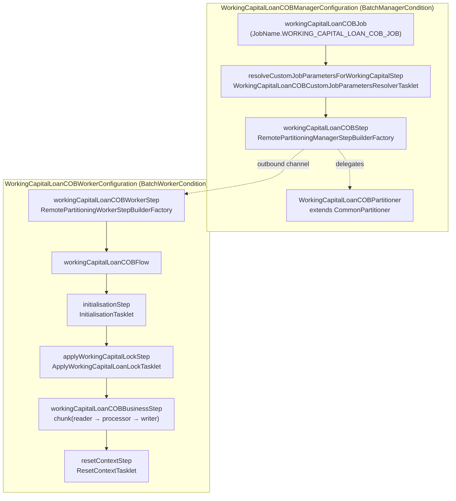
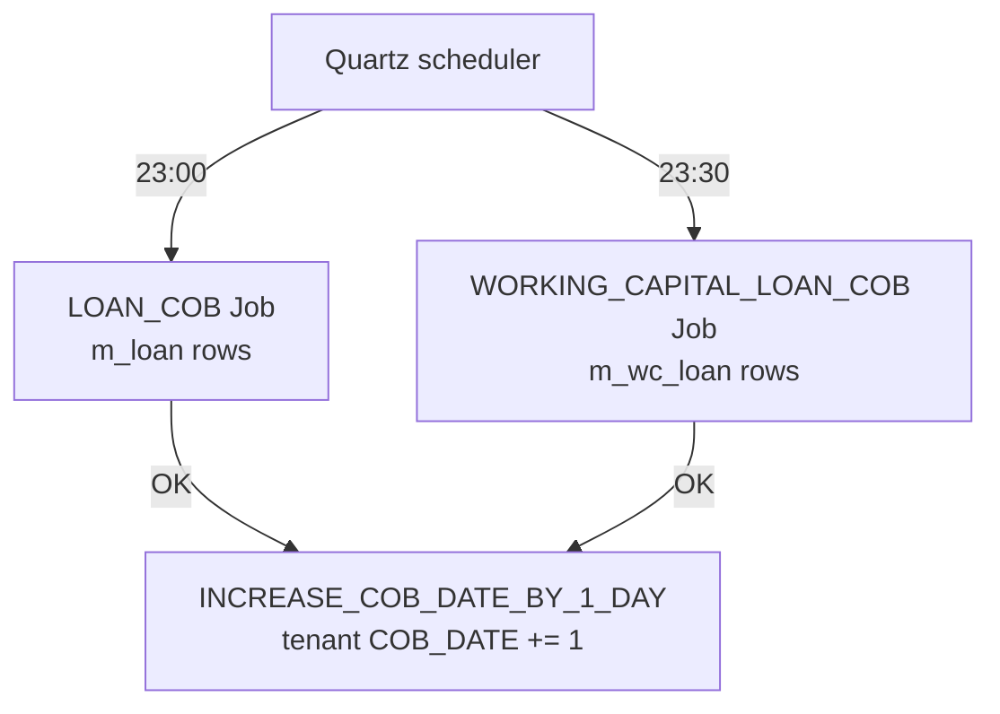

The working-capital-loan COB is a parallel Spring Batch job that runs every night against `m_wc_loan` rows the same way `LOAN_COB` runs against `m_loan`. It reuses the framework abstractions (`CommonPartitioner`, `ApplyCommonLockTasklet`, `AbstractItemProcessor`, `AbstractLoanItemListener`, `InlineLoanCOBBuildExecutionContextTasklet`) parametrised on the `WorkingCapitalLoan` aggregate, with its own lock table (`m_wc_loan_account_locks`), its own retrieve-id service, and an abstract base class `WorkingCapitalLoanCOBBusinessStep` that custom steps extend. This page is the per-class tour of `fineract-working-capital-loan/src/main/java/org/apache/fineract/cob/workingcapitalloan/` and how it composes with the loan COB pipeline you already know.

## Job identity

```java
// fineract-core/src/main/java/org/apache/fineract/infrastructure/jobs/service/JobName.java
WORKING_CAPITAL_LOAN_COB_JOB("Working Capital Loan COB"),
```

```java
// fineract-working-capital-loan/.../cob/workingcapitalloan/WorkingCapitalLoanCOBConstant.java
public final class WorkingCapitalLoanCOBConstant extends COBConstant {

    public static final String WORKING_CAPITAL_JOB_NAME                = "WC_LOAN_COB";
    public static final String WORKING_CAPITAL_JOB_HUMAN_READABLE_NAME = "Working Capital Loan COB";
    public static final String WORKING_CAPITAL_LOAN_COB_JOB_NAME       = "WORKING_CAPITAL_LOAN_CLOSE_OF_BUSINESS";

    public static final String WORKING_CAPITAL_LOAN_COB_STEP           = "workingCapitalLoanCOBStep";
    public static final String WORKING_CAPITAL_LOAN_COB_BUSINESS_STEP  = "workingCapitalLoanCOBBusinessStep";
    public static final String WORKING_CAPITAL_LOAN_COB_PARTITIONER    = "workingCapitalLoanCOBPartitioner";
    public static final String WORKING_CAPITAL_LOAN_COB_WORKER_STEP    = "workingCapitalLoanCOBWorkerStep";
    public static final String WORKING_CAPITAL_LOAN_COB_FLOW           = "workingCapitalLoanCOBFlow";

    public static final String INLINE_WORKING_CAPITAL_LOAN_COB_JOB_NAME = "INLINE_WORKING_CAPITAL_LOAN_COB";
    public static final String WORKING_CAPITAL_LOAN_IDS_PARAMETER_NAME  = "LoanIds";

    public static final String WORKING_CAPITAL_LOAN_COB_PARTITIONER_STEP = "Working Capital Loan COB partition - Step";
}
```

| Constant | Used as |
| -------- | ------- |
| `WORKING_CAPITAL_JOB_NAME` (`WC_LOAN_COB`) | `JobName` short identifier; `PropertyService` lookup key; `InlineJobType.WC_LOAN_COB.jobName` |
| `WORKING_CAPITAL_LOAN_COB_JOB_NAME` (`WORKING_CAPITAL_LOAN_CLOSE_OF_BUSINESS`) | `m_batch_business_steps.job_name` |
| `INLINE_WORKING_CAPITAL_LOAN_COB_JOB_NAME` | Spring Batch job name for the inline variant |
| `COB_PARAMETER` (inherited, `loanCobParameter`) | ExecutionContext key — same as loan; the partitioner writes a `COBParameter(min,max)` here |

## Pipeline layout



Unlike `LOAN_COB`, the working-capital job has **no** `stayedLockedStep` — failed accounts simply stay locked and surface via the `/v1/working-capital-loans/locked` (analogue) or the catch-up endpoints.

## Manager side

```java
// fineract-working-capital-loan/.../cob/workingcapitalloan/WorkingCapitalLoanCOBManagerConfiguration.java
@Configuration @EnableBatchIntegration @Conditional(BatchManagerCondition.class)
@RequiredArgsConstructor
public class WorkingCapitalLoanCOBManagerConfiguration {

    @Bean(WORKING_CAPITAL_LOAN_COB_PARTITIONER) @StepScope
    public WorkingCapitalLoanCOBPartitioner workingCapitalLoanCOBPartitioner(
            @Value("#{stepExecution}") StepExecution stepExecution) {
        return new WorkingCapitalLoanCOBPartitioner(jobOperator, stepExecution,
            WorkingCapitalLoanCOBConstant.NUMBER_OF_DAYS_BEHIND,
            retrieveIdService, cobBusinessStepService, propertyService);
    }

    @Bean(WORKING_CAPITAL_JOB_HUMAN_READABLE_NAME)
    public Job workingCapitalLoanCOBJob(WorkingCapitalLoanCOBPartitioner partitioner,
                                         ExecutionContextPromotionListener customJobParametersPromotionListener) {
        return new JobBuilder(WORKING_CAPITAL_LOAN_COB_JOB.name(), jobRepository)
            .start(resolveCustomJobParametersForWorkingCapitalStep(customJobParametersPromotionListener))
            .next(workingCapitalLoanCOBStep(partitioner))
            .incrementer(new RunIdIncrementer())
            .build();
    }

    @Bean
    public WorkingCapitalLoanCOBCustomJobParametersResolverTasklet resolveCustomJobParametersForWorkingCapitalTasklet() {
        return new WorkingCapitalLoanCOBCustomJobParametersResolverTasklet(customJobParameterResolver);
    }

    @Bean(WORKING_CAPITAL_LOAN_COB_STEP)
    public Step workingCapitalLoanCOBStep(WorkingCapitalLoanCOBPartitioner partitioner) {
        return stepBuilderFactory.get(WORKING_CAPITAL_LOAN_COB_PARTITIONER_STEP)
            .partitioner(WORKING_CAPITAL_LOAN_COB_WORKER_STEP, partitioner)
            .pollInterval(propertyService.getPollInterval(WORKING_CAPITAL_JOB_NAME))
            .outputChannel(outboundRequests).build();
    }
}
```

Differences from `LoanCOBManagerConfiguration`:

- Two steps (resolve-params + partitioned step), not three (no stayed-locked).
- The partitioner uses `WorkingCapitalLoanRetrieveIdService` (a sibling SPI to `RetrieveLoanIdService`) instead of the loan-side service.
- The bean is named with the human-readable constant (`Working Capital Loan COB`) which is also the `JobName`'s display name. The actual job name passed to `JobBuilder` is `WORKING_CAPITAL_LOAN_COB_JOB.name()`.

### Partitioner

```java
public class WorkingCapitalLoanCOBPartitioner extends CommonPartitioner implements Partitioner {

    private final COBBusinessStepService cobBusinessStepService;
    private final PropertyService propertyService;

    @Override
    public Map<String, ExecutionContext> partition(int gridSize) {
        int partitionSize = propertyService.getPartitionSize(WorkingCapitalLoanCOBConstant.WORKING_CAPITAL_JOB_NAME);
        Set<BusinessStepNameAndOrder> steps = cobBusinessStepService.getCOBBusinessSteps(
            WorkingCapitalLoanCOBBusinessStep.class,
            WorkingCapitalLoanCOBConstant.WORKING_CAPITAL_LOAN_COB_JOB_NAME);
        return getPartitions(partitionSize, steps);
    }
}
```

Identical pattern to `LoanCOBPartitioner` — only `propertyService.getPartitionSize` key and the `getCOBBusinessSteps` arguments differ.

### Custom-params resolver

```java
public class WorkingCapitalLoanCOBCustomJobParametersResolverTasklet implements Tasklet {

    private final CustomJobParameterResolver customJobParameterResolver;

    @Override
    public RepeatStatus execute(StepContribution contribution, ChunkContext chunkContext) throws Exception {
        customJobParameterResolver.resolve(contribution, chunkContext,
            WorkingCapitalLoanCOBConstant.BUSINESS_DATE_PARAMETER_NAME,
            WorkingCapitalLoanCOBConstant.BUSINESS_DATE_PARAMETER_NAME);
        return RepeatStatus.FINISHED;
    }
}
```

One-to-one with `ResolveLoanCOBCustomJobParametersTasklet`.

## Worker side

```java
// fineract-working-capital-loan/.../cob/workingcapitalloan/WorkingCapitalLoanCOBWorkerConfiguration.java
@Configuration @Conditional(BatchWorkerCondition.class) @RequiredArgsConstructor
public class WorkingCapitalLoanCOBWorkerConfiguration {

    @Bean(WORKING_CAPITAL_LOAN_COB_FLOW)
    public Flow workingCapitalLoanCOBFlow(Step initialisationStep, Step applyWorkingCapitalLockStep,
                                           Step workingCapitalLoanCOBBusinessStep, Step resetContextStep) {
        return new FlowBuilder<Flow>(WORKING_CAPITAL_LOAN_COB_FLOW)
            .start(initialisationStep)
            .next(applyWorkingCapitalLockStep)
            .next(workingCapitalLoanCOBBusinessStep)
            .next(resetContextStep).build();
    }

    @Bean(WORKING_CAPITAL_LOAN_COB_WORKER_STEP)
    public Step workingCapitalLoanCOBWorkerStep(Flow workingCapitalLoanCOBFlow) {
        return stepBuilderFactory.get(WORKING_CAPITAL_LOAN_COB_WORKER_STEP)
            .inputChannel(inboundRequests).flow(workingCapitalLoanCOBFlow).build();
    }

    @Bean(WORKING_CAPITAL_LOAN_COB_BUSINESS_STEP) @StepScope
    public Step workingCapitalLoanCOBBusinessStep(@Value("#{stepExecutionContext['partition']}") String partitionName,
            TaskExecutor workingCapitalCobTaskExecutor, COBBusinessStepService cobBusinessStepService) {
        SimpleStepBuilder<WorkingCapitalLoan, WorkingCapitalLoan> stepBuilder =
            new StepBuilder("Loan Business - Step:" + partitionName, jobRepository)
            .<WorkingCapitalLoan, WorkingCapitalLoan>chunk(propertyService.getChunkSize(JobName.LOAN_COB.name()), transactionManager)
            .reader(new WorkingCapitalLoanCOBWorkerItemReader(workingCapitalLoanRepository,
                new BeforeStepLockingItemReaderHelper<>(retrieveIdService, wpcLoanLockingService)))
            .processor(new WorkingCapitalLoanCOBWorkerItemProcessor(cobBusinessStepService))
            .writer(new WorkingCapitalLoanCOBWorkerItemWriter(wpcLoanLockingService, workingCapitalLoanRepository))
            .faultTolerant()
            .retry(Exception.class).retryLimit(propertyService.getRetryLimit(WORKING_CAPITAL_JOB_NAME))
            .skip(Exception.class).skipLimit(propertyService.getChunkSize(WORKING_CAPITAL_JOB_NAME) + 1)
            .listener(workingCapitalLoanItemListener())
            .transactionManager(transactionManager);

        if (propertyService.getThreadPoolMaxPoolSize(WORKING_CAPITAL_JOB_NAME) > 1) {
            stepBuilder.taskExecutor(workingCapitalCobTaskExecutor);
        }
        return stepBuilder.build();
    }
}
```

<Note>
Notice `chunk(propertyService.getChunkSize(JobName.LOAN_COB.name()), …)` — the chunk size is borrowed from the **loan** job's config (`fineract.partitioned-job.partitioned-job-properties[0].chunk-size`), but `retryLimit` and `taskExecutor` use the working-capital job's own keys. The working-capital `partition-size`, `thread-pool-*` and `poll-interval` properties are configured at a separate index (typically `partitioned-job-properties[1]`).
</Note>

### Reader, processor, writer

The triplet follows the loan-side abstractions:

```java
public class WorkingCapitalLoanCOBWorkerItemReader extends AbstractLoanItemReader<WorkingCapitalLoan> {
    @BeforeStep
    public void beforeStep(StepExecution stepExecution) {
        setRemainingData(beforeStepLockingItemReaderHelper.filterRemainingData(stepExecution));
    }
}

public abstract class AbstractWorkingCapitalLoanCOBWorkerItemProcessor extends AbstractItemProcessor<WorkingCapitalLoan> {
    @Override
    public void setLastRun(WorkingCapitalLoan processed) {
        processed.setLastClosedBusinessDate(getBusinessDate());
    }
}

public class WorkingCapitalLoanCOBWorkerItemProcessor extends AbstractWorkingCapitalLoanCOBWorkerItemProcessor {
    @BeforeStep
    public void beforeStep(StepExecution stepExecution) {
        setExecutionContext(stepExecution.getExecutionContext());
        setBusinessDate(stepExecution);
    }
}

public abstract class AbstractWorkingCapitalLoanCOBWorkerItemWriter
        extends RepositoryItemWriter<WorkingCapitalLoan> {
    @Override
    public void write(@NonNull Chunk<? extends WorkingCapitalLoan> items) throws Exception {
        if (!items.isEmpty()) {
            super.write(items);
            List<Long> ids = items.getItems().stream().map(AbstractPersistableCustom::getId).toList();
            wpcLoanLockingService.deleteByLoanIdInAndLockOwner(ids, LockOwner.LOAN_COB_CHUNK_PROCESSING);
        }
    }
}
```

The writer reuses the **loan-side `LockOwner.LOAN_COB_CHUNK_PROCESSING`** constant — both lock tables happen to use the same enum vocabulary because the underlying `AccountLock` superclass is shared. So a "working capital loan COB chunk lock" is identified by the same enum constant, just stored in a different table (`m_wc_loan_account_locks`).

### Lock tasklet

```java
public class ApplyWorkingCapitalLoanLockTasklet extends ApplyCommonLockTasklet<WorkingCapitalLoanAccountLock> {

    public ApplyWorkingCapitalLoanLockTasklet(FineractProperties fineractProperties,
            LockingService<WorkingCapitalLoanAccountLock> loanLockingService,
            RetrieveIdService retrieveIdService, TransactionTemplate transactionTemplate) {
        super(fineractProperties, loanLockingService, retrieveIdService, transactionTemplate);
    }

    @Override public String   getCOBParameter() { return WorkingCapitalLoanCOBConstant.COB_PARAMETER; }
    @Override public LockOwner getLockOwner()    { return LockOwner.LOAN_COB_CHUNK_PROCESSING; }
}
```

Same generic-loan pattern as `ApplyLoanLockTasklet`, parameterised on `WorkingCapitalLoanAccountLock`.

### Lock service

```java
public class WorkingCapitalLoanLockingServiceImpl extends AbstractLockingService<WorkingCapitalLoanAccountLock> {

    private static final String BATCH_INSERT = """
        INSERT INTO m_wc_loan_account_locks
            (loan_id, version, lock_owner, lock_placed_on, lock_placed_on_cob_business_date)
        VALUES (?,?,?,?,?)
        """;
    private static final String BATCH_UPGRADE = """
        UPDATE m_wc_loan_account_locks
        SET version = version + 1, lock_owner = ?, lock_placed_on = ?
        WHERE loan_id = ?
        """;

    @Override protected String getBatchLoanLockInsert()  { return BATCH_INSERT; }
    @Override protected String getBatchLoanLockUpgrade() { return BATCH_UPGRADE; }
}
```

Registered via `WorkingCapitalLoanLockingConfiguration`:

```java
@Configuration
public class WorkingCapitalLoanLockingConfiguration {
    @Bean @ConditionalOnMissingBean
    public LockingService<WorkingCapitalLoanAccountLock> wpcLoanLockingService(
            JdbcTemplate jdbcTemplate, FineractProperties fineractProperties,
            WorkingCapitalAccountLockRepository repo) {
        return new WorkingCapitalLoanLockingServiceImpl(jdbcTemplate, fineractProperties, repo);
    }
}
```

The repository:

```java
public interface WorkingCapitalAccountLockRepository
    extends JpaRepository<WorkingCapitalLoanAccountLock, Long>,
            AccountLockRepository<WorkingCapitalLoanAccountLock>,
            CustomWorkingCapitalLoanAccountLockRepositoryImpl<WorkingCapitalLoanAccountLock> { }
```

## The business-step abstract class

```java
// fineract-working-capital-loan/.../cob/workingcapitalloan/businessstep/WorkingCapitalLoanCOBBusinessStep.java
public abstract class WorkingCapitalLoanCOBBusinessStep implements COBBusinessStep<WorkingCapitalLoan> {}
```

Note: unlike the loan side (`LoanCOBBusinessStep` is an interface), the working-capital module ships an **abstract class**. This is purely stylistic; concrete steps still implement `execute`, `getEnumStyledName`, and `getHumanReadableName` directly.

### DummyBusinessStep — the seeded placeholder

```java
@Slf4j @RequiredArgsConstructor @Component
public class DummyBusinessStep extends WorkingCapitalLoanCOBBusinessStep {

    @Override
    public WorkingCapitalLoan execute(WorkingCapitalLoan input) {
        log.info("Executing DummyBusinessStep... WorkingCapitalLoan ID = {}", input.getId());
        return input;
    }

    @Override public String getEnumStyledName()    { return "DUMMY_BUSINESS_STEP"; }
    @Override public String getHumanReadableName() { return "Dummy Business Step"; }
}
```

Liquibase seeds it as the default order-1 step:

```xml
<!-- fineract-working-capital-loan/.../db/changelog/tenant/module/workingcapitalloan/parts/0003_working_capital_loan_cob.xml -->
<insert tableName="m_batch_business_steps">
    <column name="job_name"   value="WORKING_CAPITAL_LOAN_CLOSE_OF_BUSINESS"/>
    <column name="step_name"  value="DUMMY_BUSINESS_STEP"/>
    <column name="step_order" value="1"/>
</insert>
```

So the job ships **runnable but no-op** — it executes a log line for every working-capital loan in scope and updates `last_closed_business_date`. Deployments replace the seed via `PUT /v1/jobs/WC_LOAN_COB/steps` or via Liquibase changelogs in their own module.

The same `0003_…` changelog also registers the job in the `job` table (Quartz schedule), creates `m_wc_loan_account_locks`, and adds `loan_status_id` + `last_closed_business_date` columns to `m_wc_loan`.

## Inline variant

`fineract-provider/.../cob/loan/WorkingCapitalLoanInlineCOBConfig.java` defines `INLINE_WORKING_CAPITAL_LOAN_COB`, used by:

- `POST /v1/jobs/WC_LOAN_COB/inline` — routed via `InlineJobApiResource` + `InlineJobType.WC_LOAN_COB`.
- `POST /v1/working-capital-loans/catch-up` — looped by `WorkingCapitalLoanCOBCatchUpServiceImpl`.

See [Inline COB](/cob/inline-cob) for the full pipeline. The structural difference from the loan inline config:

- Uses `WorkingCapitalLoanCOBBusinessStep.class` (abstract class) instead of `LoanCOBBusinessStep.class`.
- Reader is `WorkingCapitalInlineCOBLoanItemReader` (in `fineract-provider/.../cob/loan/`).
- Job name: `INLINE_WORKING_CAPITAL_LOAN_COB` instead of `INLINE_LOAN_COB`.

## How loan COB and working-capital COB compose



Both jobs operate on the same tenant's COB date and both advance their respective `last_closed_business_date` columns. They are independent Spring Batch jobs scheduled separately — they do **not** chain. Operators schedule both before `INCREASE_COB_DATE_BY_1_DAY`. Failure of one does not block the other; failure of either does not block the date-increase, although operationally that is what triggers the catch-up endpoints to be invoked next morning.

Working-capital loans and ordinary loans share neither aggregates nor write platforms. The closest interaction is that the `LoanCOBFilterHelper` HTTP filter doesn't apply to working-capital endpoints; analogous filtering for `m_wc_loan` writes goes through the `WC_LOAN_COB` inline route via `InlineWorkingCapitalLoanCOBExecutorServiceImpl`.

## File inventory

| File | Role |
| ---- | ---- |
| `WorkingCapitalLoanCOBConstant.java` | Constants for execution-context keys, job/step names. |
| `WorkingCapitalLoanCOBManagerConfiguration.java` | Spring Batch manager-side config (`@BatchManagerCondition`). |
| `WorkingCapitalLoanCOBWorkerConfiguration.java` | Spring Batch worker-side config (`@BatchWorkerCondition`). |
| `WorkingCapitalLoanCOBPartitioner.java` | Partitioner over `m_wc_loan`. |
| `WorkingCapitalLoanCOBCustomJobParametersResolverTasklet.java` | Reads `BusinessDate` from custom job params. |
| `WorkingCapitalLoanCOBWorkerItemReader.java` | Reader using `BeforeStepLockingItemReaderHelper`. |
| `AbstractWorkingCapitalLoanCOBWorkerItemProcessor.java` / `WorkingCapitalLoanCOBWorkerItemProcessor.java` | Processor running the configured step chain. |
| `AbstractWorkingCapitalLoanCOBWorkerItemWriter.java` / `WorkingCapitalLoanCOBWorkerItemWriter.java` | Writer that saves chunks and releases locks. |
| `WorkingCapitalLoanCOBWorkerItemListener.java` | Chunk listener for the daily job. |
| `WorkingCapitalChunkProcessingLoanItemListener` (in fineract-provider) | Concrete listener pinning `LOAN_COB_CHUNK_PROCESSING`. |
| `ApplyWorkingCapitalLoanLockTasklet.java` | Lock-apply tasklet specialising `ApplyCommonLockTasklet`. |
| `WorkingCapitalLoanLockingServiceImpl.java` / `WorkingCapitalLoanLockingConfiguration.java` | JDBC batch lock manipulation. |
| `WorkingCapitalLoanAccountLock.java` / `WorkingCapitalAccountLockRepository.java` / `CustomWorkingCapitalLoanAccountLockRepositoryImpl.java` | Lock entity + repos. |
| `WorkingCapitalLoanRetrieveIdService.java` / `WorkingCapitalLoanRetrieveIdServiceImpl.java` / `WorkingCapitalLoanRetrieveIdConfiguration.java` | Partition + behind-id queries against `m_wc_loan`. |
| `WorkingCapitalAccountLockServiceImpl.java` | Read-side query for locked WC loans. |
| `InlineWorkingCapitalLoanCOBWorkerItemListener.java` / `InlineWorkingCapitalLoanCOBWorkerItemWriter.java` / `WorkingCapitalLoanInlineCOBWorkerItemProcessor.java` | Inline-variant chunk components. |
| `businessstep/WorkingCapitalLoanCOBBusinessStep.java` | Abstract base class for steps. |
| `businessstep/DummyBusinessStep.java` | Seeded no-op step (`DUMMY_BUSINESS_STEP`). |

## Adding a real working-capital step

```java
@Component @RequiredArgsConstructor
public class MyWorkingCapitalStep extends WorkingCapitalLoanCOBBusinessStep {

    private final SomeService someService;

    @Override
    public WorkingCapitalLoan execute(WorkingCapitalLoan wc) {
        someService.processForDate(wc, DateUtils.getBusinessLocalDate());
        return wc;
    }

    @Override public String getEnumStyledName()    { return "MY_WC_STEP"; }
    @Override public String getHumanReadableName() { return "My WC Step"; }
}
```

Then `PUT /v1/jobs/WC_LOAN_COB/steps`:

```json
{ "businessSteps": [ { "stepName": "MY_WC_STEP", "order": 1 } ] }
```

(Removing `DUMMY_BUSINESS_STEP` is fine — the framework treats whatever rows you submit as the complete configuration.)

## Cross-references

- The shared framework abstractions → [Business step framework](/cob/business-step-framework)
- The loan COB this mirrors → [Spring Batch wiring](/cob/cob-batch-jobs)
- The inline variant → [Inline COB](/cob/inline-cob)
- The catch-up endpoint → [API resources](/cob/cob-api-resources)
- The lock entity + owner enum → [Account locking](/cob/account-locking)
- End-to-end loan-side flow (similar shape) → [Loan COB flow](/flows/loan-cob-flow)
