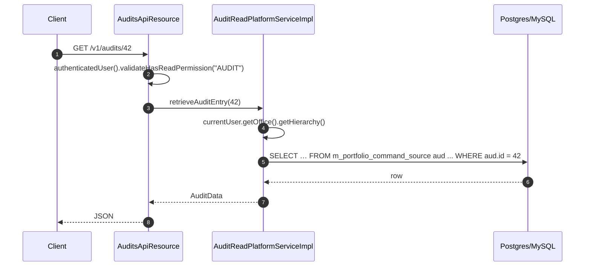
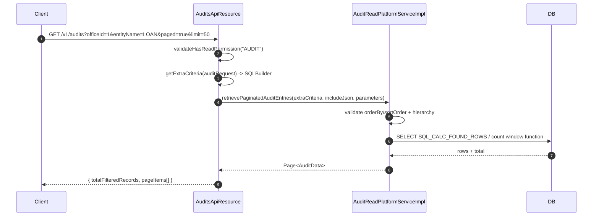

Every non-read API request that Apache Fineract processes ends up as a row in `m_portfolio_command_source`. The `/v1/audits` REST endpoints expose those rows through `AuditsApiResource`, backed by `AuditReadPlatformServiceImpl` — a JDBC-based read service that joins the audit row to office, group, client, loan, savings, and user lookup tables to produce the `AuditData` projection. This page documents the endpoints, the filter parameters, the JDBC projection, the data-scoping rules, the permissions required, and the relationship between `CommandSource` columns and `AuditData` fields.

## Source map

| Path                                                                                                            | Role                                                                       |
| --------------------------------------------------------------------------------------------------------------- | -------------------------------------------------------------------------- |
| `fineract-provider/src/main/java/org/apache/fineract/commands/api/AuditsApiResource.java`                       | REST resource (`@Path("/v1/audits")`).                                     |
| `fineract-provider/src/main/java/org/apache/fineract/commands/service/AuditReadPlatformService.java`            | Read interface — `retrieveAuditEntries`, paged variant, `retrieveAuditEntry`, `retrieveSearchTemplate`, `retrieveAllEntriesToBeChecked`. |
| `fineract-provider/src/main/java/org/apache/fineract/commands/service/AuditReadPlatformServiceImpl.java`        | JDBC implementation with the `AuditMapper` schema.                         |
| `fineract-provider/src/main/java/org/apache/fineract/commands/data/AuditData.java`                              | Projection record.                                                         |
| `fineract-provider/src/main/java/org/apache/fineract/commands/data/AuditSearchData.java`                        | Search-template projection.                                                |
| `fineract-provider/src/main/java/org/apache/fineract/commands/data/request/AuditRequest.java`                   | JAX-RS bean for query parameters.                                          |
| `fineract-provider/src/main/java/org/apache/fineract/commands/data/ProcessingResultLookup.java`                 | Status lookup used in search templates.                                    |

## Endpoint catalogue

| HTTP                                  | Path                                                                                                                                            | Operation                                                          | Permission required |
| ------------------------------------- | ----------------------------------------------------------------------------------------------------------------------------------------------- | ------------------------------------------------------------------ | ------------------- |
| `GET /v1/audits`                      | List audits matching the criteria, paginated by id descending.                                                                                  | `validateHasReadPermission("AUDIT")`                                | `READ_AUDIT`, or `ALL_FUNCTIONS` / `ALL_FUNCTIONS_READ` |
| `GET /v1/audits/{auditId}`            | Retrieve one audit row by id.                                                                                                                   | `validateHasReadPermission("AUDIT")`                                | same                |
| `GET /v1/audits/searchtemplate`       | Convenience template returning the user list, allowed action names, allowed entity names, and processing statuses to populate a search UI.       | `validateHasReadPermission("AUDIT")`                                | same                |

`AuditsApiResource` declares the resource name once at the top of the file:

```java
private static final String RESOURCE_NAME_FOR_PERMISSIONS = "AUDIT";
```

The same permission validator backs all three handlers:

```java
context.authenticatedUser().validateHasReadPermission(RESOURCE_NAME_FOR_PERMISSIONS);
```

`AppUser.validateHasReadPermission("AUDIT")` accepts any of `ALL_FUNCTIONS`, `ALL_FUNCTIONS_READ`, or the explicit `READ_AUDIT` (see [security overview](/security/overview)).

## `GET /v1/audits` — list

```java
@GET
public String retrieveAuditEntries(@Context final UriInfo uriInfo, @BeanParam AuditRequest auditRequest,
        @QueryParam("offset")  final Integer offset,
        @QueryParam("limit")   final Integer limit,
        @QueryParam("orderBy") final String orderBy,
        @QueryParam("sortOrder") final String sortOrder,
        @QueryParam("paged")   final Boolean paged) {

    context.authenticatedUser().validateHasReadPermission(RESOURCE_NAME_FOR_PERMISSIONS);
    final PaginationParameters parameters = PaginationParameters.builder().paged(Boolean.TRUE.equals(paged)).limit(limit).offset(offset)
            .orderBy(orderBy).sortOrder(sortOrder).build();
    final SQLBuilder extraCriteria = getExtraCriteria(auditRequest);
    final ApiRequestJsonSerializationSettings settings = this.apiRequestParameterHelper.process(uriInfo.getQueryParameters());

    return toApiJsonSerializer.serialize(parameters.isPaged()
            ? auditReadPlatformService.retrievePaginatedAuditEntries(extraCriteria, settings.isIncludeJson(), parameters)
            : auditReadPlatformService.retrieveAuditEntries(extraCriteria, settings.isIncludeJson()));
}
```

### Filter parameters (`AuditRequest`)

`AuditRequest` is a `@BeanParam` Lombok-annotated bean — every field maps to a `@QueryParam`:

| Query parameter            | Maps to SQL                                              | Notes                                                                   |
| -------------------------- | -------------------------------------------------------- | ----------------------------------------------------------------------- |
| `actionName`               | `aud.action_name = ?`                                    | Exact match; null → no clause.                                          |
| `entityName`               | `aud.entity_name like '<value>%'`                        | Prefix match (because some entities namespace sub-resources).           |
| `resourceId`               | `aud.resource_id = ?`                                    | The primary entity id.                                                  |
| `makerId`                  | `aud.maker_id = ?`                                       |                                                                         |
| `checkerId`                | `aud.checker_id = ?`                                     |                                                                         |
| `makerDateTimeFrom`        | `aud.made_on_date >= ?` **OR** `aud.made_on_date_utc >= ?` | Sub-operation that matches against both legacy and UTC columns.        |
| `makerDateTimeTo`          | `aud.made_on_date <= ?` **OR** `aud.made_on_date_utc <= ?` | Same sub-operation idiom.                                              |
| `checkerDateTimeFrom`      | `aud.checked_on_date >= ?` **OR** `aud.checked_on_date_utc >= ?` |                                                                |
| `checkerDateTimeTo`        | `aud.checked_on_date <= ?` **OR** `aud.checked_on_date_utc <= ?` |                                                                |
| `status`                   | `aud.status = ?`                                         | Numeric value from `CommandProcessingResultType` (1‒5).                  |
| `officeId`                 | `aud.office_id = ?`                                      | In addition to the implicit hierarchy filter (see [data scoping](#data-scoping)). |
| `groupId`                  | `aud.group_id = ?`                                       |                                                                         |
| `clientId`                 | `aud.client_id = ?`                                      |                                                                         |
| `loanId`                   | `aud.loan_id = ?`                                        |                                                                         |
| `savingsAccountId`         | `aud.savings_account_id = ?`                             |                                                                         |
| `offset`, `limit`          | LIMIT/OFFSET                                             | Only honoured when `paged=true`.                                        |
| `orderBy`, `sortOrder`     | ORDER BY                                                 | Whitelist enforced by `paginationParametersDataValidator`.              |
| `paged`                    |                                                          | Switches between `retrieveAuditEntries` and `retrievePaginatedAuditEntries`. Default: false → cap at `PaginationParameters.DEFAULT_MAX_LIMIT`. |
| `fields=...`               | JSON projection                                          | Standard Fineract field selection. `includeJson=true` adds `commandAsJson`. |

### How filters are assembled

`AuditsApiResource.getExtraCriteria` builds a `SQLBuilder` (Fineract's tiny WHERE-builder) that emits a string template and a list of arguments. The two date pairs use `addSubOperation` to emit `(... OR ...)` blocks bridging the legacy `made_on_date`/`checked_on_date` columns and their UTC counterparts:

```java
if (auditRequest.getMakerDateTimeFrom() != null) {
    extraCriteria.addSubOperation((SQLBuilder criteria) -> {
        criteria.addNonNullCriteria("aud.made_on_date >= ", auditRequest.getMakerDateTimeFrom(),
                SQLBuilder.WhereLogicalOperator.NONE);
        criteria.addNonNullCriteria("aud.made_on_date_utc >= ", auditRequest.getMakerDateTimeFrom(),
                SQLBuilder.WhereLogicalOperator.OR);
    });
}
```

This is how old audit rows written before the UTC migration still match the same date range.

### Allowed ORDER BY values

The implementation hard-codes the safe set:

```java
private static final Set<String> supportedOrderByValues = new HashSet<>(Arrays.asList("id", "actionName", "entityName", "resourceId",
        "subresourceId", "madeOnDate", "checkedOnDate", "officeName", "groupName", "clientName", "loanAccountNo", "savingsAccountNo",
        "clientId", "loanId", "maker", "checker", "processingResult"));
```

Anything outside this set is rejected by `PaginationParametersDataValidator`, blocking SQL injection through `orderBy`.

## `GET /v1/audits/{auditId}` — single row

```java
@GET
@Path("{auditId}")
public AuditData retrieveAuditEntry(@PathParam("auditId") final Long auditId) {
    context.authenticatedUser().validateHasReadPermission(RESOURCE_NAME_FOR_PERMISSIONS);
    return auditReadPlatformService.retrieveAuditEntry(auditId);
}
```

The detail endpoint always includes `commandAsJson` (the second argument of `rm.schema(true, hierarchy)` is hard-coded to `true`). Use this when you need the full request payload — list endpoints omit it unless `includeJson=true`.

## `GET /v1/audits/searchtemplate`

```java
@GET
@Path("/searchtemplate")
public AuditSearchData retrieveAuditSearchTemplate() {
    this.context.authenticatedUser().validateHasReadPermission(RESOURCE_NAME_FOR_PERMISSIONS);
    return this.auditReadPlatformService.retrieveSearchTemplate("audit");
}
```

The `"audit"` use-type causes the read service to skip the maker-checker restriction on action names. `AuditSearchData` is a Java record:

```java
public record AuditSearchData(Collection<AppUserData> appUsers, List<String> actionNames, List<String> entityNames,
        Collection<ProcessingResultLookup> statuses) implements Serializable { }
```

| Field         | Source                                                                                                  |
| ------------- | ------------------------------------------------------------------------------------------------------- |
| `appUsers`    | `AppUserReadPlatformService` filtered to the requestor's office hierarchy.                              |
| `actionNames` | Distinct `m_permission.action_name` values, narrowed when `useType = "makerchecker"` and the caller is not a `CHECKER_SUPER_USER`. |
| `entityNames` | Distinct `m_permission.entity_name` values, narrowed the same way.                                      |
| `statuses`    | `ProcessingResultLookup` rows: `(id, code)` pairs from `CommandProcessingResultType`.                   |

## `AuditData` projection

```java
@AllArgsConstructor
@Getter
public final class AuditData implements Serializable {

    private final Long id;
    private final String actionName;
    private final String entityName;
    private final Long resourceId;
    private final Long subresourceId;
    private final String maker;
    private final ZonedDateTime madeOnDate;
    private final String checker;
    private final ZonedDateTime checkedOnDate;
    private final String processingResult;
    @Setter
    private String commandAsJson;
    private final String officeName;
    private final String groupLevelName;
    private final String groupName;
    private final String clientName;
    private final String loanAccountNo;
    private final String savingsAccountNo;
    private final Long clientId;
    private final Long loanId;
    private final String url;
    private final String ip;
}
```

The `@Setter` on `commandAsJson` is what allows the projection to omit it from list responses by passing `null` and have callers fill it later if needed.

## Mapping `CommandSource` → `AuditData`

The JDBC mapper joins the audit row to lookup tables. Every `AuditData` field traces back to a column:

| `AuditData` field   | Source column / join                                                                          |
| ------------------- | --------------------------------------------------------------------------------------------- |
| `id`                | `aud.id`                                                                                       |
| `actionName`        | `aud.action_name`                                                                              |
| `entityName`        | `aud.entity_name`                                                                              |
| `resourceId`        | `aud.resource_id`                                                                              |
| `subresourceId`     | `aud.subresource_id`                                                                           |
| `maker`             | `mk.username` from `m_appuser mk on mk.id = aud.maker_id`                                       |
| `madeOnDate`        | `aud.made_on_date_utc` (falls back to legacy `aud.made_on_date` if UTC column is null)         |
| `checker`           | `ck.username` from `m_appuser ck on ck.id = aud.checker_id`                                     |
| `checkedOnDate`     | `aud.checked_on_date_utc` (falls back to legacy column)                                         |
| `processingResult`  | `ev.enum_message_property` from `r_enum_value ev on ev.enum_name='status' and ev.enum_id=aud.status` |
| `commandAsJson`     | `aud.command_as_json` (only when `includeJson=true`)                                            |
| `officeName`        | `o.name` from `m_office o on o.id = aud.office_id`                                              |
| `groupLevelName`    | `gl.level_name` from `m_group_level gl on gl.id = g.level_id`                                   |
| `groupName`         | `g.display_name` from `m_group g on g.id = aud.group_id`                                        |
| `clientName`        | `c.display_name` from `m_client c on c.id = aud.client_id`                                      |
| `loanAccountNo`     | `l.account_no` from `m_loan l on l.id = aud.loan_id`                                            |
| `savingsAccountNo`  | `s.account_no` from `m_savings_account s on s.id = aud.savings_account_id`                      |
| `clientId`          | `aud.client_id`                                                                                |
| `loanId`            | `aud.loan_id`                                                                                  |
| `url`               | `aud.api_get_url`                                                                              |
| `ip`                | `aud.client_ip`                                                                                |

The exact `select` clause (excerpted from `AuditMapper.schema`):

```java
String partSql = " aud.id as id, aud.action_name as actionName, aud.entity_name as entityName,"
        + " aud.resource_id as resourceId, aud.subresource_id as subresourceId,aud.client_id as clientId, aud.loan_id as loanId,"
        + " mk.username as maker, aud.made_on_date as madeOnDate, aud.made_on_date_utc as madeOnDateUTC, aud.api_get_url as resourceGetUrl, "
        + "ck.username as checker, aud.checked_on_date as checkedOnDate, aud.checked_on_date_utc as checkedOnDateUTC,  ev.enum_message_property as processingResult "
        + commandAsJsonString + ", "
        + " o.name as officeName, gl.level_name as groupLevelName, g.display_name as groupName, c.display_name as clientName, "
        + " l.account_no as loanAccountNo, s.account_no as savingsAccountNo , aud.client_ip  as ip "
        + " from m_portfolio_command_source aud "
        + " left join m_appuser mk on mk.id = aud.maker_id"
        + " left join m_appuser ck on ck.id = aud.checker_id"
        + " left join m_office o on o.id = aud.office_id"
        + " left join m_group g on g.id = aud.group_id"
        + " left join m_group_level gl on gl.id = g.level_id"
        + " left join m_client c on c.id = aud.client_id"
        + " left join m_loan l on l.id = aud.loan_id"
        + " left join m_savings_account s on s.id = aud.savings_account_id"
        + " left join r_enum_value ev on ev.enum_name = 'status' and ev.enum_id = aud.status";
```

The mapper then picks the UTC column when present:

```java
ZonedDateTime madeOnDate = madeOnDateUTC != null ? madeOnDateUTC.toZonedDateTime() : madeOnDateTenant;
ZonedDateTime checkedOnDate = checkedOnDateUTC != null ? checkedOnDateUTC.toZonedDateTime() : checkedOnDateTenant;
```

## Data scoping

Audits are data-scoped to the caller's office hierarchy unless they belong to the head office (`hierarchy == "."`). The schema construction injects an inner join when scoping is required:

```java
// data scoping: head office (hierarchy = ".") can see all audit entries
if (!hierarchy.equals(".")) {
    partSql += " join m_office o2 on o2.id = aud.office_id and o2.hierarchy like '" + hierarchy + "%' ";
}
```

Rows that lack an `office_id` (e.g. global definitions — loan products, GL accounts, scheduler jobs) only flow through to head-office users. Non-head-office staff see only audits under their branch tree.

## Maker-checker variant

`retrieveAllEntriesToBeChecked` (used by `MakercheckersApiResource`) wraps the same SQL with two additional clauses:

```java
extraCriteria.addCriteria("aud.status = ", 2);  // AWAITING_APPROVAL
return retrieveEntries("makerchecker", extraCriteria, " order by aud.id, mk.username", includeJson);
```

…and, when the caller lacks `ALL_FUNCTIONS` and `CHECKER_SUPER_USER`, restricts visible action/entity pairs to those the user actually has a `*_CHECKER` permission for:

```java
sql += " join m_permission p on REPLACE(p.action_name, '_CHECKER', '')  = aud.action_name and p.entity_name = aud.entity_name and p.code like '%\\_CHECKER'"
    + " join m_role_permission rp on rp.permission_id = p.id"
    + " join m_role r on r.id = rp.role_id "
    + " join m_appuser_role ur on ur.role_id = r.id and ur.appuser_id = " + currentUser.getId();
```

This is the SQL-level enforcement that complements `AppUser.validateHasCheckerPermissionTo` — see [maker-checker](/command/maker-checker).

## Sequence — single audit lookup



## Sequence — paginated list



## Example responses

### List

```http
GET /v1/audits?officeId=1&entityName=CLIENT&makerDateTimeFrom=2024-01-01 00:00:00 HTTP/1.1
```

```json
[
  {
    "id": 17832,
    "actionName": "CREATE",
    "entityName": "CLIENT",
    "resourceId": 99,
    "maker": "officer1",
    "madeOnDate": "2024-01-12T14:32:11Z",
    "checker": "supervisor",
    "checkedOnDate": "2024-01-12T15:01:44Z",
    "processingResult": "Processed",
    "officeName": "Head Office",
    "clientName": "John Doe",
    "url": "/clients/99",
    "ip": "10.0.0.42"
  }
]
```

### Detail with payload

```http
GET /v1/audits/17832?fields=actionName,entityName,maker,commandAsJson HTTP/1.1
```

```json
{
  "actionName": "CREATE",
  "entityName": "CLIENT",
  "maker": "officer1",
  "commandAsJson": "{\"firstname\":\"John\",\"lastname\":\"Doe\",\"officeId\":1,\"dateFormat\":\"yyyy-MM-dd\",\"locale\":\"en\"}"
}
```

### Search template

```http
GET /v1/audits/searchtemplate HTTP/1.1
```

```json
{
  "appUsers": [
    {"id": 1, "username": "mifos"},
    {"id": 6, "username": "officer1"}
  ],
  "actionNames": ["CREATE", "UPDATE", "DELETE", "ACTIVATE", "CLOSE", "DISBURSE", "DEPOSIT", "WITHDRAW", "APPROVE", "REJECT"],
  "entityNames": ["CLIENT", "LOAN", "SAVINGSACCOUNT", "JOURNALENTRY", "GLACCOUNT"],
  "statuses": [
    {"id": 1, "code": "commandProcessingResultType.processed"},
    {"id": 2, "code": "commandProcessingResultType.awaiting.approval"},
    {"id": 3, "code": "commandProcessingResultType.rejected"},
    {"id": 4, "code": "commandProcessingResultType.underProcessing"},
    {"id": 5, "code": "commandProcessingResultType.error"}
  ]
}
```

## Operational notes

<AccordionGroup>
  <Accordion title="Audit table volume">
    `m_portfolio_command_source` grows linearly with write throughput. The `PurgeProcessedCommandsTasklet` job calls `deleteOlderEventsWithStatus(PROCESSED, cutoff)` periodically (configurable via the Fineract scheduler). Be aware that purging deletes the idempotency replay capability for those keys.
  </Accordion>
  <Accordion title="`includeJson` and sensitive fields">
    When the original `CommandWrapper` declared `sanitizeJsonKeys`, the row's `commandAsJson` is already masked (`***`) or empty (`SANITIZE_ALL`). Setting `includeJson=true` is safe even for user-administration audits — the database never contains the raw secrets. See [`CommandSource` sanitization](/command/command-source#sanitizejson-helper).
  </Accordion>
  <Accordion title="Why `entityName` is a prefix match">
    Some endpoints write rows with namespaced entity names like `DATATABLE` + `_<table>` or `NOTE` + `_<scope>`. The `like '<value>%'` clause lets a single filter cover an entire family.
  </Accordion>
  <Accordion title="Sorting on `madeOnDate` returns historical rows in tenant time">
    The `ORDER BY` whitelist exposes `madeOnDate`, which in the underlying SQL still references the legacy column `aud.made_on_date`. For greenfield data (UTC column populated), it might be null — prefer ordering by `id` (the default) when you need strict insertion order.
  </Accordion>
</AccordionGroup>

## Permissions cheat-sheet

| Permission                  | Grants                                                                                                                |
| --------------------------- | --------------------------------------------------------------------------------------------------------------------- |
| `READ_AUDIT`                | List, detail, and search template endpoints.                                                                          |
| `ALL_FUNCTIONS_READ`        | All read endpoints; satisfies `READ_AUDIT`.                                                                            |
| `ALL_FUNCTIONS`             | All endpoints including writes; satisfies `READ_AUDIT`.                                                                |
| (none)                      | `403 Forbidden` via `AppUser.validateHasReadPermission("AUDIT")` throwing `NoAuthorizationException`.                  |
| `CHECKER_SUPER_USER`        | Not used by `/v1/audits`, but relevant for `/v1/makercheckers` — see [maker-checker](/command/maker-checker).          |

## Cross references

<CardGroup cols={2}>
  <Card title="Command framework overview" icon="layer-group" href="/command/overview">Where audits sit in the broader picture.</Card>
  <Card title="CommandSource" icon="database" href="/command/command-source">Column-level reference for the table behind these endpoints.</Card>
  <Card title="Synchronous command processing" icon="forward" href="/command/synchronous-command-processing">How rows reach the table.</Card>
  <Card title="Idempotency" icon="rotate" href="/command/idempotency">Why some rows look duplicate-but-aren't (`PROCESSED` cache hits never re-insert).</Card>
  <Card title="Maker-checker" icon="user-check" href="/command/maker-checker">`/v1/makercheckers` shares the same projection.</Card>
  <Card title="Command handler registry" icon="gears" href="/command/command-handler-registry">Source of the `actionName` / `entityName` taxonomy.</Card>
  <Card title="Command execution flow" icon="diagram-project" href="/flows/command-execution-flow">Where each audit row originates in the request lifecycle.</Card>
  <Card title="Security overview" icon="shield" href="/security/overview">`AppUser`, permissions, office hierarchy semantics.</Card>
  <Card title="Batch API" icon="layer-group" href="/batch-api/overview">Batch sub-requests each create their own audit row.</Card>
</CardGroup>
