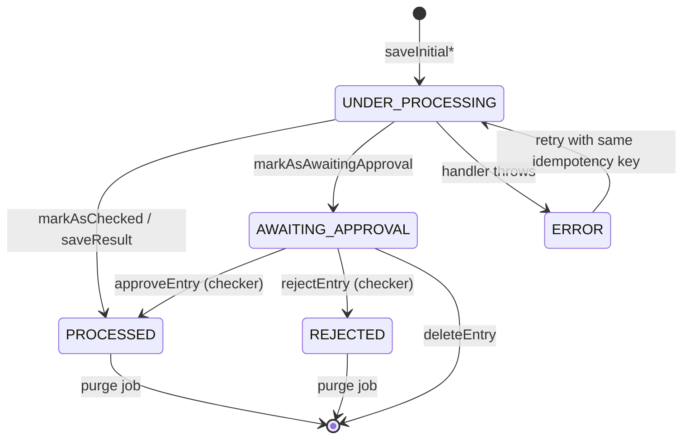
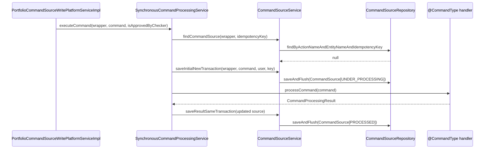

In Apache Fineract every state-changing API request is materialised as a row in `m_portfolio_command_source` through the `CommandSource` JPA entity. The same row carries the request payload, the maker who submitted it, the checker who approved it, the resulting resource identifiers (internal and external), the HTTP status code returned to the caller, and the idempotency key that guarantees safe retries. It is the persistent backbone of [`SynchronousCommandProcessingService`](/command/synchronous-command-processing), the [maker-checker flow](/command/maker-checker), the [audit trail](/command/audit-trail), and the [idempotency layer](/command/idempotency).

This page documents the entity field-by-field, the lifecycle status enum it carries, the small `CommandSourceRepository` interface used to read and purge it, the `sanitizeJson` helper that masks sensitive payload keys, and the way `updateForAudit` copies external ids out of the handler result.

## Source location

| Artifact                                            | Path                                                                                                                                         |
| --------------------------------------------------- | -------------------------------------------------------------------------------------------------------------------------------------------- |
| Entity                                              | `fineract-core/src/main/java/org/apache/fineract/commands/domain/CommandSource.java`                                                         |
| Status enum                                         | `fineract-core/src/main/java/org/apache/fineract/commands/domain/CommandProcessingResultType.java`                                           |
| Repository                                          | `fineract-core/src/main/java/org/apache/fineract/commands/domain/CommandSourceRepository.java`                                               |
| Unique index migration                              | `fineract-provider/src/main/resources/db/changelog/tenant/parts/0061_add_idempotency_key_to_command_source.xml`                              |
| Sanitization helper                                 | `CommandSourceService.sanitizeJson` (`fineract-core/.../commands/service/CommandSourceService.java`)                                         |

## Class declaration

```java
@Entity
@Getter
@Setter
@Builder
@NoArgsConstructor
@AllArgsConstructor
@Table(name = "m_portfolio_command_source")
public class CommandSource extends AbstractPersistableCustom<Long> {
```

`AbstractPersistableCustom<Long>` supplies the auto-generated `id` primary key. Lombok generates getters, setters, an all-args constructor, a no-args constructor, and a `builder()` factory used by `CommandSource.fullEntryFrom(...)` (the canonical factory used by `CommandSourceService.getInitialCommandSource`).

## Column-by-column reference

The fields below are listed in the order they appear in `CommandSource.java`. Column names map directly to `m_portfolio_command_source`.

<Note>
`madeOnDate` and `checkedOnDate` are stored as `OffsetDateTime` in UTC columns (`made_on_date_utc`, `checked_on_date_utc`). The original `made_on_date` / `checked_on_date` columns are kept in the schema for legacy migration purposes but are no longer written by the entity — see the deprecated block in `CommandSource.java`.
</Note>

| Field                          | Column                            | Type            | Nullable | Role                                                                                                                                                  |
| ------------------------------ | --------------------------------- | --------------- | -------- | ----------------------------------------------------------------------------------------------------------------------------------------------------- |
| `actionName`                   | `action_name`                     | `VARCHAR(100)`  | yes      | Verb portion of the permission code (`CREATE`, `UPDATE`, `DISBURSE`, `APPROVE`, …). Combined with `entityName` to form `permissionCode`.              |
| `entityName`                   | `entity_name`                     | `VARCHAR(100)`  | yes      | Noun portion of the permission code (`CLIENT`, `LOAN`, `SAVINGSACCOUNT`, `JOURNALENTRY`, …). Used by `CommandHandlerProvider` to dispatch.            |
| `officeId`                     | `office_id`                       | `BIGINT`        | yes      | Office data-scope. Set from `CommandWrapper.getOfficeId()` and refreshed from `CommandProcessingResult` via `updateForAudit`.                          |
| `groupId`                      | `group_id`                        | `BIGINT`        | yes      | Linked group resource (groups, centers).                                                                                                              |
| `clientId`                     | `client_id`                       | `BIGINT`        | yes      | Linked client resource.                                                                                                                               |
| `loanId`                       | `loan_id`                         | `BIGINT`        | yes      | Linked loan resource. Used by the [Loan COB pre-business-date filter](/core/business-date).                                                            |
| `savingsId`                    | `savings_account_id`              | `BIGINT`        | yes      | Linked savings account resource.                                                                                                                      |
| `resourceGetUrl`               | `api_get_url`                     | `VARCHAR(100)`  | yes      | The `href` the caller used (`/clients/123`, `/loans/45/disburse`, …). Allows the audit UI to deep-link back.                                           |
| `resourceId`                   | `resource_id`                     | `BIGINT`        | yes      | Primary entity id resolved either from the URL path or from the handler result.                                                                       |
| `subResourceId`                | `subresource_id`                  | `BIGINT`        | yes      | Sub-resource id (loan-transaction id, savings-transaction id, charge id, datatable row id…).                                                          |
| `commandAsJson`                | `command_as_json`                 | `VARCHAR(1000)` | yes      | The serialized request body. Possibly truncated by [JSON sanitization](#sanitizejson-helper). Defaults to `"{}"` when null.                            |
| `maker`                        | `maker_id` (FK `m_appuser`)       | `BIGINT`        | **no**   | `AppUser` that submitted the command. `validateHasPermissionTo(taskPermissionName)` is enforced upstream by `PortfolioCommandSourceWritePlatformServiceImpl.logCommandSource`. |
| `madeOnDate`                   | `made_on_date_utc`                | `TIMESTAMPTZ`   | **no**   | UTC instant when the row was first created. Populated by `DateUtils.getAuditOffsetDateTime()` inside `fullEntryFrom`.                                  |
| `checkedOnDate`                | `checked_on_date_utc`             | `TIMESTAMPTZ`   | yes      | UTC instant when a checker approved or rejected the command. Set by `markAsChecked` / `markAsRejected`.                                               |
| `checker`                      | `checker_id` (FK `m_appuser`)     | `BIGINT`        | yes      | `AppUser` that approved or rejected the command. Null while `status = AWAITING_APPROVAL`.                                                              |
| `status`                       | `status`                          | `INT`           | **no**   | Numeric value of `CommandProcessingResultType` (1‒5, 0 = invalid). See the [state machine](#status-lifecycle).                                         |
| `productId`                    | `product_id`                      | `BIGINT`        | yes      | Loan product or savings product id when the action targets a product.                                                                                 |
| `transactionId`                | `transaction_id`                  | `VARCHAR(100)`  | yes      | Domain-level transaction id (loan transaction id, savings transaction id, journal entry transaction id).                                              |
| `creditBureauId`               | `creditbureau_id`                 | `BIGINT`        | yes      | Linked credit bureau row when invoking credit-bureau endpoints.                                                                                       |
| `organisationCreditBureauId`   | `organisation_creditbureau_id`    | `BIGINT`        | yes      | Linked organisation-creditbureau row.                                                                                                                 |
| `jobName`                      | `job_name`                        | `VARCHAR`       | yes      | Filled when the command was raised by a scheduler job (`PurgeProcessedCommands`, `ExecutePeriodicAccrual`, …).                                         |
| `idempotencyKey`               | `idempotency_key`                 | `VARCHAR(50)`   | **no**¹  | Resolved by `IdempotencyKeyResolver`. See [idempotency](/command/idempotency).                                                                         |
| `resourceExternalId`           | `resource_external_id`            | `VARCHAR`       | yes      | `ExternalId` of the resource produced by the handler, copied from `CommandProcessingResult` via `updateForAudit`.                                      |
| `subResourceExternalId`        | `subresource_external_id`         | `VARCHAR`       | yes      | `ExternalId` of the sub-resource (e.g. loan-transaction external id) returned by the handler.                                                         |
| `result`                       | `result`                          | `TEXT`          | yes      | Serialized `CommandProcessingResult` on success, serialized `ErrorInfo` on error. Replayed by idempotent retries.                                     |
| `resultStatusCode`             | `result_status_code`              | `INT`           | yes      | HTTP status code returned to the caller; `200` on success, error code on failure.                                                                     |
| `loanExternalId`               | `loan_external_id`                | `VARCHAR(100)`  | yes      | External id of the linked loan (set from `JsonCommand.getLoanExternalId()`).                                                                          |
| `clientIp`                     | `client_ip`                       | `VARCHAR`       | yes      | Caller IP captured via `IpAddressUtils.getClientIp()`.                                                                                                 |
| `sanitized`                    | `is_sanitized`                    | `BOOLEAN`       | **no**   | `true` when `sanitizeJson` masked or cleared `commandAsJson`. Maker-checker commands cannot be sanitized.                                              |

¹ Not nullable for PostgreSQL (`mpcs_idempotency_key_nn` constraint added by changeset `0061/3` for `postgresql` context). On MySQL the not-null constraint is enforced through a separate changeset.

## Factory: `fullEntryFrom`

The static factory wires a `CommandWrapper` and `JsonCommand` into a builder instance. Called by `CommandSourceService.getInitialCommandSource`:

```java
public static CommandSource fullEntryFrom(final CommandWrapper wrapper, final JsonCommand command, final AppUser maker,
        String idempotencyKey, Integer status, boolean sanitized) {
    return CommandSource.builder() //
            .actionName(wrapper.actionName()) //
            .entityName(wrapper.entityName()) //
            .resourceGetUrl(wrapper.getHref()) //
            .resourceId(command.entityId()) //
            .subResourceId(command.subentityId()) //
            .commandAsJson(command.json()) //
            .maker(maker) //
            .madeOnDate(DateUtils.getAuditOffsetDateTime()) //
            .status(status) //
            .idempotencyKey(idempotencyKey) //
            .officeId(wrapper.getOfficeId()) //
            .groupId(command.getGroupId()) //
            .clientId(command.getClientId()) //
            .loanId(command.getLoanId()) //
            .savingsId(command.getSavingsId()) //
            .productId(command.getProductId()) //
            .transactionId(command.getTransactionId()) //
            .creditBureauId(command.getCreditBureauId()) //
            .organisationCreditBureauId(command.getOrganisationCreditBureauId()) //
            .clientIp(IpAddressUtils.getClientIp()) //
            .loanExternalId(command.getLoanExternalId()).sanitized(sanitized).build(); //
}
```

The initial row is created with `status = UNDER_PROCESSING.getValue()` and `sanitized = false`; `CommandSourceService.getInitialCommandSource` then calls `sanitizeJson` to mask password-style fields before the row is flushed.

## Status lifecycle

`CommandProcessingResultType` enumerates the five real states (plus `INVALID` for unknown values):

```java
public enum CommandProcessingResultType {
    INVALID(0, "commandProcessingResultType.invalid"),
    PROCESSED(1, "commandProcessingResultType.processed"),
    AWAITING_APPROVAL(2, "commandProcessingResultType.awaiting.approval"),
    REJECTED(3, "commandProcessingResultType.rejected"),
    UNDER_PROCESSING(4, "commandProcessingResultType.underProcessing"),
    ERROR(5, "commandProcessingResultType.error");
}
```

| Value | Constant            | Meaning                                                                                                              |
| ----- | ------------------- | -------------------------------------------------------------------------------------------------------------------- |
| 0     | `INVALID`           | Fallback returned by `fromInt` for an unknown numeric status. Should never be written.                               |
| 1     | `PROCESSED`         | Handler succeeded and the result was persisted with HTTP 200. Set by `markAsChecked` and by the success path of `executeCommand`. |
| 2     | `AWAITING_APPROVAL` | Maker-checker enabled task awaiting a checker. Set by `markAsAwaitingApproval`. Hosted as a maker-checker entry.    |
| 3     | `REJECTED`          | Checker rejected the maker-checker entry. Set by `markAsRejected`.                                                  |
| 4     | `UNDER_PROCESSING`  | Initial state when the row is first inserted. Used by the unique-index race protection.                              |
| 5     | `ERROR`             | Handler threw a `RuntimeException` that was mapped to a non-200 status. Set by the error path of `executeCommand`.   |

### State diagram



The transition `ERROR → UNDER_PROCESSING` is what makes idempotent retries safe: when `SynchronousCommandProcessingService.exceptionWhenTheRequestAlreadyProcessed` sees `status == ERROR` and the caller is a retry (`commandId` already in the request context), it does **not** throw, allowing the handler to run again against the existing row.

## Mutator methods

The entity exposes lifecycle mutators that hide the integer encoding from callers:

| Method                                       | Effect                                                                                                              |
| -------------------------------------------- | ------------------------------------------------------------------------------------------------------------------- |
| `setStatus(CommandProcessingResultType)`     | Writes `status.getValue()`.                                                                                          |
| `getStatusEnum()`                            | Returns `CommandProcessingResultType.fromInt(status)`.                                                              |
| `markAsAwaitingApproval()`                   | `status = AWAITING_APPROVAL`. Called by `CommandSourceService.processCommand` when maker-checker is enabled.        |
| `markAsChecked(AppUser checker)`             | `checker = user`, `checkedOnDate = now()`, `status = PROCESSED`. Called on checker approval or by `isCheckerSuperUser` users skipping approval. |
| `markAsRejected(AppUser checker)`            | `checker = user`, `checkedOnDate = now()`, `status = REJECTED`. Called by `PortfolioCommandSourceWritePlatformServiceImpl.rejectEntry`. |
| `isAwaitingApproval()` / `isProcessed()` / `isRejected()` | Predicates on the status enum.                                                                          |
| `isChecked()`                                | `checker != null && isProcessed()` — true only after maker-checker approval, false for direct success.              |
| `updateForAudit(CommandProcessingResult)`    | Copies `officeId`, `groupId`, `clientId`, `loanId`, `savingsId`, `productId`, `transactionId`, `resourceId`/`Eid`, `subResourceId`/`Eid`, `loanExternalId` from the handler result back onto the audit row. |

### `getPermissionCode()`

```java
public String getPermissionCode() {
    return this.actionName + "_" + this.entityName;
}
```

This is the permission string consulted by `ConfigurationDomainService.isMakerCheckerEnabledForTask` and by `AppUser.validateHasCheckerPermissionTo`. The matching `*_CHECKER_*` permission used during approval is derived by `AppUser` as `permissionCode + "_CHECKER"` (see [maker-checker](/command/maker-checker)).

## `CommandSourceRepository`

The repository is intentionally tiny — most write traffic is funnelled through `commandSourceRepository.saveAndFlush(...)` calls inside `CommandSourceService`.

```java
public interface CommandSourceRepository extends JpaRepository<CommandSource, Long>, JpaSpecificationExecutor<CommandSource> {

    CommandSource findByActionNameAndEntityNameAndIdempotencyKey(String actionName, String entityName, String idempotencyKey);

    @Modifying(flushAutomatically = true)
    @Query("delete from CommandSource c where c.status = :status and c.madeOnDate is not null and c.madeOnDate <= :dateForPurgeCriteria")
    void deleteOlderEventsWithStatus(@Param("status") Integer status, @Param("dateForPurgeCriteria") OffsetDateTime dateForPurgeCriteria);
}
```

| Method                                                    | Used by                                                                          | Purpose                                                                                       |
| --------------------------------------------------------- | -------------------------------------------------------------------------------- | --------------------------------------------------------------------------------------------- |
| `findById(Long)` (inherited)                              | `CommandSourceService.getCommandSource`, `IdempotencyStoreHelper.storeCommandResult` | Reload an existing row inside `REQUIRES_NEW` transactions and during retries.                  |
| `findByActionNameAndEntityNameAndIdempotencyKey(...)`     | `CommandSourceService.findCommandSource`                                          | Idempotency lookup. Triplet matches the `UNIQUE_PORTFOLIO_COMMAND_SOURCE` index.              |
| `saveAndFlush(CommandSource)` (inherited)                 | `saveInitial`, `saveResult`                                                       | Two-phase persistence — initial insert in `UNDER_PROCESSING`, second flush with result.       |
| `deleteOlderEventsWithStatus(...)`                        | `PurgeProcessedCommandsTasklet`                                                   | Scheduled job removes `PROCESSED` rows older than the configured retention period.            |
| `JpaSpecificationExecutor` API                            | (open for callers to build dynamic queries)                                       | Supports criteria-based lookups when needed; the audit list endpoints use raw JDBC instead.   |

### Unique index protecting idempotency

```xml
<!-- 0061_add_idempotency_key_to_command_source.xml -->
<addUniqueConstraint columnNames="action_name, entity_name, idempotency_key"
                     constraintName="UNIQUE_PORTFOLIO_COMMAND_SOURCE"
                     tableName="m_portfolio_command_source"/>
<createIndex indexName="portfolio_command_source_composite_index" tableName="m_portfolio_command_source">
    <column name="action_name"/>
    <column name="entity_name"/>
    <column name="idempotency_key"/>
</createIndex>
```

A concurrent retry with the same `(action_name, entity_name, idempotency_key)` triplet violates this constraint. `CommandSourceService.saveInitial` catches the resulting `JpaSystemException` and re-throws it as `IdempotentCommandProcessUnderProcessingException`:

```java
} catch (JpaSystemException jse) {
    final String message = (jse.getRootCause() != null) ? jse.getRootCause().getMessage() : null;
    if (message != null && message.toUpperCase().contains("UNIQUE_PORTFOLIO_COMMAND_SOURCE")) {
        throw new IdempotentCommandProcessUnderProcessingException(wrapper, idempotencyKey, jse);
    }
    throw jse;
}
```

## `sanitizeJson` helper

Sensitive payloads (passwords, secrets) must not survive into the audit row in plain text. `CommandSourceService.sanitizeJson` is invoked by `getInitialCommandSource` before the entity is flushed:

```java
private void sanitizeJson(@NonNull CommandSource commandSource, Set<String> sanitizeKeys) {
    if (sanitizeKeys == null || sanitizeKeys.isEmpty()) {
        return;
    }
    String commandAsJson = commandSource.getCommandAsJson();
    if (commandAsJson == null || commandAsJson.isEmpty()) {
        return;
    }
    final JsonElement parsedCommand = this.fromApiJsonHelper.parse(commandAsJson);
    if (!parsedCommand.isJsonObject()) {
        return;
    }
    String sanitizedJson;
    if (sanitizeKeys.contains(COMMAND_SANITIZE_ALL)) {
        sanitizedJson = "";
    } else {
        JsonObject jsonObject = parsedCommand.getAsJsonObject();
        for (String key : sanitizeKeys) {
            if (jsonObject.has(key)) {
                jsonObject.addProperty(key, COMMAND_MASK_VALUE);
            }
        }
        sanitizedJson = jsonObject.toString();
    }
    commandSource.setCommandAsJson(sanitizedJson);
    commandSource.setSanitized(true);
}
```

| Constant                | Value     | Behaviour                                                                                         |
| ----------------------- | --------- | ------------------------------------------------------------------------------------------------- |
| `COMMAND_MASK_VALUE`    | `"***"`   | Per-key replacement used for individual sensitive keys.                                            |
| `COMMAND_SANITIZE_ALL`  | `"SANITIZE_ALL"` | When the key set contains this token, `commandAsJson` is overwritten with an empty string. |

### Where keys come from

`CommandWrapperBuilder` registers sanitization keys on user-administration endpoints (the three places `sanitizeJsonKeys` is assigned):

```java
this.sanitizeJsonKeys = new HashSet<>(Arrays.asList(PASSWORD, REPEAT_PASSWORD));
```

i.e. `password` and `repeatPassword`. The set is carried on `CommandWrapper.sanitizeJsonKeys` and consulted by `getInitialCommandSource(wrapper, ...)` via `wrapper.getSanitizeJsonKeys()`.

### Sanitization + maker-checker = error

`CommandSourceService.processCommand` refuses to enqueue a sanitized command for maker-checker approval:

```java
if (commandSource.isSanitized()) {
    throw new GeneralPlatformDomainRuleException("error.msg.invalid.sanitization",
            "Maker-checker command can not be sanitized, please change the permission configuration", permission);
}
```

The reasoning: if the request JSON has been masked, no checker can actually inspect what they are approving. Either turn off sanitization for that task or turn off maker-checker.

## External id linkage

`ExternalId` columns let Fineract clients reference resources by stable, externally-issued identifiers rather than database surrogates:

| Field                       | Source on insert                                                | Source on update                                                                      |
| --------------------------- | --------------------------------------------------------------- | ------------------------------------------------------------------------------------- |
| `loanExternalId`            | `JsonCommand.getLoanExternalId()` resolved by `CommandWrapper`. | Refreshed by `updateForAudit(CommandProcessingResult)` from the handler result.       |
| `resourceExternalId`        | Not set initially.                                              | Populated by `updateForAudit` from `CommandProcessingResult.getResourceExternalId()`. |
| `subResourceExternalId`     | Not set initially.                                              | Populated by `updateForAudit` from `CommandProcessingResult.getSubResourceExternalId()`. |

The `updateForAudit` step runs inside the persistence retry block of `SynchronousCommandProcessingService.executeCommand` immediately before status flips from `UNDER_PROCESSING` to `PROCESSED`:

```java
currentSource.setResultStatusCode(SC_OK);
currentSource.updateForAudit(result);
currentSource.setResult(toApiResultJsonSerializer.serializeResult(result));
currentSource.setStatus(PROCESSED);
return commandSourceService.saveResultSameTransaction(currentSource);
```

## Common queries against `m_portfolio_command_source`

Even though most code accesses the table through JPA, operators often reach for raw SQL when triaging. A few useful queries:

<CodeGroup>
```sql Find all rows currently awaiting a checker
select id, action_name, entity_name, maker_id, made_on_date_utc, client_id, loan_id
from m_portfolio_command_source
where status = 2          -- AWAITING_APPROVAL
order by made_on_date_utc desc;
```

```sql Detect duplicate idempotency keys for a given action
select action_name, entity_name, idempotency_key, count(*)
from m_portfolio_command_source
group by action_name, entity_name, idempotency_key
having count(*) > 1;
```

```sql Recent errors with their result message
select id, action_name, entity_name, maker_id, result_status_code, result
from m_portfolio_command_source
where status = 5          -- ERROR
  and made_on_date_utc > now() - interval '24 hours'
order by id desc;
```
</CodeGroup>

The `UNIQUE_PORTFOLIO_COMMAND_SOURCE` constraint should make the second query return zero rows under normal operation; non-zero results indicate a migration or backfill broke the invariant.

## How `CommandSource` plugs into the runtime



The full walk-through — including the Resilience4j retry and the `BatchRequestContextHolder` branching — is in [Synchronous command processing](/command/synchronous-command-processing).

## Cross references

<CardGroup cols={2}>
  <Card title="Synchronous processing" icon="forward" href="/command/synchronous-command-processing">
    Line-by-line walk-through of `SynchronousCommandProcessingService.executeCommand`.
  </Card>
  <Card title="Idempotency" icon="rotate" href="/command/idempotency">
    How the `idempotencyKey` column is resolved and how retries replay the stored `result`.
  </Card>
  <Card title="Maker-checker" icon="user-check" href="/command/maker-checker">
    What happens when `status` flips to `AWAITING_APPROVAL` and the maker-checker REST API.
  </Card>
  <Card title="Audit trail" icon="clipboard-list" href="/command/audit-trail">
    How `CommandSource` rows are projected into `AuditData` for `/v1/audits`.
  </Card>
  <Card title="Command framework overview" icon="layer-group" href="/command/overview">
    Module map of `fineract-core/commands` and `fineract-command`.
  </Card>
  <Card title="Core commands framework" icon="gears" href="/core/commands-framework">
    `CommandWrapper`, `CommandWrapperBuilder`, and `JsonCommand` in the wider core stack.
  </Card>
  <Card title="Command execution flow" icon="diagram-project" href="/flows/command-execution-flow">
    End-to-end flow including filters, security context, and hook publishing.
  </Card>
  <Card title="Maker-checker flow" icon="diagram-project" href="/flows/maker-checker-flow">
    Visual flow of submission → approval → audit.
  </Card>
  <Card title="Batch API" icon="layer-group" href="/batch-api/overview">
    How `BatchRequestContextHolder.isEnclosingTransaction()` changes the persistence strategy.
  </Card>
  <Card title="Security overview" icon="shield" href="/security/overview">
    Where `AppUser`, permissions, and `PlatformSecurityContext` come from.
  </Card>
</CardGroup>
