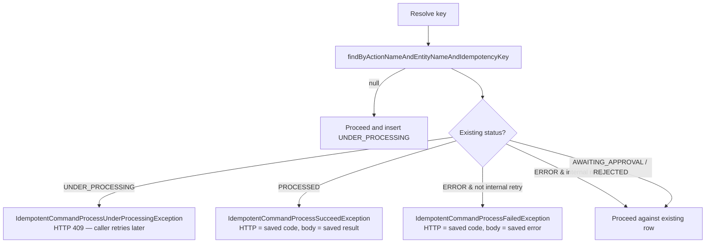
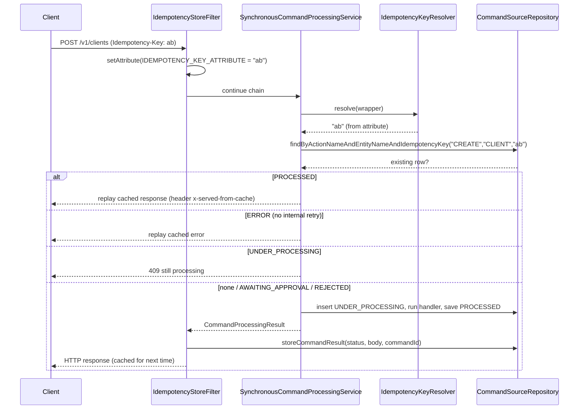

Apache Fineract treats every state-changing API call as an idempotent operation: every `CommandSource` row carries an `idempotency_key`, a unique index protects against double-execution, and three dedicated exceptions replay cached responses when callers retry with the same key. This page explains the resolution order, the storage filter, the three response variants, and the helper classes that make the loop work.

The mechanism is intentionally invisible to handler authors — a handler that follows the [`@CommandType` contract](/command/command-handler-registry) automatically benefits from it.

## Component map

| Source                                                                                                          | Role                                                                                              |
| --------------------------------------------------------------------------------------------------------------- | ------------------------------------------------------------------------------------------------- |
| `fineract-core/.../commands/service/IdempotencyKeyResolver.java`                                                | Resolution chain (wrapper field → request attribute → UUID).                                       |
| `fineract-core/.../commands/service/IdempotencyKeyGenerator.java`                                               | Fallback `UUID.randomUUID()` generator.                                                            |
| `fineract-core/.../infrastructure/core/filters/IdempotencyStoreFilter.java`                                     | Reads `Idempotency-Key` header, pushes the value to a request attribute, and caches the response. |
| `fineract-core/.../infrastructure/core/filters/IdempotencyStoreBatchFilter.java`                                | Same role for Batch API child requests.                                                            |
| `fineract-core/.../infrastructure/core/filters/IdempotencyStoreHelper.java`                                     | Reusable helpers shared by both filters.                                                           |
| `fineract-core/.../infrastructure/core/exception/AbstractIdempotentCommandException.java`                       | Base type carrying the cached `response`, `action`, `entity`, `idempotencyKey`.                    |
| `fineract-core/.../infrastructure/core/exception/IdempotentCommandProcessSucceedException.java`                 | Replays a `PROCESSED` row.                                                                         |
| `fineract-core/.../infrastructure/core/exception/IdempotentCommandProcessFailedException.java`                  | Replays an `ERROR` row.                                                                            |
| `fineract-core/.../infrastructure/core/exception/IdempotentCommandProcessUnderProcessingException.java`         | Tells the client the original request is still running.                                            |
| `fineract-provider/src/main/resources/db/changelog/tenant/parts/0061_add_idempotency_key_to_command_source.xml` | Adds the column, the not-null constraint, and the unique index.                                    |

## `IdempotencyKeyResolver`

```java
@Component
@RequiredArgsConstructor
public class IdempotencyKeyResolver {

    private final FineractRequestContextHolder fineractRequestContextHolder;
    private final IdempotencyKeyGenerator idempotencyKeyGenerator;

    public String resolve(CommandWrapper wrapper) {
        return Optional.ofNullable(wrapper.getIdempotencyKey())
                .orElseGet(() -> getAttribute()
                .orElseGet(idempotencyKeyGenerator::create));
    }

    private Optional<String> getAttribute() {
        return Optional.ofNullable(fineractRequestContextHolder.getAttribute(
                        SynchronousCommandProcessingService.IDEMPOTENCY_KEY_ATTRIBUTE))
                .map(String::valueOf);
    }
}
```

The resolution chain is strictly ordered:

| Priority | Source                                                                                                     | When set                                                                                                  |
| -------- | ---------------------------------------------------------------------------------------------------------- | --------------------------------------------------------------------------------------------------------- |
| 1        | `CommandWrapper.idempotencyKey` field                                                                       | Caller built the wrapper via `CommandWrapperBuilder.build(idempotencyKey)` or `CommandWrapper.fromExistingCommand(..., idempotencyKey, ...)` — used during maker-checker approval so the approval call reuses the maker's key. |
| 2        | `FineractRequestContextHolder` attribute `IdempotencyKeyAttribute`                                          | Populated by `IdempotencyStoreFilter` when the incoming request carried the `Idempotency-Key` header (header name configurable via `fineract.command.idempotency-key-header-name`). |
| 3        | `IdempotencyKeyGenerator.create()` → `UUID.randomUUID().toString()`                                         | Internal default — every command gets *some* key even when the caller did not supply one, so the unique index has something to enforce. |

```java
@Component
public class IdempotencyKeyGenerator {
    public String create() {
        return UUID.randomUUID().toString();
    }
}
```

<Tip>
Keys are stored in `VARCHAR(50)` (`idempotency_key`). UUIDs are 36 characters, leaving headroom for the longest caller-supplied keys. Truncating longer headers is not done — make sure your client sends ≤ 50 characters.
</Tip>

## `IdempotencyStoreFilter` — request lifecycle

```java
@Override
protected void doFilterInternal(HttpServletRequest request, HttpServletResponse response, FilterChain filterChain) {
    Mutable<ContentCachingResponseWrapper> wrapper = new MutableObject<>();
    if (helper.isAllowedContentTypeRequest(request)) {
        wrapper.setValue(new ContentCachingResponseWrapper(response));
    }
    extractIdempotentKeyFromHttpServletRequest(request).ifPresent(idempotentKey ->
        fineractRequestContextHolder.setAttribute(
            SynchronousCommandProcessingService.IDEMPOTENCY_KEY_ATTRIBUTE, idempotentKey, request));

    filterChain.doFilter(request, wrapper.get() != null ? wrapper.get() : response);
    Optional<Long> commandId = helper.getCommandId(request);
    boolean isSuccessWithoutStored = commandId.isPresent() && wrapper.get() != null
            && helper.isStoreIdempotencyKey(request)
            && helper.isAllowedContentTypeResponse(response);
    if (isSuccessWithoutStored) {
        helper.storeCommandResult(response.getStatus(),
            Optional.ofNullable(wrapper.get())
                .map(ContentCachingResponseWrapper::getContentAsByteArray)
                .map(s -> new String(s, StandardCharsets.UTF_8))
                .orElse(null),
            commandId.get());
    }
    if (wrapper.get() != null) {
        wrapper.get().copyBodyToResponse();
    }
}

private Optional<String> extractIdempotentKeyFromHttpServletRequest(HttpServletRequest request) {
    return Optional.ofNullable(request.getHeader(fineractProperties.getIdempotencyKeyHeaderName()));
}
```

In sequence:

1. **Before the chain** — wraps the response with a `ContentCachingResponseWrapper` for JSON-typed requests and lifts the `Idempotency-Key` header into a request attribute.
2. **Runs the rest of the pipeline** — eventually `SynchronousCommandProcessingService.executeCommand` stores `COMMAND_SOURCE_ID` and (on success) `IDEMPOTENCY_KEY_STORE_FLAG = true` on the same context.
3. **After the chain** — if all three guards are satisfied, the cached response body and status are written back to the `CommandSource.result` / `result_status_code` columns via `IdempotencyStoreHelper.storeCommandResult`.
4. **Copy the body back** to the real response so the client receives it.

### `IdempotencyStoreHelper`

```java
@Component
@RequiredArgsConstructor
public class IdempotencyStoreHelper {

    private final CommandSourceRepository commandSourceRepository;
    private final CommandSourceService commandSourceService;
    private final FineractRequestContextHolder fineractRequestContextHolder;

    public void storeCommandResult(Integer response, String body, Long commandId) {
        commandSourceRepository.findById(commandId).ifPresent(commandSource -> {
            commandSource.setResultStatusCode(response);
            commandSource.setResult(body);
            commandSourceService.saveResultSameTransaction(commandSource);
        });
    }

    public boolean isAllowedContentTypeResponse(HttpServletResponse response) {
        return Optional.ofNullable(response.getContentType())
                .map(String::toLowerCase).map(ct -> ct.contains("application/json")).orElse(false)
                || (response.getStatus() > 200 && response.getStatus() < 300);
    }

    public boolean isAllowedContentTypeRequest(HttpServletRequest request) {
        return Optional.ofNullable(request.getContentType())
                .map(String::toLowerCase).map(ct -> ct.contains("application/json")).orElse(false);
    }

    public boolean isStoreIdempotencyKey(HttpServletRequest request) {
        return Optional.ofNullable(fineractRequestContextHolder.getAttribute(
                        SynchronousCommandProcessingService.IDEMPOTENCY_KEY_STORE_FLAG, request))
                .filter(Boolean.class::isInstance).map(Boolean.class::cast).orElse(false);
    }

    public Optional<Long> getCommandId(HttpServletRequest request) {
        return Optional.ofNullable(fineractRequestContextHolder.getAttribute(
                        SynchronousCommandProcessingService.COMMAND_SOURCE_ID, request))
                .filter(Long.class::isInstance).map(Long.class::cast);
    }
}
```

The helper is intentionally generic so that:

- `IdempotencyStoreFilter` can use it for plain REST traffic, and
- `IdempotencyStoreBatchFilter` can reuse the same `storeCommandResult` for Batch API child requests (where the response body is the batch sub-response).

The store flag — `IDEMPOTENCY_KEY_STORE_FLAG` — is the small dance that makes the system safe: it starts as `false`, flips to `true` only after the row is in `UNDER_PROCESSING`, and is consulted by the filter to gate writing the response back. Any error path that throws before the flip leaves the row's `result` column to be populated by `SynchronousCommandProcessingService` itself (with the serialised `ErrorInfo`).

## Persistence guarantees

```xml
<addUniqueConstraint columnNames="action_name, entity_name, idempotency_key"
                     constraintName="UNIQUE_PORTFOLIO_COMMAND_SOURCE"
                     tableName="m_portfolio_command_source"/>
<createIndex indexName="portfolio_command_source_composite_index" tableName="m_portfolio_command_source">
    <column name="action_name"/>
    <column name="entity_name"/>
    <column name="idempotency_key"/>
</createIndex>
```

The triplet `(action_name, entity_name, idempotency_key)` is unique. Concurrent retries with the same `Idempotency-Key` race on the insert in `saveInitial`; the loser sees `JpaSystemException` whose root cause contains `UNIQUE_PORTFOLIO_COMMAND_SOURCE` and gets translated:

```java
} catch (JpaSystemException jse) {
    final String message = (jse.getRootCause() != null) ? jse.getRootCause().getMessage() : null;
    if (message != null && message.toUpperCase().contains("UNIQUE_PORTFOLIO_COMMAND_SOURCE")) {
        throw new IdempotentCommandProcessUnderProcessingException(wrapper, idempotencyKey, jse);
    }
    throw jse;
}
```

The constraint is the only place where the idempotency contract is *atomically* enforced. Filters and exceptions exist to provide a nice client experience; the database is the source of truth.

## Replay decisions — three exception flavours

`SynchronousCommandProcessingService.exceptionWhenTheRequestAlreadyProcessed` looks up the existing row by `(actionName, entityName, idempotencyKey)` and picks one of three responses depending on the persisted status:



### `AbstractIdempotentCommandException`

```java
public abstract class AbstractIdempotentCommandException extends AbstractPlatformException {

    public static final String IDEMPOTENT_CACHE_HEADER = "x-served-from-cache";

    @Getter private final String action;
    @Getter private final String entity;
    @Getter private final String idempotencyKey;
    @Getter private final String response;

    protected AbstractIdempotentCommandException(String action, String entity, String idempotencyKey, String response) {
        super(null, null);
        this.action = action;
        this.entity = entity;
        this.idempotencyKey = idempotencyKey;
        this.response = response;
    }
}
```

| Field            | Used by                                                                                          |
| ---------------- | ------------------------------------------------------------------------------------------------ |
| `action`         | Diagnostics in logs/exception serialisation.                                                     |
| `entity`         | Same.                                                                                            |
| `idempotencyKey` | Returned to the client (echoed in logs/traces).                                                  |
| `response`       | The cached response body to replay — exactly what was written into `CommandSource.result`.      |
| `IDEMPOTENT_CACHE_HEADER` | Header (`x-served-from-cache`) appended by the global exception mapper so clients can tell a cache-hit replay from a fresh execution. |

### Variant table

| Exception                                                | Triggered when persisted status is …    | HTTP status returned                                                          | Body                                                                                              |
| -------------------------------------------------------- | --------------------------------------- | ----------------------------------------------------------------------------- | ------------------------------------------------------------------------------------------------- |
| `IdempotentCommandProcessSucceedException`               | `PROCESSED`                             | `commandSource.getResultStatusCode()` — typically `200`                       | `commandSource.getResult()` — the original `CommandProcessingResult` JSON                          |
| `IdempotentCommandProcessFailedException`                | `ERROR` and the call is *not* an internal retry | `commandSource.getResultStatusCode()` (falls back to 500 if null)             | `commandSource.getResult()` — the serialised `ErrorInfo`                                          |
| `IdempotentCommandProcessUnderProcessingException`       | `UNDER_PROCESSING`, or the unique index race | Generally `409 Conflict` (mapped by the global handler)                       | The wrapper's request JSON (caller retries can include the same body without state confusion)     |

Code excerpts:

```java
public class IdempotentCommandProcessSucceedException extends AbstractIdempotentCommandException {
    private final Integer statusCode;

    public IdempotentCommandProcessSucceedException(CommandWrapper wrapper, String idempotencyKey, CommandSource command) {
        super(wrapper.actionName(), wrapper.entityName(), idempotencyKey, command.getResult());
        this.statusCode = command.getResultStatusCode();
    }
}
```

```java
public class IdempotentCommandProcessFailedException extends AbstractIdempotentCommandException {
    private final Integer statusCode;

    public IdempotentCommandProcessFailedException(CommandWrapper wrapper, String idempotencyKey, CommandSource command) {
        super(wrapper.actionName(), wrapper.actionName(), idempotencyKey, command.getResult());
        this.statusCode = command.getResultStatusCode();
    }

    @NotNull
    public Integer getStatusCode() {
        // If the database inconsistent we return http 500 instead of null pointer exception
        return statusCode == null ? Integer.valueOf(SC_INTERNAL_SERVER_ERROR) : statusCode;
    }
}
```

```java
public class IdempotentCommandProcessUnderProcessingException extends AbstractIdempotentCommandException {

    public IdempotentCommandProcessUnderProcessingException(CommandWrapper wrapper, String idempotencyKey) {
        super(wrapper.actionName(), wrapper.entityName(), idempotencyKey, wrapper.getJson());
    }

    public IdempotentCommandProcessUnderProcessingException(CommandWrapper wrapper, String idempotencyKey, Exception e) {
        super(wrapper.actionName(), wrapper.entityName(), idempotencyKey, wrapper.getJson());
    }
}
```

## Internal retries vs client retries

The boolean `isRetry` inside `SynchronousCommandProcessingService.executeCommand` is **not** about HTTP retries — it is `true` whenever the Resilience4j `getRetryConfigurationForExecuteCommand` re-invokes the same supplier *inside* a single HTTP request:

```java
Long commandId = (Long) fineractRequestContextHolder.getAttribute(COMMAND_SOURCE_ID, null);
boolean isRetry = commandId != null;
```

The decision tree is therefore:

| Caller            | `isRetry` | Behaviour on existing `ERROR` row                                                                |
| ----------------- | --------- | ------------------------------------------------------------------------------------------------ |
| HTTP client       | `false`   | Throw `IdempotentCommandProcessFailedException` — replay the cached error. Client must use a new key to re-try. |
| Resilience4j retry within the same call | `true` | Proceed and rerun the handler against the existing row — the previous attempt failed transiently. |

## Worked examples

<AccordionGroup>
  <Accordion title="Successful create followed by retry">
    Client posts `POST /v1/clients` with `Idempotency-Key: 9c…`. Server creates client #42, persists the row with `status = PROCESSED`, `result_status_code = 200`, `result = {...resourceId:42...}`. Client times out, sends the request again with the same key. Server sees the existing `PROCESSED` row, throws `IdempotentCommandProcessSucceedException`, the exception mapper translates it back to HTTP 200 with the original body plus header `x-served-from-cache: true`. No second client is created.
  </Accordion>
  <Accordion title="Validation error followed by corrected retry">
    Client posts `POST /v1/loans/{id}/disburse` with `Idempotency-Key: ab…` and a malformed amount. Handler throws `PlatformApiDataValidationException`. Server writes `status = ERROR`, `result_status_code = 400`, `result = {validation errors}`. Client fixes the body and retries with the **same** key. Server sees `ERROR`, throws `IdempotentCommandProcessFailedException` — the **original** validation error is replayed; the corrected body is ignored. Lesson: when correcting, generate a new key.
  </Accordion>
  <Accordion title="Two concurrent requests with the same key">
    Both inserts race the unique index. The loser receives `JpaSystemException` containing `UNIQUE_PORTFOLIO_COMMAND_SOURCE`, which is re-thrown as `IdempotentCommandProcessUnderProcessingException`. The client is told the operation is still in flight and should retry later; whichever side wins is what eventually owns the cached result.
  </Accordion>
  <Accordion title="Internal Resilience4j retry hides a transient deadlock">
    Inside a single HTTP request, the first attempt fails with a deadlock (`CannotAcquireLockException`, configured as a retry exception). The retry wrapper invokes the supplier again. The second attempt finds `COMMAND_SOURCE_ID` already in the context — `isRetry = true` — reloads the row, sees `status = ERROR`, but skips the throw because of the retry guard, and reruns the handler successfully. The row is updated to `PROCESSED`. The client sees a normal 200.
  </Accordion>
</AccordionGroup>

## Configuration knobs

| Property                                                            | Default            | Effect                                                            |
| ------------------------------------------------------------------- | ------------------ | ----------------------------------------------------------------- |
| `fineract.idempotency-key-header-name`                              | `Idempotency-Key`  | Header consumed by `IdempotencyStoreFilter` for normal requests.   |
| `fineract.command.idempotency-key-header-name`                      | `Idempotency-Key`  | Same header name reused for batch sub-requests by `IdempotencyStoreBatchFilter`. |

Both properties default to the same value in `application.properties`:

```properties
fineract.idempotency-key-header-name=${FINERACT_IDEMPOTENCY_KEY_HEADER_NAME:Idempotency-Key}
fineract.command.idempotency-key-header-name=${FINERACT_IDEMPOTENCY_KEY_HEADER_NAME:Idempotency-Key}
```

## Putting it all together



## Cross references

<CardGroup cols={2}>
  <Card title="Command framework overview" icon="layer-group" href="/command/overview">Module map and entry points.</Card>
  <Card title="CommandSource" icon="database" href="/command/command-source">Where the `idempotency_key` column lives and how it relates to the row state machine.</Card>
  <Card title="Synchronous command processing" icon="forward" href="/command/synchronous-command-processing">The `exceptionWhenTheRequestAlreadyProcessed` decision in context.</Card>
  <Card title="Maker-checker" icon="user-check" href="/command/maker-checker">Why the idempotency key is reused on the checker's approve call.</Card>
  <Card title="Command handler registry" icon="gears" href="/command/command-handler-registry">Handlers downstream of the idempotency check.</Card>
  <Card title="Command execution flow" icon="diagram-project" href="/flows/command-execution-flow">Filter chain → security → command pipeline.</Card>
  <Card title="Batch API" icon="layer-group" href="/batch-api/overview">How `IdempotencyStoreBatchFilter` extends this design to multi-step batches.</Card>
  <Card title="Security overview" icon="shield" href="/security/overview">Filter ordering and `FineractRequestContextHolder` lifecycle.</Card>
  <Card title="Core commands framework" icon="layer-group" href="/core/commands-framework">`CommandWrapper.idempotencyKey` field origin.</Card>
</CardGroup>
