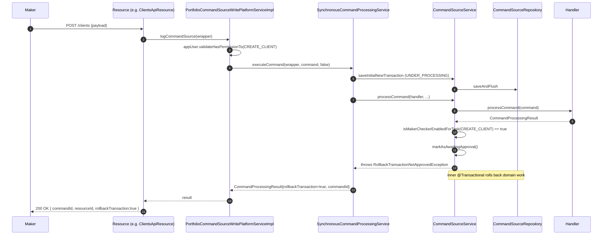
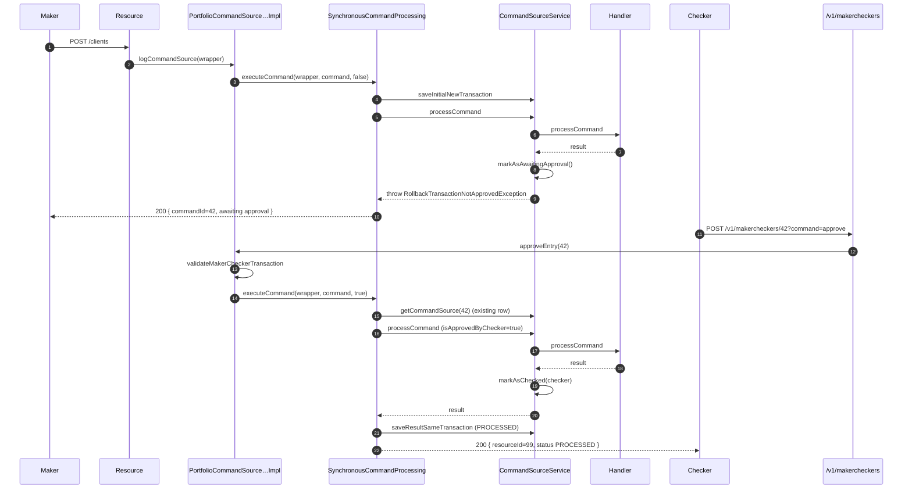

Maker-checker (a.k.a. *4-eye* control) is one of Apache Fineract's regulatory cornerstones. Once enabled for a permission, the framework forces every relevant write to be submitted by one user (**maker**), parked as `AWAITING_APPROVAL`, and reviewed by a different user (**checker**) before it is allowed to commit. The mechanism sits on top of the same `CommandSource` row that drives audit and idempotency — there is no parallel state.

This page walks through how maker-checker is detected at runtime, how the rollback flow keeps the audit row alive while discarding the handler's domain changes, how the `MakercheckersApiResource` exposes approve / reject / delete, and how `PortfolioCommandSourceWritePlatformServiceImpl` re-runs the command on approval.

## Source map

| Path                                                                                                          | Role                                                                                                       |
| ------------------------------------------------------------------------------------------------------------- | ---------------------------------------------------------------------------------------------------------- |
| `fineract-core/.../commands/service/CommandSourceService.java` — `processCommand`                             | Detects maker-checker and triggers `RollbackTransactionNotApprovedException`.                              |
| `fineract-core/.../commands/exception/RollbackTransactionNotApprovedException.java`                           | Signals the rollback while carrying the audit row's id back to the caller.                                 |
| `fineract-core/.../commands/service/PortfolioCommandSourceWritePlatformServiceImpl.java`                      | `logCommandSource`, `approveEntry`, `rejectEntry`, `deleteEntry`.                                          |
| `fineract-provider/.../commands/api/MakercheckersApiResource.java`                                            | REST endpoints `/v1/makercheckers`.                                                                        |
| `fineract-core/.../useradministration/domain/AppUser.java`                                                    | `validateHasPermissionTo`, `validateHasCheckerPermissionTo`, `isCheckerSuperUser`.                         |
| `fineract-core/.../commands/exception/CommandNotAwaitingApprovalException.java`                               | 404 thrown when the audit row is not in `AWAITING_APPROVAL`.                                               |
| `fineract-core/.../commands/exception/CommandNotFoundException.java`                                          | 404 thrown when the audit row id does not exist.                                                            |

## Permission model

Every command pair `(actionName, entityName)` produces three permission codes that all flow through `AppUser`:

| Permission              | Holder         | Used to …                                                                                     |
| ----------------------- | -------------- | --------------------------------------------------------------------------------------------- |
| `<ACTION>_<ENTITY>`     | Maker          | Submit the command in the first place via `AppUser.validateHasPermissionTo(...)`.            |
| `<ACTION>_<ENTITY>_CHECKER` | Checker     | Approve or reject the audit row via `AppUser.validateHasCheckerPermissionTo(...)`.            |
| `CHECKER_SUPER_USER`    | Super-user     | Bypass maker-checker entirely — the command is processed straight through without parking.   |

`AppUser` builds the checker permission name on the fly:

```java
public void validateHasCheckerPermissionTo(final String function) {
    final String checkerPermissionName = function.toUpperCase() + "_CHECKER";
    if (hasNotPermissionTo("CHECKER_SUPER_USER") && hasNotPermissionTo(checkerPermissionName)) {
        final String authorizationMessage = "User has no authority to be a checker for: " + function;
        throw new NoAuthorizationException(authorizationMessage);
    }
}

public boolean isCheckerSuperUser() {
    return hasPermissionTo("CHECKER_SUPER_USER");
}
```

Three quick interactions:

1. The maker calls a write endpoint. `PortfolioCommandSourceWritePlatformServiceImpl.logCommandSource` first calls `appUser.validateHasPermissionTo(wrapper.getTaskPermissionName())` — i.e. `<ACTION>_<ENTITY>`.
2. The checker calls `POST /v1/makercheckers/{id}?command=approve`. `validateMakerCheckerTransaction` calls `appUser.validateHasCheckerPermissionTo(permissionCode)`, deriving `<ACTION>_<ENTITY>_CHECKER` internally.
3. A super-user with `CHECKER_SUPER_USER` causes `processCommand` to skip the rollback entirely — `commandSource.markAsChecked(user)` runs in the same transaction.

## Detection inside `processCommand`

The detection happens inside `CommandSourceService.processCommand`, which is the inner transactional method invoked by `SynchronousCommandProcessingService.executeCommand`:

```java
@Transactional
public CommandProcessingResult processCommand(NewCommandSourceHandler handler, JsonCommand command, CommandSource commandSource,
        AppUser user, boolean isApprovedByChecker) {
    final CommandProcessingResult result = handler.processCommand(command);

    String permission = commandSource.getPermissionCode();
    boolean isMakerChecker = configurationDomainService.isMakerCheckerEnabledForTask(permission);
    if (isMakerChecker || result.isRollbackTransaction()) {
        if (isApprovedByChecker || user.isCheckerSuperUser()) {
            commandSource.markAsChecked(user);
        } else {
            if (commandSource.isSanitized()) {
                throw new GeneralPlatformDomainRuleException("error.msg.invalid.sanitization",
                        "Maker-checker command can not be sanitized, please change the permission configuration", permission);
            }
            commandSource.markAsAwaitingApproval();
            throw new RollbackTransactionNotApprovedException(commandSource.getId(), commandSource.getResourceId());
        }
    }
    return result;
}
```

Things to remember:

- **The handler runs first.** Validation errors and domain rule violations surface before maker-checker; the row only enters `AWAITING_APPROVAL` once we know the operation *would* succeed.
- **Sanitized payloads are illegal.** A command whose JSON has been masked by `sanitizeJson` cannot meaningfully be reviewed, so submitting one with maker-checker enabled errors out (`error.msg.invalid.sanitization`).
- **`result.isRollbackTransaction()` also triggers parking** — handlers can ask for the same flow even when maker-checker is not configured globally, e.g. when the handler detects a high-risk amount.
- **The throw is what rolls back domain work.** Spring's `@Transactional` interceptor rolls back the transaction on the unchecked `RollbackTransactionNotApprovedException`; only the audit row survives — and only because `saveInitialNewTransaction` wrote it in a separate `REQUIRES_NEW` transaction.

## `RollbackTransactionNotApprovedException`

```java
public class RollbackTransactionNotApprovedException extends RuntimeException {

    private final CommandProcessingResult result;

    public RollbackTransactionNotApprovedException(Long commandId, Long entityId) {
        this.result = new CommandProcessingResultBuilder().withCommandId(commandId).withEntityId(entityId).setRollbackTransaction(true)
                .build();
    }

    public CommandProcessingResult getResult() {
        return result;
    }
}
```

The exception carries a `CommandProcessingResult` containing only the new `commandId` and the targeted `entityId`. The global exception mapper unwraps it into a 200 response that signals "submitted, pending approval"; the audit row's `id` is the handle the checker will use later.

## Maker submission flow



The audit row now sits in `AWAITING_APPROVAL` waiting for a checker, while the would-be client is *not* in `m_client`.

## Checker REST API — `MakercheckersApiResource`

`@Path("/v1/makercheckers")` exposes four operations:

| Method | Path                           | Operation                                                                         | Service call                                |
| ------ | ------------------------------ | --------------------------------------------------------------------------------- | ------------------------------------------- |
| `GET`  | `/v1/makercheckers`            | List entries the requestor can check (scoped by office and `<ACTION>_<ENTITY>_CHECKER`). | `AuditReadPlatformService.retrieveAllEntriesToBeChecked` |
| `GET`  | `/v1/makercheckers/searchtemplate` | Build a Checker Inbox UI (data-scoped `appUsers`, allowed `actionNames`, `entityNames`). | `AuditReadPlatformService.retrieveSearchTemplate("makerchecker")` |
| `POST` | `/v1/makercheckers/{auditId}?command=approve` | Approve the entry — re-runs the handler with `isApprovedByChecker = true`. | `PortfolioCommandSourceWritePlatformService.approveEntry` |
| `POST` | `/v1/makercheckers/{auditId}?command=reject`  | Reject the entry — marks the row `REJECTED`.                              | `PortfolioCommandSourceWritePlatformService.rejectEntry` |
| `DELETE` | `/v1/makercheckers/{auditId}` | Hard delete the row (typically used to discard a no-longer-needed pending entry). | `PortfolioCommandSourceWritePlatformService.deleteEntry` |

The dispatch logic for approve/reject is straightforward:

```java
@POST
@Path("{auditId}")
public CommandProcessingResult approveMakerCheckerEntry(@PathParam("auditId") final Long auditId,
        @QueryParam("command") final String commandParam) {

    CommandProcessingResult result = null;
    if (is(commandParam, COMMAND_APPROVE)) {
        result = writePlatformService.approveEntry(auditId);
    } else if (is(commandParam, COMMAND_REJECT)) {
        final Long id = writePlatformService.rejectEntry(auditId);
        result = CommandProcessingResult.commandOnlyResult(id);
    } else {
        throw new UnrecognizedQueryParamException("command", commandParam);
    }
    return result;
}
```

`COMMAND_APPROVE = "approve"` and `COMMAND_REJECT = "reject"`. Anything else triggers a `UnrecognizedQueryParamException` (HTTP 400).

## `validateMakerCheckerTransaction`

Both `approveEntry` and `rejectEntry` route through the same guard:

```java
private CommandSource validateMakerCheckerTransaction(final Long makerCheckerId) {
    final CommandSource commandSource = this.commandSourceRepository.findById(makerCheckerId)
            .orElseThrow(() -> new CommandNotFoundException(makerCheckerId));
    if (!commandSource.isAwaitingApproval()) {
        throw new CommandNotAwaitingApprovalException(makerCheckerId);
    }
    AppUser appUser = this.context.authenticatedUser();
    String permissionCode = commandSource.getPermissionCode();
    appUser.validateHasCheckerPermissionTo(permissionCode);
    if (!configurationService.isSameMakerCheckerEnabled() && !appUser.isCheckerSuperUser()) {
        AppUser maker = commandSource.getMaker();
        if (maker == null) {
            throw new UnsupportedCommandException(permissionCode, "Maker user is missing.");
        }
        if (Objects.equals(appUser.getId(), maker.getId())) {
            throw new UnsupportedCommandException(permissionCode, "Can not be checked by the same user.");
        }
    }
    return commandSource;
}
```

The rules enforced:

| Guard                                              | Failure mode                                                                                                                                                  |
| -------------------------------------------------- | ------------------------------------------------------------------------------------------------------------------------------------------------------------- |
| Row exists                                         | `CommandNotFoundException` → 404 `error.msg.command.id.invalid`.                                                                                              |
| Row is in `AWAITING_APPROVAL`                      | `CommandNotAwaitingApprovalException` → 404 `error.msg.command.id.not.awaiting.approval`. Prevents re-approving an already-processed row.                     |
| Caller holds `<ACTION>_<ENTITY>_CHECKER` or `CHECKER_SUPER_USER` | `NoAuthorizationException` from `validateHasCheckerPermissionTo`.                                                                          |
| Same-user check                                    | When `fineract.configuration.same.maker.checker.enabled = false` (default), the maker cannot also be the checker — `UnsupportedCommandException("Can not be checked by the same user.")`. `CHECKER_SUPER_USER` bypasses this. |
| Maker user known                                   | `UnsupportedCommandException("Maker user is missing.")` — defensive check for orphaned rows.                                                                  |

## `approveEntry` — re-running the command

```java
@Override
public CommandProcessingResult approveEntry(final Long makerCheckerId) {
    final CommandSource commandSourceInput = validateMakerCheckerTransaction(makerCheckerId);
    validateIsUpdateAllowed();

    final CommandWrapper wrapper = CommandWrapper.fromExistingCommand(makerCheckerId, commandSourceInput.getActionName(),
            commandSourceInput.getEntityName(), commandSourceInput.getResourceId(), commandSourceInput.getSubResourceId(),
            commandSourceInput.getResourceGetUrl(), commandSourceInput.getProductId(), commandSourceInput.getOfficeId(),
            commandSourceInput.getGroupId(), commandSourceInput.getClientId(), commandSourceInput.getLoanId(),
            commandSourceInput.getSavingsId(), commandSourceInput.getTransactionId(), commandSourceInput.getCreditBureauId(),
            commandSourceInput.getOrganisationCreditBureauId(), commandSourceInput.getIdempotencyKey(),
            commandSourceInput.getLoanExternalId());
    final JsonElement parsedCommand = this.fromApiJsonHelper.parse(commandSourceInput.getCommandAsJson());
    final JsonCommand command = JsonCommand.fromExistingCommand(makerCheckerId, commandSourceInput.getCommandAsJson(), parsedCommand,
            this.fromApiJsonHelper, commandSourceInput.getEntityName(), commandSourceInput.getResourceId(),
            commandSourceInput.getSubResourceId(), commandSourceInput.getGroupId(), commandSourceInput.getClientId(),
            commandSourceInput.getLoanId(), commandSourceInput.getSavingsId(), commandSourceInput.getTransactionId(),
            commandSourceInput.getResourceGetUrl(), commandSourceInput.getProductId(), commandSourceInput.getCreditBureauId(),
            commandSourceInput.getOrganisationCreditBureauId(), commandSourceInput.getJobName(),
            commandSourceInput.getLoanExternalId());

    return this.processAndLogCommandService.executeCommand(wrapper, command, true);
}
```

Key details:

- The wrapper is rebuilt with `CommandWrapper.fromExistingCommand(...)`, threading the original `makerCheckerId` as `commandId` so `SynchronousCommandProcessingService.executeCommand` reloads the same row instead of inserting a new one.
- The original `idempotencyKey` is preserved — the rerun is idempotent against the original submission's key.
- The third argument to `executeCommand` is `isApprovedByChecker = true`, telling `CommandSourceService.processCommand` to call `markAsChecked(user)` instead of throwing.
- `validateIsUpdateAllowed()` delegates to `SchedulerJobRunnerReadService.isUpdatesAllowed()` — when batch jobs are mid-flight, updates are blocked.

## `rejectEntry`

```java
@Override
public Long rejectEntry(final Long makerCheckerId) {
    final CommandSource commandSourceInput = validateMakerCheckerTransaction(makerCheckerId);
    validateIsUpdateAllowed();
    final AppUser maker = this.context.authenticatedUser();
    commandSourceInput.markAsRejected(maker);
    this.commandSourceRepository.save(commandSourceInput);
    if (cleanupServices != null) {
        for (CleanupService cleanupService : cleanupServices) {
            cleanupService.cleanup(commandSourceInput);
        }
    }
    return makerCheckerId;
}
```

- `markAsRejected(checker)` sets `checker`, `checkedOnDate`, and `status = REJECTED`.
- A list of `CleanupService` beans is invoked so other modules can react to rejection (e.g. clean up tentative data inserted by the original handler that survived the rollback).
- Returns the audit id; `MakercheckersApiResource` wraps it into `CommandProcessingResult.commandOnlyResult(id)`.

## `deleteEntry`

```java
@Transactional
@Override
public Long deleteEntry(final Long makerCheckerId) {

    validateMakerCheckerTransaction(makerCheckerId);
    validateIsUpdateAllowed();

    this.commandSourceRepository.deleteById(makerCheckerId);

    return makerCheckerId;
}
```

Delete bypasses `markAsRejected` — the row is physically removed. Use case: a maker who realises the command was a mistake before any checker reviews it (and has the right permissions to clean it up).

## End-to-end maker → checker flow



Alternative branches:

- `command=reject` → `markAsRejected(checker)` + cleanup hooks.
- `DELETE /v1/makercheckers/42` → row removed.

## Configuration flags

| Property                                                                            | Effect                                                                                                  |
| ----------------------------------------------------------------------------------- | ------------------------------------------------------------------------------------------------------- |
| `ConfigurationDomainService.isMakerCheckerEnabledForTask(permissionCode)`           | Per-permission switch in `c_configuration` / `c_external_service_properties`. Enabling a task is what causes `processCommand` to take the approval branch. |
| `ConfigurationDomainService.isSameMakerCheckerEnabled()`                            | When `true`, allows a maker to also approve their own command. Default `false`.                          |
| Role permissions: `<ACTION>_<ENTITY>`, `<ACTION>_<ENTITY>_CHECKER`, `CHECKER_SUPER_USER` | Standard `m_permission` / `m_role_permission` rows.                                                  |

## Edge cases

<AccordionGroup>
  <Accordion title="Super-user submitting their own command">
    `validateMakerCheckerTransaction` skips the same-user guard when `isCheckerSuperUser()` is true. Combined with `processCommand`'s `user.isCheckerSuperUser()` early exit, this user is effectively bypassing 4-eye control on every endpoint — reserve the permission for emergency operators.
  </Accordion>
  <Accordion title="Handler asks for rollback unilaterally">
    A handler may set `result.setRollbackTransaction(true)` based on its own risk rules (e.g. transaction amount > threshold). `processCommand` then takes the approval branch even when `isMakerCheckerEnabledForTask` returns `false`. The next checker must still hold `<ACTION>_<ENTITY>_CHECKER`.
  </Accordion>
  <Accordion title="Maker-checker for a sanitized command">
    Submitting a `USER` `CREATE` (which sanitizes `password`/`repeatPassword`) while maker-checker is enabled for `CREATE_USER` throws `GeneralPlatformDomainRuleException("error.msg.invalid.sanitization", …)`. Either disable maker-checker for that task or remove the sanitization keys.
  </Accordion>
  <Accordion title="Re-running an approved command after data drift">
    Between submission and approval, the underlying data can change (e.g. account closed). The handler is re-invoked from scratch on approval and may now fail — Fineract surfaces the new error and the row transitions to `ERROR` rather than `PROCESSED`. The maker must resubmit with a fresh key.
  </Accordion>
</AccordionGroup>

## Cross references

<CardGroup cols={2}>
  <Card title="Command framework overview" icon="layer-group" href="/command/overview">Module-level map.</Card>
  <Card title="CommandSource" icon="database" href="/command/command-source">`AWAITING_APPROVAL`, `markAsChecked`, `markAsRejected`.</Card>
  <Card title="Synchronous command processing" icon="forward" href="/command/synchronous-command-processing">The `processCommand` call that triggers approval parking.</Card>
  <Card title="Idempotency" icon="rotate" href="/command/idempotency">Why the original idempotency key is reused on `approveEntry`.</Card>
  <Card title="Audit trail" icon="clipboard-list" href="/command/audit-trail">Listing already-processed rows from the same store.</Card>
  <Card title="Command execution flow" icon="diagram-project" href="/flows/command-execution-flow">End-to-end request flow.</Card>
  <Card title="Maker-checker flow" icon="diagram-project" href="/flows/maker-checker-flow">Detailed visual companion to this page.</Card>
  <Card title="Security overview" icon="shield" href="/security/overview">`AppUser`, permissions, `PlatformSecurityContext`.</Card>
  <Card title="Batch API" icon="layer-group" href="/batch-api/overview">Maker-checker behaviour inside batches.</Card>
</CardGroup>
