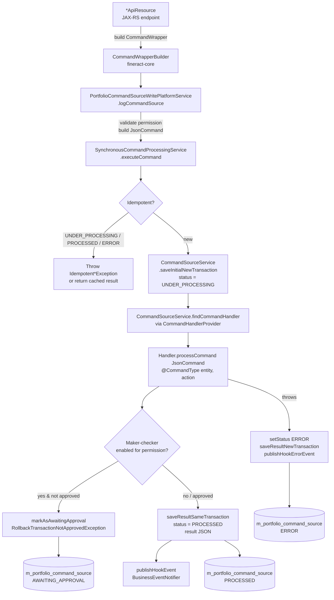

Apache Fineract treats every state-changing API call as a **command**: a serialized intent that is wrapped, persisted, dispatched to a strongly-typed handler, and recorded as an audit row in `m_portfolio_command_source`. Two cooperating Gradle modules implement this CQRS-style write path. The `commands` package inside [`fineract-core`](https://github.com/apache/fineract/tree/develop/fineract-core/src/main/java/org/apache/fineract/commands) hosts the production framework that every `*ApiResource` calls through `PortfolioCommandSourceWritePlatformService`. The newer [`fineract-command`](https://github.com/apache/fineract/tree/develop/fineract-command) module ships a Spring Boot starter with a generic `Command<T>` pipeline, router, auditor, and Disruptor/sync/async executors aimed at being the next-generation replacement.

This page is the entry point for both. It maps each file you will touch when adding a new write endpoint, when debugging an idempotent retry, or when triaging a maker-checker rejection. Deep dives for `CommandSource`, the synchronous processor, idempotency, maker-checker, the handler registry, and the audit/maker-checker REST APIs follow in their own pages.

## What the framework gives you

<CardGroup cols={2}>
  <Card title="Uniform write path" icon="layer-group">
    Every `POST` / `PUT` / `DELETE` goes through `CommandWrapperBuilder` → `PortfolioCommandSourceWritePlatformService.logCommandSource` → `SynchronousCommandProcessingService.executeCommand` → a `@CommandType`-annotated handler.
  </Card>
  <Card title="Persistent audit row" icon="database">
    `CommandSource` (table `m_portfolio_command_source`) stores actionName, entityName, request JSON, maker, checker, status, idempotency key, IP, and result for every write — read back via `/v1/audits`.
  </Card>
  <Card title="Idempotency" icon="key">
    `IdempotencyKeyResolver` picks an `Idempotency-Key` from the HTTP header, the request context, or generates a UUID. A unique index on `(action_name, entity_name, idempotency_key)` blocks duplicates.
  </Card>
  <Card title="Maker-checker (4-eye)" icon="user-shield">
    When a permission is configured for maker-checker, the handler runs in a rollback-marked transaction and the row is parked as `AWAITING_APPROVAL` for a second user to approve or reject via `/v1/makercheckers/{id}`.
  </Card>
</CardGroup>

## End-to-end command flow



The orchestrator is [`SynchronousCommandProcessingService.executeCommand`](https://github.com/apache/fineract/blob/develop/fineract-core/src/main/java/org/apache/fineract/commands/service/SynchronousCommandProcessingService.java). It wraps everything in a Resilience4j retry, resolves the idempotency key, persists an `UNDER_PROCESSING` row, calls `CommandSourceService.findCommandHandler` (delegating to [`CommandHandlerProvider`](https://github.com/apache/fineract/blob/develop/fineract-core/src/main/java/org/apache/fineract/commands/provider/CommandHandlerProvider.java) for the `entity|action` lookup), invokes `handler.processCommand(JsonCommand)`, then writes the result back in either the same transaction or a new one depending on whether the request is part of a Batch API enclosing transaction.

See [/flows/command-execution-flow](/flows/command-execution-flow) for the sequence diagram, [/flows/maker-checker-flow](/flows/maker-checker-flow) for the approval cycle, and [/core/commands-framework](/core/commands-framework) for how the framework slots into `fineract-core`.

## Two modules, two layers

| Module | Status | Role |
| --- | --- | --- |
| `fineract-core/commands/` | Production. Every write API uses it. | Persistent `CommandSource`, idempotency, maker-checker, audit trail, Resilience4j retry, hook publishing. |
| `fineract-command/` | New, opt-in via `fineract.command.executor` property. | Generic `Command<T>` pipeline, `CommandRouter`, `CommandAuditor`, sync / async / Disruptor executors, JDBC `m_command` audit, dead-letter queue. |

The production write path uses `fineract-core/commands/` exclusively. `fineract-command/` is a Spring Boot starter (`CommandAutoConfiguration`) that today is enabled only in its own sample tests (`DummyApiController`, `DummyCommandHandler`) but is designed to eventually subsume the role of the older framework. Both share the same conceptual vocabulary — command, handler, idempotency key, processed / awaiting-approval / rejected / error states — so understanding one transfers to the other.

## fineract-command file inventory

The `fineract-command` Gradle module is laid out as four packages: `core`, `core.exception`, `implementation`, `persistence` (with `converter`, `domain`, `mapping`), and `starter`. Each class is single-purpose and short.

| File | Package | Role |
| --- | --- | --- |
| `Command.java` | `command.core` | Generic command envelope: `commandId`, `idempotencyKey`, `ipAddress`, `createdAt/updatedAt/executedAt`, `initiatedByUsername`, `error`, generic `payload`. |
| `CommandHandler.java` | `command.core` | `RES handle(Command<REQ>)` + `fallback` + default `matches(...)` using `TypeToken` to pick the right handler by payload type. |
| `CommandPipeline.java` | `command.core` | `Supplier<RES> send(Command<REQ>)` — top-level entry point for invoking a command. |
| `CommandExecutor.java` | `command.core` | `Supplier<RES> execute(Command<REQ>)` — selected by `fineract.command.executor` (sync / async / disruptor). |
| `CommandRouter.java` | `command.core` | `CommandHandler<REQ,RES> route(Command<REQ>)` — picks a handler bean. |
| `CommandAuditor.java` | `command.core` | Hooks `processing` / `processed` / `error`, plus `getResponseByIdempotencyKey` for replay. |
| `CommandConstants.java` | `command.core` | `@class` JSON discriminator, request-id / tenant / IP header names. |
| `CommandProperties.java` | `command.core` | `@ConfigurationProperties("fineract.command")`: `enabled`, `executor`, `ringBufferSize`, `producerType`, `auditable`, `fileDeadLetterQueueEnabled`, `fileDeadLetterQueuePath`, `idemPotencyKeyHeaderName` (defaults to `Idempotency-Key`). |
| `CommandHandlerNotFoundException.java` | `command.core.exception` | Thrown by `DefaultCommandRouter` when no handler matches. |
| `CommandIllegalArgumentException.java` | `command.core.exception` | Generic validation failure carrying the failing command. |
| `BaseCommandPipeline.java` | `command.implementation` | Pulls IP header (`IP`), idempotency-key header, `SecurityContextHolder` username into the `Command<?>` before executor runs. |
| `DefaultCommandPipeline.java` | `command.implementation` | The wired-up `CommandPipeline` bean (active when `CommandPipeline` is on the context). |
| `BaseCommandExecutor.java` | `command.implementation` | Stores the shared `CommandRouter` + `CommandAuditor` for all executor flavors. |
| `SynchronousCommandExecutor.java` | `command.implementation` | Default executor (`fineract.command.executor=sync`); audits processing → handle → processed/error inline. |
| `AsynchronousCommandExecutor.java` | `command.implementation` | `CompletableFuture.supplyAsync` plus a 3s `get` timeout. Marked TODO / not enabled. |
| `DisruptorCommandExecutor.java` | `command.implementation` | LMAX Disruptor ring buffer (`CommandEvent`) for high-throughput dispatch. Also gated TODO. |
| `DefaultCommandRouter.java` | `command.implementation` | Iterates registered `CommandHandler` beans, picks the first whose `matches(command)` returns true. |
| `DefaultCommandAuditor.java` | `command.implementation` | Persists `CommandEntity` rows in `m_command` with state transitions (`UNDER_PROCESSING` → `PROCESSED` / `ERROR`), `@Retry`-protected, optional file dead-letter queue. |
| `CommandEntity.java` | `command.persistence.domain` | Spring Data JDBC `@Table("m_command")` — `idempotencyKey`, `state`, `error`, `ipAddress`, `request` JSON, `response` JSON. |
| `CommandEntityState.java` | `command.persistence.domain` | `INVALID, PROCESSED, AWAITING_APPROVAL, REJECTED, UNDER_PROCESSING, ERROR`. |
| `CommandRepository.java` | `command.persistence.domain` | `ListCrudRepository<CommandEntity, Long>` + `findOneByIdempotencyKey`. |
| `CommandJsonMapper.java` | `command.persistence.mapping` | Adds the `@class` discriminator into the persisted JSON so the auditor can rehydrate the original payload type on idempotent replay. |
| `CommandMapper.java` | `command.persistence.mapping` | MapStruct mapper between `Command<?>` and `CommandEntity` (both directions). |
| `JsonNodeReadingConverter.java` | `command.persistence.converter` | Spring Data JDBC `String` → Jackson `JsonNode`. |
| `JsonNodeWritingConverter.java` | `command.persistence.converter` | Jackson `JsonNode` → `String` for column storage. |
| `CommandAutoConfiguration.java` | `command.starter` | Spring Boot `@AutoConfiguration` importing `CommandConfiguration` + `CommandPersistenceConfiguration`. |
| `CommandConfiguration.java` | `command.starter` | `@EnableConfigurationProperties(CommandProperties.class)` plus a Disruptor bean factory wired only when `fineract.command.executor=disruptor`. |
| `CommandPersistenceConfiguration.java` | `command.starter` | `@EnableJdbcRepositories` + `JdbcCustomConversions` to register the JSON converters. |

## fineract-core/commands file inventory

| File | Role |
| --- | --- |
| [`annotation/CommandType.java`](https://github.com/apache/fineract/blob/develop/fineract-core/src/main/java/org/apache/fineract/commands/annotation/CommandType.java) | `@CommandType(entity="CLIENT", action="CREATE")` — registers a `NewCommandSourceHandler` bean with the `CommandHandlerProvider`. |
| `configuration/RetryConfigurationAssembler.java` | Builds Resilience4j `Retry` instances for `executeCommand`, batch retry, and command result persistence; threads `LAST_EXECUTION_EXCEPTION` through the request context. |
| `domain/CommandSource.java` | JPA `@Entity` for `m_portfolio_command_source` (see [command-source](/command/command-source)). |
| `domain/CommandSourceRepository.java` | `JpaRepository` + `findByActionNameAndEntityNameAndIdempotencyKey` + purge query for the `PURGE_PROCESSED_COMMANDS` job. |
| `domain/CommandWrapper.java` | Immutable bundle the API layer builds via `CommandWrapperBuilder`; carries `actionName`, `entityName`, ids, `href`, `json`, `idempotencyKey`, sanitize keys. |
| `domain/CommandProcessingResultType.java` | `INVALID(0), PROCESSED(1), AWAITING_APPROVAL(2), REJECTED(3), UNDER_PROCESSING(4), ERROR(5)`. |
| `exception/*.java` | `CommandNotFoundException`, `CommandNotAwaitingApprovalException`, `RollbackTransactionNotApprovedException`, `UnsupportedCommandException`, `CommandResultPersistenceException`. |
| `handler/NewCommandSourceHandler.java` | The handler SPI: `CommandProcessingResult processCommand(JsonCommand command)`. |
| `jobs/PurgeProcessedCommandsTasklet.java` | Spring Batch tasklet that deletes `PROCESSED` rows older than `configurationDomainService.retrieveProcessedCommandsPurgeDaysCriteria()` days. |
| `jobs/PurgeProcessedCommandsConfig.java` | Wires the `PURGE_PROCESSED_COMMANDS` job. |
| `provider/CommandHandlerProvider.java` | Scans `@CommandType` beans at startup; `getHandler(entity, action)` returns the matching `NewCommandSourceHandler`. |
| `service/CommandWrapperBuilder.java` | Fluent builder (3,700+ LOC) with one method per write operation in Fineract — e.g. `createClient()`, `disburseLoanApplication(loanId)`. |
| `service/CommandProcessingService.java` | Interface implemented by `SynchronousCommandProcessingService`. |
| `service/SynchronousCommandProcessingService.java` | The execution orchestrator — see [synchronous-command-processing](/command/synchronous-command-processing). |
| `service/CommandSourceService.java` | Two-phase persistence: `saveInitial*` + `saveResult*` in `REQUIRED` / `REQUIRES_NEW` variants, sanitize JSON, `processCommand` decides maker-checker. |
| `service/IdempotencyKeyGenerator.java` | `UUID.randomUUID().toString()`. |
| `service/IdempotencyKeyResolver.java` | Resolves the key from `CommandWrapper.idempotencyKey`, the request attribute set by the filter, or generates a fresh one. |
| `service/PortfolioCommandSourceWritePlatformService.java` | The interface used by every `*ApiResource`: `logCommandSource`, `approveEntry`, `rejectEntry`, `deleteEntry`. |
| `service/PortfolioCommandSourceWritePlatformServiceImpl.java` | Validates permission, parses JSON, builds `JsonCommand`, calls `executeCommand`. Also handles approve / reject / delete of `AWAITING_APPROVAL` rows. |

## A representative call site

The simplest write — creating a client — flows like this. `ClientsApiResource` builds a `CommandWrapper` and hands it to the write platform service:

```java
final CommandWrapper commandRequest = new CommandWrapperBuilder()
        .createClient()
        .withJson(apiRequestBodyAsJson)
        .build();
final CommandProcessingResult result =
        this.commandsSourceWritePlatformService.logCommandSource(commandRequest);
return this.toApiJsonSerializer.serialize(result);
```

`logCommandSource` validates the permission (`CREATE_CLIENT`), builds a `JsonCommand`, and calls `SynchronousCommandProcessingService.executeCommand`. The dispatcher resolves an idempotency key, persists an `UNDER_PROCESSING` row, looks up the `@CommandType(entity="CLIENT", action="CREATE")` handler via `CommandHandlerProvider`, and calls:

```java
@Service
@CommandType(entity = "CLIENT", action = "CREATE")
public class CreateClientCommandHandler implements NewCommandSourceHandler {

    private final ClientWritePlatformService clientWritePlatformService;

    @Transactional
    @Override
    public CommandProcessingResult processCommand(final JsonCommand command) {
        return this.clientWritePlatformService.createClient(command);
    }
}
```

The result is persisted back onto the same `CommandSource` row with `status = PROCESSED` and `result` set to the serialized JSON, and a `HookEvent` is published.

## Handler population across the codebase

Handlers are auto-discovered by Spring scanning every Gradle module. Counts give a sense of where the business logic lives:

| Module | `*CommandHandler.java` count |
| --- | --- |
| `fineract-accounting` | 12 |
| `fineract-branch` | 10 |
| `fineract-charge` | 3 |
| `fineract-command` | 3 (sample only) |
| `fineract-core` | 5 |
| `fineract-document` | 5 |
| `fineract-loan` | 74 |
| `fineract-loan-origination` | 5 |
| `fineract-mix` | 1 |
| `fineract-progressive-loan` | 4 |
| `fineract-provider` | 309 |
| `fineract-rates` | 2 |
| `fineract-security` | 2 |
| `fineract-tax` | 4 |
| `fineract-working-capital-loan` | 9 |

The bulk lives in `fineract-provider` (every legacy domain) and `fineract-loan` (loan account lifecycle). See [command-handler-registry](/command/command-handler-registry) for the lookup mechanics and representative examples per resource.

## Cross-cutting features

<AccordionGroup>
  <Accordion title="Resilience4j retries">
    Driven by `RetryConfigurationAssembler`. Two retry registries: `executeCommand` (covers idempotent retries when configured exceptions bubble up) and `commandResultPersistence` (re-saves the command source result row on transient DB failures). The Batch API path uses a separate `batchRetry` instance that unwraps `BatchExecutionException`.
  </Accordion>
  <Accordion title="Hook events">
    On success and on error, `SynchronousCommandProcessingService.publishHookEvent` serializes `{entityName, actionName, request, response, createdBy, ...}` and publishes a Spring `HookEvent` so configured `Hook` rows (webhook / template-based) can fire. See [Hooks](/extensions/hooks).
  </Accordion>
  <Accordion title="Sanitization">
    `CommandWrapperBuilder` lets API resources flag keys (e.g. `password`, `repeatPassword`) to mask before persisting. `CommandSourceService.sanitizeJson` replaces values with `***` (or wipes the JSON if `SANITIZE_ALL` is requested). A sanitized command cannot use maker-checker — `GeneralPlatformDomainRuleException` is thrown if both are configured.
  </Accordion>
  <Accordion title="Audit purge job">
    `PURGE_PROCESSED_COMMANDS` (Spring Batch tasklet) deletes `PROCESSED` rows older than the configured threshold via `CommandSourceRepository.deleteOlderEventsWithStatus(...)`. Schedule via `JobName.PURGE_PROCESSED_COMMANDS`.
  </Accordion>
  <Accordion title="Batch API integration">
    When the request is part of an enclosing batch transaction (`BatchRequestContextHolder.isEnclosingTransaction()`), `executeCommand` uses `saveInitialSameTransaction` / `saveResultSameTransaction` (`Propagation.REQUIRED`) so the whole batch can be rolled back atomically. Outside of batch, both calls use `REQUIRES_NEW`.
  </Accordion>
</AccordionGroup>

## Where to go next

<CardGroup cols={3}>
  <Card title="CommandSource entity" icon="table" href="/command/command-source">
    Every column of `m_portfolio_command_source`, plus the lifecycle state machine.
  </Card>
  <Card title="Synchronous processing" icon="play" href="/command/synchronous-command-processing">
    Line-by-line walk-through of `SynchronousCommandProcessingService.executeCommand`.
  </Card>
  <Card title="Idempotency" icon="key" href="/command/idempotency">
    How the `Idempotency-Key` header is resolved, stored, and used to short-circuit replays.
  </Card>
  <Card title="Maker-checker" icon="user-shield" href="/command/maker-checker">
    `*_CHECKER_` permissions, parking commands as `AWAITING_APPROVAL`, the `/v1/makercheckers` API.
  </Card>
  <Card title="Handler registry" icon="plug" href="/command/command-handler-registry">
    `@CommandType`, `CommandHandlerProvider`, and the sample handlers per major resource.
  </Card>
  <Card title="Audit trail" icon="file-magnifying-glass" href="/command/audit-trail">
    `/v1/audits` filters, `AuditData` shape, and the `CommandSource` → audit row mapping.
  </Card>
</CardGroup>

For the broader execution sequence see [/flows/command-execution-flow](/flows/command-execution-flow); for the approve/reject cycle see [/flows/maker-checker-flow](/flows/maker-checker-flow); for security context and permission resolution see [/security/overview](/security/overview).
