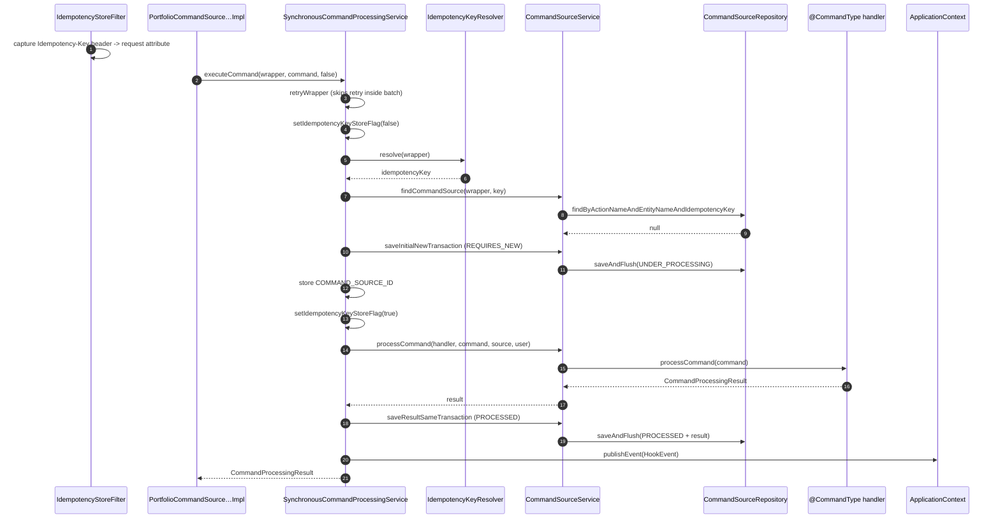

`SynchronousCommandProcessingService` is the engine that turns every Apache Fineract write into a row in `m_portfolio_command_source` and a call to a `@CommandType` handler. Every REST endpoint that mutates state eventually funnels through `executeCommand(wrapper, command, isApprovedByChecker)`. This page reads the source method-by-method so you can debug retries, idempotency races, batch-mode transactions, hook publishing, and error mapping with confidence.

Source: `fineract-core/src/main/java/org/apache/fineract/commands/service/SynchronousCommandProcessingService.java`.

## Where the entry point is called

`PortfolioCommandSourceWritePlatformServiceImpl` is the only production caller of `executeCommand`. It is invoked from three places:

| Caller                                                     | Use case                                                                                                     |
| ---------------------------------------------------------- | ------------------------------------------------------------------------------------------------------------ |
| `logCommandSource(wrapper)`                                | Every `*ApiResource` that builds a `CommandWrapper` with `CommandWrapperBuilder` and submits it as a maker.  |
| `approveEntry(makerCheckerId)`                             | `POST /v1/makercheckers/{id}?command=approve` — checker re-runs an existing command with `isApprovedByChecker = true`. |
| Batch sub-requests                                         | The [Batch API](/batch-api/overview) wraps each child request as a `CommandWrapper` and executes it inside the enclosing transaction. |

## Field map

```java
public static final String IDEMPOTENCY_KEY_STORE_FLAG = "idempotencyKeyStoreFlag";
public static final String IDEMPOTENCY_KEY_ATTRIBUTE   = "IdempotencyKeyAttribute";
public static final String COMMAND_SOURCE_ID           = "commandSourceId";

private final PlatformSecurityContext           context;
private final ApplicationContext                applicationContext;
private final ToApiJsonSerializer<Map<String,Object>> toApiJsonSerializer;
private final ToApiJsonSerializer<CommandProcessingResult> toApiResultJsonSerializer;
private final ConfigurationDomainService        configurationDomainService;
private final CommandHandlerProvider            commandHandlerProvider;
private final IdempotencyKeyResolver            idempotencyKeyResolver;
private final CommandSourceService              commandSourceService;
private final RetryConfigurationAssembler       retryConfigurationAssembler;
private final FineractRequestContextHolder      fineractRequestContextHolder;
```

| Constant                       | Purpose                                                                                                                                |
| ------------------------------ | -------------------------------------------------------------------------------------------------------------------------------------- |
| `IDEMPOTENCY_KEY_STORE_FLAG`   | Request attribute consulted by `IdempotencyStoreFilter` to decide whether to write the response body back into `CommandSource.result`. |
| `IDEMPOTENCY_KEY_ATTRIBUTE`    | Request attribute the `IdempotencyStoreFilter` sets when an `Idempotency-Key` HTTP header is present.                                   |
| `COMMAND_SOURCE_ID`            | Request attribute holding the persisted `CommandSource.id`. Drives retry detection and the idempotency replay filter.                  |

## Top-level retry wrapper

```java
private CommandProcessingResult retryWrapper(Supplier<CommandProcessingResult> supplier) {
    try {
        if (!BatchRequestContextHolder.isEnclosingTransaction()) {
            return retryConfigurationAssembler.getRetryConfigurationForExecuteCommand().executeSupplier(supplier);
        }
        return supplier.get();
    } catch (RuntimeException e) {
        return fallbackExecuteCommand(e);
    }
}
```

Two facts to internalise:

1. **Retry is only applied to non-batch calls.** When `BatchRequestContextHolder.isEnclosingTransaction()` is `true` (`POST /v1/batches?enclosingTransaction=true`), the supplier is called directly so a retry cannot leave the enclosing batch transaction in a half-committed state — the batch driver owns retries via `getRetryConfigurationForBatchApiWithEnclosingTransaction`.
2. **Anything escaping is mapped.** `fallbackExecuteCommand` simply re-throws via `ErrorHandler.getMappable(e)`, which converts third-party exceptions into Fineract's `PlatformException` hierarchy.

The retry configuration comes from `RetryConfigurationAssembler.getRetryConfigurationForExecuteCommand()` which reads `fineract.retry.instances.executeCommand.*` properties (max attempts, wait duration, exponential backoff, retry exceptions). Each retry attempt also stores the last seen exception class in the request context (`LAST_EXECUTION_EXCEPTION_KEY`), consulted later by `exceptionWhenTheRequestAlreadyProcessed` to decide whether to throw `IdempotentCommandProcessUnderProcessingException` again.

## `executeCommand` — line-by-line

```java
@Override
public CommandProcessingResult executeCommand(final CommandWrapper wrapper, final JsonCommand command,
        final boolean isApprovedByChecker) {
    return retryWrapper(() -> {
        // Do not store the idempotency key because of the exception handling
        setIdempotencyKeyStoreFlag(false);
```

The store-flag is flipped off **before** the work starts. While `false`, `IdempotencyStoreFilter` will not write the response body back into the `CommandSource` row even if the call ultimately errors. The flag is set back to `true` later — only when we have a valid persistent row to write to.

```java
        Long commandId = (Long) fineractRequestContextHolder.getAttribute(COMMAND_SOURCE_ID, null);
        boolean isRetry = commandId != null;
        boolean isEnclosingTransaction = BatchRequestContextHolder.isEnclosingTransaction();
```

| Variable                  | Meaning                                                                                                            |
| ------------------------- | ------------------------------------------------------------------------------------------------------------------ |
| `commandId`               | `m_portfolio_command_source.id` of a row we already created in an earlier attempt; non-null on a Resilience4j retry. |
| `isRetry`                 | `true` ⇔ `commandId` was already present in the request context.                                                   |
| `isEnclosingTransaction`  | `true` ⇔ we are inside a Batch API enclosing transaction.                                                          |

```java
        CommandSource commandSource = null;
        String idempotencyKey;
        if (isRetry) {
            commandSource = commandSourceService.getCommandSource(commandId);
            idempotencyKey = commandSource.getIdempotencyKey();
        } else if ((commandId = command.commandId()) != null) { // action on the command itself
            commandSource = commandSourceService.getCommandSource(commandId);
            idempotencyKey = commandSource.getIdempotencyKey();
        } else {
            idempotencyKey = idempotencyKeyResolver.resolve(wrapper);
        }
```

Three branches choose the idempotency key:

1. **Retry path** — reload the existing row by id and reuse its key.
2. **Existing-command path** — when the caller is acting on a previously persisted command (maker-checker approval re-execution), reload by id.
3. **Fresh path** — call `IdempotencyKeyResolver.resolve(wrapper)`, which checks the wrapper's `idempotencyKey` field, then the `IDEMPOTENCY_KEY_ATTRIBUTE` request attribute (set by `IdempotencyStoreFilter` from the `Idempotency-Key` header), and finally generates a fresh UUID. Details in [idempotency](/command/idempotency).

```java
        exceptionWhenTheRequestAlreadyProcessed(wrapper, idempotencyKey, isRetry);
```

Look up `(actionName, entityName, idempotencyKey)` in `CommandSourceRepository`. If a row already exists, this method throws one of three idempotency exceptions — except when `status == ERROR && isRetry`, where execution continues against the existing row. See [the dispatcher branch](#exceptionwhentherequestalreadyprocessed).

```java
        AppUser user = context.authenticatedUser(wrapper);
        if (commandSource == null) {
            if (isEnclosingTransaction) {
                commandSource = commandSourceService.getInitialCommandSource(wrapper, command, user, idempotencyKey);
            } else {
                commandSource = commandSourceService.saveInitialNewTransaction(wrapper, command, user, idempotencyKey);
                commandId = commandSource.getId();
            }
        }
```

The branch is the heart of the **transaction propagation rule**:

| Mode                                  | Method called                                  | Propagation                              | Why                                                                                                       |
| ------------------------------------- | ---------------------------------------------- | ---------------------------------------- | --------------------------------------------------------------------------------------------------------- |
| **Batch enclosing**                   | `getInitialCommandSource(...)`                 | none — pure in-memory construction       | Save happens later inside the same outer transaction so we can roll back atomically.                       |
| **Standalone / non-enclosing batch**  | `saveInitialNewTransaction(...)`               | `REQUIRES_NEW`, `REPEATABLE_READ`        | Insert the `UNDER_PROCESSING` row immediately so the unique index serializes concurrent retries with the same key. |

The `REQUIRES_NEW` insert is what guarantees that even if the handler later throws, the audit row survives the rollback and a retry sees `status = ERROR` rather than missing data.

```java
        if (commandId != null) {
            storeCommandIdInContext(commandSource); // Store command id as a request attribute
        }

        setIdempotencyKeyStoreFlag(true);

        return executeCommand(wrapper, command, isApprovedByChecker, commandSource, user, isEnclosingTransaction);
    });
}
```

Storing the command id on the request attribute is critical for two follow-ups:

- A Resilience4j retry will see `commandId != null` and pick the `isRetry` branch above.
- `IdempotencyStoreFilter.storeCommandResult` uses it to write the HTTP response body back into `CommandSource.result` after the request completes.

After flipping the store flag back on, control passes to the private overload that runs the handler.

## Private `executeCommand` overload

```java
private CommandProcessingResult executeCommand(final CommandWrapper wrapper, final JsonCommand command,
        final boolean isApprovedByChecker, CommandSource commandSource, AppUser user, boolean isEnclosingTransaction) {

    final CommandProcessingResult result;
    try {
        result = commandSourceService.processCommand(findCommandHandler(wrapper), command, commandSource, user, isApprovedByChecker);
    } catch (Throwable t) { // NOSONAR
        RuntimeException mappable = ErrorHandler.getMappable(t);
        ErrorInfo errorInfo = commandSourceService.generateErrorInfo(mappable);
        Integer statusCode = errorInfo.getStatusCode();
        commandSource.setResultStatusCode(statusCode);
        commandSource.setResult(errorInfo.getMessage());
        if (statusCode != SC_OK) {
            commandSource.setStatus(ERROR);
        }
        if (!isEnclosingTransaction) { // TODO: temporary solution
            commandSourceService.saveResultNewTransaction(commandSource);
        }
        publishHookErrorEvent(wrapper, command, errorInfo);
        throw mappable;
    }
```

### Successful path: handler invocation

`findCommandHandler(wrapper)` returns a `NewCommandSourceHandler` either by:

- Hard-coded `if` chain for cross-cutting resources (datatables, notes, surveys, loan disbursement details, interest pauses), or
- Falling through to `commandHandlerProvider.getHandler(entityName, actionName)` (the standard `@CommandType` registry, documented in [Command handler registry](/command/command-handler-registry)).

The selected handler runs **inside `CommandSourceService.processCommand`**, which is itself `@Transactional`. That method:

1. Calls `handler.processCommand(command)`.
2. Reads `ConfigurationDomainService.isMakerCheckerEnabledForTask(permissionCode)`.
3. If maker-checker is enabled (or the handler asked for a rollback via `result.isRollbackTransaction()`) and the caller is not a checker / super user, calls `commandSource.markAsAwaitingApproval()` and throws `RollbackTransactionNotApprovedException` — Spring's transaction interceptor then rolls the work back but the audit row (saved in a separate transaction) survives with `status = AWAITING_APPROVAL`.
4. Otherwise calls `commandSource.markAsChecked(user)` and returns the result for downstream success persistence.

### Error path

The `catch (Throwable t)` block:

1. Maps the throwable to a Fineract `PlatformException` (`ErrorHandler.getMappable`).
2. Generates a structured `ErrorInfo` (status code + message + arguments).
3. Writes the failing status code and message onto the audit row.
4. If outside a batch enclosing transaction, persists the failure in a fresh `REQUIRES_NEW` transaction (the current one was marked for rollback by `processCommand`).
5. Publishes a hook error event (errors are swallowed inside `publishHookErrorEvent`).
6. Re-throws the mappable exception for the API layer to translate to HTTP.

The `TODO: temporary solution` comment reflects the fact that in batch enclosing mode the row is lost on rollback — a known limitation when running batches that mix error and success child requests under a single transaction.

## Result persistence with retry

```java
    Retry persistenceRetry = retryConfigurationAssembler.getRetryConfigurationForCommandResultPersistence();

    try {
        CommandSource finalCommandSource = commandSource;
        AtomicInteger attemptNumber = new AtomicInteger(0);
        CommandSource savedCommandSource = persistenceRetry.executeSupplier(() -> {
            CommandSource currentSource = finalCommandSource;
            attemptNumber.getAndIncrement();
            if (attemptNumber.get() > 1 && commandSource.getId() != null) {
                log.info("Retrying command result save - attempt {} for command ID {}", attemptNumber, finalCommandSource.getId());
                currentSource = commandSourceService.getCommandSource(finalCommandSource.getId());
            }

            currentSource.setResultStatusCode(SC_OK);
            currentSource.updateForAudit(result);
            currentSource.setResult(toApiResultJsonSerializer.serializeResult(result));
            currentSource.setStatus(PROCESSED);

            return commandSourceService.saveResultSameTransaction(currentSource);
        });

        storeCommandIdInContext(savedCommandSource);

    } catch (Exception e) {
        log.error("Failed to persist command result after multiple retries for command ID {}", commandSource.getId(), e);
        throw new CommandResultPersistenceException("Failed to persist command result after multiple retries", e);
    }
```

Three subtleties:

- The persistence retry uses a **different retry instance** (`commandResultPersistence`) than the outer execute retry; it retries on any `RuntimeException` except `CommandResultPersistenceException` (see `RetryConfigurationAssembler.getRetryConfigurationForCommandResultPersistence`).
- The first attempt updates the in-memory entity; subsequent attempts **refetch** from the database before re-applying the changes. This avoids stale optimistic-lock failures.
- `updateForAudit(result)` is what writes back the resource ids and `ExternalId`s the handler computed. See [CommandSource](/command/command-source) for the full list of copied fields.

After successful persistence, `storeCommandIdInContext` is called again so any later filter / interceptor still sees the saved id.

## Hook publishing

```java
    result.setRollbackTransaction(null);
    publishHookEvent(wrapper.entityName(), wrapper.actionName(), command, result);
    return result;
}
```

`publishHookEvent` builds a `HookEventSource(entityName, actionName)` and publishes a `HookEvent` to the Spring `ApplicationContext`. The event includes:

- `entityName`, `actionName`
- `createdBy`, `createdByName`, `createdByFullName` from `PlatformSecurityContext.authenticatedUser()`
- the parsed request JSON under `request`
- the `CommandProcessingResult` under `response` (with `officeId` stripped to a top-level field for routing)
- `timestamp` (`Instant.now()`)

Failures inside `publishHookEvent` are logged but do not bubble up — hooks are best-effort and must not roll back the business transaction.

The `result.setRollbackTransaction(null)` call clears the flag so downstream consumers (Batch API, OpenAPI serialisers) do not see the internal control bit.

## `exceptionWhenTheRequestAlreadyProcessed`

```java
private void exceptionWhenTheRequestAlreadyProcessed(CommandWrapper wrapper, String idempotencyKey, boolean retry) {
    CommandSource command = commandSourceService.findCommandSource(wrapper, idempotencyKey);
    if (command == null) {
        return;
    }
    CommandProcessingResultType status = CommandProcessingResultType.fromInt(command.getStatus());
    switch (status) {
        case UNDER_PROCESSING -> {
            Class<?> lastExecutionExceptionClass = retryConfigurationAssembler.getLastException();
            if (lastExecutionExceptionClass == null
                    || IdempotentCommandProcessUnderProcessingException.class.isAssignableFrom(lastExecutionExceptionClass)) {
                throw new IdempotentCommandProcessUnderProcessingException(wrapper, idempotencyKey);
            }
        }
        case PROCESSED -> throw new IdempotentCommandProcessSucceedException(wrapper, idempotencyKey, command);
        case ERROR -> {
            if (!retry) {
                throw new IdempotentCommandProcessFailedException(wrapper, idempotencyKey, command);
            }
        }
        default -> { }
    }
}
```

| Persisted status      | New caller (`retry == false`)                                                | Internal retry (`retry == true`)                                       |
| --------------------- | ---------------------------------------------------------------------------- | ----------------------------------------------------------------------- |
| **None**              | proceed                                                                       | n/a                                                                     |
| `UNDER_PROCESSING`    | throw `IdempotentCommandProcessUnderProcessingException` (HTTP 409 typically) | re-throw the same iff the previous retry exception was the same type    |
| `PROCESSED`           | throw `IdempotentCommandProcessSucceedException` — replays cached `result`    | same                                                                     |
| `REJECTED` / `AWAITING_APPROVAL` | proceed (allowed to overwrite — only `markAsAwaiting…` produces these) | proceed                                                                |
| `ERROR`               | throw `IdempotentCommandProcessFailedException` — replays cached error        | **proceed** so the retry can attempt the handler again on the same row  |

The `IdempotentCommandProcess*Exception` types all extend `AbstractIdempotentCommandException` which adds the `x-served-from-cache` header on the way out. See [idempotency](/command/idempotency) for the response semantics.

## `findCommandHandler` dispatch table

`findCommandHandler` hard-codes a few categories of resources before falling back to `CommandHandlerProvider`. Each branch resolves a Spring bean by name from `applicationContext`:

| Resource detection                              | Action variant                       | Bean name                                                  |
| ----------------------------------------------- | ------------------------------------ | ---------------------------------------------------------- |
| `wrapper.isDatatableResource()` (href starts `/datatables/`) | `isCreateDatatable()`            | `createDatatableCommandHandler`                            |
|                                                 | `isDeleteDatatable()`                | `deleteDatatableCommandHandler`                            |
|                                                 | `isUpdateDatatable()`                | `updateDatatableCommandHandler`                            |
|                                                 | `isCreate()` (datatable entry)       | `createDatatableEntryCommandHandler`                       |
|                                                 | `isUpdateMultiple()`                 | `updateOneToManyDatatableEntryCommandHandler`              |
|                                                 | `isUpdateOneToOne()`                 | `updateOneToOneDatatableEntryCommandHandler`               |
|                                                 | `isDeleteMultiple()`                 | `deleteOneToManyDatatableEntryCommandHandler`              |
|                                                 | `isDeleteOneToOne()`                 | `deleteOneToOneDatatableEntryCommandHandler`               |
|                                                 | `isRegisterDatatable()`              | `registerDatatableCommandHandler`                          |
| `wrapper.isNoteResource()` (CLIENTNOTE, LOANNOTE, …) | `isCreate()` / `isUpdate()` / `isDelete()` | `create/update/deleteNoteCommandHandler`            |
| `wrapper.isSurveyResource()`                    | `isRegisterSurvey()` / `isFullFilSurvey()` | `registerSurveyCommandHandler` / `fullFilSurveyCommandHandler` |
| `wrapper.isLoanDisburseDetailResource()`        | `isUpdateDisbursementDate()` / `addAndDeleteDisbursementDetails()` | `updateLoanDisburseDateCommandHandler` / `addAndDeleteLoanDisburseDetailsCommandHandler` |
| `wrapper.isInterestPauseResource()`             | `CREATE` / `UPDATE` / `DELETE`       | `create/update/deleteInterestPauseCommandHandler`          |
| (default)                                       | n/a                                  | `commandHandlerProvider.getHandler(entityName, actionName)` |

Any path that does not match throws `UnsupportedCommandException(wrapper.commandName())`.

## `validateRollbackCommand`

```java
@Override
public boolean validateRollbackCommand(final CommandWrapper commandWrapper, final AppUser user) {
    user.validateHasPermissionTo(commandWrapper.getTaskPermissionName());
    boolean isMakerChecker = configurationDomainService.isMakerCheckerEnabledForTask(commandWrapper.taskPermissionName());
    return isMakerChecker && !user.isCheckerSuperUser();
}
```

This helper is consumed by code that needs to know whether the current call would end up being rolled back into an `AWAITING_APPROVAL` row, before actually invoking the handler — used by some pre-check paths to short-circuit work that would be discarded.

## End-to-end sequence



## Failure variants

### Handler throws `RuntimeException`

1. `commandSourceService.processCommand` rolls back the inner transaction.
2. `SynchronousCommandProcessingService.executeCommand` catches, mutates the row to `ERROR`, persists in a fresh `REQUIRES_NEW` transaction.
3. `IdempotencyStoreFilter` later does *not* overwrite the body because `IDEMPOTENCY_KEY_STORE_FLAG` is `true` only on success paths; the `ERROR` row's `result` already contains the serialised `ErrorInfo`.
4. A repeat request with the same `Idempotency-Key` triggers `IdempotentCommandProcessFailedException` and the cached error is replayed.

### Maker-checker required

1. `processCommand` calls `markAsAwaitingApproval()` and throws `RollbackTransactionNotApprovedException`.
2. The transaction interceptor rolls the handler's domain changes back.
3. The audit row already inserted in the `REQUIRES_NEW` initial save survives with `status = AWAITING_APPROVAL`.
4. `SynchronousCommandProcessingService` catches the exception as part of the outer `catch (Throwable t)`, but `RollbackTransactionNotApprovedException.getResult()` is *not* a non-200 status — `ErrorHandler.getMappable` maps it through and the caller receives the embedded `CommandProcessingResult` (with the new audit id) typically as HTTP 200.

### Persistence retry exhausted

`CommandResultPersistenceException` is thrown after `getRetryConfigurationForCommandResultPersistence()` exhausts retries. The handler's work was already committed (`saveResultSameTransaction` is `REQUIRED`); only the *final* status update may be lost. Operators must reconcile the row manually.

## Operational levers

| Configuration property                                                   | Effect                                                                                          |
| ------------------------------------------------------------------------ | ----------------------------------------------------------------------------------------------- |
| `fineract.retry.instances.executeCommand.maxAttempts`                    | Retry budget for the outer `retryWrapper`.                                                       |
| `fineract.retry.instances.executeCommand.waitDuration`                   | Base wait between attempts; `enableExponentialBackoff` and `exponentialBackoffMultiplier` modify the curve. |
| `fineract.retry.instances.executeCommand.retryExceptions`                | List of `Throwable` subclasses that trigger a retry; everything else propagates immediately.    |
| `fineract.command.idempotency-key-header-name` (default `Idempotency-Key`) | Header that `IdempotencyStoreFilter` extracts and `IdempotencyKeyResolver` picks up.            |

## Cross references

<CardGroup cols={2}>
  <Card title="CommandSource entity" icon="database" href="/command/command-source">Field-by-field reference for the row this service writes.</Card>
  <Card title="Idempotency" icon="rotate" href="/command/idempotency">Resolver, store filter, and the three idempotent exceptions thrown above.</Card>
  <Card title="Maker-checker" icon="user-check" href="/command/maker-checker">What happens when `processCommand` calls `markAsAwaitingApproval()`.</Card>
  <Card title="Command handler registry" icon="gears" href="/command/command-handler-registry">The `@CommandType` dispatch backing `findCommandHandler`'s default branch.</Card>
  <Card title="Audit trail" icon="clipboard-list" href="/command/audit-trail">How successful rows are queried via `/v1/audits`.</Card>
  <Card title="Command execution flow" icon="diagram-project" href="/flows/command-execution-flow">End-to-end visualisation across filters, security, and hooks.</Card>
  <Card title="Maker-checker flow" icon="diagram-project" href="/flows/maker-checker-flow">Maker submit → checker approve sequence diagram.</Card>
  <Card title="Batch API" icon="layer-group" href="/batch-api/overview">How `BatchRequestContextHolder.isEnclosingTransaction()` toggles the persistence strategy.</Card>
  <Card title="Security overview" icon="shield" href="/security/overview">`PlatformSecurityContext.authenticatedUser(wrapper)` and the upstream filter chain.</Card>
  <Card title="Core commands framework" icon="layer-group" href="/core/commands-framework">`CommandWrapper`, `CommandWrapperBuilder`, and `JsonCommand` lifecycle.</Card>
</CardGroup>
