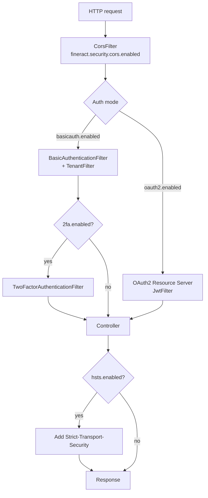

The `fineract.security.*` property tree owns every HTTP‑level security
knob Apache Fineract exposes through configuration: basic auth on/off,
OAuth2 toggle, 2FA toggle, HSTS toggle, the CORS filter, and the map of
OAuth2 client registrations used by the embedded authorization server.
This page collects every key, ties it back to the typed
`FineractSecurityProperties` nested class, and points at the Java
consumers that act on each one.

## Property tree shape

```text
fineract.security.basicauth.enabled
fineract.security.oauth2.enabled
fineract.security.2fa.enabled
fineract.security.hsts.enabled

fineract.security.cors.enabled
fineract.security.cors.allowed-origin-patterns
fineract.security.cors.allowed-methods
fineract.security.cors.allowed-headers
fineract.security.cors.exposed-headers
fineract.security.cors.allow-credentials

fineract.security.oauth2.client.registrations.<name>.client-id
fineract.security.oauth2.client.registrations.<name>.scopes
fineract.security.oauth2.client.registrations.<name>.authorization-grant-types
fineract.security.oauth2.client.registrations.<name>.redirect-uris
fineract.security.oauth2.client.registrations.<name>.require-authorization-consent
```

All bind to `FineractProperties.security` —
`FineractSecurityProperties` — under
`org.apache.fineract.infrastructure.core.config`.

## FineractSecurityProperties

```java
@Getter @Setter
public static class FineractSecurityProperties {
    private FineractSecurityBasicAuth        basicauth;
    private FineractSecurityTwoFactorAuth    twoFactor;
    private FineractSecurityHsts             hsts;
    private FineractSecurityOAuth2Properties oauth2;
    private CorsProperties                   cors;

    public void set2fa(FineractSecurityTwoFactorAuth twoFactor) {
        this.twoFactor = twoFactor;
    }

    @Getter @Setter public static class FineractSecurityBasicAuth      { private boolean enabled; }
    @Getter @Setter public static class FineractSecurityTwoFactorAuth  { private boolean enabled; }
    @Getter @Setter public static class FineractSecurityHsts           { private boolean enabled; }
    // ...
}
```

The slightly odd `set2fa` method exists because Java field names cannot
start with a digit, but Spring's relaxed binder happily maps
`fineract.security.2fa.enabled` to a method called `set2fa(...)`.

## Auth toggles

| Property | Env var | Default | Java field | Role |
| --- | --- | --- | --- | --- |
| `fineract.security.basicauth.enabled` | `FINERACT_SECURITY_BASICAUTH_ENABLED` | `true` | `basicauth.enabled` | Adds Basic + tenant filter chain |
| `fineract.security.oauth2.enabled` | `FINERACT_SECURITY_OAUTH_ENABLED` | `false` | `oauth2.enabled` | Enables OAuth2 resource server & authorization server beans |
| `fineract.security.2fa.enabled` | `FINERACT_SECURITY_2FA_ENABLED` | `false` | `twoFactor.enabled` | Adds second‑factor check on top of basic auth |
| `fineract.security.hsts.enabled` | `FINERACT_SECURITY_HSTS_ENABLED` | `false` | `hsts.enabled` | Sends `Strict-Transport-Security` header |

Basic auth and OAuth2 are not mutually exclusive — if both are on, the
resource server falls back to the authentication manager that performs
basic auth when a bearer token is absent. The conventional production
shape is one of:

- **Basic only** — `basicauth=true`, `oauth2=false`, `2fa=false`.
- **Basic + 2FA** — `basicauth=true`, `oauth2=false`, `2fa=true`.
- **OAuth2 only** — `basicauth=false`, `oauth2=true`, `2fa=false`.

See [/security/security-config](/security/security-config) for the
filter chain that consumes these.

## CORS

`CorsProperties` is bound under `fineract.security.cors.*`:

```java
@Getter @Setter
public static class CorsProperties {
    private boolean enabled;
    private List<String> allowedOriginPatterns;
    private List<String> allowedMethods;
    private List<String> allowedHeaders;
    private List<String> exposedHeaders;
    private boolean allowCredentials;
}
```

The shipped defaults are intentionally permissive (`*` everywhere) so
developers can run locally without thinking. Production deployments
narrow them.

| Property | Env var | Default | Role |
| --- | --- | --- | --- |
| `fineract.security.cors.enabled` | `FINERACT_SECURITY_CORS_ENABLED` | `true` | Master toggle |
| `fineract.security.cors.allowed-origin-patterns` | `FINERACT_SECURITY_CORS_ALLOWED_ORIGIN_PATTERNS` | `*` | Comma‑separated origin patterns (CORS spec) |
| `fineract.security.cors.allowed-methods` | `FINERACT_SECURITY_CORS_ALLOWED_METHODS` | `*` | HTTP methods whitelist |
| `fineract.security.cors.allowed-headers` | `FINERACT_SECURITY_CORS_ALLOWED_HEADERS` | `*` | Request header whitelist |
| `fineract.security.cors.exposed-headers` | `FINERACT_SECURITY_CORS_EXPOSED_HEADERS` | `*` | Response header whitelist (`Access-Control-Expose-Headers`) |
| `fineract.security.cors.allow-credentials` | `FINERACT_SECURITY_CORS_ALLOW_CREDENTIALS` | `true` | Sets `Access-Control-Allow-Credentials` |

Property reference in `application.properties`:

```properties
fineract.security.cors.enabled=${FINERACT_SECURITY_CORS_ENABLED:true}
fineract.security.cors.allowed-origin-patterns=${FINERACT_SECURITY_CORS_ALLOWED_ORIGIN_PATTERNS:*}
fineract.security.cors.allowed-methods=${FINERACT_SECURITY_CORS_ALLOWED_METHODS:*}
fineract.security.cors.allowed-headers=${FINERACT_SECURITY_CORS_ALLOWED_HEADERS:*}
fineract.security.cors.exposed-headers=${FINERACT_SECURITY_CORS_EXPOSED_HEADERS:*}
fineract.security.cors.allow-credentials=${FINERACT_SECURITY_CORS_ALLOW_CREDENTIALS:true}
```

### Origin patterns vs. origins

The platform uses `allowed-origin-patterns`, not Spring's older
`allowed-origins`. Patterns support wildcards (`https://*.example.com`)
while origins do not — this matters because Spring requires patterns
when `allow-credentials=true` and an origin uses a wildcard. Setting
`allowed-origin-patterns=*` with `allow-credentials=true` produces a
permissive but legal CORS config.

### Productionising CORS

Recommended production overrides:

```bash
FINERACT_SECURITY_CORS_ALLOWED_ORIGIN_PATTERNS="https://app.example.com,https://*.example.com"
FINERACT_SECURITY_CORS_ALLOWED_METHODS="GET,POST,PUT,DELETE,OPTIONS"
FINERACT_SECURITY_CORS_ALLOWED_HEADERS="Authorization,Content-Type,Fineract-Platform-TenantId,Idempotency-Key"
FINERACT_SECURITY_CORS_EXPOSED_HEADERS="X-Correlation-ID,Content-Disposition"
```

See [/security/cors-and-hsts](/security/cors-and-hsts) for the actual
`CorsConfigurationSource` bean and how the filter is wired.

## Actuator CORS

Separate from the application CORS filter, the actuator endpoints have
their own CORS settings:

```properties
management.endpoints.web.cors.allowed-origins=*
management.endpoints.web.cors.allowed-methods=GET, POST, PUT, DELETE, OPTIONS
management.endpoints.web.cors.allowed-headers=*
```

These live under `management.*`, are not part of `FineractSecurityProperties`,
and are evaluated by Spring Boot's actuator. See
[/runtime/metrics-and-actuator](/runtime/metrics-and-actuator).

## HSTS

```java
@Getter @Setter
public static class FineractSecurityHsts {
    private boolean enabled;
}
```

When `fineract.security.hsts.enabled=true`, the security configurer
adds `HttpStrictTransportSecurityHeaderWriter` to the chain. Only one
property gates HSTS — the max‑age, sub‑domains and preload flags are
fixed in code rather than configurable.

```properties
fineract.security.hsts.enabled=${FINERACT_SECURITY_HSTS_ENABLED:false}
```

Operators should enable HSTS only after confirming TLS terminates at
the load balancer for **every** domain that resolves to the JVM. Once
browsers cache the HSTS rule for a domain, they will refuse plain HTTP
until the cache expires.

See [/security/cors-and-hsts](/security/cors-and-hsts) for the
writer wiring.

## OAuth2 client registrations

`FineractSecurityOAuth2Properties` holds a map of named registrations:

```java
@Getter @Setter
public static class FineractSecurityOAuth2Properties {
    private boolean enabled;
    private ClientProperties client;

    @Getter @Setter
    public static class ClientProperties implements Serializable {
        private Map<String, Registration> registrations = new HashMap<>();

        @Getter @Setter
        public static final class Registration implements Serializable {
            private String clientId;
            private List<String> scopes = new ArrayList<>();
            private List<String> authorizationGrantTypes = new ArrayList<>();
            private List<String> redirectUris = new ArrayList<>();
            private boolean requireAuthorizationConsent = true;
        }
    }
}
```

Each entry under `fineract.security.oauth2.client.registrations.<name>.*`
becomes one `Registration` in the map. The example shipped in
`application.properties` is `frontend-client`:

```properties
fineract.security.oauth2.client.registrations.frontend-client.client-id=${FINERACT_SECURITY_OAUTH2_CLIENTS_FRONTEND_ID:frontend-client}
fineract.security.oauth2.client.registrations.frontend-client.scopes=${FINERACT_SECURITY_OAUTH2_CLIENTS_FRONTEND_SCOPES:read,write}
fineract.security.oauth2.client.registrations.frontend-client.authorization-grant-types=${FINERACT_SECURITY_OAUTH2_CLIENTS_FRONTEND_GRANTS:authorization_code,refresh_token}
fineract.security.oauth2.client.registrations.frontend-client.redirect-uris=${FINERACT_SECURITY_OAUTH2_CLIENTS_FRONTEND_REDIRECT:http://localhost:3000/callback}
fineract.security.oauth2.client.registrations.frontend-client.require-authorization-consent=${FINERACT_SECURITY_OAUTH2_CLIENTS_FRONTEND_CONSENT:false}
```

Per‑registration keys:

| Suffix | Type | Role |
| --- | --- | --- |
| `.client-id` | String | Public client identifier sent by the SPA / app |
| `.scopes` | `List<String>` | OAuth2 scopes the client may request |
| `.authorization-grant-types` | `List<String>` | Allowed grants (`authorization_code`, `refresh_token`, `client_credentials`) |
| `.redirect-uris` | `List<String>` | Permitted callback URLs |
| `.require-authorization-consent` | boolean | Show the consent page on first auth |

Add additional clients by repeating the block under a new name:

```properties
fineract.security.oauth2.client.registrations.mobile-app.client-id=mobile-app
fineract.security.oauth2.client.registrations.mobile-app.scopes=read,write
fineract.security.oauth2.client.registrations.mobile-app.authorization-grant-types=authorization_code,refresh_token
fineract.security.oauth2.client.registrations.mobile-app.redirect-uris=com.example.mobile://callback
fineract.security.oauth2.client.registrations.mobile-app.require-authorization-consent=true
```

See [/security/oauth2-authorization-server](/security/oauth2-authorization-server)
for how these registrations become Spring Authorization Server
`RegisteredClient` beans at startup.

## Filter chain matrix



## Header reference

The shipped CORS configuration enables a handful of headers that the
platform itself reads or writes:

| Header | Direction | Source |
| --- | --- | --- |
| `Authorization` | request | Standard HTTP auth |
| `Fineract-Platform-TenantId` | request | Tenant routing filter |
| `Idempotency-Key` | request | Command idempotency (rename via `fineract.idempotency-key-header-name`) |
| `X-Correlation-ID` | request | Correlation filter (rename via `fineract.correlation.header-name`) |
| `Content-Type` | request | Body content negotiation |
| `Content-Disposition` | response | File downloads |
| `Strict-Transport-Security` | response | HSTS writer |

If you tighten `fineract.security.cors.allowed-headers` away from `*`,
make sure to include the request headers above explicitly.

## Programmatic vs. property security

A few security knobs are *not* in this property tree:

- **Password policy** is held in `c_configuration` rows
  (`force-password-reset-days`, `password-reuse-check-history-count`,
  `max-login-retry-attempts`). See [Feature Flags](/config/feature-flags).
- **2FA delivery providers** (email, SMS) read their endpoint config
  from `c_external_service_properties`. See
  [External Services Config](/config/external-services-config) and
  [/security/two-factor-auth](/security/two-factor-auth).
- **SQL injection patterns** live under `fineract.sql-validation.*`
  rather than `fineract.security.*` — see
  [Application Properties](/config/application-properties#sql-validation).
- **JKS keystore** for HTTPS lives under `server.ssl.*`.

## Production checklist

```bash
# Auth
FINERACT_SECURITY_BASICAUTH_ENABLED=true   # or use oauth2 only
FINERACT_SECURITY_OAUTH_ENABLED=true
FINERACT_SECURITY_2FA_ENABLED=true

# Transport security
FINERACT_SECURITY_HSTS_ENABLED=true

# CORS — locked down
FINERACT_SECURITY_CORS_ENABLED=true
FINERACT_SECURITY_CORS_ALLOWED_ORIGIN_PATTERNS="https://app.example.com"
FINERACT_SECURITY_CORS_ALLOWED_METHODS="GET,POST,PUT,DELETE,OPTIONS"
FINERACT_SECURITY_CORS_ALLOWED_HEADERS="Authorization,Content-Type,Fineract-Platform-TenantId,Idempotency-Key,X-Correlation-ID"
FINERACT_SECURITY_CORS_EXPOSED_HEADERS="X-Correlation-ID,Content-Disposition"
FINERACT_SECURITY_CORS_ALLOW_CREDENTIALS=true

# OAuth2 client (production frontend)
FINERACT_SECURITY_OAUTH2_CLIENTS_FRONTEND_ID="frontend-client"
FINERACT_SECURITY_OAUTH2_CLIENTS_FRONTEND_SCOPES="read,write"
FINERACT_SECURITY_OAUTH2_CLIENTS_FRONTEND_GRANTS="authorization_code,refresh_token"
FINERACT_SECURITY_OAUTH2_CLIENTS_FRONTEND_REDIRECT="https://app.example.com/callback"
FINERACT_SECURITY_OAUTH2_CLIENTS_FRONTEND_CONSENT=true
```

Never paste real secrets here — pass them through your secret store.

## Related pages

- [Application Properties](/config/application-properties) — the
  `application.properties` view of these keys.
- [FineractProperties Reference](/config/fineract-properties) — the
  full nested‑class tree.
- [/security/security-config](/security/security-config) — the Spring
  `SecurityFilterChain` that reads these flags.
- [/security/cors-and-hsts](/security/cors-and-hsts) — CORS source bean
  and HSTS writer.
- [/security/oauth2-authorization-server](/security/oauth2-authorization-server)
  — how `oauth2.client.registrations.*` become `RegisteredClient` beans.
- [/security/two-factor-auth](/security/two-factor-auth) — `2fa.enabled`
  consumer.
- [/security/basic-and-tenant-filters](/security/basic-and-tenant-filters)
  — `basicauth.enabled` consumer.
